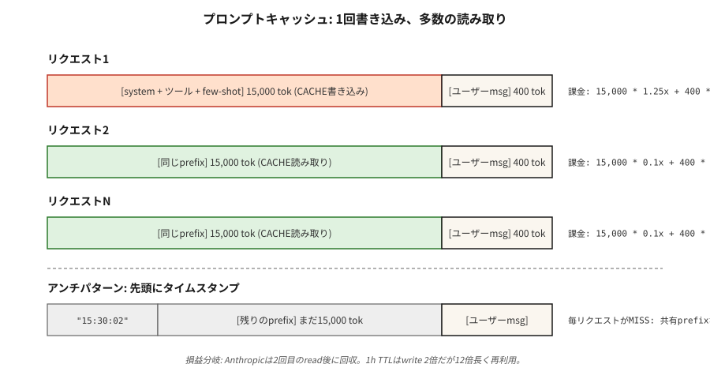

# 提示缓存与上下文缓存

> 你的系统提示有 4,000 token。你的 RAG 上下文有 20,000 token。你每次请求都要发送这两者，每一次也都为它们付费。提示缓存让提供商在它们那端保持该前缀"预热"，并在重用时只按正常价格的 10% 收费。正确使用时，可将推理成本降低 50–90%，首 token 延迟降低 40–85%。

**类型：** 构建
**语言：** Python
**前置要求：** 阶段 11 · 01（提示工程），阶段 11 · 05（上下文工程），阶段 11 · 11（缓存与成本）
**时长：** ~60 分钟

## 问题

一个编码代理在对话的每一轮都向 Claude 发送同样的 15,000 token 系统提示。按 $3/M 输入 token 计算，二十轮对话仅输入成本就是 $0.90——这还没算用户的真实消息。再乘以每天 10,000 次对话，账单就达到 $9,000/天，而这些文本从未改变过。

你不能为了降低成本而压缩提示——那样会损害质量。你也不能避免发送它——模型每一轮都需要它。唯一的办法是：停止为提供商已经见过的前缀支付全价。

这个办法就是提示缓存。Anthropic 在 2024 年 8 月推出了它（2025 年又推出了 1 小时延长 TTL 变体），OpenAI 在同年晚些时候将其自动化，Google 随 Gemini 1.5 一起推出了显式上下文缓存——如今三者都将其作为旗舰模型的一等特性提供。

## 概念



**机制。** 当一次请求的前缀与最近某次请求的前缀匹配时，提供商将提供上一次运行的 KV 缓存，而不是重新编码 token。你第一次支付少量写入溢价，之后每次读取都享受大幅折扣。

**2026 年的三种提供商风格。**

| 提供商 | API 风格 | 命中折扣 | 写入溢价 | 默认 TTL | 最小可缓存大小 |
|---------|-----------|--------------|---------------|-------------|---------------|
| Anthropic | 内容块上的显式 `cache_control` 标记 | 输入减免 90% | 加收 25% | 5 分钟（可延长至 1 小时） | 1,024 token（Sonnet/Opus），2,048（Haiku） |
| OpenAI | 自动前缀检测 | 输入减免 50% | 无 | 最长 1 小时（尽力而为） | 1,024 token |
| Google（Gemini） | 显式 `CachedContent` API | 按存储计费；读取约正常价格的 25% | 按 token·小时收取存储费 | 用户设置（默认 1 小时） | 4,096 token（Flash），32,768（Pro） |

**不变规则。** 三者都只缓存前缀。如果两次请求之间的任何 token 不同，则第一个不同 token 之后的所有内容都会缓存未命中。把**稳定**部分放在前面，**可变**部分放在后面。

### 缓存友好的布局

```
[系统提示]          <-- 缓存这部分
[工具定义]           <-- 缓存这部分
[少样本示例]         <-- 缓存这部分
[检索到的文档]       <-- 如果复用则缓存，否则不缓存
[对话历史]          <-- 缓存到上一轮为止
[当前用户消息]       <-- 永远不缓存（每次都不同）
```

打乱顺序——把用户消息放在系统提示之前，在少样本示例之间插入动态检索——缓存就永远不会命中。

### 盈亏平衡计算

Anthropic 25% 的写入溢价意味着一个缓存块至少需要被读取两次才能净节省成本。1 次写入 + 1 次读取平均每请求 0.675x 成本（节省 32%）；1 次写入 + 10 次读取平均 0.205x（节省 80%）。经验法则：缓存任何你预计在 TTL 内至少复用 3 次的内容。

## 动手构建

### 步骤 1：使用显式标记的 Anthropic 提示缓存

```python
import anthropic

client = anthropic.Anthropic()

SYSTEM = [
    {
        "type": "text",
        "text": "你是一名高级 Python 审查员。请严格按照评分标准执行。\n\n" + RUBRIC_15K_TOKENS,
        "cache_control": {"type": "ephemeral"},
    }
]

def review(code: str):
    return client.messages.create(
        model="claude-opus-4-7",
        max_tokens=1024,
        system=SYSTEM,
        messages=[{"role": "user", "content": code}],
    )
```

`cache_control` 标记告诉 Anthropic 将该块存储 5 分钟。在此期间内复用则命中；过期后复用则再次写入。

**响应中的用量字段：**

```python
response = review(code_a)
response.usage
# InputTokensUsage(
#     input_tokens=120,
#     cache_creation_input_tokens=15023,   # 按 1.25x 付费
#     cache_read_input_tokens=0,
#     output_tokens=340,
# )

response_b = review(code_b)
response_b.usage
# cache_creation_input_tokens=0
# cache_read_input_tokens=15023           # 按 0.1x 付费
```

在 CI 中检查这两个字段——如果 `cache_read_input_tokens` 在多次请求间始终为零，说明你的缓存键在偏移。

### 步骤 2：一小时延长 TTL

对于长时间运行的批处理作业，5 分钟的默认 TTL 会在作业之间过期。设置 `ttl`：

```python
{"type": "text", "text": RUBRIC, "cache_control": {"type": "ephemeral", "ttl": "1h"}}
```

1 小时 TTL 的写入溢价为 2 倍（比基线高 50% 而非 25%），但任何复用前缀超过 5 次的批处理都能快速回本。

### 步骤 3：OpenAI 自动缓存

OpenAI 无需你配置任何东西。任何超过 1,024 token 且与最近请求匹配的前缀都会自动获得 50% 折扣。

```python
from openai import OpenAI
client = OpenAI()

resp = client.chat.completions.create(
    model="gpt-5",
    messages=[
        {"role": "system", "content": SYSTEM_PROMPT},   # 长且稳定
        {"role": "user", "content": user_msg},
    ],
)
resp.usage.prompt_tokens_details.cached_tokens  # 享受折扣的部分
```

同样的缓存友好布局规则适用。有两个因素会破坏 OpenAI 的缓存，但不会影响 Anthropic：更改 `user` 字段（用作缓存键的组成部分）以及重新排列工具。

### 步骤 4：Gemini 显式上下文缓存

Gemini 将缓存视为一等对象，你可以创建并命名：

```python
from google import genai
from google.genai import types

client = genai.Client()

cache = client.caches.create(
    model="gemini-3-pro",
    config=types.CreateCachedContentConfig(
        display_name="rubric-v3",
        system_instruction=RUBRIC,
        contents=[FEW_SHOT_EXAMPLES],
        ttl="3600s",
    ),
)

resp = client.models.generate_content(
    model="gemini-3-pro",
    contents=["请审查这段代码：\n" + code],
    config=types.GenerateContentConfig(cached_content=cache.name),
)
```

Gemini 按 token·小时收取存储费，缓存存续期间持续计费，读取价格约为正常输入价格的 25%。当你跨数天、跨多个会话复用一个巨大的提示时，这种模式最合适。

### 步骤 5：在生产中测量命中率

参见 `code/main.py`，这是一个模拟的三提供商计费器，用于跟踪写入/读取/未命中次数并计算每 1K 请求的混合成本。根据目标命中率来门控部署——大多数生产环境的 Anthropic 设置应该在预热后达到 >80% 的读取比例。

## 2026 年仍在出现的陷阱

- **顶部的动态时间戳。** 在系统提示顶部放置 `"当前时间：2026-04-22 15:30:02"`。每次请求都会未命中。将时间戳移到缓存断点之后。
- **工具重新排序。** 以稳定顺序序列化工具——部署之间的字典重排会破坏每一次命中。
- **自由文本近似重复。** "你是乐于助人的助手。" 与 "你是一位乐于助人的助手。"——一个字节的差异 = 完全未命中。
- **块太小。** Anthropic 强制要求至少 1,024 token（Haiku 为 2,048）。更小的块静默地不被缓存。
- **盲目的成本仪表盘。** 将"输入 token"拆分为已缓存和未缓存两部分。否则流量下降看起来就像是缓存的胜利。

## 使用建议

2026 年的缓存选型：

| 场景 | 选择 |
|-----------|------|
| 具有稳定 10k+ 系统提示的代理，多轮对话 | Anthropic `cache_control`，5 分钟 TTL |
| 在 30+ 分钟内复用前缀的批处理作业 | Anthropic，`ttl: "1h"` |
| 基于 GPT-5 的无服务器端点，无自建基础设施 | OpenAI 自动缓存（只需使前缀稳定且足够长） |
| 跨多天复用大型代码/文档语料库 | Gemini 显式 `CachedContent` |
| 跨提供商回退 | 保持可缓存前缀布局在各提供商间一致，这样任何命中都能生效 |

与语义缓存（阶段 11 · 11）结合用于用户消息层面：提示缓存处理**token 相同**的复用，语义缓存处理**含义相同**的复用。

## 交付物

保存 `outputs/skill-prompt-caching-planner.md`：

```markdown
---
name: prompt-caching-planner
description: 设计缓存友好的提示布局，并选择合适的提供商缓存模式。
version: 1.0.0
phase: 11
lesson: 15
tags: [llm-engineering, caching, cost]
---

给定一个提示（系统提示 + 工具 + 少样本示例 + 检索内容 + 历史 + 用户消息）和使用画像（每小时请求数、所需 TTL、提供商），输出：

1. 布局。重新排序的各部分，标记一个缓存断点；说明哪些部分是稳定的，哪些是可变的。
2. 提供商模式。Anthropic cache_control、OpenAI 自动缓存或 Gemini CachedContent。基于 TTL 和复用模式给出理由。
3. 盈亏平衡。TTL 内每次写入对应的预期读取次数；与无缓存相比的净成本，附计算过程。
4. 验证计划。CI 断言：第二次相同请求时 `cache_read_input_tokens > 0`；仪表盘按已缓存与未缓存 token 拆分。
5. 故障模式。列出在此设置下缓存最可能未命中的三个原因（动态时间戳、工具重排、近似重复文本）以及如何预防每种情况。

拒绝交付将动态字段放在断点之上的缓存方案。拒绝启用 1h TTL，除非复用次数足以让 2x 写入溢价回本。
```

## 练习

1. **简单。** 取一个 10 轮对话，系统提示为 5,000 token，使用 Claude。先在不使用 `cache_control` 的情况下运行，再使用它。分别报告各自的输入 token 费用。
2. **中等。** 编写一个测试工具，给定提示模板和请求日志，计算每个提供商的预期命中率和美元节省（Anthropic 5 分钟、Anthropic 1 小时、OpenAI 自动缓存、Gemini 显式缓存）。
3. **困难。** 构建一个布局优化器：给定一个提示和一个标记为 `stable=True/False` 的字段列表，在不丢失信息的情况下重新编排提示，在最大缓存友好位置设置单个缓存断点。在真实的 Anthropic 端点上验证。

## 关键术语

| 术语 | 人们说的 | 实际含义 |
|------|-----------------|-----------------------|
| 提示缓存（Prompt caching） | "让长提示变便宜" | 复用提供商端的 KV 缓存以匹配前缀；重复输入 token 享受 50-90% 折扣。 |
| `cache_control` | "Anthropic 的标记" | 内容块属性，声明"至此为止的所有内容都是可缓存的"；`{"type": "ephemeral"}`。 |
| 缓存写入（Cache write） | "付溢价" | 填充缓存的第一次请求；Anthropic 按约 1.25x 输入费率计费，OpenAI 免费。 |
| 缓存读取（Cache read） | "折扣" | 后续匹配前缀的请求；按 10%（Anthropic）、50%（OpenAI）、~25%（Gemini）计费。 |
| TTL | "存活时间" | 缓存保持温热的秒数；Anthropic 默认 5 分钟（可延长至 1 小时），OpenAI 尽力最长 1 小时，Gemini 用户设置。 |
| 延长 TTL（Extended TTL） | "1 小时 Anthropic 缓存" | `{"type": "ephemeral", "ttl": "1h"}`；写入溢价 2 倍，但对批处理复用来说值得。 |
| 前缀匹配（Prefix match） | "为什么我的缓存没命中" | 缓存仅在从开头到断点的每个 token 字节完全相同时才命中。 |
| 上下文缓存（Context caching，Gemini） | "显式的那种" | Google 的命名缓存对象，按存储计费；最适合跨多天复用大型语料库。 |

## 延伸阅读

- [Anthropic — 提示缓存](https://docs.anthropic.com/en/docs/build-with-claude/prompt-caching) — `cache_control`、1 小时 TTL、盈亏平衡表。
- [OpenAI — 提示缓存](https://platform.openai.com/docs/guides/prompt-caching) — 自动前缀匹配。
- [Google — 上下文缓存](https://ai.google.dev/gemini-api/docs/caching) — `CachedContent` API 和存储定价。
- [Anthropic engineering — 面向长上下文工作负载的提示缓存](https://www.anthropic.com/news/prompt-caching) — 原始发布文章，含延迟数据。
- 阶段 11 · 05（上下文工程）—— 如何切分提示以使缓存生效。
- 阶段 11 · 11（缓存与成本）—— 将提示缓存与用户消息的语义缓存配对使用。
- [Pope 等人，"Efficiently Scaling Transformer Inference" (2022)](https://arxiv.org/abs/2211.05102) — 提示缓存向用户暴露的 KV 缓存内存模型；解释了为什么缓存前缀比重新计算便宜约 10 倍。
- [Agrawal 等人，"SARATHI: Efficient LLM Inference by Piggybacking Decodes with Chunked Prefills" (2023)](https://arxiv.org/abs/2308.16369) — prefilling 是提示缓存所绕过的阶段；本文解释了为什么缓存命中时 TTFT 急剧下降而 TPOT 不受影响。
- [Leviathan 等人，"Fast Inference from Transformers via Speculative Decoding" (2023)](https://arxiv.org/abs/2211.17192) — 提示缓存与推测解码、Flash Attention 和 MQA/GQA 并列为降低推理成本曲线的杠杆；阅读本文以了解其他三项技术。
