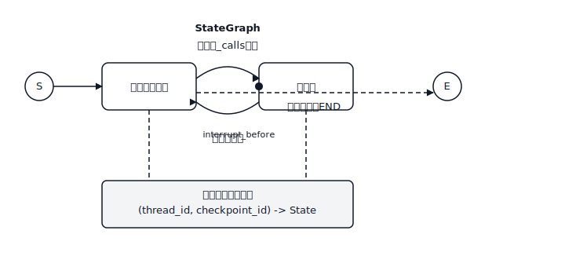

# LangGraph — Agent 的状态机

> 手写 ReAct 循环是一个 `while True`。用 LangGraph 写的 ReAct 循环是一个你可以 checkpoint、中断、分支和时间旅行的图。Agent 本身没有改变。围绕它的 harness 改变了。

**类型：** Build
**语言：** Python
**前置知识：** Phase 11 · 09（函数调用），Phase 11 · 14（Model Context Protocol）
**时间：** ~75 分钟

## 问题所在

你发布了一个函数调用 agent。它工作了三轮，然后出了问题：模型尝试了一个返回 500 的工具，用户在任务中途改变了主意，或者 agent 决定在没有人工签字的情况下退款订单。`while True:` 循环没有钩子。你无法暂停它，无法回退它，也无法分支到"如果模型选择了另一个工具会怎样"。一旦你把这个发布到演示之外，agent 就变成了一个要么工作要么不工作的黑盒。

下一步一旦你看到它就显而易见。Agent 已经是一个状态机——系统 prompt 加消息历史加待处理工具调用加下一个动作。让状态机显式化：节点用于"模型思考"、"工具运行"、"人工批准"，边用于它们之间的条件转换。一旦图是显式的，harness 就免费获得四样东西：checkpointing（步骤之间保存状态）、interrupts（暂停等待人工）、streaming（流式传输 token 和中间事件）和 time-travel（回退到先前状态并尝试不同分支）。

LangGraph 是实现这个抽象的库。它不是 LangChain 意义上的 agent 框架（"这是一个 AgentExecutor，祝你好运"）。它是一个图运行时，具有一流的状态、一流的持久化和一流的中断。Agent 循环是你绘制的东西，不是你手写的东西。

## 核心概念



`StateGraph` 有三样东西。

1. **State。** 一个类型化的 dict（TypedDict 或 Pydantic 模型），流经图。每个节点接收完整状态并返回部分更新，LangGraph 使用每个字段的 *reducer* 合并——列表用 `operator.add` 累积，默认覆盖。
2. **Nodes。** Python 函数 `state -> partial_state`。每个是一个离散步："调用模型"、"运行工具"、"总结"。
3. **Edges。** 节点之间的转换。静态边去一个地方。条件边接受 router 函数 `state -> next_node_name`，以便图可以在模型输出上分支。

你编译图。编译绑定拓扑，附加 checkpointer（可选但对生产至关重要），并返回一个可运行对象。你用初始状态和 `thread_id` 调用它。执行的每一步都将 checkpoint 持久化，以 `(thread_id, checkpoint_id)` 为键。

### 四种超能力

**Checkpointing。** 每个节点转换将新状态写入存储（测试用内存，生产用 Postgres/Redis/SQLite）。通过用相同的 `thread_id` 再次调用图来恢复。图从暂停处继续。

**Interrupts。** 用 `interrupt_before=["human_review"]` 标记一个节点，执行在该节点运行前停止。状态持久化。你的 API 向用户响应"等待批准"。稍后向同一 `thread_id` 发送 `Command(resume=...)` 的请求恢复执行。

**Streaming。** `graph.stream(state, mode="updates")` 在发生时产生状态增量。`mode="messages"` 在模型节点内部流式传输 LLM token。`mode="values"` 产生完整快照。你选择要在 UI 中展示什么。

**Time-travel。** `graph.get_state_history(thread_id)` 返回完整 checkpoint 日志。将任何先前的 `checkpoint_id` 传递给 `graph.invoke`，你就从该点分叉。非常适合调试（"如果模型选择了工具 B 会怎样？"）和重放生产 trace 的回归测试。

### Reducers 是关键

每个状态字段都有一个 reducer。大多数默认值没问题——新值覆盖旧的。但消息列表需要 `operator.add`，以便新消息追加而不是替换。并行边通过 reducer 合并它们的更新。如果两个节点都更新 `messages` 而你忘记了 `Annotated[list, add_messages]`，第二个静默获胜，你丢失了一半的轮次。Reducer 是库中唯一微妙的东西；做对了，其余部分就能组合。

### 四个节点的 ReAct 图

一个生产 ReAct agent 是四个节点和两条边：

1. `agent`——用当前消息历史调用 LLM。返回 assistant 消息（可能包含 tool_calls）。
2. `tools`——执行最后 assistant 消息中的任何 tool_calls，将工具结果作为 tool 消息追加。
3. 从 `agent` 的条件边，如果最后消息有 tool_calls 则路由到 `tools`，否则到 `END`。
4. 从 `tools` 回到 `agent` 的静态边。

就是这样。你获得完整的 ReAct 循环（Thought → Action → Observation → Thought → …），包含 checkpointing、interrupts 和 streaming，大约 40 行代码。

### StateGraph vs Send（扇出）

`Send(node_name, state)` 让节点调度并行子图。示例：agent 决定同时查询三个检索器。每个 `Send` 生成目标节点的并行执行；它们的输出通过状态 reducer 合并。这就是 LangGraph 表达 orchestrator-workers 模式的方式，无需线程原语。

### 子图

编译后的图可以作为另一个图中的节点。外部图看到一个单一节点；内部图有自己的状态和自己的 checkpoints。这就是团队构建 supervisor-worker agent 的方式：supervisor 图将用户意图路由到每个领域的 worker 子图。

## 动手实现

### 步骤 1：状态和节点

```python
from typing import Annotated, TypedDict
from langchain_core.messages import AnyMessage, HumanMessage, AIMessage
from langgraph.graph import StateGraph, END
from langgraph.graph.message import add_messages
from langgraph.prebuilt import ToolNode
from langgraph.checkpoint.memory import MemorySaver

class State(TypedDict):
    messages: Annotated[list[AnyMessage], add_messages]

def agent_node(state: State) -> dict:
    response = llm.invoke(state["messages"])
    return {"messages": [response]}

def should_continue(state: State) -> str:
    last = state["messages"][-1]
    return "tools" if getattr(last, "tool_calls", None) else END

tool_node = ToolNode(tools=[search_web, read_file])

graph = StateGraph(State)
graph.add_node("agent", agent_node)
graph.add_node("tools", tool_node)
graph.set_entry_point("agent")
graph.add_conditional_edges("agent", should_continue, {"tools": "tools", END: END})
graph.add_edge("tools", "agent")

app = graph.compile(checkpointer=MemorySaver())
```

`add_messages` 是让消息列表累积而不是覆盖的 reducer。忘记它是最常见的 LangGraph bug。

### 步骤 2：用线程运行

```python
config = {"configurable": {"thread_id": "user-42"}}
for event in app.stream(
    {"messages": [HumanMessage("find the Anthropic headquarters address")]},
    config,
    stream_mode="updates",
):
    print(event)
```

每个更新是一个 dict `{node_name: state_delta}`。你的前端可以将这些流式传输到 UI，让用户看到"agent 正在思考…调用 search_web…获得结果…回答中。

### 步骤 3：添加人工介入循环中断

标记一个节点，以便执行在运行前暂停。

```python
app = graph.compile(
    checkpointer=MemorySaver(),
    interrupt_before=["tools"],  # 在每个工具调用前暂停
)

state = app.invoke({"messages": [HumanMessage("delete the production database")]}, config)
# state["__interrupt__"] 被设置。检查提议的工具调用。
# 如果批准：
from langgraph.types import Command
app.invoke(Command(resume=True), config)
# 如果拒绝：写入拒绝消息并恢复
app.update_state(config, {"messages": [AIMessage("Blocked by human reviewer.")]})
```

状态、checkpoint 和线程在中断间都持久化。除了执行期间，没有任何东西在内存中。

### 步骤 4：用于调试的时间旅行

```python
history = list(app.get_state_history(config))
for snapshot in history:
    print(snapshot.values["messages"][-1].content[:80], snapshot.config)

# 从先前的 checkpoint 分叉
target = history[3].config  # 回退三步
for event in app.stream(None, target, stream_mode="values"):
    pass  # 从该点向前重放
```

传递 `None` 作为输入从给定 checkpoint 重放；传递一个值将其作为更新附加到该 checkpoint 的状态，然后恢复。这就是你重现 bad agent 运行而无需重新运行整个对话的方式。

### 步骤 5：为生产交换 checkpointer

```python
from langgraph.checkpoint.postgres import PostgresSaver

with PostgresSaver.from_conn_string("postgresql://...") as checkpointer:
    checkpointer.setup()
    app = graph.compile(checkpointer=checkpointer)
```

SQLite、Redis 和 Postgres 已提供。`MemorySaver` 用于测试。任何跨重启持久化的东西都需要真正的存储。

## 技能

> 你将 agent 构建为图，而不是 `while True` 循环。

在你伸手拿 LangGraph 之前，做一个 60 秒的设计：

1. **命名节点。** 每个离散决策或副作用动作都是一个节点。"Agent 思考"、"工具运行"、"审查者批准"、"响应流式传输"。如果你无法列出它们，任务还不是 agent 形状的。
2. **声明状态。** 最小 TypedDict，每个列表字段都有 reducer。不要把所有东西都塞进 `messages`；将任务特定字段（一个工作的 `plan`、一个 `budget` 计数器、一个 `retrieved_docs` 列表）提升到顶层。
3. **绘制边。** 除非下一步取决于模型输出，否则是静态的。每个条件边都需要一个带命名分支的 router 函数。
4. **预先选择 checkpointer。** 测试用 `MemorySaver`，其他情况用 Postgres/Redis/SQLite。不要不带 checkpointer 就发布——没有 checkpointer 意味着没有恢复、没有中断、没有时间旅行。
5. **在工具运行前决定中断，而不是之后。** 批准放在进入副作用节点的边上，以便你可以在伤害前取消；验证放在模型出来的边上，以便你可以廉价地拒绝 bad calls。
6. **默认流式传输。** UI 用 `mode="updates"`，模型节点内部 token 级流式传输用 `mode="messages"`，评估期间完整快照用 `mode="values"`。

拒绝发布没有 checkpointer 的 LangGraph agent。拒绝在副作用*之后*中断的。拒绝 `messages` 字段没有 `add_messages` 作为 reducer 的。

## 练习

1. **简单。** 用计算工具和网络搜索工具实现上面的四节点 ReAct 图。验证 `list(app.get_state_history(config))` 为两轮对话返回至少四个 checkpoints。
2. **中等。** 添加一个在 `agent` 之前运行的 `planner` 节点，将结构化 `plan: list[str]` 写入状态。让 `agent` 将计划步骤标记为完成。如果 `plan` 在 checkpoint 恢复间丢失（错误的 reducer），则测试失败。
3. **困难。** 构建一个使用 `Send` 在三个子图（`researcher`、`writer`、`reviewer`）之间路由的 supervisor 图。每个子图有自己的状态和 checkpointer。在外部图上添加 `interrupt_before=["writer"]`，以便人工可以批准研究简报。确认从先前 checkpoint 的时间旅行只重新运行分叉的分支。

## 关键术语

| 术语 | 人们怎么说 | 实际含义 |
|------|-----------------|-----------------------|
| StateGraph | "LangGraph 图" | 你在编译前添加节点和边的构建器对象。 |
| Reducer | "字段如何合并" | 当节点返回该字段的更新时应用的函数 `(old, new) -> merged`；默认是覆盖，`add_messages` 是追加。 |
| Thread | "对话 ID" | 一个 `thread_id` 字符串，为一次会话的所有 checkpoints 划定范围。 |
| Checkpoint | "暂停的状态" | 节点转换后完整图状态的持久化快照，以 `(thread_id, checkpoint_id)` 为键。 |
| Interrupt | "暂停等待人工" | `interrupt_before` / `interrupt_after` 在节点边界停止执行；用 `Command(resume=...)` 恢复。 |
| Time-travel | "从先前步骤分叉" | `graph.invoke(None, config_with_old_checkpoint_id)` 从该 checkpoint 向前重放。 |
| Send | "并行子图调度" | 节点可以返回的构造函数，用于生成目标节点的 N 个并行执行。 |
| Subgraph | "作为节点的编译图" | 在另一个图中用作节点的编译 StateGraph；保留自己的状态范围。 |

## 延伸阅读

- [LangGraph documentation](https://langchain-ai.github.io/langgraph/)——StateGraph、reducers、checkpointers 和 interrupts 的规范参考。
- [LangGraph concepts: state, reducers, checkpointers](https://langchain-ai.github.io/langgraph/concepts/low_level/)——本课使用的心智模型，直接来自源头。
- [LangGraph Persistence and Checkpoints](https://langchain-ai.github.io/langgraph/concepts/persistence/)——Postgres/SQLite/Redis 存储、checkpoint 命名空间和 thread ID 的详细信息。
- [LangGraph Human-in-the-loop](https://langchain-ai.github.io/langgraph/concepts/human_in_the_loop/)——`interrupt_before`、`interrupt_after`、`Command(resume=...)` 和编辑状态模式。
- [Yao et al., "ReAct: Synergizing Reasoning and Acting in Language Models" (ICLR 2023)](https://arxiv.org/abs/2210.03629)——每个 LangGraph agent 实现的模式；阅读它了解推理 trace 的原理。
- [Anthropic — Building effective agents (Dec 2024)](https://www.anthropic.com/research/building-effective-agents)——哪些图形状（链、路由器、orchestrator-workers、evaluator-optimizer）更适合以及何时使用。
- Phase 11 · 09（函数调用）——每个 LangGraph agent 节点重用的工具调用原语。
- Phase 11 · 14（Model Context Protocol）——通过 MCP 适配器插入 LangGraph `ToolNode` 的外部工具发现。
- Phase 11 · 17（Agent 框架权衡）——何时选择 LangGraph 而非 CrewAI、AutoGen 或 Agno。
