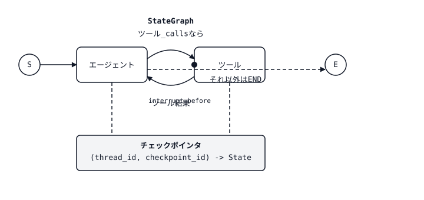

# LangGraph — 智能体的状态机

> 手写的 ReAct 循环是一个 `while True`。用 LangGraph 编写的 ReAct 循环则是一个可检查点、可中断、可分支、可时间旅行的图。智能体本身没有变，变化的是它周围的外部框架。

**类型：** 构建
**语言：** Python
**前置知识：** 阶段 11 · 09（函数调用），阶段 11 · 14（模型上下文协议）
**时长：** ~75 分钟

## 问题

你交付了一个函数调用智能体。它正常工作了三个回合，然后出了问题：模型尝试调用一个返回 500 的工具，用户中途改变了主意，或者智能体在未经人工批准的情况下决定退款。`while True:` 循环没有任何钩子。你无法暂停它，无法回退它，也无法分支出去探索"如果模型选择了另一个工具会怎样"。当你把这个东西交付到演示之外的环境中时，智能体就变成了一个黑盒——要么工作，要么不工作。

下一步一旦你看明白了就非常显然。智能体本身就是一个状态机——系统提示词加消息历史加待处理的工具调用加下一步动作。把状态机显式化：用节点表示"模型思考"、"工具运行"、"人工审批"，用边表示它们之间的条件转换。一旦图被显式化，框架就免费获得了四样东西：检查点（在步骤之间保存状态）、中断（暂停以便人工介入）、流式（流式传输令牌和中间事件）、以及时间旅行（回退到之前的状态并尝试不同的分支）。

LangGraph 就是实现这种抽象的库。它不是 LangChain 意义上的智能体框架（"给你一个 AgentExecutor，祝你好运"）。它是一个图运行时，拥有头等公民的状态、头等公民的持久化、以及头等公民的中断。智能体循环是你**绘制**出来的，而不是手写的。

## 概念



一个 `StateGraph` 由三部分组成。

1. **状态（State）。** 一个类型化的字典（TypedDict 或 Pydantic 模型），在图中的节点间流动。每个节点接收完整状态并返回部分更新，LangGraph 使用每个字段的**规约器（reducer）**来合并更新——对于应该累积的列表使用 `operator.add`，默认是覆盖。
2. **节点（Nodes）。** Python 函数 `state -> partial_state`。每个节点是一个离散步骤："调用模型"、"运行工具"、"总结"。
3. **边（Edges）。** 节点之间的转换。静态边指向一个固定位置。条件边使用路由函数 `state -> next_node_name`，使图能够根据模型输出进行分支。

你**编译**这个图。编译操作绑定拓扑结构、附加检查点（可选但对生产环境至关重要）并返回一个可运行对象。你用初始状态和一个 `thread_id` 来调用它。每一步执行都会持久化一个以 `(thread_id, checkpoint_id)` 为键的检查点。

### 四大超能力

**检查点（Checkpointing）。** 每次节点转换都将新状态写入存储（测试用内存，生产用 Postgres/Redis/SQLite）。用相同的 `thread_id` 再次调用图即可恢复。图会从暂停的地方继续执行。

**中断（Interrupts）。** 使用 `interrupt_before=["human_review"]` 标记一个节点，执行会在该节点运行前停止。状态被持久化。你的 API 向用户返回"等待审批"。后续使用 `Command(resume=...)` 请求相同的 `thread_id` 即可恢复执行。

**流式（Streaming）。** `graph.stream(state, mode="updates")` 实时产生状态增量（delta）。`mode="messages"` 流式输出模型节点内部的 LLM 令牌。`mode="values"` 产生完整快照。你可以选择在 UI 中展示哪些内容。

**时间旅行（Time-travel）。** `graph.get_state_history(thread_id)` 返回完整的检查点日志。将之前的任意 `checkpoint_id` 传入 `graph.invoke`，你就可以从那个点分叉。对调试（"如果模型选择了工具 B 会怎样？"）和重放生产轨迹的回归测试非常有用。

### 规约器是核心

每个状态字段都有一个规约器。大多数默认值都没问题——新值覆盖旧值。但消息列表需要 `operator.add`，这样新消息会追加而非替换。并行边通过规约器合并它们的更新。如果两个节点都更新了 `messages` 而你又忘记了 `Annotated[list, add_messages]`，第二个更新会静默地覆盖掉第一个，你就丢失了半个回合。规约器是这个库中唯一微妙的地方；把它搞对了，其余部分自然就能组合起来。

### 四个节点的 ReAct 图

一个生产级的 ReAct 智能体由四个节点和两条边组成：

1. `agent`——用当前消息历史调用 LLM。返回助理消息（可能包含 tool_calls）。
2. `tools`——执行上一条助理消息中的任意 tool_calls，将工具结果作为工具消息追加。
3. 从 `agent` 出发的条件边：如果最后一条消息包含 tool_calls，则路由到 `tools`，否则路由到 `END`。
4. 从 `tools` 回到 `agent` 的静态边。

仅此而已。你就能获得完整的 ReAct 循环（思考 → 行动 → 观察 → 思考 → ……），带有检查点、中断和流式功能，大约只需 40 行代码。

### StateGraph 与 Send（扇出）

`Send(node_name, state)` 允许一个节点派发并行的子图。例如：智能体决定同时查询三个检索器。每个 `Send` 都会产生目标节点的一个并行执行；它们的输出通过状态规约器进行合并。这就是 LangGraph 表达编排者-工作者模式的方式，无需线程原语。

### 子图

一个编译后的图可以作为另一个图中的一个节点。外部图看到一个单一的节点；内部图有自己的状态和检查点。这就是团队构建监督者-工作者智能体的方式：监督者图将用户意图路由到特定领域的工作者子图。

## 动手构建

### 第一步：状态和节点

```python
from typing import Annotated, TypedDict
from langchain_core.messages import AnyMessage, HumanMessage, AIMessage
from langgraph.graph import StateGraph, END
from langgraph.graph.message import add_messages
from langgraph.prebuilt import ToolNode
from langgraph.checkpoint.memory import MemorySaver

class State(TypedDict):
    messages: Annotated[list[AnyMessage], add_messages]

def agent_node(state: State) -> dict:
    response = llm.invoke(state["messages"])
    return {"messages": [response]}

def should_continue(state: State) -> str:
    last = state["messages"][-1]
    return "tools" if getattr(last, "tool_calls", None) else END

tool_node = ToolNode(tools=[search_web, read_file])

graph = StateGraph(State)
graph.add_node("agent", agent_node)
graph.add_node("tools", tool_node)
graph.set_entry_point("agent")
graph.add_conditional_edges("agent", should_continue, {"tools": "tools", END: END})
graph.add_edge("tools", "agent")

app = graph.compile(checkpointer=MemorySaver())
```

`add_messages` 是让消息列表累积而非覆盖的规约器。忘记它是 LangGraph 中最常见的错误。

### 第二步：使用线程运行

```python
config = {"configurable": {"thread_id": "user-42"}}
for event in app.stream(
    {"messages": [HumanMessage("find the Anthropic headquarters address")]},
    config,
    stream_mode="updates",
):
    print(event)
```

每次更新都是一个字典 `{node_name: state_delta}`。你的前端可以将这些更新流式传输到 UI，让用户看到"智能体正在思考……正在调用 search_web……已获取结果……正在回答"。

### 第三步：添加人机协同中断

标记一个节点，使执行在它运行前暂停。

```python
app = graph.compile(
    checkpointer=MemorySaver(),
    interrupt_before=["tools"],  # 在每次工具调用前暂停
)

state = app.invoke({"messages": [HumanMessage("delete the production database")]}, config)
# state["__interrupt__"] 已被设置。检查提议的工具调用。
# 如果批准：
from langgraph.types import Command
app.invoke(Command(resume=True), config)
# 如果拒绝：写入一条拒绝消息并恢复
app.update_state(config, {"messages": [AIMessage("Blocked by human reviewer.")]})
```

状态、检查点和线程在中断期间都持续存在。只有在执行过程中数据才存在于内存中。

### 第四步：用于调试的时间旅行

```python
history = list(app.get_state_history(config))
for snapshot in history:
    print(snapshot.values["messages"][-1].content[:80], snapshot.config)

# 从之前的检查点分叉
target = history[3].config  # 回退三步
for event in app.stream(None, target, stream_mode="values"):
    pass  # 从该点向前重放
```

传入 `None` 作为输入会从给定检查点重放；传入一个值会在恢复前将其作为更新追加到该检查点的状态中。这就是你重现一个有问题的智能体运行的方法，而无需重新运行整个对话。

### 第五步：为生产环境更换检查点

```python
from langgraph.checkpoint.postgres import PostgresSaver

with PostgresSaver.from_conn_string("postgresql://...") as checkpointer:
    checkpointer.setup()
    app = graph.compile(checkpointer=checkpointer)
```

SQLite、Redis 和 Postgres 均已提供。`MemorySaver` 用于测试。任何需要在重启间持久化的场景都需要真实的存储。

## 技能

> 你将智能体构建为图，而不是 `while True` 循环。

在接触 LangGraph 之前，先花 60 秒做设计：

1. **命名节点。** 每个离散决策或带副作用的动作都是一个节点。"智能体思考"、"工具运行"、"评审者批准"、"响应流式输出"。如果你列不出来，说明这个任务还不是智能体形态。
2. **声明状态。** 最小的 TypedDict，每个列表字段都要有规约器。不要把所有的东西都塞进 `messages`；将任务特定字段（运行的 `plan`、`budget` 计数器、`retrieved_docs` 列表）提升到顶层。
3. **绘制边。** 除非下一步依赖于模型输出，否则使用静态边。每个条件边都需要一个带有命名分支的路由函数。
4. **提前选择检查点。** 测试用 `MemorySaver`，其他用 Postgres/Redis/SQLite。不要在没有检查点的情况下交付——没有检查点意味着没有恢复、没有中断、没有时间旅行。
5. **在工具运行之前决定中断，而不是之后。** 审批放在进入带副作用节点的边上，这样可以在造成损害前取消；验证放在离开模型节点的边上，这样可以低成本地拒绝错误调用。
6. **默认使用流式。** `mode="updates"` 用于 UI，`mode="messages"` 用于模型节点内部的令牌级流式，`mode="values"` 用于评估时的完整快照。

拒绝交付没有检查点的 LangGraph 智能体。拒绝交付在副作用*之后*才中断的智能体。拒绝交付 `messages` 字段没有 `add_messages` 作为规约器的智能体。

## 练习

1. **简单。** 实现上述四节点 ReAct 图，包含一个计算器工具和一个网页搜索工具。验证对于一个两轮对话，`list(app.get_state_history(config))` 返回至少四个检查点。
2. **中等。** 添加一个在 `agent` 之前运行的 `planner` 节点，将一个结构化的 `plan: list[str]` 写入状态。让 `agent` 标记计划步骤为已完成。如果 `plan` 在检查点恢复后丢失（规约器错误），则测试失败。
3. **困难。** 构建一个监督者图，使用 `Send` 在三个子图（`researcher`、`writer`、`reviewer`）之间路由。每个子图有自己的状态和检查点。在外部图上添加 `interrupt_before=["writer"]`，以便人工可以批准研究简报。确认从之前检查点的时间旅行只重新执行被分叉的分支。

## 关键术语

| 术语 | 人们通常说的 | 实际含义 |
|------|-------------|---------|
| StateGraph | "LangGraph 的图" | 编译前添加节点和边的构建器对象。 |
| Reducer（规约器） | "字段如何合并" | 当节点返回该字段的更新时应用的函数 `(old, new) -> merged`；默认是覆盖，`add_messages` 追加。 |
| Thread（线程） | "对话 ID" | 一个 `thread_id` 字符串，限定一个会话中所有检查点的作用域。 |
| Checkpoint（检查点） | "暂停的状态" | 节点转换后完整图状态的持久化快照，以 `(thread_id, checkpoint_id)` 为键。 |
| Interrupt（中断） | "等待人工介入" | `interrupt_before` / `interrupt_after` 在节点边界停止执行；使用 `Command(resume=...)` 恢复。 |
| Time-travel（时间旅行） | "从之前的步骤分叉" | `graph.invoke(None, config_with_old_checkpoint_id)` 从该检查点向前重放。 |
| Send（发送） | "并行子图派发" | 节点可以返回的一种构造器，用于产生目标节点的 N 个并行执行。 |
| Subgraph（子图） | "作为节点的编译图" | 一个编译后的 StateGraph 用作另一个图中的节点；保留自己的状态作用域。 |

## 延伸阅读

- [LangGraph 文档](https://langchain-ai.github.io/langgraph/) — StateGraph、规约器、检查点和中断的权威参考。
- [LangGraph 概念：状态、规约器、检查点](https://langchain-ai.github.io/langgraph/concepts/low_level/) — 本课使用的思维模型，直接来自官方源。
- [LangGraph 持久化与检查点](https://langchain-ai.github.io/langgraph/concepts/persistence/) — 关于 Postgres/SQLite/Redis 存储、检查点命名空间和线程 ID 的详细信息。
- [LangGraph 人机协同](https://langchain-ai.github.io/langgraph/concepts/human_in_the_loop/) — `interrupt_before`、`interrupt_after`、`Command(resume=...)` 以及状态编辑模式。
- [Yao 等, "ReAct: Synergizing Reasoning and Acting in Language Models" (ICLR 2023)](https://arxiv.org/abs/2210.03629) — 每个 LangGraph 智能体都在实现的模式；阅读它以了解推理轨迹的原理。
- [Anthropic — Building effective agents (2024 年 12 月)](https://www.anthropic.com/research/building-effective-agents) — 何时优先选用哪种图结构（链式、路由器、编排者-工作者、评估者-优化器）。
- 阶段 11 · 09（函数调用）——每个 LangGraph 智能体节点都在复用的工具调用原语。
- 阶段 11 · 14（模型上下文协议）——通过 MCP 适配器接入 LangGraph `ToolNode` 的外部工具发现。
- 阶段 11 · 17（智能体框架权衡）——何时选择 LangGraph 而非 CrewAI、AutoGen 或 Agno。
