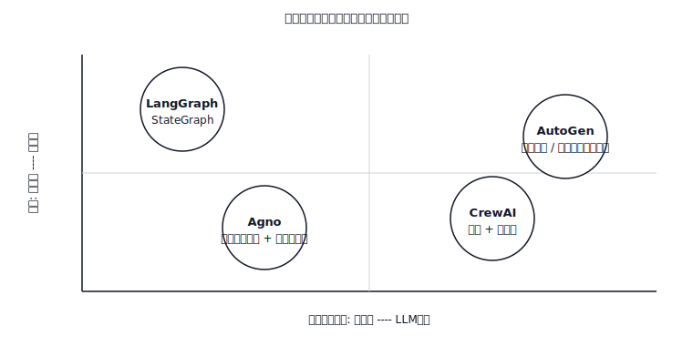

# Agent 框架权衡 — LangGraph vs CrewAI vs AutoGen vs Agno

> 每个框架都推销相同的演示（研究 agent 构建报告）并隐藏相同的 bug（状态 schema 与编排层打架）。选择其抽象与你问题形状匹配的框架；其他一切都是你写两遍的胶水代码。

**类型：** Learn
**语言：** Python
**前置知识：** Phase 11 · 09（函数调用），Phase 11 · 16（LangGraph）
**时间：** ~45 分钟

## 问题所在

你有一个需要多次 LLM 调用的任务。也许是研究工作流（计划、搜索、总结、引用）。也许是代码审查管道（解析 diff、批评、修补、验证）。也许是多轮助手，可以预订航班、写邮件和提交费用报告。你选择一个框架。

三天后，你发现框架的抽象泄漏了。CrewAI 给你角色，但当"研究员"需要向"写手"传递结构化计划时与你打架。AutoGen 给你 agent 之间的聊天，但没有一流的状态，所以你的 checkpoint 是对话日志的 pickle。LangGraph 给你状态图，但迫使你命名每个转换，然后你才知道 agent 会做什么。Agno 给你单个 agent 原语，当你尝试扇出到三个并发 worker 时它会尖叫。

修复不是"选择最佳框架"。而是将框架的核心抽象与你问题的形状匹配。本课绘制了那张地图。

## 核心概念

四个框架主导 2026 年的格局。它们的核心抽象并不相同。

| 框架 | 核心抽象 | 最适合 | 最不适合 |
|-----------|------------------|----------|-----------|
| **LangGraph** | `StateGraph`——类型化状态、节点、条件边、checkpointer。 | 具有显式状态和人工介入中断的工作流；需要时间旅行调试的生产 agent。 | 松散的、角色驱动的头脑风暴，拓扑未知。 |
| **CrewAI** | `Crew`——角色（目标、背景故事）、任务、流程（顺序或层级）。 | 具有短线性/层级计划的角色扮演或角色驱动工作流。 | 超出 crew 轮次历史的任何有状态的东西；复杂分支。 |
| **AutoGen** | `ConversableAgent` 对——两个或更多 agent 轮流发言直到退出条件。 | 多 agent *对话*（师生、提议者-批评者、执行者-审查者），思考从聊天中涌现。 | 具有已知 DAG 的确定性工作流；任何需要跨重启持久状态的东西。 |
| **Agno** | `Agent`——单个 LLM + 工具 + 记忆，可组合成团队。 | 快速构建的单个 agent 和轻量级团队；强多模态和内置存储驱动。 | 具有自定义 reducer 的深度、显式分支图。 |

### "抽象"实际意味着什么

框架的核心抽象是你在白板上推销架构时画的东西。

- **LangGraph** → 你画一个图。节点是步骤，边是转换，每一点的状态对象都是类型化的。心智模型是状态机。
- **CrewAI** → 你画一个组织结构图。每个角色有工作描述，经理路由任务。心智模型是一个小型专家团队。
- **AutoGen** → 你画一个 Slack DM。两个 agent 互相发消息；如果你需要 moderator，第三个加入。心智模型是聊天。
- **Agno** → 你画一个带工具的单个框。把框并排放置组成团队。心智模型是"带电池的 agent"。

### 状态问题

状态是大多数框架选择在生产中崩溃的地方。

- **LangGraph。** 类型化状态（`TypedDict` 或 Pydantic 模型），每个字段的 reducer，一流的 checkpointer（SQLite/Postgres/Redis）。恢复、中断和时间旅行是免费的。*(参见 Phase 11 · 16。)*
- **CrewAI。** 状态通过 `context` 字段作为字符串在任务之间流动，或通过 `output_pydantic` 结构化。没有开箱即用的持久化 per-crew 存储；如果 crew 必须跨重启存活，你需要自己添加。
- **AutoGen。** 状态是聊天历史和任何用户定义的 `context`。对话记录持久化；任意工作流状态不持久，除非你写适配器。
- **Agno。** 通过 `storage=` 附加到 `Agent` 的内置存储驱动（SQLite、Postgres、Mongo、Redis、DynamoDB）——对话会话和用户记忆自动持久化。不是完整的图 checkpointer；是会话存储。

### 分支问题

每个非平凡的 agent 都会分支。谁决定分支很重要。

- **LangGraph**——你通过条件边决定。路由是一个带命名分支的 Python 函数。分支在编译后的图中是一流的；checkpointer 记录了哪个分支被采取。
- **CrewAI**——在层级模式下经理决定；在顺序模式下你在构建时决定。路由隐含在任务列表中；经理的 prompt 之外没有一流的"if"。
- **AutoGen**——agent 通过聊天决定。分支从谁接下来发言中涌现。`GroupChatManager` 选择下一个发言者；你可以手写 `speaker_selection_method`，但默认是 LLM 驱动的。
- **Agno**——agent 通过接下来调用哪个工具决定。团队有 coordinator/router/collaborator 模式；超出该范围的分支是开发者的责任。

### 可观测性问题

- **LangGraph**——通过 LangSmith 或任何 OTel exporter 的 OpenTelemetry。每个节点转换都是一个 trace span；checkpoints 兼作可重放的 trace。LangSmith 是第一方选项；Langfuse/Phoenix 也有适配器。
- **CrewAI**——自 2025 年末起一流的 OpenTelemetry；与 Langfuse、Phoenix、Opik、AgentOps 集成。
- **AutoGen**——通过 `autogen-core` 的 OpenTelemetry 集成；AgentOps 和 Opik 有连接器。追踪粒度是 per-agent-message，不是 per-node。
- **Agno**——内置 `monitoring=True` 标志加 OpenTelemetry exporter；与 Langfuse 紧密集成用于会话 trace。

### 成本和延迟

四个框架都增加了每次调用的开销（框架逻辑、验证、序列化）。开销递增的大致顺序：Agno ≈ LangGraph < CrewAI ≈ AutoGen。差异主要由框架执行的额外 LLM 路由决定。CrewAI 的层级经理花费 token 决定谁下一个去；AutoGen 的 `GroupChatManager` 同样。LangGraph 只在你写 `llm.invoke` 的地方花费 token。Agno 的单个 agent 路径很薄。

当每次运行的成本很重要时，优先选择显式路由（LangGraph 边、AutoGen `speaker_selection_method`）而非 LLM 选择的路由。

### 互操作性

- **LangGraph** ↔ **LangChain** 工具、检索器、LLM。一流的 MCP 适配器（工具作为 MCP 服务器导入）。
- **CrewAI** ↔ 工具继承自 `BaseTool`；LangChain 工具、LlamaIndex 工具和 MCP 工具都可以适配。通过 `allow_delegation=True` 进行 crew-to-crew 委派。
- **AutoGen** → `FunctionTool` 包装任何 Python 可调用对象；MCP 适配器可用。与 AG2 生态系统紧密耦合用于 agent-to-agent 模式。
- **Agno** → `@tool` 装饰器或 BaseTool 子类；MCP 适配器；工具可以在 agent 和团队之间共享。

## 技能

> 你能用一句话解释为什么给定框架适合给定的 agent 问题。

构建前检查清单：

1. **绘制形状。** 这是图（类型化状态、命名转换）？角色扮演（专家交接工作）？聊天（agent 聊到完成）？带工具的单个 agent？
2. **决定谁分支。** 开发者决定的分支 → LangGraph。Manager-agent 决定 → CrewAI 层级。聊天涌现 → AutoGen。工具调用决定 → Agno。
3. **检查状态预算。** 你需要从 checkpoint 恢复吗？时间旅行？运行中的人工中断？如果是，LangGraph 是默认；Agno 会话覆盖对话范围的状态。
4. **检查成本预算。** LLM 选择的路由每轮花费额外 token。如果 agent 每天运行数千次，优先选择显式路由。
5. **预算框架开销。** 每个框架都是另一个依赖。如果任务是两次 LLM 调用加一个工具，写 30 行纯 Python；没有框架比没有框架更便宜。

在你能画出图、组织结构图、聊天或 agent 框之前，不要伸手拿框架。不要选择一个迫使你为其状态模型为你实际需要的东西而战的框架。

## 决策矩阵

| 问题形状 | 首选框架 | 原因 |
|---------------|---------------------|-----|
| 具有类型化状态、人工批准、长时间运行的工作流 DAG | LangGraph | 一流的状态、checkpointer、中断、时间旅行。 |
| 具有不同角色的研究/写作管道 | CrewAI（顺序）或 LangGraph 子图 | CrewAI 中角色-per-task 表达便宜；分支变复杂时用 LangGraph 扩展。 |
| 提议者-批评者或师生对话 | AutoGen | 双 agent 聊天是其原生形状。 |
| 带工具、会话、记忆的单个 agent | Agno | 最薄的设置，内置存储和记忆。 |
| 数千个带 reducer 的并行扇出 | LangGraph + `Send` | 唯一具有第一流并行调度原语的。 |
| 快速原型，无框架承诺 | 纯 Python + 提供商 SDK | 没有框架是最快的框架。 |

## 练习

1. **简单。** 对同一任务——"研究 Anthropic 的总部，写 200 字简报，引用来源"——在 LangGraph（四个节点：plan、search、write、cite）和 CrewAI（三个角色：researcher、writer、editor）中实现它。报告每次运行的 token 成本和代码行数。
2. **中等。** 在 AutoGen（researcher ↔ writer 聊天，editor 通过 `GroupChat` 加入）和 Agno（单个 agent 带 `search_tools` 和 `write_tools`，加会话存储）中构建同一任务。对四个实现进行排名：(a) 每次运行成本，(b) 崩溃后恢复能力，(c) 在写步骤前注入人工批准的能力。
3. **困难。** 构建一个决策树脚本 `pick_framework.py`，接受简短问题描述（JSON：`{has_typed_state, has_roles, has_dialogue, has_parallel_fanout, needs_resume}`）并返回带一句话理由的推荐。在你自己设计的六个案例上验证它。

## 关键术语

| 术语 | 人们怎么说 | 实际含义 |
|------|-----------------|-----------------------|
| 编排 | "Agent 如何协调" | 决定哪个节点/角色/agent 下一步运行的层。 |
| 持久状态 | "重启后恢复" | 附加到 checkpoint 或会话存储的、跨进程死亡存活的状态。 |
| LLM 选择的路由 | "让模型决定" | 规划器 LLM 每轮选择下一步；灵活但每轮决策都花费 token。 |
| 显式路由 | "开发者决定" | Python 函数或静态边选择下一步；便宜且可审计。 |
| Crew | "一个 CrewAI 团队" | 绑定到单个可运行对象的角色 + 任务 + 流程（顺序或层级）。 |
| GroupChat | "AutoGen 的多 agent 聊天" | 带发言选择器的 N 个 agent 之间的管理对话。 |
| Team (Agno) | "多 agent Agno" | 在一组 agent 上的路由/协调/协作模式。 |
| StateGraph | "LangGraph 的图" | 类型化状态、节点、条件边、checkpointer 原语。 |

## 延伸阅读

- [LangGraph documentation](https://langchain-ai.github.io/langgraph/)——StateGraph、checkpointers、interrupts、time-travel。
- [CrewAI documentation](https://docs.crewai.com/)——Crews、Flows、Agents、Tasks、Processes。
- [AutoGen documentation](https://microsoft.github.io/autogen/)——ConversableAgent、GroupChat、teams、tools。
- [Agno documentation](https://docs.agno.com/)——Agent、Team、Workflow、storage、memory。
- [Anthropic — Building effective agents (Dec 2024)](https://www.anthropic.com/research/building-effective-agents)——模式库（prompt chaining、routing、parallelization、orchestrator-workers、evaluator-optimizer），与框架无关。
- [Yao et al., "ReAct: Synergizing Reasoning and Acting" (ICLR 2023)](https://arxiv.org/abs/2210.03629)——每个框架包装的原语。
- [Wu et al., "AutoGen: Enabling Next-Gen LLM Applications via Multi-Agent Conversation" (2023)](https://arxiv.org/abs/2308.08155)——AutoGen 的设计论文。
- [Park et al., "Generative Agents: Interactive Simulacra of Human Behavior" (UIST 2023)](https://arxiv.org/abs/2304.03442)——CrewAI 风格角色堆栈所基于的角色扮演基础。
- Phase 11 · 16（LangGraph）——本课对其进行基准测试的框架。
- Phase 11 · 19（Reflexion）——清晰映射到 LangGraph 但映射到 CrewAI 很尴尬的模式。
- Phase 11 · 22（Production observability）——如何插桩你选择的任何框架。
