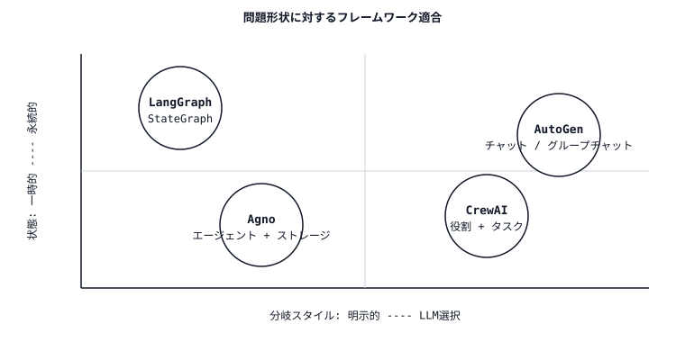

# Agent 框架权衡 — LangGraph vs CrewAI vs AutoGen vs Agno

> 每个框架都能演示同一个示例（研究型 Agent 撰写报告），也都藏着同一个 Bug（状态 schema 与编排层打架）。挑选框架时，让它的抽象与你问题的形状匹配；其余的都是你要写两遍的胶水代码。

**类型：** 学习  
**语言：** Python  
**前置要求：** 阶段 11 · 09（函数调用）、阶段 11 · 16（LangGraph）  
**时长：** ~45 分钟

## 问题

你需要一个不止一次 LLM 调用的任务。可能是一个研究工作流（规划、搜索、总结、引用）。可能是一个代码审查流水线（解析 diff、批评、补丁、验证）。也可能是一个能订机票、写邮件、提交报销的多轮助理。你选了一个框架。

三天后，你发现框架的抽象会泄露。CrewAI 给了你角色，但当你让"研究员"把结构化计划交给"写手"时却处处作对。AutoGen 给了你 Agent 间的聊天，但没有一等公民的状态，于是你的检查点只能是一坨对话日志的 pickle。LangGraph 给了你状态图，却强制你在了解 Agent 会做什么之前就得命名每条转换。Agno 给了你单 Agent 抽象，但当你试图展开成三个并发工作者时它直接报错。

解决方案不是"选最好的框架"，而是将框架的核心抽象与问题的形状匹配。这节课就绘制这张地图。

## 概念

2026 年的生态中有四个主流框架。它们的核心抽象并不相同。

| 框架 | 核心抽象 | 最适用场景 | 最不适用场景 |
|-------|---------|-----------|------------|
| **LangGraph** | `StateGraph` — 类型化状态、节点、条件边、检查点 | 需要显式状态和人机环中断的工作流；需要时间旅行调试的生产级 Agent | 松散的、角色驱动的头脑风暴，拓扑结构未知 |
| **CrewAI** | `Crew` — 角色（目标、背景故事）、任务、流程（顺序或层级） | 角色扮演或人格驱动的工作流，具有简短的线性/层级计划 | 任何超出 Crew 对话历史的带状态场景；复杂分支 |
| **AutoGen** | `ConversableAgent` 对 — 两个或多个 Agent 轮流发言直到退出条件 | 多 Agent *对话*（师生、提议-批评、演员-评审），思考从聊天中涌现 | 已知 DAG 的确定性工作流；任何需要在重启后保持持久状态的任务 |
| **Agno** | `Agent` — 单个 LLM + 工具 + 记忆，可组合成团队 | 快速构建的单个 Agent 和轻量级团队；强大的多模态能力和内置存储驱动 | 深度、显式分支且有自定义 reducer 的图 |

### "抽象"究竟是什么意思

框架的核心抽象，就是你在白板上画出来推销架构的那个东西。

- **LangGraph** → 你画一张图。节点是步骤，边是转换，每个节点的状态对象是有类型的。心智模型是状态机。
- **CrewAI** → 你画一张组织架构图。每个角色有一份职位描述，管理者分配任务。心智模型是一个小型专家团队。
- **AutoGen** → 你画一个 Slack 私聊。两个 Agent 互相发消息；如果需要主持人，再加第三个。心智模型是聊天。
- **Agno** → 你画一个盒子，四周挂着工具。把多个盒子并排放就是团队。心智模型是"开箱即用的 Agent"。

### 状态问题

状态是大多数框架选择在生产环境崩溃的地方。

- **LangGraph。** 类型化状态（`TypedDict` 或 Pydantic 模型）、字段级别 reducer、一等公民检查点（SQLite/Postgres/Redis）。恢复、中断和时间旅行都是免费的 *（参见阶段 11 · 16）*。
- **CrewAI。** 状态通过 `context` 字段以字符串形式在任务间流动，或通过 `output_pydantic` 结构化传递。没有开箱即用的持久化 Crew 存储；如果 Crew 需要在重启后存活，你得自己加。
- **AutoGen。** 状态是聊天历史和任何用户定义的 `context`。对话记录会持久化；任意工作流状态除非你写适配器否则不会持久化。
- **Agno。** 内置存储驱动（SQLite、Postgres、Mongo、Redis、DynamoDB），通过 `storage=` 附加到 `Agent` 上——对话会话和用户记忆自动持久化。不是完整的图检查点，而是会话存储。

### 分支问题

每个非平凡的 Agent 都有分支。谁来决定分支很重要。

- **LangGraph** — 你决定，通过条件边。路由是一个带命名分支的 Python 函数。分支在编译后的图中是一等公民；检查点会记录走了哪个分支。
- **CrewAI** — 层级模式下由管理者决定；顺序模式下你在构建时决定。路由隐含在任务列表中；除了管理者的提示之外，没有一等公民的"if"。
- **AutoGen** — Agent 通过聊天决定。分支由谁接下来发言而涌现。`GroupChatManager` 选择下一位发言者；你可以手写 `speaker_selection_method`，但默认由 LLM 驱动。
- **Agno** — Agent 通过调用哪个工具来决定。团队有协调者/路由器/协作者模式；超出此范围的分支由开发者负责。

### 可观测性问题

- **LangGraph** — 通过 LangSmith 或任何 OTel 导出器进行 OpenTelemetry 追踪。每个节点转换都是一个追踪 span；检查点可兼作可回放的追踪。LangSmith 是第一方选项；Langfuse/Phoenix 也有适配器。
- **CrewAI** — 自 2025 年底起，一等公民的 OpenTelemetry 支持；与 Langfuse、Phoenix、Opik、AgentOps 集成。
- **AutoGen** — 通过 `autogen-core` 集成 OpenTelemetry；AgentOps 和 Opik 有连接器。追踪粒度是按 Agent 消息而非按节点。
- **Agno** — 内置 `monitoring=True` 标志加上 OpenTelemetry 导出器；与 Langfuse 深度集成，用于会话追踪。

### 成本与延迟

四个框架都会增加每次调用的开销（框架逻辑、验证、序列化）。大致按开销递增排序：Agno ≈ LangGraph < CrewAI ≈ AutoGen。差异主要来自框架做了多少额外的 LLM 路由。CrewAI 的层级管理者会消耗 token 来决定谁下一步；AutoGen 的 `GroupChatManager` 也一样。LangGraph 只在你写 `llm.invoke` 的地方消耗 token。Agno 的单 Agent 路径很薄。

当单次运行成本很重要时，优先选择显式路由（LangGraph 边、AutoGen `speaker_selection_method`）而非 LLM 选择的路由。

### 互操作性

- **LangGraph** ↔ **LangChain** 工具、检索器、LLM。一等公民的 MCP 适配器（作为 MCP 服务器导入的工具）。
- **CrewAI** ↔ 工具继承自 `BaseTool`；LangChain 工具、LlamaIndex 工具和 MCP 工具都可以适配。通过 `allow_delegation=True` 实现 Crew 到 Crew 的委派。
- **AutoGen** → `FunctionTool` 包装任何 Python 可调用对象；提供 MCP 适配器。与 AG2 生态系统紧密耦合，用于 Agent 到 Agent 的模式。
- **Agno** → `@tool` 装饰器或 BaseTool 子类；MCP 适配器；工具可在 Agent 和团队间共享。

## 技能

> 你能用一句话解释，为什么某个框架适合某个 Agent 问题。

构建前检查清单：

1. **画形状。** 这是一个图（类型化状态、命名转换）？角色扮演（专家交接工作）？聊天（Agent 聊到完）？还是带工具的单 Agent？
2. **决定谁来分支。** 开发者决定分支 → LangGraph。管理者/Agent 决定 → CrewAI 层级模式。聊天涌现 → AutoGen。工具调用决定 → Agno。
3. **检查状态预算。** 你需要从检查点恢复吗？时间旅行？运行中的人机中断？如果是，LangGraph 是默认选择；Agno 的会话覆盖对话范围内的状态。
4. **检查成本预算。** LLM 选择的路由每轮消耗额外 token。如果 Agent 每天运行数千次，优先选择显式路由。
5. **预算框架的开销。** 每个框架都是一个额外依赖。如果任务只是两次 LLM 调用加一个工具，写 30 行纯 Python；没有框架比没有框架更快。

在你画出图、组织架构图、聊天图或 Agent 盒子之前，拒绝使用框架。拒绝选择一个强迫你为了真正需要的东西而与它的状态模型对抗的框架。

## 决策矩阵

| 问题形状 | 推荐框架 | 原因 |
|----------|---------|------|
| 带类型化状态、人工审批、长时间运行的工作流 DAG | LangGraph | 一等公民状态、检查点、中断、时间旅行 |
| 带不同角色的研究/写作流水线 | CrewAI（顺序模式）或 LangGraph 子图 | CrewAI 中按角色分配任务表达简单；分支复杂时升级到 LangGraph |
| 提议-批评或师生对话 | AutoGen | 双 Agent 聊天是其原生形态 |
| 带工具、会话、记忆的单 Agent | Agno | 最薄的设置，内置存储和记忆 |
| 数千个并行扇出带 reducer 的场景 | LangGraph + `Send` | 唯一具有一等公民并行分发 API 的框架 |
| 快速原型，不绑定框架 | 纯 Python + 提供商 SDK | 没有框架是最快的框架 |

## 练习

1. **简单。** 取同一个任务——"研究 Anthropic 总部，写 200 字简报，注明来源"——在 LangGraph（四个节点：规划、搜索、写稿、引用）和 CrewAI（三个角色：研究员、写手、编辑）中各实现一次。报告每次运行的 token 成本和代码行数。
2. **中等。** 在 AutoGen（研究员 ↔ 写手聊天，编辑通过 `GroupChat` 加入）和 Agno（一个带 `search_tools` 和 `write_tools` 以及会话存储的单 Agent）中实现同样的任务。对四个实现按 (a) 每次运行成本、(b) 崩溃后恢复能力、(c) 在写稿步骤前插入人工审批的能力进行排序。
3. **困难。** 构建一个决策树脚本 `pick_framework.py`，接收简短的问题描述（JSON：`{has_typed_state, has_roles, has_dialogue, has_parallel_fanout, needs_resume}`），返回带一句话理由的推荐。在你自己设计的六个案例上验证它。

## 关键术语

| 术语 | 人们说的意思 | 实际含义 |
|------|-------------|---------|
| 编排（Orchestration） | "Agent 如何协调" | 决定下一个节点/角色/Agent 运行的层 |
| 持久化状态（Durable state） | "重启后恢复" | 在进程死亡后仍存活的状态，附加到检查点或会话存储 |
| LLM 选择路由 | "让模型决定" | 规划 LLM 每轮选择下一步；灵活但每次决策都消耗 token |
| 显式路由 | "开发者决定" | Python 函数或静态边选择下一步；廉价且可审计 |
| Crew | "一个 CrewAI 团队" | 角色 + 任务 + 流程（顺序或层级）绑定为一个可运行单元 |
| GroupChat | "AutoGen 的多 Agent 聊天" | N 个 Agent 之间的受控对话，带发言者选择器 |
| 团队（Agno Team） | "多 Agent Agno" | 在一组 Agent 上的路由/协调/协作模式 |
| StateGraph | "LangGraph 的图" | 类型化状态、节点、条件边、检查点抽象 |

## 延伸阅读

- [LangGraph 文档](https://langchain-ai.github.io/langgraph/) — StateGraph、检查点、中断、时间旅行
- [CrewAI 文档](https://docs.crewai.com/) — Crews、Flows、Agents、Tasks、Processes
- [AutoGen 文档](https://microsoft.github.io/autogen/) — ConversableAgent、GroupChat、teams、tools
- [Agno 文档](https://docs.agno.com/) — Agent、Team、Workflow、storage、memory
- [Anthropic — Building effective agents（2024 年 12 月）](https://www.anthropic.com/research/building-effective-agents) — 模式库（提示链、路由、并行化、编排者-工作者、评估者-优化器），框架无关
- [Yao et al., "ReAct: Synergizing Reasoning and Acting"（ICLR 2023）](https://arxiv.org/abs/2210.03629) — 每个框架都在包装的那个循环
- [Wu et al., "AutoGen: Enabling Next-Gen LLM Applications via Multi-Agent Conversation"（2023）](https://arxiv.org/abs/2308.08155) — AutoGen 的设计论文
- [Park et al., "Generative Agents: Interactive Simulacra of Human Behavior"（UIST 2023）](https://arxiv.org/abs/2304.03442) — CrewAI 风格角色栈所依赖的角色扮演基础
- 阶段 11 · 16（LangGraph）— 本节课作为基准对比的框架
- 阶段 11 · 19（Reflexion）— 一个在 LangGraph 中映射清晰但在 CrewAI 中别扭的模式
- 阶段 11 · 22（生产环境可观测性）— 如何为你选择的框架做监控埋点
