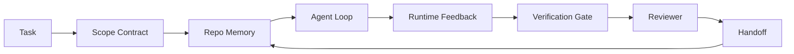

# Agent Workbench Engineering: 高性能モデルがそれでも失敗する理由

> 高性能なモデルだけでは足りません。信頼できるエージェントには workbench が必要です。instructions、state、scope、feedback、verification、review、handoff がそろって初めて、安全に出荷できる作業になります。これらを取り除くと、frontier model でさえ出荷できない危険な成果物を生みます。

**種別:** 学習 + 構築
**言語:** Python (stdlib)
**前提条件:** Phase 14 · 01 (Agent Loop), Phase 14 · 26 (Failure Modes)
**所要時間:** 約45分

## Learning Objectives

- モデル能力と実行の信頼性を分けて考える。
- エージェントが出荷可能かどうかを決める 7 つの workbench surface を説明する。
- 小さな repo task で、prompt-only の実行と workbench-guided の実行を比較する。
- 欠けていた surface と、それが引き起こした症状を対応付けた failure-mode report を作る。

## 問題

frontier model を実際の repo に入れて、入力 validation を追加するよう頼んだとします。モデルは 4 つのファイルを開き、もっともらしいコードを書き、成功を宣言して停止します。テストを実行すると 2 つ失敗します。3 つ目のファイルは validation と無関係なのに変更されています。エージェントが何を仮定し、最初に何を試し、何が残っているのかという記録はありません。

モデルが Python を間違えたわけではありません。作業を間違えたのです。何をもって完了とするのか、どこへ書いてよいのか、どのテストが authoritative なのか、次の session がどう引き継ぐべきなのかを知らなかったのです。

これは model bug ではありません。workbench bug です。エージェントを取り巻く surface に、one-shot generation を信頼できる再開可能な engineering に変える部品が欠けています。

## The Concept

workbench は、タスク中にモデルを包む operating environment です。7 つの surface があります。

| Surface | 運ぶもの | 欠けたときの失敗 |
|---------|----------|------------------|
| Instructions | 起動時のルール、禁止行為、definition of done | Agent が出荷の意味を推測する |
| State | 現在のタスク、触ったファイル、blocker、次の action | 各 session がゼロから再開する |
| Scope | 許可ファイル、禁止ファイル、acceptance criteria | 無関係な code に編集が漏れる |
| Feedback | loop に取り込まれた実コマンド出力 | Agent が 400 を見ても成功を宣言する |
| Verification | tests、lint、smoke run、scope check | "Looks good" が main に届く |
| Review | 別ロールによる second pass | Builder が自分の宿題を採点する |
| Handoff | 何を、なぜ変更し、何が残るか | 次の session がすべて再発見する |

workbench はモデルから独立しています。モデルは差し替えられますが、surface は保てます。surface を差し替えて信頼性を保つことはできません。



loop は chat history ではなく state file で閉じます。chat は揮発的です。repo が system of record です。

### Workbench versus prompt engineering

prompting は、この turn で何が欲しいかをモデルに伝えます。workbench は、turn と session をまたいでどう作業するかをモデルに伝えます。エージェント失敗談の多くは、prompt-engineering の服を着た workbench failure です。

### Workbench versus framework

framework は runtime を与えます (LangGraph、AutoGen、Agents SDK)。workbench は、その runtime の中でエージェントが作業する場所を与えます。両方が必要です。この mini-track は後者について扱います。

### ベンダー分類ではなく primitive から考える

いま "harness engineering" について多くの文章があります。Addy Osmani、OpenAI、Anthropic、LangChain、Martin Fowler、MongoDB、HumanLayer、Augment Code、Thoughtworks、walkinglabs awesome list、そして Medium や Hacker News の記事が継続的に扱っています。harness の境界、scope、語彙については意見が割れています。どちらかを選ぶ必要はありません。7 つの surface は UX layer です。その下にある workbench はすべて、信頼できる backend を支える distributed-systems primitives の同じ集合でできています。

少しだけ agent という label を外してください。agent run は、時間、process、machine をまたぐ computation です。信頼できるものにするには、production system と同じ primitive が必要です。

| Primitive | 何か | agent では何を運ぶか |
|-----------|------|----------------------|
| Function | 型付き handler。可能なら pure。input と output を所有する。 | tool call、rule check、verification step、model invocation |
| Worker | 1 つ以上の function と lifecycle を所有する long-lived process | builder、reviewer、verifier、MCP server |
| Trigger | function を起動する event source | agent loop tick、HTTP request、queue message、cron、file change、hook |
| Runtime | 何をどこで、どの timeout と resource で実行するかを決める boundary | Claude Code の process、LangGraph runtime、worker container |
| HTTP / RPC | caller と worker の wire | tool-call protocol、MCP request、model API |
| Queue | trigger と worker の間の durable buffer。back-pressure、retry、idempotency | task board、feedback log、review inbox |
| Session persistence | crash、restart、model swap を越えて残る state | `agent_state.json`、checkpoints、KV stores、repo 自体 |
| Authorization policy | 誰が、どの scope で、どの function を呼べるか | allowed/forbidden files、approval boundaries、MCP capability lists |

7 つの workbench surface をこれらの primitive に対応付けると次のようになります。

- **Instructions** — policy + function metadata。rules は check (functions) です。router (`AGENTS.md`) は runtime startup に付与される policy です。
- **State** — session persistence。runtime が各 step で読む keyed store です。file、KV、DB のどれでもよく、重要なのは storage backend ではなく persistence semantics です。
- **Scope** — task ごとの authorization policy。allowed/forbidden globs は ACL です。approval required は permission lattice です。
- **Feedback** — queue に書かれた invocation log。すべての shell call が durable で replayable な record です。
- **Verification** — function。input に対して deterministic。task close で trigger され、fail closed します。
- **Review** — builder artifacts に対する read-only authz と review reports に対する write-only authz を持つ別 worker。
- **Handoff** — session-end trigger が emitted する durable record。次 session の startup trigger がそれを読みます。

agent loop そのものは、event (user message、tool result、timer tick) を消費し、function (model と、model が選んだ tools) を呼び、record (state、feedback) を書き、trigger (verify、review、handoff) を emitted する worker です。神秘はありません。job processor と同じ形です。

### 流通している pattern を primitive に翻訳する

よくある harness pattern は、どれも 8 つの primitive に還元できます。翻訳表です。

| Vendor or community pattern | 実体 |
|------------------------------|------|
| Ralph Loop (Claude Code, Codex, agentic_harness book) — agent が早く止まろうとしたとき、fresh context window に original intent を再注入する | clean context で task を再 enqueue する trigger。goal は session persistence が運ぶ |
| Plan / Execute / Verify (PEV) | role ごとの 3 worker。phase 間は state と queue で通信する |
| Harness-compute separation (OpenAI Agents SDK, April 2026) — control plane と execution plane を分離 | control-plane / data-plane の言い換え。agent label より何十年も前からある |
| Open Agent Passport (OAP, March 2026) — execution 前に declarative policy に照らして全 tool call を署名・監査 | pre-action worker が強制する authorization policy と signed audit queue |
| Guides and Sensors (Birgitta Böckeler / Thoughtworks) — feedforward rules + feedback observability | authorization policy + verification functions + observability traces |
| Progressive compaction, 5-stage (Claude Code reverse engineering, April 2026) | session persistence を budget 内に保つため cron 的に動く state-management worker |
| Hooks / middleware (LangChain, Claude Code) — model call と tool call を intercept | runtime invocation path を包む triggers + functions |
| Skills as Markdown with progressive disclosure (Anthropic, Flue) | function metadata を just-in-time に context へ load する function registry |
| Sandbox agents (Codex, Sandcastle, Vercel Sandbox) | compute plane: isolated filesystem、network、lifecycle を持つ runtime |
| MCP servers | stable RPC 越しに functions を公開する workers。capability lists は authorization |

この表の各行は、agent community が distributed systems で既に名前を持っていた primitive に到達し、新しい名前を付けているだけです。marketing label としては有用ですが、engineering vocabulary としては有用ではありません。

### 数字が示していること

harness-over-model という主張には、いまでは数字があります。"より賢いモデルを待てばよい" への唯一の正直な反論でもあるため、知っておく価値があります。

- Terminal Bench 2.0 — 同じ model で harness を変えただけで coding agent が top 30 圏外から 5 位へ上がった (LangChain, *Anatomy of an Agent Harness*)。
- Vercel — agent の tools の 80% を削除し、success rate が 80% から 100% へ上がった (MongoDB)。
- Harvey — legal agents は harness optimization だけで accuracy が 2 倍以上になった (MongoDB)。
- enterprise AI agent projects の 88% は production に到達しない。失敗は reasoning ではなく runtime 周辺に集中している (preprints.org, *Harness Engineering for Language Agents*, March 2026)。
- 2025 年の benchmark study では、人気の open-source frameworks 3 つの task completion は約 50%。long-context WebAgent は long-context 条件で 40-50% から 10% 未満に崩れ、主因は infinite loop と goal loss だった (2026 年初頭の writeups で広く扱われた)。

結論は "harness が永遠に勝つ" ではありません。モデルは時間とともに harness trick を吸収します。結論は、今日の load-bearing engineering はモデルの中ではなくモデルの周囲にあり、その負荷を支える primitive は production system が昔から必要としてきたものだということです。

### ベンダー記事が踏み込まないところ

ここは遠慮する必要のない部分です。

- LangChain の *Anatomy of an Agent Harness* は prompts、tools、hooks、sandboxes、orchestration、memory、skills、subagents、runtime の "dumb loop" など 11 components を列挙します。しかし queue、deployment unit としての worker、trigger semantics、独立 concern としての session persistence、authorization policy を名指ししていません。harness を deploy する system ではなく、configure する object として扱っています。
- Addy Osmani の *Agent Harness Engineering* は `Agent = Model + Harness` と ratchet pattern という framing を置きますが、harness が何から作られるのかまでは言いません。spec ではなく stance として読めます。
- Anthropic と OpenAI は surface について最も深く書いていますが、自社 runtime の内側に留まります。April 2026 Agents SDK の "harness-compute separation" announcement は、control-plane / data-plane split を明示的に endorse した最初の vendor piece です。それは primitive idea であり、新しいものではありません。
- agentic_harness book は harness を config object として扱います (Jaymin West の *Agentic Engineering*, chapter 6)。そこでもっとも強い一文は "the harness is the primary security boundary in an agentic system" です。これは authorization policy を言い換えただけです。
- Hacker News threads も同じ場所に到達しています。April 2026 の *The agent harness belongs outside the sandbox* thread は、harness は "more like a hypervisor that sits outside everything and authorises access based on context and user" であるべきだと論じます。これも authorization policy as a separate plane です。

これらの記事に反対する必要はありません。ただ gap に気づけば十分です。彼らは既に存在する system の UX description を書いています。私たちは system を書いています。system が正しく作られていれば、7 つの surface は primitive から自然に現れます。system が間違っていれば、どれだけ `AGENTS.md` を磨いても、欠けた queue は直りません。

したがって他所で "harness engineering" を聞いたら primitive に翻訳してください。prompts と rules は policy と functions。scaffolding は runtime。guardrails は authorization + verification。hooks は triggers。memory は session persistence。Ralph Loop は requeue。subagents は workers。sandboxes は compute planes。語彙は変わりますが、engineering は変わりません。workbench は agent-facing UX です。次の vendor reframe を越えて残る意味での harness は、functions、workers、triggers、runtimes、queues、persistence、policy が正しく結線されたものです。

## 実装

`code/main.py` は小さな repo task を 2 回実行します。1 回目は prompt only、2 回目は 7 つの surface を結線した workbench ありです。同じ model、同じ task です。script は失敗 run で欠けていた surface を数え、failure-mode report を出力します。

repo task は意図的に小さくしています。one-file の FastAPI 風 handler に input validation を追加し、passing test を書く task です。

実行:

```
python3 code/main.py
```

出力: 2 つの run の side-by-side log、prompt-only run を要約した `failure_modes.json`、workbench run の one-line verdict。

agent は小さな rule-based stub です。ポイントは model ではなく surface です。この mini-track の残りで、各 surface を本物の再利用可能な artifact として作り直します。

## Use It

workbench surface は、そう呼ばれていなくても既に現場にあります。

- **Claude Code, Codex, Cursor.** `AGENTS.md` と `CLAUDE.md` は instructions surface です。slash commands は scope。hooks は verification です。
- **LangGraph, OpenAI Agents SDK.** checkpoints と session stores は state surface です。handoffs は handoff surface です。
- **実 repo の CI.** tests、lint、type-check は verification。PR template は handoff。CODEOWNERS は review です。

Workbench engineering とは、各 team がそれらを再発見するのではなく、surface を explicit で reusable にする discipline です。

## Ship It

`outputs/skill-workbench-audit.md` は、既存 repo に 7 つの workbench surface があるかを監査し、missing、partial、healthy を報告する portable skill です。どんな agent setup の横にも置けます。何を先に直すべきかを教えてくれます。

## Exercises

1. 既に agent を走らせている repo を 1 つ選び、7 つの surface を 0 (missing) から 2 (healthy) で採点してください。最も弱い surface は何ですか。
2. `main.py` を拡張し、prompt-only run も fake な "success" claim を出すようにしてください。verification gate がそれを検出できることを確認してください。
3. 自分の product 用に 8 番目の surface を追加してください。既存 7 つのどれにも畳み込めない理由を説明してください。
4. 余計な file write を hallucinate する別の stub agent で script を再実行してください。どの surface が最初に検出しますか。
5. Phase 14 · 26 の industry-recurring failure modes 5 つを 7 つの surface に対応付けてください。各 surface はどの mode を吸収するためのものですか。

## Key Terms

| Term | よくある言い方 | 実際の意味 |
|------|----------------|------------|
| Workbench | "The setup" | work を reliable にする、model 周辺の engineered surfaces |
| Surface | "A doc" or "a script" | agent が各 turn で読み書きする named, machine-readable input |
| System of record | "The notes" | chat history が消えたとき agent が真実として扱う file |
| Definition of done | "Acceptance" | agent がごまかせない objective, file-backed checklist |
| Workbench audit | "Repo readiness check" | 作業前に 7 つの surface を巡回し、欠けた部品を示す pass |

## 参考文献

権威としてではなく data point として読んでください。どれも partial taxonomy です。採用する前に、すべての概念を primitive (function, worker, trigger, runtime, HTTP/RPC, queue, persistence, policy) に戻して考えます。

Vendor framings:

- [Addy Osmani, Agent Harness Engineering](https://addyosmani.com/blog/agent-harness-engineering/) — `Agent = Model + Harness` と ratchet pattern。infrastructure は薄い
- [LangChain, The Anatomy of an Agent Harness](https://blog.langchain.com/the-anatomy-of-an-agent-harness/) — 11 components: prompts, tools, hooks, orchestration, sandboxes, memory, skills, subagents, runtime。queues、deployment、authz は省かれている
- [OpenAI, Harness engineering: leveraging Codex in an agent-first world](https://openai.com/index/harness-engineering/) — Codex team から見た runtime 周辺 surface
- [OpenAI, Unrolling the Codex agent loop](https://openai.com/index/unrolling-the-codex-agent-loop/) — function calls 上の `while` に還元された agent loop
- [Anthropic, Effective harnesses for long-running agents](https://www.anthropic.com/engineering/effective-harnesses-for-long-running-agents) — 特定 runtime 内の long-horizon surfaces
- [Anthropic, Harness design for long-running application development](https://www.anthropic.com/engineering/harness-design-long-running-apps) — applied design notes
- [LangChain Deep Agents harness capabilities](https://docs.langchain.com/oss/python/deepagents/harness) — runtime config surface

Practitioner pieces with usable detail:

- [Martin Fowler / Birgitta Böckeler, Harness engineering for coding agent users](https://martinfowler.com/articles/harness-engineering.html) — guides (feedforward) + sensors (feedback)。最も明快な control-theory framing
- [HumanLayer, Skill Issue: Harness Engineering for Coding Agents](https://www.humanlayer.dev/blog/skill-issue-harness-engineering-for-coding-agents) — "it's not a model problem, it's a configuration problem"
- [MongoDB, The Agent Harness: Why the LLM Is the Smallest Part of Your Agent System](https://www.mongodb.com/company/blog/technical/agent-harness-why-llm-is-smallest-part-of-your-agent-system) — receipts: Vercel 80% to 100%、Harvey 2x accuracy、Terminal Bench Top 30 to Top 5
- [Augment Code, Harness Engineering for AI Coding Agents](https://www.augmentcode.com/guides/harness-engineering-ai-coding-agents) — constraint-first walkthrough
- [Sequoia podcast, Harrison Chase on Context Engineering Long-Horizon Agents](https://sequoiacap.com/podcast/context-engineering-our-way-to-long-horizon-agents-langchains-harrison-chase/) — model concern より runtime concern

Books, papers, and reference implementations:

- [Jaymin West, Agentic Engineering — Chapter 6: Harnesses](https://www.jayminwest.com/agentic-engineering-book/6-harnesses) — book-length treatment。harness を primary security boundary として扱う
- [preprints.org, Harness Engineering for Language Agents (March 2026)](https://www.preprints.org/manuscript/202603.1756) — control / agency / runtime としての academic framing
- [walkinglabs/awesome-harness-engineering](https://github.com/walkinglabs/awesome-harness-engineering) — context、evaluation、observability、orchestration を横断する curated reading list
- [ai-boost/awesome-harness-engineering](https://github.com/ai-boost/awesome-harness-engineering) — alternate curated list (tools, evals, memory, MCP, permissions)
- [andrewgarst/agentic_harness](https://github.com/andrewgarst/agentic_harness) — Redis-backed memory と eval suite を備えた production-ready reference implementation
- [HKUDS/OpenHarness](https://github.com/HKUDS/OpenHarness) — built-in personal agent を持つ open agent harness

Hacker News threads worth reading for the disagreements, not the consensus:

- [HN: Effective harnesses for long-running agents](https://news.ycombinator.com/item?id=46081704)
- [HN: Improving 15 LLMs at Coding in One Afternoon. Only the Harness Changed](https://news.ycombinator.com/item?id=46988596)
- [HN: The agent harness belongs outside the sandbox](https://news.ycombinator.com/item?id=47990675) — authorization を separate plane として論じる

Cross-references inside this curriculum:

- Phase 14 · 23 — OpenTelemetry GenAI conventions: sensors literature が指す observability layer
- Phase 14 · 26 — 7 つの surface が吸収するために設計された failure modes catalog
- Phase 14 · 27 — authorization-policy primitive に置かれる prompt injection defenses
- Phase 14 · 29 — Production runtimes (queue, event, cron): この lesson の primitive が deployment で生きる場所
