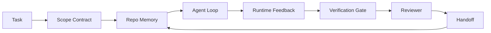

# Engenharia de Agent Workbench: Por Que Modelos Capazes Ainda Falham

> Um modelo capaz não é suficiente. Agents confiáveis precisam de um workbench: instruções, estado, escopo, feedback, verificação, revisão e handoff. Tire esses elementos e mesmo um modelo de ponta produz trabalho inseguro pra release.

**Tipo:** Aprenda + Construa
**Linguagens:** Python (stdlib)
**Pré-requisitos:** Fase 14 · 01 (Agent Loop), Fase 14 · 26 (Modos de Falha)
**Tempo:** ~45 minutos

## Objetivos de Aprendizado

- Separar capacidade do modelo da confiabilidade de execução.
- Nomear as sete superfícies do workbench que decidem se um agent faz release.
- Comparar uma execução só com prompt contra uma execução guiada pelo workbench em uma tarefa pequena de repo.
- Produzir um relatório de modo de falha que mapeia cada superfície perdida pro sintoma que ela causou.

## O Problema

Você joga um modelo de ponta num repo real e pede pra ele adicionar validação de input. Ele abre quatro arquivos, escreve código plausível, declara sucesso e para. Você roda os testes. Dois falham. Um terceiro arquivo foi tocado e não tinha nada a ver com validação. Não tem registro do que o agent assumiu, o que tentou primeiro, ou o que falta pra fazer.

O modelo não estava errado sobre Python. Estava errado sobre o trabalho. Ele não fazia ideia do que contava como pronto, onde podia escrever, quais testes eram autoritativos, ou como a próxima sessão deveria retomar.

Isso não é um bug do modelo. É um bug do workbench. A superfície ao redor do agent tá faltando as partes que transformam uma geração one-shot em engenharia confiável e retomável.

## O Conceito

Um workbench é o ambiente operacional que envolve o modelo durante uma tarefa. Ele tem sete superfícies:

| Superfície | O que carrega | Falha quando ausente |
|------------|---------------|----------------------|
| Instruções | Regras de inicialização, ações proibidas, definição de pronto | Agent adivinha o que significa release |
| Estado | Tarefa atual, arquivos tocados, bloqueios, próxima ação | Cada sessão recomeça do zero |
| Escopo | Arquivos permitidos, arquivos proibidos, critérios de aceitação | Edições vazam pra código não relacionado |
| Feedback | Saída real de comandos capturada no loop | Agent declara sucesso num erro 400 |
| Verificação | Testes, lint, smoke run, verificação de escopo | "Parece bom" vai pro main |
| Revisão | Uma segunda passagem com um papel diferente | Builder avalia a própria lição de casa |
| Handoff | O que mudou, por quê, o que falta | Próxima sessão redescobre tudo |

O workbench é independente do modelo. Você pode trocar o modelo e manter as superfícies. Não pode trocar as superfícies e manter a confiabilidade.



O loop fecha no arquivo de estado, não no histórico de chat. Chat é volátil. O repo é o sistema de registro.

### Workbench versus prompt engineering

Prompting diz ao modelo o que você quer neste turno. Um workbench diz ao modelo como trabalhar entre turnos e entre sessões. A maioria das histórias de falha de agent são falhas de workbench vestidas de prompt engineering.

### Workbench versus framework

Um framework te dá um runtime (LangGraph, AutoGen, Agents SDK). Um workbench dá ao agent um lugar pra trabalhar dentro desse runtime. Você precisa dos dois. Esse mini-track é sobre o segundo.

### Raciocínio a partir de primitivos, não de taxonomias de vendor

Tem muita coisa escrita sobre "harness engineering" agora. Addy Osmani, OpenAI, Anthropic, LangChain, Martin Fowler, MongoDB, HumanLayer, Augment Code, Thoughtworks, a lista awesome do walkinglabs, e uma infinidade de posts no Medium e Hacker News tão cobrindo isso. Eles discordam sobre o limite do que é um harness, o que tá no escopo, e qual vocabulário usar. Não precisamos escolher um lado. As sete superfícies são uma camada de UX; por baixo de todo workbench tá o mesmo conjunto de primitivos de sistemas distribuídos que sustentam qualquer backend confiável.

Tira o label de agent por um momento. Uma execução de agent é computação que cruza tempo, processos e máquinas. Pra tornar isso confiável você precisa das mesmas primitivos que qualquer sistema de produção precisa.

| Primitivo | O que é | O que carrega pra um agent |
|-----------|---------|---------------------------|
| Function | Handler tipado. Puro onde possível. Dono dos inputs e outputs. | Uma chamada de ferramenta, uma verificação de regra, um passo de verificação, uma invocação de modelo |
| Worker | Processo de longa duração que domina uma ou mais funções e um ciclo de vida | O builder, o reviewer, o verificador, um servidor MCP |
| Trigger | Fonte de eventos que invoca uma function | Tick do agent loop, requisição HTTP, mensagem de fila, cron, mudança de arquivo, hook |
| Runtime | A fronteira que decide o que roda onde, com quais timeouts e recursos | O processo do Claude Code, o runtime do LangGraph, um container de worker |
| HTTP / RPC | A rede entre o chamador e o worker | Protocolo de tool-call, requisição MCP, API de modelo |
| Queue | Buffer durável entre trigger e worker; back-pressure, retry, idempotência | O quadro de tarefas, o log de feedback, a inbox de revisão |
| Persistência de sessão | Estado que sobrevive crashes, restarts, trocas de modelo | `agent_state.json`, checkpoints, KV stores, o próprio repo |
| Política de autorização | Quem pode chamar qual function com qual escopo | Arquivos permitidos/proibidos, limites de aprovação, listas de capacidades MCP |

Agora mapeie as sete superfícies do workbench nessas primitivos.

- **Instruções** — política + metadados de function. Regras são verificações (functions). O roteador (`AGENTS.md`) é política vinculada à inicialização do runtime.
- **Estado** — persistência de sessão. Um store indexado que o runtime lê a cada passo. Arquivo, KV ou DB; as semânticas de persistência importam, o backend de armazenamento não.
- **Escopo** — política de autorização por tarefa. Globs permitidos/proibidos são um ACL. Aprovações necessárias são uma lattice de permissões.
- **Feedback** — log de invocação gravado numa queue. Cada chamada de shell é um registro, durável, reproduzível.
- **Verificação** — uma function. Determinística sobre inputs. Disparada no fechamento de tarefa. Falha fechada (closed).
- **Revisão** — um worker separado com autorização de leitura nos artefatos do builder e autorização de escrita nos relatórios de revisão.
- **Handoff** — um registro durável emitido por um trigger de fim de sessão. O trigger de inicialização da próxima sessão o lê.

O agent loop em si é um worker que consome eventos (mensagem do usuário, resultado de ferramenta, tick de timer), chama functions (o modelo, depois as ferramentas que o modelo escolhe), grava registros (estado, feedback) e emite triggers (verify, review, handoff). Sem segredos; a mesma forma de um job processor.

### Padrões em circulação, traduzidos pra primitivos

Todo padrão popular de harness se reduz às oito primitivos. Tabela de tradução.

| Padrão de vendor ou comunidade | O que realmente é |
|--------------------------------|-------------------|
| Ralph Loop (Claude Code, Codex, livro agentic_harness) — reinjeta a intenção original numa janela de contexto nova quando o agent tenta parar cedo | Um trigger que re-enfileira uma tarefa com contexto limpo; a persistência de sessão carrega o objetivo adiante |
| Plan / Execute / Verify (PEV) | Três workers, um por papel, comunicando via estado e uma queue entre fases |
| Separação harness-compute (OpenAI Agents SDK, abril 2026) — separa plano de controle de plano de execução | Reformulação de plano de controle / plano de dados. Antecede o label de agent por décadas |
| Open Agent Passport (OAP, março 2026) — assina e audita cada chamada de ferramenta contra uma política declarativa antes da execução | Uma política de autorização aplicada por um worker de pré-ação, com uma queue de auditoria assinada |
| Guides and Sensors (Birgitta Böckeler / Thoughtworks) — regras de feedforward + observabilidade de feedback | Política de autorização + functions de verificação + traces de observabilidade |
| Compactação progressiva, 5 estágios (engenharia reversa do Claude Code, abril 2026) | Um worker de gerenciamento de estado que roda algo como cron sobre a persistência de sessão pra manter dentro do orçamento |
| Hooks / middleware (LangChain, Claude Code) — intercepta chamadas de modelo e ferramentas | Triggers + functions embrulhadas no caminho de invocação do runtime |
| Skills como Markdown com disclosure progressivo (Anthropic, Flue) | Um registro de functions onde os metadados de function são carregados no contexto just-in-time |
| Sandbox agents (Codex, Sandcastle, Vercel Sandbox) | O plano de computação: um runtime com sistema de arquivos, rede e ciclo de vida isolados |
| MCP servers | Workers que expõem functions via uma RPC estável, com listas de capacidades como autorização |

Cada entrada nessa tabela é a comunidade de agent chegando numa primitivo que já tinha nome em sistemas distribuídos e dando um novo nome. Útil pra marketing; não útil como vocabulário de engenharia.

### O que os dados realmente dizem

A tese de harness sobre modelo tem números atrás agora. Vale a pena conhecer, porque também são o único argumento honesto contra "só espera um modelo mais inteligente."

- Terminal Bench 2.0 — mesmo modelo, mudança de harness movimentou um agent de codificação de fora do top 30 pra quinto lugar (LangChain, *Anatomy of an Agent Harness*).
- Vercel — deletou 80% das ferramentas do seu agent; taxa de sucesso pulou de 80% pra 100% (MongoDB).
- Harvey — agents legais mais que dobraram a precisão só com otimização de harness (MongoDB).
- 88% dos projetos de AI agent empresariais falham em chegar a produção. As falhas se concentram em runtime, não em raciocínio (preprints.org, *Harness Engineering for Language Agents*, março 2026).
- Um estudo benchmark de 2025 em três frameworks open-source populares reportou ~50% de conclusão de tarefas; o WebAgent de longo contexto desabou de 40-50% pra menos de 10% em condições de longo contexto, majoritariamente por loops infinitos e perda de objetivo (coberto extensivamente em publicações do início de 2026).

A conclusão não é "harness ganha pra sempre." Modelos absorvem truques de harness ao longo do tempo. A conclusão é que hoje, a engenharia que aguenta o peso está ao redor do modelo, não dentro dele, e as primitivos que carregam esse peso são as que todo sistema de produção sempre precisou.

### Onde os artigos de vendor param curto

Essa é a parte que você não precisa ser educado sobre.

- O *Anatomy of an Agent Harness* da LangChain enumera onze componentes — prompts, ferramentas, hooks, sandboxes, orquestração, memória, skills, subagents e um runtime "loop burro." Não nomeia queues, workers como unidade de deploy, semânticas de triggers, persistência de sessão como preocupação separada, ou política de autorização. Trata o harness como um objeto que você configura, não como um sistema que você deploya.
- O *Agent Harness Engineering* do Addy Osmani acerta o enquadramento `Agent = Model + Harness` e o padrão ratchet, mas não diz de que o harness é feito. Soa como uma posição, não como uma especificação.
- Anthropic e OpenAI vão mais fundo nas superfícies mas ficam dentro dos seus próprios runtimes. O anúncio de "sepuração harness-compute" no Agents SDK de abril de 2026 é o primeiro artigo de vendor que endossa explicitamente a separação plano de controle / plano de dados. Isso é uma ideia primitiva, não nova.
- O livro agentic_harness trata o harness como objeto de configuração (Jaymin West, *Agentic Engineering*, capítulo 6) e a frase mais forte é "o harness é a fronteira de segurança primária em um sistema agentic." Isso é só política de autorização, reformulada.
- As threads do Hacker News chegam sempre no mesmo lugar. A thread de abril de 2026 *The agent harness belongs outside the sandbox* argumenta que o harness deveria ficar "mais como um hypervisor que fica fora de tudo e autoriza acesso baseado em contexto e usuário." Isso é, de novo, política de autorização como plano separado.

Você não precisa discordar de nenhum desses artigos pra notar o gap. Eles estão escrevendo descrições de UX de um sistema que já existe. Nós estamos escrevendo o sistema. Quando o sistema é construído certo, as sete superfícies surgem das primitivos. Quando é construído errado, nenhuma quantidade de polimento em `AGENTS.md` conserta a queue que falta.

Então quando você ouvir "harness engineering" em outro lugar, traduza pra primitivos. Prompts e regras são política e functions. Scaffolding é o runtime. Guardrails são autorização + verificação. Hooks são triggers. Memória é persistência de sessão. O Ralph Loop é requeue. Subagents são workers. Sandboxes são planos de computação. O vocabulário muda; a engenharia não. O workbench é a UX voltada pro agent; o harness, no sentido que sobrevive à próxima reformulação de vendor, é functions, workers, triggers, runtimes, queues, persistência e política conectados corretamente.

## Construa

`code/main.py` roda uma tarefa pequena de repo duas vezes. Primeiro só com prompt, depois com as sete superfícies conectadas. Mesmo modelo, mesma tarefa. O script conta quais superfícies estavam faltando na execução que falhou e imprime um relatório de modo de falha.

A tarefa de repo é pequem de propósito: adicionar validação de input a um handler estilo FastAPI de um arquivo só e escrever um teste que passe.

Execute:

```
python3 code/main.py
```

Saída: um log lado a lado das duas execuções, um `failure_modes.json` resumindo a execução só com prompt, e um veredicto de uma linha pra execução do workbench.

O agent é um stub baseado em regras bem pequeno; o ponto são as superfícies, não o modelo. No resto desse mini-track você vai reconstruir cada superfície como um artefato real e reutilizável.

## Use

Três lugares onde superfícies de workbench já existem no mundo real, mesmo que ninguém chame assim:

- **Claude Code, Codex, Cursor.** `AGENTS.md` e `CLAUDE.md` são a superfície de instruções. Slash commands são escopo. Hooks são verificação.
- **LangGraph, OpenAI Agents SDK.** Checkpoints e session stores são a superfície de estado. Handoffs são a superfície de handoff.
- **CI em um repo real.** Testes, lint e type-check são verificação. O template de PR é handoff. CODEOWNERS é revisão.

Engenharia de workbench é a disciplina de tornar essas superfícies explícitas e reutilizáveis, em vez de deixar cada time redescobrir por conta própria.

## Entregue

`outputs/skill-workbench-audit.md` é uma skill portátil que audita um repo existente pra verificar as sete superfícies do workbench e relata quais estão faltando, quais estão parciais, e quais estão saudáveis. Coloque ao lado de qualquer setup de agent; ele diz o que consertar primeiro.

## Exercícios

1. Escolha um repo onde você já roda um agent. Pontue as sete superfícies de 0 (ausente) a 2 (saudável). Qual é a sua superfície mais fraca?
2. Estenda `main.py` pra que a execução só com prompt também produza uma alegação falsa de "sucesso." Verifique que o gate de verificação teria pego isso.
3. Adicione uma oitava superfície pro seu produto. Justifique por que ela não colapsa em uma das sete existentes.
4. Rode o script novamente com um stub agent diferente que alucina uma escrita extra de arquivo. Qual superfície pega primeiro?
5. Mapeie os cinco modos de falha recorrentes na indústria da Fase 14 · 26 sobre as sete superfícies. Qual modo cada superfície foi projetada pra absorver?

## Termos-Chave

| Termo | O que a galera fala | O que realmente significa |
|-------|---------------------|--------------------------|
| Workbench | "O setup" | Superfícies engenheiradas ao redor do modelo que tornam o trabalho confiável |
| Superfície | "Um doc" ou "um script" | Um input nomeado e legível por máquina que o agent lê ou escreve a cada turno |
| Sistema de registro | "As anotações" | O arquivo que o agent trata como verdade quando o histórico de chat acabou |
| Definição de pronto | "Aceitação" | Uma checklist objetiva, respaldada em arquivo, que o agent não consegue forjar |
| Auditoria de workbench | "Verificação de prontidão do repo" | Uma passagem pelas sete superfícies que sinaliza peças faltantes antes do trabalho começar |

## Leitura Complementar

Leia esses como dados, não como autoridades. Cada um é uma taxonomia parcial. Traduza todo conceito de volta pra uma primitivo (function, worker, trigger, runtime, HTTP/RPC, queue, persistência, política) antes de decidir se adota ou não.

Artigos de vendors:

- [Addy Osmani, Agent Harness Engineering](https://addyosmani.com/blog/agent-harness-engineering/) — `Agent = Model + Harness` e o padrão ratchet; raso em infraestrutura
- [LangChain, The Anatomy of an Agent Harness](https://blog.langchain.com/the-anatomy-of-an-agent-harness/) — onze componentes: prompts, ferramentas, hooks, orquestração, sandboxes, memória, skills, subagents, runtime; omite queues, deploy, authz
- [OpenAI, Harness engineering: leveraging Codex in an agent-first world](https://openai.com/index/harness-engineering/) — visão do time Codex sobre as superfícies ao redor do runtime
- [OpenAI, Unrolling the Codex agent loop](https://openai.com/index/unrolling-the-codex-agent-loop/) — o agent loop reduzido a um `while` sobre chamadas de function
- [Anthropic, Effective harnesses for long-running agents](https://www.anthropic.com/engineering/effective-harnesses-for-long-running-agents) — superfícies de horizonte longo dentro de um runtime específico
- [Anthropic, Harness design for long-running application development](https://www.anthropic.com/engineering/harness-design-long-running-apps) — notas de design aplicado
- [LangChain Deep Agents harness capabilities](https://docs.langchain.com/oss/python/deepagents/harness) — superfície de configuração do runtime

Artigos de praticantes com detalhes utilizáveis:

- [Martin Fowler / Birgitta Böckeler, Harness engineering for coding agent users](https://martinfowler.com/articles/harness-engineering.html) — guides (feedforward) + sensors (feedback); a formulação de teoria de controle mais limpa
- [HumanLayer, Skill Issue: Harness Engineering for Coding Agents](https://www.humanlayer.dev/blog/skill-issue-harness-engineering-for-coding-agents) — "não é um problema de modelo, é um problema de configuração"
- [MongoDB, The Agent Harness: Why the LLM Is the Smallest Part of Your Agent System](https://www.mongodb.com/company/blog/technical/agent-harness-why-llm-is-smallest-part-of-your-agent-system) — dados: Vercel 80% pra 100%, Harvey 2x precisão, Terminal Bench Top 30 pra Top 5
- [Augment Code, Harness Engineering for AI Coding Agents](https://www.augmentcode.com/guides/harness-engineering-ai-coding-agents) — walkthrough com foco em restrições
- [Sequoia podcast, Harrison Chase on Context Engineering Long-Horizon Agents](https://sequoiacap.com/podcast/context-engineering-our-way-to-long-horizon-agents-langchains-harrison-chase/) — preocupações de runtime sobre preocupações de modelo

Livros, papers e implementações de referência:

- [Jaymin West, Agentic Engineering — Chapter 6: Harnesses](https://www.jayminwest.com/agentic-engineering-book/6-harnesses) — tratamento em tamanho de livro, trata harness como a fronteira de segurança primária
- [preprints.org, Harness Engineering for Language Agents (March 2026)](https://www.preprints.org/manuscript/202603.1756) — formulação acadêmica como controle / agência / runtime
- [walkinglabs/awesome-harness-engineering](https://github.com/walkinglabs/awesome-harness-engineering) — lista de leitura curada sobre contexto, avaliação, observabilidade, orquestração
- [ai-boost/awesome-harness-engineering](https://github.com/ai-boost/awesome-harness-engineering) — lista curada alternativa (ferramentas, evals, memória, MCP, permissões)
- [andrewgarst/agentic_harness](https://github.com/andrewgarst/agentic_harness) — implementação de referência pronta pra produção com memória em Redis e suíte de evals
- [HKUDS/OpenHarness](https://github.com/HKUDS/OpenHarness) — agent harness open-source com agent pessoal embutido

Threads do Hacker News vale a pena ler pelas discordâncias, não pelo consenso:

- [HN: Effective harnesses for long-running agents](https://news.ycombinator.com/item?id=46081704)
- [HN: Improving 15 LLMs at Coding in One Afternoon. Only the Harness Changed](https://news.ycombinator.com/item?id=46988596)
- [HN: The agent harness belongs outside the sandbox](https://news.ycombinator.com/item?id=47990675) — argumenta que autorização é um plano separado

Referências cruzadas dentro desse currículo:

- Fase 14 · 23 — Convenções OpenTelemetry GenAI: a camada de observabilidade que a literatura de sensors aponta
- Fase 14 · 26 — Catálogo de modos de falha que as sete superfícies foram projetadas pra absorver
- Fase 14 · 27 — Defesas contra prompt injection que ficam na primitivo de política de autorização
- Fase 14 · 29 — Runtimes de produção (queue, evento, cron): onde as primitivos dessa aula vivem em deploy
