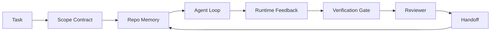

# Agent Çalışma Tezgahı Mühendisliği: Yetenekli Modeller Neden Hala Başarısız?

> Yetenekli bir model yeterli değildir. Güvenilir agent'ların bir çalışma tezgahına ihtiyacı vardır: talimatlar, durum, kapsam, geri bildirim, doğrulama, inceleme ve devir. Bunları ortadan kaldırın ve bir sınır modeli bile nakliyesi güvenli olmayan işler üretir.

**Tür:** Öğren + Oluştur
**Diller:** Python (stdlib)
**Önkoşullar:** Aşama 14 · 01 (Agent Loop), Aşama 14 · 26 (Arıza Modları)
**Süre:** ~45 dakika

## Öğrenme Hedefleri

- Model yeteneğini yürütme güvenilirliğinden ayırın.
- Bir agent'nin gönderilip gönderilmeyeceğine karar veren yedi tezgah yüzeyini adlandırın.
- Yalnızca prompt çalıştırmasını, küçük bir repo görevindeki çalışma tezgahı kılavuzlu çalıştırmayla karşılaştırın.
- Kaçırılan her yüzeyi neden olduğu semptomla eşleştiren bir arıza modu raporu oluşturun.

## Sorun

Bir sınır modelini gerçek bir depoya bırakırsınız ve ondan giriş doğrulaması eklemesini istersiniz. Dört dosyayı açar, makul kod yazar, başarıyı bildirir ve durur. Testleri siz yapın. İki tanesi başarısız oldu. Doğrulamayla hiçbir ilgisi olmayan üçüncü bir dosyaya dokunuldu. agent'nın ne varsaydığına, ilk olarak neyi denediğine ya da ne yapması gerektiğine dair hiçbir kayıt yok.

Model Python konusunda hatalı değildi. İş konusunda yanlıştı. Neyin yapılmış sayıldığı, nereye yazılmasına izin verildiği, hangi testlerin geçerli olduğu veya bir sonraki oturumun nasıl başlaması gerektiği hakkında hiçbir fikri yoktu.

Bu bir model hatası değil. Bu bir tezgah hatasıdır. agent etrafındaki yüzey, tek seferlik üretimi güvenilir, devam ettirilebilir mühendisliğe dönüştüren parçalardan yoksun.

## Konsept

Çalışma tezgahı, bir görev sırasında modeli saran çalışma ortamıdır. Yedi yüzeyi vardır:

| Yüzey | Ne taşıyor | Eksik olduğunda başarısızlık |
|---------|-----------------|----------------------|
| Talimatlar | Başlatma kuralları, yasak eylemler, yapılanın tanımı | Agent gönderimin ne anlama geldiğini tahmin ediyor |
| Devlet | Geçerli görev, dokunulan dosyalar, engelleyiciler, sonraki eylem | Her oturum sıfırdan yeniden başlar |
| Kapsam | İzin verilen dosyalar, yasak dosyalar, kabul kriterleri | Düzenlemeler alakasız kodlara sızıntı yapıyor |
| Geribildirim | Döngüye yakalanan gerçek komut çıktısı | Agent 400'de başarısını ilan etti |
| Doğrulama | Testler, tüylenme, duman tahliyesi, kapsam kontrolü | "İyi görünüyor" ana sayfaya ulaştı |
| İncele | Farklı bir role sahip ikinci geçiş | İnşaatçı kendi ödevini yazıyor |
| Aktarma | Ne değişti, neden, geriye ne kaldı | Sonraki oturumda her şey yeniden keşfediliyor |

Tezgah modelden bağımsızdır. Modeli değiştirebilir ve yüzeyleri koruyabilirsiniz. Yüzeyleri değiştirip güvenilirliği koruyamazsınız.



Döngü, sohbet geçmişinde değil, durum dosyasında kapanır. Sohbet geçicidir. Repo kayıt sistemidir.

### Workbench'e karşı prompt mühendisliği

Prompting, modele bu turda ne istediğinizi söyler. Bir çalışma tezgahı, modele sıralar ve oturumlar arasında işin nasıl yapılacağını anlatır. Çoğu agent başarısızlık hikayesi, prompt-mühendislik kıyafetleri giyen tezgah arızalarıdır.

### Çalışma Tezgahı ve framework

Bir framework size bir çalışma zamanı verir (LangGraph, AutoGen, Agents SDK'sı). Bir çalışma tezgahı, agent'ye o çalışma zamanı içinde çalışabileceği bir yer sağlar. İkisine de ihtiyacın var. Bu mini parça ikinciyle ilgili.

### Satıcı sınıflandırmalarına göre değil, ilkellere dayanarak akıl yürütme

Şu anda "kemer mühendisliği" üzerine çok fazla yazı var. Addy Osmani, OpenAI, Anthropic, LangChain, Martin Fowler, MongoDB, HumanLayer, Augment Code, Thinkworks, Walkinglabs'in harika listesi ve Medium ile Hacker News'in sürekli davul ritmi bu listeyi taşıyor. Emniyet kemerinin ne olduğu, kapsamının ne olduğu ve hangi kelime dağarcığının kullanılacağı konusunda anlaşamıyorlar. Taraf seçmemize gerek yok. Yedi yüzey bir UX katmanıdır; Her tezgahın altında, güvenilir bir arka ucu destekleyen aynı dağıtılmış sistem ilkelleri kümesi bulunur.

agent etiketini bir anlığına çıkarın. Bir agent çalıştırması, zamanı, süreçleri ve makineleri aşan bir hesaplamadır. Bunu güvenilir kılmak için herhangi bir üretim sisteminin ihtiyaç duyduğu aynı temel öğelere ihtiyacınız vardır.

| İlkel | Nedir | agent için ne taşır |
|-----------|------------|------------------------------|
| İşlev | Yazılan işleyici. Mümkün olduğunca saf. Giriş ve çıkışlarının sahibidir. | Bir araç çağrısı, bir kural kontrolü, bir doğrulama adımı, bir model çağırma |
| İşçi | Bir veya daha fazla fonksiyona ve yaşam döngüsüne sahip uzun ömürlü süreç | Oluşturucu, inceleyici, doğrulayıcı, bir MCP sunucusu |
| Tetikleyici | Bir işlevi çağıran olay kaynağı | Agent loop işareti, HTTP isteği, kuyruk mesajı, cron, dosya değişikliği, kanca |
| Çalışma zamanı | Neyin nerede, hangi zaman aşımları ve kaynaklarla çalışacağına karar veren sınır | Claude Code'un süreci, LangGraph'ın çalışma zamanı, bir çalışan konteyneri |
| HTTP / RPC | Arayan ile işçi arasındaki tel | Araç çağrısı protokolü, MCP isteği, model API'si |
| kuyruk | Tetikleyici ve çalışan arasında dayanıklı tampon; karşı basınç, yeniden deneme, yetersizlik | Görev panosu, geri bildirim günlüğü, inceleme gelen kutusu |
| Oturum kalıcılığı | Çökmelerden, yeniden başlatmalardan ve model değişimlerinden sağ kurtulan durum | `agent_state.json`, kontrol noktaları, KV depoları, deponun kendisi |
| Yetkilendirme politikası | Kim hangi fonksiyonu hangi kapsamda çağırabilir | İzin verilen/yasaklı dosyalar, onay sınırları, MCP yetenek listeleri |

Şimdi yedi tezgah yüzeyini bu ilkellerin üzerine eşleyin.

- **Talimatlar** — politika + işlev meta verileri. Kurallar kontrollerdir (işlevlerdir). Yönlendirici (`AGENTS.md`), çalışma zamanının başlangıcına eklenen politikadır.
- **Durum** — oturumun kalıcılığı. Çalışma zamanının her adımda okuduğu anahtarlı bir depo. Dosya, KV veya DB; kalıcılık anlambilimi önemlidir, depolama arka ucu önemli değildir.
- **Kapsam** — görev başına yetkilendirme politikası. İzin verilen/yasaklanan küreler bir ACL'dir. Gerekli onaylar bir izin kafesidir.
- **Geri bildirim** — kuyruğa yazılan çağrı günlüğü. Her kabuk çağrısı bir kayıttır, dayanıklıdır ve tekrar oynatılabilir.
- **Doğrulama** — bir işlev. Girdiler üzerinde deterministik. Görev kapatıldığında tetiklendi. Başarısız kapatıldı.
- **İnceleme** — oluşturucu artifact'larda salt okunur yetkilendirmeye ve inceleme raporlarında salt yazma yetkilendirmesine sahip ayrı bir çalışan.
- **Handoff** — oturum sonu tetikleyicisi tarafından yayılan kalıcı bir kayıt. Bir sonraki oturumun başlangıç ​​tetikleyicisi bunu okur.

agent loop'nin kendisi, olayları tüketen (kullanıcı mesajı, araç sonucu, zamanlayıcı işareti), işlevleri çağıran (model, ardından modelin seçtiği araçlar), kayıtları yazan (durum, geri bildirim) ve tetikleyicileri yayan (doğrulama, inceleme, aktarma) bir çalışandır. Gizem yok; iş işlemcisi ile aynı şekle sahiptir.

### Dolaşımdaki modeller, ilkellere çevrildi

Her popüler koşum takımı modeli sekiz temele indirgenir. Çeviri tablosu.

| Satıcı veya topluluk modeli | Aslında nedir |
|------------------------------|--------------------|
| Ralph Loop (Claude Code, Codex, agentic_harness kitabı) — agent erken durmaya çalıştığında orijinal amacı yeni bir context window'ya yeniden enjekte edin | Bir görevi temiz bir bağlamla yeniden sıraya koyan bir tetikleyici; oturum ısrarı hedefi ileriye taşır |
| Planla / Yürüt / Doğrula (PEV) | Her rol için bir tane olmak üzere üç çalışan, durum aracılığıyla iletişim kuruyor ve aşamalar arasında bir kuyruk |
| Harness-compute ayrımı (OpenAI AgentSDK'sı, Nisan 2026) — kontrol düzlemini yürütme düzleminden ayır | Kontrol düzlemini / veri düzlemini yeniden ayarlama. agent etiketinden onlarca yıl öncesine aittir |
| Agent Pasaportunu açın (OAP, Mart 2026) — yürütmeden önce her araç çağrısını bildirime dayalı bir politikaya göre imzalayın ve denetleyin | İmzalı bir denetim kuyruğuna sahip, eylem öncesi çalışan tarafından uygulanan bir yetkilendirme politikası |
| Kılavuzlar ve Sensörler (Birgitta Böckeler / Düşünce Çalışmaları) — ileri besleme kuralları + geri bildirim observability | Yetkilendirme politikası + doğrulama işlevleri + observability izleme |
| Aşamalı sıkıştırma, 5 aşamalı (Claude Kodu tersine mühendislik, Nisan 2026) | Bütçe dahilinde tutmak için oturum sürekliliği üzerinde cron benzeri çalışan bir devlet yönetimi çalışanı |
| Kancalar / ara katman yazılımı (LangChain, Claude Code) — model ve araç çağrılarını engelleme | Tetikleyiciler + işlevler, çalışma zamanının çağırma yolunun etrafına sarılmış |
| Aşamalı açıklama ile Markdown Becerileri (Antropik, Flue) | İşlev meta verilerinin bağlama tam zamanında yüklendiği bir işlev kaydı |
| Sandbox agent'lar (Codex, Sandcastle, Vercel Sandbox) | Hesaplama düzlemi: yalıtılmış dosya sistemi, ağ ve yaşam döngüsüne sahip bir çalışma zamanı |
| MCP sunucuları | Yetkilendirme olarak yetenek listeleriyle, kararlı bir RPC üzerinden işlevleri kullanıma sunan çalışanlar |

Bu tablodaki her giriş, agent topluluğunun, dağıtılmış sistemlerde zaten bir adı olan bir ilkel öğeye ulaşması ve ona yeni bir ad vermesidir. Pazarlama için faydalı etiketler; mühendislik sözlüğü olarak kullanışlı değil.

### Makbuzlarda aslında ne yazıyor

Model üzerinden koşum iddiasının arkasında artık rakamlar var. Bilmeye değer, çünkü bunlar aynı zamanda "daha akıllı bir modeli bekleyin"e karşı tek dürüst argümandır.

- Terminal Bench 2.0 — aynı model, kablo demeti değişikliği, agent kodlamasını ilk 30'un dışından beşinci sıraya taşıdı (LangChain, *Anatomy of an Agent Harness*).
- Vercel — agent araçlarının %80'ini sildi; başarı oranı %80'den %100'e yükseldi (MongoDB).
- Harvey — yalnızca kablo demeti optimizasyonu (MongoDB) sayesinde yasal agentdoğruluk iki kattan fazladır.
- Kurumsal AI agent projelerinin %88'i üretime ulaşamıyor. Başarısızlıklar mantık yürütmeye değil çalışma zamanına göre kümeleniyor (preprints.org, *Harness Engineering for Language Agents*, Mart 2026).
- Üç popüler açık kaynak framework üzerinde 2025 yılında yapılan bir benchmark çalışması, görevin ~%50 oranında tamamlandığını bildirdi; uzun bağlamlı WebAgent uzun bağlam koşullarında %40-50'den %10'un altına çöktü; çoğunlukla sonsuz döngüler ve hedef kaybı nedeniyle (2026'nın başındaki yazılarda geniş çapta ele alındı).

Paket servisi "koşum takımı sonsuza kadar kazanır" değildir. Modeller zamanla koşum hilelerini absorbe eder. Çıkarılan sonuç, günümüzde yük taşıma mühendisliğinin modelin içinde değil, etrafında olduğu ve bu yükü taşıyan ilkellerin, her üretim sisteminin her zaman ihtiyaç duyduğu şeyler olduğudur.

### Satıcı yazmalarının kısa sürede bittiği yer

Bu, kibar olmanıza gerek olmayan kısımdır.

- LangChain'in *Agent Donanımının Anatomisi* on bir bileşeni sıralar: prompt'ler, araçlar, kancalar, sanal alanlar, düzenleme, bellek, beceriler, altagent'lar ve çalışma zamanı "aptal döngüsü." Kuyrukları, çalışanları bir deployment birimi olarak adlandırmaz, tetikleme semantiğini, ayrı bir sorun olarak oturum kalıcılığını veya yetkilendirme politikasını belirtmez. Kablo demetini konuşlandırdığınız bir sistem olarak değil, yapılandırdığınız bir nesne olarak ele alır.
- Addy Osmani'nin *Agent Emniyet Kemeri Mühendisliği* çerçevelemeyi `Agent = Model + Harness` ve mandal düzenini belirliyor, ancak bir emniyet kemerinin neyden oluştuğunu söylemeden duruyor. Bu bir spesifikasyon olarak değil, bir duruş olarak okunur.
- Antropik ve OpenAI yüzeylerde en derine iner ancak kendi çalışma zamanlarının içinde kalır. Nisan 2026 Agent SDK'sındaki "kablo demeti-hesaplama ayrımı" duyurusu, kontrol düzlemi / veri düzlemi ayrımını açıkça onaylayan ilk satıcı parçasıdır. Bu ilkel bir fikir, yeni değil.
- agentic_harness kitabı, koşum takımını bir yapılandırma nesnesi olarak ele alır (Jaymin West'in *Agentic Mühendisliği*, bölüm 6) ve buradaki en güçlü ifade, "koşum takımı, bir agentic sistemindeki birincil güvenlik sınırıdır." Bu sadece yeniden ifade edilen yetkilendirme politikasıdır.
- Hacker News konuları aynı yere gelmeye devam ediyor. Nisan 2026 tarihli başlık *agent koşum takımı sandbox'ın dışındadır* koşum takımının "daha çok her şeyin dışında duran ve bağlama ve kullanıcıya dayalı olarak erişime izin veren bir hipervizör gibi" oturması gerektiğini savunuyor. Yani yine ayrı bir düzlemde yetkilendirme politikası.

Boşluğu fark etmek için bu parçalardan herhangi birine katılmamanıza gerek yok. Zaten var olan bir sistemin UX açıklamalarını yazıyorlar. Sistemi yazıyoruz. Sistem doğru kurulduğunda yedi yüzey ilkellerin dışına çıkar. Yanlış oluşturulduğunda, hiçbir `AGENTS.md` cila eksik kuyruğu düzeltmez.

Yani başka bir yerde "koşum mühendisliği" kelimesini duyduğunuzda, bunu ilkel dillere çevirin. Prompt'lar ve kurallar politika ve işlevlerdir. İskele çalışma zamanıdır. Korkuluklar yetkilendirme + doğrulamadır. Kancalar tetikleyicilerdir. Bellek oturumun kalıcılığıdır. Ralph Loop yeniden kuyrukta. Altagent'lar işçilerdir. Korumalı alanlar hesaplama düzlemleridir. Kelime dağarcığı değişir; mühendislik öyle değil. Çalışma tezgahı, agent'ye bakan UX'tir; Bir sonraki satıcı yeniden çerçevesinde hayatta kalan anlamında koşum takımı, işlevler, çalışanlar, tetikleyiciler, çalışma zamanları, kuyruklar, kalıcılık ve politikanın doğru bir şekilde bir araya getirilmesinden oluşur.

## İnşa Et

`code/main.py` küçük bir repo görevini iki kez çalıştırıyor. İlk önce yalnızca prompt olarak, ardından yedi yüzey kablolu olarak. Aynı model, aynı görev. Komut dosyası, başarısız çalıştırmada hangi yüzeylerin eksik olduğunu sayar ve bir hata modu raporu yazdırır.

Repo görevi bilerek küçüktür: tek dosyalı FastAPI tarzı işleyiciye giriş doğrulaması ekleyin ve geçen bir test yazın.

Çalıştır:

```
python3 code/main.py
```

Çıktı: iki çalıştırmanın yan yana günlüğü, yalnızca prompt çalıştırmayı özetleyen bir `failure_modes.json` ve çalışma tezgahı çalıştırması için tek satırlık bir karar.

agent küçük, kural tabanlı bir taslaktır; önemli olan model değil yüzeylerdir. Bu mini parkurun geri kalanında her yüzeyi gerçek, yeniden kullanılabilir bir artifact olarak yeniden inşa edeceksiniz.

## Kullan onu

Kimse onlara bu şekilde hitap etmese bile, doğada halihazırda üç tezgah yüzeyi mevcuttur:

- **Claude Kodu, Kodeksi, İmleç.** `AGENTS.md` ve `CLAUDE.md` talimat yüzeyidir. Eğik çizgi komutları kapsamdır. Kancalar doğrulamadır.
- **LangGraph, OpenAI Agent'nin SDK'sı.** Denetim noktaları ve oturum depoları durum yüzeyidir. Aktarımlar aktarım yüzeyidir.
- **Gerçek bir depoda CI.** Testler, tüy bırakma ve tip kontrolü doğrulamadır. PR şablonu aktarımdır. CODEOWNERS incelemesi.

Workbench mühendisliği, her ekibin bunları yeniden keşfetmesine izin vermek yerine, bu yüzeyleri açık ve yeniden kullanılabilir hale getirme disiplinidir.

## Gönderin

`outputs/skill-workbench-audit.md`, yedi çalışma tezgahı yüzeyi ve eksik, kısmi ve sağlıklı raporlar için mevcut bir depoyu denetleyen taşınabilir bir beceridir. Herhangi bir agent kurulumunun yanına bırakın; size ilk önce neyi düzeltmeniz gerektiğini söyler.

## Egzersizler

1. Halihazırda agent çalıştırdığınız bir repo seçin. Yedi yüzeyi 0'dan (eksik) 2'ye (sağlıklı) kadar puanlayın. En zayıf yüzeyiniz hangisi?
2. `main.py`'yi, yalnızca prompt çalıştırmasının aynı zamanda sahte bir "başarı" iddiası üreteceği şekilde genişletin. Doğrulama kapısının onu yakaladığını doğrulayın.
3. Kendi ürününüz için sekizinci bir yüzey ekleyin. Neden mevcut yedi kişiden birine dönüşmediğini gerekçelendirin.
4. Betiği, fazladan bir dosya yazma halüsinasyonu gösteren farklı bir agent saplaması ile yeniden çalıştırın. Hangi yüzey onu ilk yakalar?
5. Aşama 14 · 26'da endüstride tekrarlanan beş arıza modunu yedi yüzeye haritalayın. Her yüzey hangi modu emecek şekilde tasarlandı?

## Anahtar Terimler

| Dönem | İnsanlar ne diyor | Aslında ne anlama geliyor |
|------|----------------|------------------------|
| Tezgah | "Kurulum" | Modelin etrafında çalışmayı güvenilir kılan özel olarak tasarlanmış yüzeyler |
| Yüzey | "Bir belge" veya "bir komut dosyası" | agent'nin her fırsatta okuduğu veya yazdığı, adlandırılmış, makine tarafından okunabilir bir giriş |
| Kayıt sistemi | "Notlar" | agent'nin sohbet geçmişi gittiğinde gerçek olarak değerlendirdiği dosya |
| done'ın tanımı | "Kabul" | agent'nin taklit edemeyeceği objektif, dosya destekli bir kontrol listesi |
| Tezgah denetimi | "Repo hazırlık kontrolü" | İş başlamadan önce eksik parçaları işaretleyen yedi yüzeyin üzerinden geçiş |

## Daha Fazla Okuma

Bunları otorite olarak değil, veri noktaları olarak okuyun. Her biri kısmi bir taksonomidir. Benimseyip benimsememeye karar vermeden önce her kavramı bir temele (işlev, çalışan, tetikleyici, çalışma zamanı, HTTP/RPC, kuyruk, kalıcılık, politika) geri çevirin.

Satıcı çerçeveleri:

- [Addy Osmani, Agent Donanım Mühendisliği](https://addyosmani.com/blog/agent-harness-engineering/) — `Agent = Model + Harness` ve mandal düzeni; altyapı açısından zayıf
- [LangChain, Bir Agent Donanımının Anatomisi](https://blog.langchain.com/the-anatomy-of-an-agent-harness/) — on bir bileşen: prompt'ler, araçlar, kancalar, düzenleme, sanal alanlar, bellek, beceriler, altagent'lar, çalışma zamanı; kuyrukları atlar, deployment, authz
- [OpenAI, Harness mühendisliği: agent-birinci dünyada Codex'ten yararlanmak](https://openai.com/index/harness-engineering/) — Codex ekibinin çalışma zamanları etrafındaki yüzeylere ilişkin görünümü
- [OpenAI, agent loop Kodeksini Açmak](https://openai.com/index/unrolling-the-codex-agent-loop/) — agent loop, işlev çağrıları üzerinden `while` değerine düşürüldü
- [Uzun koşan agents](https://www.anthropic.com/engineering/effective-harnesses-for-long-running-agents) için antropik, Etkili koşum takımları — belirli bir çalışma süresi içindeki uzun ufuklu yüzeyler
- [Uzun süreli uygulama geliştirme için Antropik, Kablo Demeti tasarımı](https://www.anthropic.com/engineering/harness-design-long-running-apps) — uygulamalı tasarım notları
- [LangChain Deep Agent'nin koşum yetenekleri](https://docs.langchain.com/oss/python/deepagents/harness) — çalışma zamanı yapılandırma yüzeyi

Kullanılabilir ayrıntılara sahip uygulayıcı parçaları:

- [Martin Fowler / Birgitta Böckeler, agent kullanıcıyı kodlamak için Harness mühendisliği](https://martinfowler.com/articles/harness-engineering.html) — kılavuzlar (ileri besleme) + sensörler (geri bildirim); en temiz kontrol teorisi çerçevesi
- [HumanLayer, Beceri Sorunu: Agents](https://www.humanlayer.dev/blog/skill-issue-harness-engineering-for-coding-agents) Kodlama için Harness Mühendisliği - "bu bir model sorunu değil, bir yapılandırma sorunu"
- [MongoDB, Agent Harness: LLM Neden Agent Sisteminizin En Küçük Parçasıdır](https://www.mongodb.com/company/blog/technical/agent-harness-why-llm-is-smallest-part-of-your-agent-system) — alındılar: Vercel %80 ila %100, Harvey 2 kat doğruluk, Terminal Bench İlk 30'dan İlk 5'e
- [Augment Code, AI Kodlama için Donanım Mühendisliği Agents](https://www.augmentcode.com/guides/harness-engineering-ai-coding-agents) — kısıtlama öncelikli izlenecek yol
- [Sequoia podcast'i, Harrison Chase on Context Engineering Long-Horizon Agents](https://sequoiacap.com/podcast/context-engineering-our-way-to-long-horizon-agents-langchains-harrison-chase/) — model endişeleriyle ilgili çalışma zamanı endişeleri

Kitaplar, makaleler ve referans uygulamaları:

- [Jaymin West, Agentic Engineering — Bölüm 6: Emniyet Kemerleri](https://www.jayminwest.com/agentic-engineering-book/6-harnesses) — kitap uzunluğunda inceleme, emniyet kemerini birincil güvenlik sınırı olarak ele alır
- [preprints.org, Harness Engineering for Language Agents (Mart 2026)](https://www.preprints.org/manuscript/202603.1756) — kontrol / ajans / çalışma zamanı olarak akademik çerçeveleme
- [walkinglabs/awesome-harness-engineering](https://github.com/walkinglabs/awesome-harness-engineering) — bağlam, değerlendirme, observability, orkestrasyona göre seçilmiş okuma listesi
- [ai-boost/awesome-harness-engineering](https://github.com/ai-boost/awesome-harness-engineering) — alternatif olarak seçilmiş liste (araçlar, değerlendirmeler, bellek, MCP, izinler)
- [andrewgarst/agentic_harness](https://github.com/andrewgarst/agentic_harness) — Redis destekli bellek ve değerlendirme paketiyle üretime hazır referans uygulaması
- [HKUDS/OpenHarness](https://github.com/HKUDS/OpenHarness) — yerleşik kişisel agent ile agent koşum takımını açın

Hacker News'te fikir birliği için değil, anlaşmazlıklar için okumaya değer konular:

- [HN: Uzun süren agents](https://news.ycombinator.com/item?id=46081704) için etkili koşum takımları
- [HN: Bir Öğleden Sonra Kodlama alanında 15 Yüksek Lisans Derecesinin Geliştirilmesi. Yalnızca Kayış Takımı Değişti](https://news.ycombinator.com/item?id=46988596)
- [HN: agent koşum takımı sanal alanın dışındadır](https://news.ycombinator.com/item?id=47990675) — ayrı bir düzlem olarak yetkilendirmeyi savunuyor

Bu müfredat içindeki çapraz referanslar:

- Aşama 14 · 23 — OpenTelemetry GenAI kuralları: sensör literatürünün işaret ettiği observability katmanı
- Aşama 14 · 26 — Arıza modları kataloğu, yedi yüzeyin absorbe edilmesi için tasarlanmıştır
- Aşama 14 · 27 — Yetkilendirme politikası ilkelinde yer alan Prompt enjeksiyon savunması
- Aşama 14 · 29 — Üretim çalışma süreleri (kuyruk, etkinlik, cron): bu dersteki ilkellerin deployment içinde yaşadığı yer
