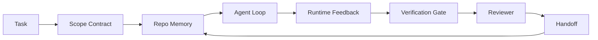

# 31 · 智能体工作台工程：为何强大的模型仍会失败

> 仅有强大的模型还不够。可靠的智能体需要一套工作台：指令、状态、范围、反馈、验证、评审与交接。把这些剥离掉，即便是前沿模型，产出的工作成果也不安全到无法上线。

**类型：** 学习 + 构建
**语言：** Python（标准库）
**前置：** 第 14 阶段 · 01（智能体循环）、第 14 阶段 · 26（失败模式）
**时长：** 约 45 分钟

## 学习目标

- 把模型能力与执行可靠性区分开来。
- 说出决定一个智能体能否上线的七个工作台「面（surface）」。
- 在一个小型仓库任务上，对比「仅靠提示词」的运行与「工作台引导」的运行。
- 产出一份失败模式报告，将每个缺失的面映射到它所导致的症状。

## 问题所在

你把一个前沿模型丢进真实仓库，让它添加输入校验。它打开四个文件，写出看似合理的代码，宣告成功，然后停下。你运行测试，两个失败。第三个文件被改动了，而它跟校验毫无关系。没有任何记录说明智能体假设了什么、最先尝试了什么、还剩下什么没做。

模型对 Python 的理解没有错，它错在对「工作」的理解上。它根本不知道什么算「完成」、自己被允许在哪里写入、哪些测试是权威的，以及下一次会话该如何接续。

这不是模型 bug，而是工作台 bug。围绕智能体的那层面，缺失了那些能把一次性生成变成可靠、可续接的工程化产物的部件。

## 核心概念

工作台（workbench）是在任务执行期间包裹模型的运行环境。它有七个面：

| 面 | 它承载什么 | 缺失时的失败 |
|---------|-----------------|----------------------|
| 指令（Instructions） | 启动规则、禁止操作、完成的定义 | 智能体凭猜测理解什么叫「交付」 |
| 状态（State） | 当前任务、已改动文件、阻塞项、下一步动作 | 每次会话都从零重启 |
| 范围（Scope） | 允许的文件、禁止的文件、验收标准 | 改动泄漏到无关代码中 |
| 反馈（Feedback） | 把真实命令输出捕获进循环 | 智能体在收到 400 时却宣告成功 |
| 验证（Verification） | 测试、lint、冒烟运行、范围检查 | 「看着没问题」就进了 main |
| 评审（Review） | 由不同角色进行的二次审查 | 建造者给自己的作业打分 |
| 交接（Handoff） | 改了什么、为什么、还剩什么 | 下一次会话把一切重新摸索一遍 |

工作台独立于模型。你可以换掉模型而保留这些面；你无法换掉这些面还保留可靠性。



这个循环闭合在状态文件上，而不是聊天记录上。聊天是易失的，仓库才是事实记录系统（system of record）。

### 工作台 vs 提示词工程

提示（prompting）告诉模型你这一轮想要什么。工作台告诉模型如何跨多轮、跨多个会话地完成工作。大多数智能体失败故事，其实是穿着提示词工程外衣的工作台失败。

### 工作台 vs 框架

框架（framework）给你一个运行时（runtime）（LangGraph、AutoGen、Agents SDK）。工作台则在那个运行时内部给智能体一个干活的场所。两者你都需要。本迷你专题讲的是后者。

### 从原语出发推理，而不是从厂商分类法出发

眼下关于「框架工程（harness engineering）」的文章很多。Addy Osmani、OpenAI、Anthropic、LangChain、Martin Fowler、MongoDB、HumanLayer、Augment Code、Thoughtworks、walkinglabs 的 awesome 清单，以及 Medium 和 Hacker News 上源源不断的文章，都在谈它。它们在「harness 到底是什么」「边界在哪」「该用什么词汇」上各执一词。我们不需要选边站。这七个面是一层 UX；而每一套工作台的底层，都是同一组分布式系统原语（primitive）——正是支撑起任何可靠后端的那组原语。

把「智能体」这个标签暂时撕掉。一次智能体运行，就是跨越时间、进程和机器的计算。要让它可靠，你需要的正是任何生产系统所需的那组原语。

| 原语 | 它是什么 | 它为智能体承载什么 |
|-----------|------------|------------------------------|
| 函数（Function） | 有类型的处理器，尽可能纯函数。拥有自己的输入与输出。 | 一次工具调用、一次规则检查、一个验证步骤、一次模型调用 |
| 工作者（Worker） | 长期存活的进程，拥有一个或多个函数及其生命周期 | 建造者、评审者、验证者、一个 MCP 服务器 |
| 触发器（Trigger） | 调用函数的事件源 | 智能体循环的一次 tick、HTTP 请求、队列消息、cron、文件变更、hook |
| 运行时（Runtime） | 决定什么在哪里运行、用什么超时和资源的边界 | Claude Code 的进程、LangGraph 的运行时、一个 worker 容器 |
| HTTP / RPC | 调用方与工作者之间的线缆 | 工具调用协议、MCP 请求、模型 API |
| 队列（Queue） | 触发器与工作者之间的持久缓冲；背压、重试、幂等 | 任务看板、反馈日志、评审收件箱 |
| 会话持久化（Session persistence） | 在崩溃、重启、换模型后仍能存活的状态 | `agent_state.json`、检查点、KV 存储、仓库本身 |
| 授权策略（Authorization policy） | 谁能以何种范围调用哪个函数 | 允许/禁止的文件、审批边界、MCP 能力清单 |

现在把七个工作台面映射到这些原语上。

- **指令** — 策略 + 函数元数据。规则就是检查（函数）。路由器（`AGENTS.md`）是附着在运行时启动阶段的策略。
- **状态** — 会话持久化。运行时在每一步都会读取的、按键索引的存储。文件、KV 或 DB 皆可；持久化语义才重要，存储后端无关紧要。
- **范围** — 每个任务的授权策略。允许/禁止的 glob 就是一份 ACL。所需的审批就是一套权限格（permission lattice）。
- **反馈** — 写入队列的调用日志。每一次 shell 调用都是一条记录，持久且可重放。
- **验证** — 一个函数。对输入是确定性的。在任务关闭时触发。失败即关闭（fails closed）。
- **评审** — 一个独立的工作者，对建造者产物拥有只读授权，对评审报告拥有只写授权。
- **交接** — 由会话结束触发器发出的一条持久记录。下一次会话的启动触发器会读取它。

智能体循环本身就是一个工作者：它消费事件（用户消息、工具结果、计时器 tick），调用函数（先是模型，再是模型挑选的工具），写入记录（状态、反馈），并发出触发器（验证、评审、交接）。没什么神秘的；它跟一个作业处理器（job processor）形状相同。

### 流行的模式，翻译成原语

每一种流行的 harness 模式，都可归约为这八个原语。对照表如下。

| 厂商或社区模式 | 它实际上是什么 |
|------------------------------|--------------------|
| Ralph Loop（Claude Code、Codex、agentic_harness 一书）——当智能体试图提前停止时，把原始意图重新注入一个全新的上下文窗口 | 一个把任务以干净上下文重新入队的触发器；会话持久化把目标向前传递 |
| Plan / Execute / Verify（PEV，计划/执行/验证） | 三个工作者，每个角色一个，通过状态以及各阶段之间的队列通信 |
| Harness-compute 分离（OpenAI Agents SDK，2026 年 4 月）——把控制平面与执行平面拆开 | 不过是「控制平面 / 数据平面」的换种说法。这个想法比「智能体」标签早了几十年 |
| Open Agent Passport（OAP，2026 年 3 月）——在执行前，依据一份声明式策略对每次工具调用进行签名与审计 | 由一个前置动作工作者强制执行的授权策略，配一个带签名的审计队列 |
| Guides and Sensors（Birgitta Böckeler / Thoughtworks）——前馈规则 + 反馈可观测性 | 授权策略 + 验证函数 + 可观测性追踪 |
| 渐进式压实（progressive compaction），五阶段（对 Claude Code 的逆向工程，2026 年 4 月） | 一个状态管理工作者，以类 cron 的方式在会话持久化上运行，把它控制在预算之内 |
| Hooks / 中间件（LangChain、Claude Code）——拦截模型与工具调用 | 包裹在运行时调用路径上的触发器 + 函数 |
| 以渐进披露（progressive disclosure）方式呈现的 Markdown 技能（Anthropic、Flue） | 一个函数注册表，其中函数元数据按需即时加载进上下文 |
| 沙箱智能体（Codex、Sandcastle、Vercel Sandbox） | 计算平面：一个拥有隔离文件系统、网络与生命周期的运行时 |
| MCP 服务器 | 通过稳定 RPC 暴露函数的工作者，以能力清单作为授权 |

那张表里的每一条，都是智能体社区抵达了一个分布式系统里早有名字的原语，然后给它起了个新名。这些标签对营销有用，作为工程词汇却没用。

### 那些「收据」到底说了什么

「harness 胜过 model」这个论断如今有数据支撑了。值得了解，因为它们也是反驳「只要等一个更聪明的模型就行」的唯一诚实论据。

- Terminal Bench 2.0——同一个模型，仅改 harness，就把一个编码智能体从榜单前 30 名之外推到了第五名（LangChain，《Anatomy of an Agent Harness》）。
- Vercel——删掉了其智能体 80% 的工具；成功率从 80% 跃升到 100%（MongoDB）。
- Harvey——仅靠 harness 优化，就让法律智能体的准确率翻了一倍多（MongoDB）。
- 88% 的企业 AI 智能体项目无法走到生产环境。这些失败聚集在运行时上，而非推理上（preprints.org，《Harness Engineering for Language Agents》，2026 年 3 月）。
- 一项 2025 年针对三个流行开源框架的基准研究报告称任务完成率约 50%；在长上下文条件下，长上下文 WebAgent 从 40-50% 崩塌到 10% 以下，主要源于死循环与目标丢失（2026 年初多篇文章广泛报道）。

要点不是「harness 永远赢」。模型确实会随时间吸收 harness 的技巧。要点是：在今天，承重的工程在模型周围，而非模型内部；而承载这份重量的原语，正是每一个生产系统一直以来都需要的那些。

### 厂商文章止步于何处

这部分你不必客气。

- LangChain 的《Anatomy of an Agent Harness》列举了十一个组件——提示词、工具、hooks、沙箱、编排、记忆、技能、子智能体，以及一个运行时的「笨循环（dumb loop）」。它没有点名队列、作为部署单元的工作者、触发器语义、作为独立关注点的会话持久化，也没有点名授权策略。它把 harness 当作一个你去配置的对象，而非一个你去部署的系统。
- Addy Osmani 的《Agent Harness Engineering》立住了 `Agent = Model + Harness` 这个框架和棘轮（ratchet）模式，却止步于说清 harness 究竟由什么构成。它读起来像一种立场，而非一份规格。
- Anthropic 和 OpenAI 在「面」上挖得最深，但都停留在各自的运行时内部。2026 年 4 月 Agents SDK 中的「harness-compute 分离」公告，是第一篇明确背书控制平面 / 数据平面拆分的厂商文章。那是一个原语层面的旧想法，并非新事物。
- agentic_harness 一书把 harness 当作一个配置对象（Jaymin West 的《Agentic Engineering》第 6 章），书中最有力的一句是「harness 是智能体系统中最主要的安全边界」。那不过是授权策略的换种说法。
- Hacker News 上的讨论串不断抵达同一处。2026 年 4 月那篇《The agent harness belongs outside the sandbox》主张 harness 应当「更像一个坐在一切之外的 hypervisor，依据上下文与用户来授权访问」。那同样是把授权策略当作一个独立的平面。

你不必反对上述任何一篇文章，也能看出那道缺口。它们在为一个已经存在的系统撰写 UX 描述，而我们在编写那个系统。当系统被正确构建时，七个面会从原语中自然落出。当它被错误构建时，再怎么打磨 `AGENTS.md` 也修不好那个缺失的队列。

所以当你在别处听到「harness engineering」时，把它翻译成原语。提示词和规则是策略与函数。脚手架是运行时。护栏是授权 + 验证。Hooks 是触发器。记忆是会话持久化。Ralph Loop 是重新入队。子智能体是工作者。沙箱是计算平面。词汇在变，工程不变。工作台是面向智能体的 UX；而 harness——在能熬过下一次厂商重新包装的那个意义上——是把函数、工作者、触发器、运行时、队列、持久化与策略正确连接在一起。

## 动手构建

`code/main.py` 把一个微型仓库任务运行两次。第一次仅靠提示词，第二次接入七个面。同一个模型，同一个任务。脚本会统计失败的那次运行缺失了哪些面，并打印一份失败模式报告。

这个仓库任务故意做得很小：给一个单文件的 FastAPI 风格处理器添加输入校验，并写一个能通过的测试。

运行它：

```
python3 code/main.py
```

输出：两次运行的并排日志、一份概括「仅靠提示词」运行的 `failure_modes.json`，以及对工作台运行的一行裁决。

这个智能体只是一个微型的基于规则的桩（stub）；重点在于那些面，而非模型。在本迷你专题接下来的部分里，你将把每一个面重建为真实、可复用的产物。

## 实战应用

工作台面已经在现实中存在的三处地方，即使没人这么称呼它们：

- **Claude Code、Codex、Cursor。** `AGENTS.md` 和 `CLAUDE.md` 是指令面。斜杠命令（slash commands）是范围。Hooks 是验证。
- **LangGraph、OpenAI Agents SDK。** 检查点和会话存储是状态面。Handoffs 是交接面。
- **真实仓库上的 CI。** 测试、lint 和类型检查是验证。PR 模板是交接。CODEOWNERS 是评审。

工作台工程，就是把这些面变得显式且可复用的纪律，而不是让每个团队各自去重新发现它们。

## 交付上线

`outputs/skill-workbench-audit.md` 是一个可移植的技能，它会针对七个工作台面审计一个现有仓库，报告哪些缺失、哪些只有部分、哪些健康。把它放到任何智能体配置旁边；它会告诉你该先修什么。

## 练习

1. 选一个你已经在上面跑智能体的仓库。给七个面从 0（缺失）到 2（健康）打分。你最薄弱的面是哪个？
2. 扩展 `main.py`，让仅靠提示词的那次运行也产出一个假的「成功」声明。验证一下验证关卡是否本可以抓住它。
3. 为你自己的产品添加第八个面。论证它为何不会坍缩进已有的七个面之一。
4. 用一个会幻觉出额外文件写入的不同桩智能体重新运行脚本。哪个面最先抓住它？
5. 把第 14 阶段 · 26 中那五个行业反复出现的失败模式映射到七个面上。每个面被设计用来吸收哪种模式？

## 关键术语

| 术语 | 人们怎么说 | 它实际上指什么 |
|------|----------------|------------------------|
| 工作台（Workbench） | 「那套配置」 | 围绕模型、使工作变得可靠的、被工程化的面 |
| 面（Surface） | 「一个文档」或「一个脚本」 | 一个有名字、机器可读、智能体每轮读或写的输入 |
| 事实记录系统（System of record） | 「那些笔记」 | 聊天记录消失后，智能体当作真相对待的那个文件 |
| 完成的定义（Definition of done） | 「验收」 | 一份客观、由文件支撑、智能体无法造假的清单 |
| 工作台审计（Workbench audit） | 「仓库就绪度检查」 | 在工作开始前，对七个面过一遍以标记缺失部件 |

## 延伸阅读

把这些当作数据点来读，而不是当作权威。每一篇都是一份不完整的分类法。在决定是否采纳之前，把每个概念翻译回一个原语（函数、工作者、触发器、运行时、HTTP/RPC、队列、持久化、策略）。

厂商框架：

- [Addy Osmani, Agent Harness Engineering](https://addyosmani.com/blog/agent-harness-engineering/) —— `Agent = Model + Harness` 与棘轮模式；基础设施层面单薄
- [LangChain, The Anatomy of an Agent Harness](https://blog.langchain.com/the-anatomy-of-an-agent-harness/) —— 十一个组件：提示词、工具、hooks、编排、沙箱、记忆、技能、子智能体、运行时；遗漏了队列、部署、授权
- [OpenAI, Harness engineering: leveraging Codex in an agent-first world](https://openai.com/index/harness-engineering/) —— Codex 团队对其运行时周边各面的看法
- [OpenAI, Unrolling the Codex agent loop](https://openai.com/index/unrolling-the-codex-agent-loop/) —— 把智能体循环归约为对函数调用的一个 `while`
- [Anthropic, Effective harnesses for long-running agents](https://www.anthropic.com/engineering/effective-harnesses-for-long-running-agents) —— 某个特定运行时内部的长程（long-horizon）面
- [Anthropic, Harness design for long-running application development](https://www.anthropic.com/engineering/harness-design-long-running-apps) —— 应用化的设计笔记
- [LangChain Deep Agents harness capabilities](https://docs.langchain.com/oss/python/deepagents/harness) —— 运行时配置面

具备可用细节的实践者文章：

- [Martin Fowler / Birgitta Böckeler, Harness engineering for coding agent users](https://martinfowler.com/articles/harness-engineering.html) —— guides（前馈）+ sensors（反馈）；最干净的控制论框架
- [HumanLayer, Skill Issue: Harness Engineering for Coding Agents](https://www.humanlayer.dev/blog/skill-issue-harness-engineering-for-coding-agents) —— 「这不是模型问题，是配置问题」
- [MongoDB, The Agent Harness: Why the LLM Is the Smallest Part of Your Agent System](https://www.mongodb.com/company/blog/technical/agent-harness-why-llm-is-smallest-part-of-your-agent-system) —— 收据：Vercel 80% 到 100%、Harvey 准确率 2 倍、Terminal Bench 前 30 到前 5
- [Augment Code, Harness Engineering for AI Coding Agents](https://www.augmentcode.com/guides/harness-engineering-ai-coding-agents) —— 约束优先的逐步讲解
- [Sequoia podcast, Harrison Chase on Context Engineering Long-Horizon Agents](https://sequoiacap.com/podcast/context-engineering-our-way-to-long-horizon-agents-langchains-harrison-chase/) —— 运行时关注点优先于模型关注点

书籍、论文与参考实现：

- [Jaymin West, Agentic Engineering — Chapter 6: Harnesses](https://www.jayminwest.com/agentic-engineering-book/6-harnesses) —— 书籍篇幅的论述，把 harness 当作最主要的安全边界
- [preprints.org, Harness Engineering for Language Agents (March 2026)](https://www.preprints.org/manuscript/202603.1756) —— 把它学术化框定为控制 / 主体性 / 运行时
- [walkinglabs/awesome-harness-engineering](https://github.com/walkinglabs/awesome-harness-engineering) —— 横跨上下文、评估、可观测性、编排的精选阅读清单
- [ai-boost/awesome-harness-engineering](https://github.com/ai-boost/awesome-harness-engineering) —— 另一份精选清单（工具、评估、记忆、MCP、权限）
- [andrewgarst/agentic_harness](https://github.com/andrewgarst/agentic_harness) —— 生产可用的参考实现，带 Redis 支撑的记忆与评估套件
- [HKUDS/OpenHarness](https://github.com/HKUDS/OpenHarness) —— 开源智能体 harness，内置个人智能体

Hacker News 讨论串，值得为其中的分歧而非共识一读：

- [HN: Effective harnesses for long-running agents](https://news.ycombinator.com/item?id=46081704)
- [HN: Improving 15 LLMs at Coding in One Afternoon. Only the Harness Changed](https://news.ycombinator.com/item?id=46988596)
- [HN: The agent harness belongs outside the sandbox](https://news.ycombinator.com/item?id=47990675) —— 主张把授权当作一个独立的平面

本课程体系内部的交叉引用：

- 第 14 阶段 · 23 —— OpenTelemetry GenAI 约定：sensors 一派文献所指向的可观测性层
- 第 14 阶段 · 26 —— 失败模式目录，七个面正是被设计来吸收它们的
- 第 14 阶段 · 27 —— 坐落在授权策略原语处的提示注入（prompt injection）防御
- 第 14 阶段 · 29 —— 生产运行时（队列、事件、cron）：本课中的原语在部署中所在之处
