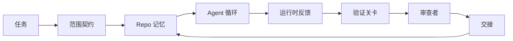

# Agent 工作台工程：为什么强模型仍然会失败

> 译注：本文译自同目录 [`en.md`](./en.md)。术语遵循仓根 [TRANSLATION_GUIDE.md](../../../../TRANSLATION_GUIDE.md)。

> 光有强模型不够。可靠的 agent 需要一整套 workbench（工作台）：指令、状态、范围、反馈、验证、审查和交接。把这些剥掉，前沿模型也会产出不能上线的活儿。

**Type:** Learn + Build
**Languages:** Python (stdlib)
**Prerequisites:** Phase 14 · 01 (Agent Loop), Phase 14 · 26 (Failure Modes)
**Time:** ~45 minutes

## 学习目标（Learning Objectives）

- 把模型能力（capability）和执行可靠性（reliability）分开来看。
- 说出决定一个 agent 能否上线的七个 workbench 表面。
- 在同一个小型仓库任务上，对比纯 prompt 跑法 vs. 工作台引导跑法。
- 输出一份失败模式报告，把每个缺失的表面映射到它造成的症状。

## 问题（The Problem）

你把一个前沿模型扔进真实 repo，让它给某个接口加输入校验。它打开了四个文件、写出看起来合理的代码，宣布完工，停下来。你跑测试。两个挂了。还有第三个文件被改了，跟校验完全无关。没有任何记录说明这个 agent 假设了什么、最先尝试了什么、还剩什么没做。

模型不是在 Python 上犯错。它是在「这件活儿到底是什么」上犯错。它根本不知道什么算 done，被允许在哪儿写、哪些测试是权威、下一次会话该怎么接手。

这不是模型 bug，是 workbench bug。环绕在 agent 周围的那一层表面，缺了把一次性生成变成可靠、可续作工程的那些零件。

## 概念（The Concept）

workbench 是任务执行期间包裹模型的运行环境。它有七个表面：

| 表面 | 承载什么 | 缺失时的失败 |
|---------|-----------------|----------------------|
| Instructions（指令） | 启动规则、禁止动作、done 的定义 | agent 自己猜什么叫上线 |
| State（状态） | 当前任务、被改过的文件、阻塞点、下一步动作 | 每次会话都从零开始 |
| Scope（范围） | 允许文件、禁止文件、验收标准 | 修改外溢到无关代码 |
| Feedback（反馈） | 真实命令输出回灌进 loop | agent 在 400 错误上宣布成功 |
| Verification（验证） | 测试、lint、冒烟运行、范围检查 | "看起来不错" 直接进 main |
| Review（审查） | 由不同角色再过一遍 | 建造者自己批改自己的作业 |
| Handoff（交接） | 改了什么、为什么、还剩什么 | 下次会话重新摸索一遍 |

workbench 与模型无关。你可以换掉模型、保留这些表面。但你换不掉表面还指望保留可靠性。



这个 loop 的闭合点是状态文件，而不是聊天记录。聊天是易失的，repo 才是 system of record（权威记录）。

### Workbench 与 prompt engineering 的区别

prompt 告诉模型这一轮你想要什么。workbench 告诉模型如何跨轮、跨会话地把活儿干完。多数 agent 失败故事都是穿着 prompt-engineering 外衣的 workbench 失败。

### Workbench 与 framework 的区别

framework 给你一个运行时（LangGraph、AutoGen、Agents SDK）。workbench 在那个运行时里给 agent 一块工位。两个都需要。这个 mini-track 讲的是后者。

### 从基本元素出发推理，而不是从厂商分类出发

现在关于 "harness engineering"（工装工程）的文章很多。Addy Osmani、OpenAI、Anthropic、LangChain、Martin Fowler、MongoDB、HumanLayer、Augment Code、Thoughtworks、walkinglabs awesome list，加上 Medium 和 Hacker News 上的源源不断更新——大家都在写。他们在 harness 的边界、范围、术语上都谈不拢。我们不必选边站。这七个表面是 UX 层；每个 workbench 底下都是同一套分布式系统基本元素，跟撑起任何可靠后端的元素一模一样。

把 agent 这个标签先撕掉。一次 agent 运行就是跨时间、跨进程、跨机器的计算。要让它可靠，需要的就是任何生产系统都需要的那套基本元素。

| 基本元素 | 是什么 | 在 agent 里承载什么 |
|-----------|------------|------------------------------|
| Function（函数） | 带类型的 handler。能纯就纯。拥有自己的输入和输出。 | 一次工具调用、一次规则检查、一次验证步骤、一次模型调用 |
| Worker（工作进程） | 长生命周期进程，拥有一个或多个 function 和一套生命周期 | builder、reviewer、verifier、一个 MCP server |
| Trigger（触发器） | 调用 function 的事件源 | agent loop tick、HTTP 请求、队列消息、cron、文件变更、hook |
| Runtime（运行时） | 决定什么跑在哪儿、超时多少、用多少资源的边界 | Claude Code 的进程、LangGraph 的 runtime、worker 容器 |
| HTTP / RPC | 调用方与 worker 之间的连线 | 工具调用协议、MCP 请求、模型 API |
| Queue（队列） | trigger 和 worker 之间的持久缓冲；back-pressure、重试、幂等性 | 任务板、反馈日志、审查收件箱 |
| Session persistence（会话持久化） | 能在崩溃、重启、模型更换之后存活的状态 | `agent_state.json`、checkpoint、KV 存储、repo 本身 |
| Authorization policy（授权策略） | 谁能用什么 scope 调哪个 function | 允许/禁止文件清单、审批边界、MCP capability 列表 |

现在把那七个 workbench 表面映射到这些基本元素上。

- **Instructions** —— 策略 + function 元数据。规则就是检查（function）。路由器（`AGENTS.md`）就是绑在 runtime 启动上的策略。
- **State** —— session persistence。一个 keyed 存储，runtime 在每一步都会读它。文件、KV 还是 DB 都行；要紧的是持久化语义，存储后端无所谓。
- **Scope** —— 任务级 authorization policy。允许/禁止 glob 是 ACL。需要审批的事情是一种权限格。
- **Feedback** —— 写入队列的调用日志。每一次 shell 调用都是一条记录，持久、可重放。
- **Verification** —— 一个 function。对输入是确定性的。任务关闭时被 trigger。失败即关闭。
- **Review** —— 一个独立的 worker，对建造者产物只读授权，对审查报告只写授权。
- **Handoff** —— 由会话结束 trigger 发出的一条持久记录。下次会话的启动 trigger 会读它。

agent loop 本身就是一个 worker：消费事件（用户消息、工具结果、定时器 tick）、调用 function（先调模型，再调模型挑出来的工具）、写记录（state、feedback）、发出 trigger（verify、review、handoff）。一点都不神秘；和一个 job processor 形状完全一样。

### 流行的模式，翻译回基本元素

每一个流行的 harness 模式都能归约成那八个基本元素。翻译表如下。

| 厂商或社区模式 | 它实际上是什么 |
|------------------------------|--------------------|
| Ralph Loop（Claude Code、Codex、agentic_harness 一书）—— agent 想提前停下来时，把原始意图重新塞进一个全新的 context window | 一个把任务以干净 context 重新入队的 trigger；session persistence 把目标带过来 |
| Plan / Execute / Verify (PEV) | 三个 worker，一人一角，通过 state 和阶段间的 queue 通信 |
| Harness-compute separation（OpenAI Agents SDK，2026 年 4 月）—— 把控制面和执行面拆开 | 重述 control-plane / data-plane。这思路比 agent 这个标签早了几十年 |
| Open Agent Passport（OAP，2026 年 3 月）—— 执行前对每一次工具调用按声明式策略签名并审计 | 一个由 pre-action worker 强制执行的 authorization policy，配一条带签名的审计 queue |
| Guides and Sensors（Birgitta Böckeler / Thoughtworks）—— 前馈规则 + 反馈可观测性 | authorization policy + verification function + 可观测性 trace |
| Progressive compaction，五阶段（Claude Code 逆向，2026 年 4 月） | 一个 state 管理 worker，对 session persistence 做 cron 式运行，把它压在预算之内 |
| Hooks / middleware（LangChain、Claude Code）—— 拦截模型和工具调用 | 包在 runtime 调用路径周围的 trigger + function |
| Skills as Markdown with progressive disclosure（Anthropic、Flue） | 一个 function 注册表，function 元数据按需加载进 context |
| Sandbox agents（Codex、Sandcastle、Vercel Sandbox） | 计算面：一个隔离了文件系统、网络和生命周期的 runtime |
| MCP servers | 通过稳定 RPC 暴露 function 的 worker，capability 列表就是授权 |

这张表里的每一项，都是 agent 圈子重新发现一个分布式系统里早就有名字的基本元素，再给它起一个新名字。当营销词汇有用；当工程词汇没用。

### 收据上到底写了什么

「harness 比模型重要」这个论断现在是有数据的。值得记一下，因为它也是反驳「再等等下一代更聪明的模型」的唯一诚实论据。

- Terminal Bench 2.0 —— 同一个模型，只换 harness，让一个写代码的 agent 从前 30 名外冲到第 5 名（LangChain，*Anatomy of an Agent Harness*）。
- Vercel —— 删掉了它 agent 80% 的工具；成功率从 80% 跳到 100%（MongoDB）。
- Harvey —— 法律 agent 仅靠 harness 优化就让准确率翻了一倍多（MongoDB）。
- 88% 的企业 AI agent 项目无法投产。失败集中在 runtime 上，而不是 reasoning（preprints.org，*Harness Engineering for Language Agents*，2026 年 3 月）。
- 2025 年的一个跨三个流行开源 framework 的基准研究报告 ~50% 的任务完成率；长上下文 WebAgent 在长上下文条件下从 40-50% 崩到 10% 以下，主要是死循环和目标丢失（2026 年初被广泛报道）。

结论不是「harness 永远赢」。模型确实会逐步把 harness 的小把戏吸收进去。结论是：今天，承重的工程发生在模型周围，而不是模型里面，承重所用的基本元素，正是任何生产系统一直都需要的那些。

### 厂商博文止步在哪儿

这一段不用客气。

- LangChain 的 *Anatomy of an Agent Harness* 列了 11 个组件——prompt、工具、hook、sandbox、orchestration、memory、skill、subagent，加一个 runtime 「dumb loop」。它没点名 queue、把 worker 当作一个部署单元、trigger 语义、把 session persistence 单独拎出来,、authorization policy。它把 harness 当成你配置出来的对象，而不是你部署出来的系统。
- Addy Osmani 的 *Agent Harness Engineering* 把 `Agent = Model + Harness` 的框架和 ratchet 模式落定，但停在了「harness 是用什么搭出来的」之前。读起来像态度，不像 spec。
- Anthropic 和 OpenAI 在表面层挖得最深，但都不出自家 runtime。2026 年 4 月 Agents SDK 的 "harness-compute separation" 公告，是首个明确认领 control-plane / data-plane 拆分的厂商内容。这是个基本想法，不是新想法。
- agentic_harness 这本书把 harness 当作配置对象（Jaymin West 的 *Agentic Engineering* 第 6 章），里面最硬的一句话是「在 agentic 系统里 harness 是首要的安全边界」。这就是 authorization policy 的另一种说法。
- Hacker News 帖子总是回到同一个地方。2026 年 4 月那条 *The agent harness belongs outside the sandbox* 主张 harness 应该「更像一个坐在所有东西外面、根据 context 和用户授权访问的 hypervisor」。这又是把 authorization policy 放在一个独立平面上。

你不必反对这些文章里的任何一句，也能看到那道缺口。他们写的是一个已经存在系统的 UX 描述。我们写的是那个系统。系统搭对了，七个表面会自然从基本元素里掉出来。系统搭错了，再多 `AGENTS.md` 的修辞也补不回缺失的 queue。

所以下次你在别处听到 "harness engineering"，把它翻译回基本元素。Prompt 和规则是策略和 function。脚手架是 runtime。Guardrail（护栏）是授权 + 验证。Hook 是 trigger。Memory 是 session persistence。Ralph Loop 是重新入队。Subagent 是 worker。Sandbox 是计算面。词汇换了，工程没换。workbench 是面向 agent 的 UX；harness——在能熬过下一次厂商重述的意义上——就是 function、worker、trigger、runtime、queue、persistence、policy 正确地接到一起。

## 动手实现（Build It）

`code/main.py` 把同一个小 repo 任务跑两遍。第一遍只用 prompt，第二遍把七个表面接上。同模型，同任务。脚本会数失败那遍缺了哪些表面，并打印一份失败模式报告。

repo 任务故意做小：给一个单文件的 FastAPI 风格 handler 加输入校验，并写一个能通过的测试。

跑：

```
python3 code/main.py
```

输出：两次运行的并排日志、一份概括 prompt-only 跑法的 `failure_modes.json`，以及 workbench 跑法的一行 verdict（裁决）。

这里的 agent 是个极简的基于规则的桩；重点在表面，不在模型。在这个 mini-track 接下来的内容里，你会把每个表面重建成真实、可复用的产物。

## 用起来（Use It）

野生环境里 workbench 表面已经存在的三个地方，哪怕没人这么叫它们：

- **Claude Code、Codex、Cursor。** `AGENTS.md` 和 `CLAUDE.md` 是 instructions 表面。Slash command 是 scope。Hook 是 verification。
- **LangGraph、OpenAI Agents SDK。** Checkpoint 和 session store 是 state 表面。Handoff 是 handoff 表面。
- **真实 repo 上的 CI。** 测试、lint、type-check 是 verification。PR 模板是 handoff。CODEOWNERS 是 review。

workbench engineering 的功夫在于把这些表面显式化、可复用化，而不是让每个团队各自重新发现一遍。

## 上线部署（Ship It）

`outputs/skill-workbench-audit.md` 是一份可移植的 skill，它对一个现成 repo 按七个 workbench 表面做审计，报告哪些缺失、哪些半成品、哪些健康。把它扔到任何 agent 配置旁边，它会告诉你先修哪儿。

## 练习（Exercises）

1. 挑一个你已经在跑 agent 的 repo。给七个表面打分，从 0（缺失）到 2（健康）。你最弱的表面是哪个？
2. 扩展 `main.py`，让 prompt-only 跑法也产生一个假的「成功」声明。验证 verification gate 会不会捕获它。
3. 给你自己的产品加一个第八个表面。论证为什么它不会塌缩进现有七个之一。
4. 用一个不一样的桩 agent 重跑脚本，让它幻觉出多余的文件写入。哪个表面最先抓到？
5. 把 Phase 14 · 26 里那五个产业反复出现的失败模式映射到这七个表面上。每个表面是为吸收哪种模式而设计的？

## 关键术语（Key Terms）

| 术语 | 大家是怎么说的 | 它实际上是什么 |
|------|----------------|------------------------|
| Workbench（工作台） | 「那一套配置」 | 围绕模型工程出来的、让工作可靠的若干表面 |
| Surface（表面） | 「一份文档」或「一个脚本」 | 一个有名字、机器可读的输入，agent 每一轮都会读或写 |
| System of record（权威记录） | 「笔记」 | 聊天记录消失之后，agent 当作真理对待的那个文件 |
| Definition of done（done 的定义） | 「验收」 | 一份客观的、有文件背书的、agent 伪造不了的 checklist |
| Workbench audit（工作台审计） | 「repo 就绪检查」 | 在动工前过一遍七个表面、标记缺失的检查 |

## 延伸阅读（Further Reading）

把它们当作数据点读，不要当作权威。每一份都是局部的分类法。决定要不要采用之前，把每一个概念翻译回基本元素（function、worker、trigger、runtime、HTTP/RPC、queue、persistence、policy）。

厂商框架视角：

- [Addy Osmani, Agent Harness Engineering](https://addyosmani.com/blog/agent-harness-engineering/) —— `Agent = Model + Harness` 与 ratchet 模式；基础设施层薄弱
- [LangChain, The Anatomy of an Agent Harness](https://blog.langchain.com/the-anatomy-of-an-agent-harness/) —— 11 个组件：prompt、工具、hook、orchestration、sandbox、memory、skill、subagent、runtime；缺了 queue、部署、authz
- [OpenAI, Harness engineering: leveraging Codex in an agent-first world](https://openai.com/index/harness-engineering/) —— Codex 团队对自家 runtime 周围表面的看法
- [OpenAI, Unrolling the Codex agent loop](https://openai.com/index/unrolling-the-codex-agent-loop/) —— 把 agent loop 简化为对 function call 的一个 `while`
- [Anthropic, Effective harnesses for long-running agents](https://www.anthropic.com/engineering/effective-harnesses-for-long-running-agents) —— 特定 runtime 下的长链路表面
- [Anthropic, Harness design for long-running application development](https://www.anthropic.com/engineering/harness-design-long-running-apps) —— 应用层设计笔记
- [LangChain Deep Agents harness capabilities](https://docs.langchain.com/oss/python/deepagents/harness) —— runtime 配置面

带可用细节的从业者文章：

- [Martin Fowler / Birgitta Böckeler, Harness engineering for coding agent users](https://martinfowler.com/articles/harness-engineering.html) —— guides（前馈）+ sensors（反馈）；最干净的控制论框架
- [HumanLayer, Skill Issue: Harness Engineering for Coding Agents](https://www.humanlayer.dev/blog/skill-issue-harness-engineering-for-coding-agents) —— "这不是模型问题，是配置问题"
- [MongoDB, The Agent Harness: Why the LLM Is the Smallest Part of Your Agent System](https://www.mongodb.com/company/blog/technical/agent-harness-why-llm-is-smallest-part-of-your-agent-system) —— 收据：Vercel 80% 到 100%、Harvey 准确率翻倍、Terminal Bench 从 Top 30 到 Top 5
- [Augment Code, Harness Engineering for AI Coding Agents](https://www.augmentcode.com/guides/harness-engineering-ai-coding-agents) —— 约束优先的走读
- [Sequoia podcast, Harrison Chase on Context Engineering Long-Horizon Agents](https://sequoiacap.com/podcast/context-engineering-our-way-to-long-horizon-agents-langchains-harrison-chase/) —— runtime 关切优先于模型关切

书、论文、参考实现：

- [Jaymin West, Agentic Engineering — Chapter 6: Harnesses](https://www.jayminwest.com/agentic-engineering-book/6-harnesses) —— 一整本书量级的处理，把 harness 当作首要安全边界
- [preprints.org, Harness Engineering for Language Agents (March 2026)](https://www.preprints.org/manuscript/202603.1756) —— 学术框架：control / agency / runtime
- [walkinglabs/awesome-harness-engineering](https://github.com/walkinglabs/awesome-harness-engineering) —— 跨 context、evaluation、observability、orchestration 的精选阅读列表
- [ai-boost/awesome-harness-engineering](https://github.com/ai-boost/awesome-harness-engineering) —— 另一份精选清单（工具、eval、memory、MCP、permission）
- [andrewgarst/agentic_harness](https://github.com/andrewgarst/agentic_harness) —— 生产级参考实现，Redis 后端 memory + eval 套件
- [HKUDS/OpenHarness](https://github.com/HKUDS/OpenHarness) —— 内置个人 agent 的开源 agent harness

值得读分歧而不是共识的 Hacker News 帖：

- [HN: Effective harnesses for long-running agents](https://news.ycombinator.com/item?id=46081704)
- [HN: Improving 15 LLMs at Coding in One Afternoon. Only the Harness Changed](https://news.ycombinator.com/item?id=46988596)
- [HN: The agent harness belongs outside the sandbox](https://news.ycombinator.com/item?id=47990675) —— 主张把 authorization 放到独立平面

本课程内的交叉引用：

- Phase 14 · 23 —— OpenTelemetry GenAI 约定：sensors 文献指向的可观测性层
- Phase 14 · 26 —— 失败模式目录，七个表面就是为吸收它们而设计
- Phase 14 · 27 —— 坐在 authorization-policy 基本元素上的 prompt 注入防御
- Phase 14 · 29 —— 生产 runtime（queue、event、cron）：本节这些基本元素在部署里落在哪里
