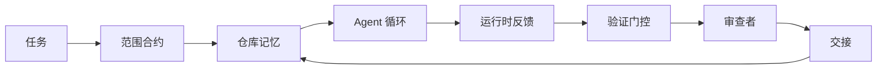

# Agent 工作台工程：为什么有能力的模型仍然会失败

> 有能力的模型是不够的。可靠的 agent 需要一个工作台：指令、状态、范围、反馈、验证、审查和交接。去掉这些，即使是前沿模型也会产生不安全的工作。

**类型：** 学习 + 构建
**语言：** Python（标准库）
**前置条件：** 第 14 阶段 · 01（Agent 循环），第 14 阶段 · 26（失败模式）
**时间：** ~45 分钟

## 学习目标

- 将模型能力与执行可靠性分开。
- 说出决定 agent 是否能发布的七个工作台表面。
- 在一个小型仓库任务上比较仅提示运行与工作台引导运行。
- 生成一份失败模式报告，将每个缺失的表面映射到它导致的症状。

## 问题

你将一个前沿模型放入真实仓库，要求它添加输入验证。它打开四个文件，编写看似合理的代码，宣布成功，然后停止。你运行测试。两个失败。第三个被触碰的文件与验证无关。没有记录 agent 假设了什么、它首先尝试了什么，或者还有什么要做。

模型在 Python 上没有错。它在工作上错了。它不知道什么算完成、允许在哪里写入、哪些测试是权威的，或者下一个会话应该如何继续。

这不是模型错误。这是工作台错误。agent 周围的表面缺少将一次性生成转变为可靠、可恢复工程的部分。

## 概念

工作台是任务期间包裹模型的操作环境。它有七个表面：

| 表面 | 承载内容 | 缺失时的失败 |
|------|---------|------------|
| 指令 | 启动规则、禁止动作、完成定义 | Agent 猜测发布意味着什么 |
| 状态 | 当前任务、触碰的文件、阻塞者、下一步动作 | 每个会话从零重启 |
| 范围 | 允许的文件、禁止的文件、验收标准 | 编辑泄漏到无关代码 |
| 反馈 | 捕获到循环中的真实命令输出 | Agent 在 400 上宣布成功 |
| 验证 | 测试、lint、冒烟运行、范围检查 | "看起来不错"到达主分支 |
| 审查 | 不同角色的第二次通过 | 建造者给自己打分 |
| 交接 | 什么改变了、为什么、还有什么 | 下一个会话重新发现一切 |

工作台独立于模型。你可以更换模型并保留表面。你不能更换表面并保留可靠性。



循环在状态文件上关闭，而不是在聊天历史上。聊天是易失的。仓库是记录系统。

### 工作台与提示工程

提示告诉模型你这轮想要什么。工作台告诉模型如何跨轮次和跨会话完成工作。大多数 agent 失败故事都是穿着提示工程外衣的工作台失败。

### 工作台与框架

框架给你运行时（LangGraph、AutoGen、Agents SDK）。工作台给 agent 一个在该运行时内工作的地方。你需要两者。这个小轨道是关于第二个的。

### 从原语推理，而不是从供应商分类法

现在有很多关于"工具工程"的文章。Addy Osmani、OpenAI、Anthropic、LangChain、Martin Fowler、MongoDB、HumanLayer、Augment Code、Thoughtworks、walkinglabs 精选列表，以及 Medium 和 Hacker News 上的稳定鼓点都在传播它。他们对工具的边界是什么、范围是什么、使用什么词汇存在分歧。我们不需要选边。七个表面是 UX 层；在每个工作台下面是相同的分布式系统原语集合，支撑着任何可靠的后端。

暂时去掉 agent 标签。Agent 运行是跨越时间、进程和机器的计算。要使其可靠，你需要与任何生产系统相同的原语。

| 原语 | 它是什么 | 它为 agent 承载什么 |
|------|---------|------------------|
| 函数 | 类型化处理程序。尽可能纯。拥有其输入和输出。 | 工具调用、规则检查、验证步骤、模型调用 |
| 工作者 | 拥有一个或多个函数和生命周期的长寿命进程 | 建造者、审查者、验证者、MCP 服务器 |
| 触发器 | 调用函数的事件源 | Agent 循环滴答、HTTP 请求、队列消息、定时任务、文件变更、钩子 |
| 运行时 | 决定什么在哪里运行、带什么超时和资源的边界 | Claude Code 的进程、LangGraph 的运行时、工作者容器 |
| HTTP / RPC | 调用者和工作者之间的连线 | 工具调用协议、MCP 请求、模型 API |
| 队列 | 触发器和工作者之间的持久缓冲区；背压、重试、幂等性 | 任务板、反馈日志、审查收件箱 |
| 会话持久化 | 在崩溃、重启、模型更换中幸存的状态 | `agent_state.json`、检查点、KV 存储、仓库本身 |
| 授权策略 | 谁可以用什么范围调用什么函数 | 允许/禁止的文件、审批边界、MCP 能力列表 |

现在将七个工作台表面映射到这些原语上。

- **指令** —— 策略 + 函数元数据。规则是检查（函数）。路由器（`AGENTS.md`）是附加到运行时启动的策略。
- **状态** —— 会话持久化。运行时每一步读取的键值存储。文件、KV 或 DB；持久化语义重要，存储后端不重要。
- **范围** —— 每任务的授权策略。允许/禁止的通配符是 ACL。需要的审批是权限格。
- **反馈** —— 写入队列的调用日志。每个 shell 调用是一条记录，持久、可重放。
- **验证** —— 一个函数。对输入确定性。在任务关闭时触发。失败时关闭。
- **审查** —— 一个单独的工作者，对建造者产物只读授权，对审查报告只写授权。
- **交接** —— 由会话结束触发器发出的持久记录。下一个会话的启动触发器读取它。

Agent 循环本身是一个工作者，消费事件（用户消息、工具结果、定时器滴答），调用函数（模型，然后模型选择的工具），写入记录（状态、反馈），并发出触发器（验证、审查、交接）。没有神秘；与作业处理器相同的形状。

### 流通中的模式，翻译为原语

每个流行的工具模式都归结为八个原语。翻译表。

| 供应商或社区模式 | 它实际是什么 |
|----------------|------------|
| Ralph 循环（Claude Code、Codex、agentic_harness 书）—— 当 agent 试图提前停止时，将原始意图重新注入新上下文窗口 | 一个用干净上下文重新排队任务的触发器；会话持久化将目标向前携带 |
| 计划 / 执行 / 验证（PEV） | 三个工作者，每个角色一个，通过状态和阶段之间的队列通信 |
| 工具-计算分离（OpenAI Agents SDK，2026 年 4 月）—— 将控制平面与执行平面分开 | 重述控制平面 / 数据平面。比 agent 标签早几十年 |
| Open Agent Passport（OAP，2026 年 3 月）—— 针对声明性策略签署和审计每个工具调用 | 由预动作工作者强制执行的授权策略，带有签名审计队列 |
| 指南和传感器（Birgitta Böckeler / Thoughtworks）—— 前馈规则 + 反馈可观察性 | 授权策略 + 验证函数 + 可观察性跟踪 |
| 渐进压缩，5 阶段（Claude Code 逆向工程，2026 年 4 月） | 一个状态管理工作器，类似定时任务地在会话持久化上运行，将其保持在预算内 |
| 钩子 / 中间件（LangChain、Claude Code）—— 拦截模型和工具调用 | 包裹运行时调用路径的触发器 + 函数 |
| 作为 Markdown 的技能，渐进披露（Anthropic、Flue） | 函数注册表，其中函数元数据及时加载到上下文中 |
| 沙盒 agent（Codex、Sandcastle、Vercel Sandbox） | 计算平面：具有隔离文件系统、网络和生命周期的运行时 |
| MCP 服务器 | 通过稳定 RPC 暴露函数的工作者，能力列表作为授权 |

该表中的每个条目都是 agent 社区到达分布式系统中已有名称的原语并给它一个新名称。营销的有用标签；不是工程词汇。

### 收据实际说了什么

工具优于模型的主张现在有数据支持。值得知道，因为它们也是反对"只是等待更聪明的模型"的唯一诚实论点。

- Terminal Bench 2.0 —— 相同模型，工具变更将编码 agent 从前 30 名之外移到第五名（LangChain，*Agent Harness 剖析*）。
- Vercel —— 删除了其 agent 80% 的工具；成功率从 80% 跳到 100%（MongoDB）。
- Harvey —— 仅通过工具优化，法律 agent 的准确率就提高了一倍以上（MongoDB）。
- 88% 的企业 AI agent 项目未能达到生产。失败集中在运行时，而不是推理（preprints.org，*语言 Agent 的工具工程*，2026 年 3 月）。
- 2025 年跨三个流行开源框架的基准研究报告约 50% 的任务完成率；长上下文 WebAgent 在长上下文条件下从 40-50% 崩溃到 10% 以下，主要来自无限循环和目标丢失（在 2026 年初的文章中广泛涵盖）。

结论不是"工具永远赢"。模型确实会随时间吸收工具技巧。结论是，今天，承重工程在模型周围，而不是内部，承载该负载的原语是每个生产系统一直需要的那些。

### 供应商文章在哪里停止

这是你不需要礼貌的部分。

- LangChain 的 *Agent Harness 剖析* 列举了十一个组件 —— 提示词、工具、钩子、沙盒、编排、记忆、技能、子 agent 和一个运行时"愚蠢循环"。它没有命名队列、作为部署单元的工作者、触发器语义、作为单独问题的会话持久化或授权策略。它将工具视为你配置的对象，而不是你部署的系统。
- Addy Osmani 的 *Agent Harness Engineering* 确立了框架 `Agent = Model + Harness` 和棘轮模式，但止步于说工具是由什么构建的。它读起来像是一种立场，而不是规范。
- Anthropic 和 OpenAI 在表面上最深入，但留在自己的运行时内。2026 年 4 月 Agents SDK 中的"工具-计算分离"公告是第一个明确支持控制平面/数据平面分割的供应商文章。那是一个原语思想，不是新思想。
- agentic_harness 书将工具视为配置对象（Jaymin West 的 *Agentic Engineering*，第 6 章），其中最强的一句话是"工具是 agent 系统中的主要安全边界"。这只是授权策略，重述了一遍。
- Hacker News 线程不断到达同一个地方。2026 年 4 月的线程 *The agent harness belongs outside the sandbox* 认为工具应该"更像一个位于一切之外的管理程序，根据上下文和用户授权访问"。这，又是，作为单独平面的授权策略。

你不需要不同意任何这些文章就能注意到差距。它们正在为一个已存在的系统编写 UX 描述。我们正在编写系统。当系统构建正确时，七个表面从原语中自然产生。当构建错误时，再多的 `AGENTS.md` 润色也无法修复缺失的队列。

所以当你在其他地方听到"工具工程"时，翻译为原语。提示词和规则是策略和函数。脚手架是运行时。护栏是授权 + 验证。钩子是触发器。记忆是会话持久化。Ralph 循环是重新排队。子 agent 是工作者。沙盒是计算平面。词汇变化；工程不变。工作台是面向 agent 的 UX；工具，在下一个供应商重构中幸存的意义上，是正确连接在一起的函数、工作者、触发器、运行时、队列、持久化和策略。

## 构建

`code/main.py` 两次运行一个微型仓库任务。首先是仅提示，然后是用七个表面连接。相同模型，相同任务。脚本计算仅提示运行中缺失哪些表面，并打印失败模式报告。

仓库任务故意很小：向单文件 FastAPI 风格处理程序添加输入验证并编写通过测试。

运行：

```
python3 code/main.py
```

输出：两次运行的并排日志、总结仅提示运行的 `failure_modes.json`，以及工作台运行的一行裁决。

Agent 是一个微小的基于规则的存根；重点是表面，不是模型。在这个小轨道的其余部分，你将把每个表面重建为真实、可重用的工件。

## 使用

三个工作台表面已在野外存在的地方，即使没有人这样称呼它们：

- **Claude Code、Codex、Cursor。** `AGENTS.md` 和 `CLAUDE.md` 是指令表面。斜杠命令是范围。钩子是验证。
- **LangGraph、OpenAI Agents SDK。** 检查点和会话存储是状态表面。交接是交接表面。
- **真实仓库上的 CI。** 测试、lint 和类型检查是验证。PR 模板是交接。CODEOWNERS 是审查。

工作台工程是使这些表面显式和可重用的学科，而不是让每个团队重新发现它们。

## 交付

`outputs/skill-workbench-audit.md` 是一个可移植的技能，审核现有仓库的七个工作台表面，报告哪些缺失、哪些部分存在、哪些健康。放在任何 agent 设置旁边；它告诉你首先修复什么。

## 练习

1. 选择一个你已经在运行 agent 的仓库。给七个表面评分从 0（缺失）到 2（健康）。你最弱的表面是什么？
2. 扩展 `main.py`，使仅提示运行也产生虚假的"成功"声明。验证验证门控会捕获它。
3. 为你的产品添加第八个表面。证明为什么它不会坍缩到现有七个之一。
4. 用幻觉额外文件写入的不同存根 agent 重新运行脚本。哪个表面首先捕获它？
5. 将第 14 阶段 · 26 的五种行业反复出现的失败模式映射到七个表面。每种模式是哪个表面设计来吸收的？

## 关键术语

| 术语 | 人们怎么说 | 实际含义 |
|------|-----------|---------|
| Workbench | "设置" | 围绕模型的工程表面，使工作可靠 |
| Surface | "文档"或"脚本" | agent 每轮读取或写入的命名、机器可读输入 |
| System of record | "笔记" | 当聊天历史消失时，agent 视为真相的文件 |
| Definition of done | "验收" | agent 无法伪造的客观、文件支持的检查清单 |
| Workbench audit | "仓库就绪检查" | 对七个表面的遍历，在工作开始前标记缺失部分 |

## 延伸阅读

将这些作为数据点阅读，而不是权威。每个都是部分分类法。在决定是否采用之前，将每个概念翻译回原语（函数、工作者、触发器、运行时、HTTP/RPC、队列、持久化、策略）。

供应商框架：

- [Addy Osmani, Agent Harness Engineering](https://addyosmani.com/blog/agent-harness-engineering/) —— `Agent = Model + Harness` 和棘轮模式；基础设施薄弱
- [LangChain, The Anatomy of an Agent Harness](https://blog.langchain.com/the-anatomy-of-an-agent-harness/) —— 十一个组件：提示词、工具、钩子、编排、沙盒、记忆、技能、子 agent、运行时；省略队列、部署、授权
- [OpenAI, Harness engineering: leveraging Codex in an agent-first world](https://openai.com/index/harness-engineering/) —— Codex 团队对其运行时周围表面的看法
- [OpenAI, Unrolling the Codex agent loop](https://openai.com/index/unrolling-the-codex-agent-loop/) —— agent 循环简化为函数调用上的 `while`
- [Anthropic, Effective harnesses for long-running agents](https://www.anthropic.com/engineering/effective-harnesses-for-long-running-agents) —— 特定运行时内的长程表面
- [Anthropic, Harness design for long-running application development](https://www.anthropic.com/engineering/harness-design-long-running-apps) —— 应用设计笔记
- [LangChain Deep Agents harness capabilities](https://docs.langchain.com/oss/python/deepagents/harness) —— 运行时配置表面

具有可用细节的实践者文章：

- [Martin Fowler / Birgitta Böckeler, Harness engineering for coding agent users](https://martinfowler.com/articles/harness-engineering.html) —— 指南（前馈）+ 传感器（反馈）；最干净的控制理论框架
- [HumanLayer, Skill Issue: Harness Engineering for Coding Agents](https://www.humanlayer.dev/blog/skill-issue-harness-engineering-for-coding-agents) —— "不是模型问题，是配置问题"
- [MongoDB, The Agent Harness: Why the LLM Is the Smallest Part of Your Agent System](https://www.mongodb.com/company/blog/technical/agent-harness-why-llm-is-smallest-part-of-your-agent-system) —— 收据：Vercel 80% 到 100%，Harvey 2 倍准确率，Terminal Bench 前 30 到前 5
- [Augment Code, Harness Engineering for AI Coding Agents](https://www.augmentcode.com/guides/harness-engineering-ai-coding-agents) —— 约束优先的演练
- [Sequoia podcast, Harrison Chase on Context Engineering Long-Horizon Agents](https://sequoiacap.com/podcast/context-engineering-our-way-to-long-horizon-agents-langchains-harrison-chase/) —— 运行时问题优于模型问题

书籍、论文和参考实现：

- [Jaymin West, Agentic Engineering —— 第 6 章：Harnesses](https://www.jayminwest.com/agentic-engineering-book/6-harnesses) —— 书籍长度处理，将工具视为主要安全边界
- [preprints.org, Harness Engineering for Language Agents (2026 年 3 月)](https://www.preprints.org/manuscript/202603.1756) —— 作为控制 / 代理 / 运行时的学术框架
- [walkinglabs/awesome-harness-engineering](https://github.com/walkinglabs/awesome-harness-engineering) —— 跨上下文、评估、可观察性、编排的精选阅读列表
- [ai-boost/awesome-harness-engineering](https://github.com/ai-boost/awesome-harness-engineering) —— 替代精选列表（工具、评估、记忆、MCP、权限）
- [andrewgarst/agentic_harness](https://github.com/andrewgarst/agentic_harness) —— 带有 Redis 支持的记忆和评估套件的生产就绪参考实现
- [HKUDS/OpenHarness](https://github.com/HKUDS/OpenHarness) —— 带有内置个人 agent 的开放 agent 工具

值得阅读的 Hacker News 线程，为了分歧而非共识：

- [HN: Effective harnesses for long-running agents](https://news.ycombinator.com/item?id=46081704)
- [HN: Improving 15 LLMs at Coding in One Afternoon. Only the Harness Changed](https://news.ycombinator.com/item?id=46988596)
- [HN: The agent harness belongs outside the sandbox](https://news.ycombinator.com/item?id=47990675) —— 主张授权作为单独平面

本课程内部的交叉引用：

- 第 14 阶段 · 23 —— OpenTelemetry GenAI 约定：传感器文献指向的可观察性层
- 第 14 阶段 · 26 —— 失败模式编目七个表面设计来吸收的内容
- 第 14 阶段 · 27 —— 位于授权策略原语的提示注入防御
- 第 14 阶段 · 29 —— 生产运行时（队列、事件、定时任务）：本课原语在部署中的位置