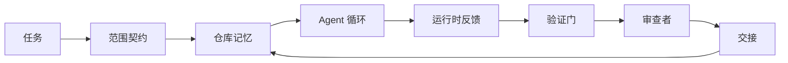

# Agent Workbench 工程：为何能力强大的模型仍然失败

> 仅靠能力强大的模型是不够的。可靠的 Agent 需要一个 workbench（工作台）：指令、状态、范围、反馈、验证、审查和交接。剥离这些，即使是最前沿的模型也会产生不安全的输出。

**类型：** 学习 + 构建
**语言：** Python（标准库）
**先决条件：** 阶段 14 · 01（Agent 循环）、阶段 14 · 26（失败模式）
**时间：** ~45 分钟

## 学习目标

- 区分模型能力与执行可靠性。
- 说出决定 Agent 是否能够交付的七个工作台层面。
- 在小规模仓库任务上比较仅提示运行与工作台引导运行。
- 生成失败模式报告，将每个缺失的层面映射到其导致的症状。

## 问题

你将前沿模型放入真实仓库，要求它添加输入验证。它打开四个文件，编写看似合理的代码，宣布成功，然后停止。你运行测试。两个失败。第三个文件被改动，却与验证无关。没有记录 Agent 做了什么假设、尝试了什么，或者还有什么要做。

模型对 Python 的理解没有错。错的是对工作的理解。它不知道什么算完成、允许在哪里写入、哪些测试是权威的，或者下一轮会话应该如何继续。

这不是模型缺陷。这是工作台缺陷。Agent 周围的环境缺少将一次性生成转变为可靠、可恢复的工程的那些部分。

## 概念

工作台是任务期间包裹模型的操作环境。它有七个层面：

| 层面 | 承载内容 | 缺失时的失败表现 |
|------|----------|-----------------|
| Instructions（指令） | 启动规则、禁止操作、完成定义 | Agent 猜测交付含义 |
| State（状态） | 当前任务、接触的文件、阻塞项、下一步操作 | 每次会话从零开始 |
| Scope（范围） | 允许的文件、禁止的文件、验收标准 | 编辑泄露到无关代码 |
| Feedback（反馈） | 捕获到循环中的真实命令输出 | Agent 在 400 错误时宣布成功 |
| Verification（验证） | 测试、lint、冒烟运行、范围检查 | "看起来不错"进入 main 分支 |
| Review（审查） | 不同角色的第二遍检查 | 构建者自己批改作业 |
| Handoff（交接） | 变更内容、原因、剩余工作 | 下一轮会话重新发现一切 |

工作台独立于模型。你可以更换模型并保持这些层面。但你不能更换这些层面而保持可靠性。



循环闭合于状态文件，而非聊天历史。聊天是易失的。仓库是记录系统。

### 工作台与提示工程的区别

提示告诉模型本轮你想要什么。工作台告诉模型如何跨轮次、跨会话地工作。大多数 Agent 失败故事都是披着提示工程外衣的工作台失败。

### 工作台与框架的区别

框架提供运行时（LangGraph、AutoGen、Agents SDK）。工作台为 Agent 提供在该运行时内工作的场所。两者都需要。本迷你课程系列关于后者。

### 从原语推理，而非供应商分类法

目前有很多关于"harness engineering（工装工程）"的论述。Addy Osmani、OpenAI、Anthropic、LangChain、Martin Fowler、MongoDB、HumanLayer、Augment Code、Thoughtworks、walkinglabs 的 awesome 列表，以及 Medium 和 Hacker News 上持续不断的文章都在讨论它。他们对 harness（工装）的边界、范围内容和使用哪种词汇存在分歧。我们不需要选边站。七个层面是一个 UX 层；每个工作台之下都是支撑任何可靠后端的同一组分布式系统原语。

暂时去掉 Agent 标签。一次 Agent 运行是跨越时间、进程和机器的计算。要使其可靠，你需要任何生产系统都需要的相同原语。

| 原语 | 含义 | 对 Agent 的承载内容 |
|------|------|---------------------|
| Function（函数） | 类型化处理器。尽可能纯函数。拥有其输入输出。 | 工具调用、规则检查、验证步骤、模型调用 |
| Worker（工作器） | 拥有至少一个函数及其生命周期的长寿命进程 | 构建者、审查者、验证者、MCP 服务器 |
| Trigger（触发器） | 调用函数的事件源 | Agent 循环计时、HTTP 请求、队列消息、cron、文件变更、hook |
| Runtime（运行时） | 决定什么在哪里运行、超时和资源边界 | Claude Code 的进程、LangGraph 的运行时、worker 容器 |
| HTTP / RPC | 调用者与工作器之间的线路 | 工具调用协议、MCP 请求、模型 API |
| Queue（队列） | 触发器与工作器之间的持久缓冲；背压、重试、幂等性 | 任务面板、反馈日志、审查收件箱 |
| Session persistence（会话持久化） | 在崩溃、重启、模型更换后存活的状态 | `agent_state.json`、检查点、KV 存储、仓库本身 |
| Authorization policy（授权策略） | 谁可以用哪个范围调用哪个函数 | 允许/禁止的文件、审批边界、MCP 能力列表 |

现在将七个工作台层面映射到这些原语：

- **Instructions（指令）** — 策略 + 函数元数据。规则是检查（函数）。路由器（`AGENTS.md`）是附加到运行时启动的策略。
- **State（状态）** — 会话持久化。运行时在每一步读取的键控存储。文件、KV 或数据库；持久化语义重要，存储后端不重要。
- **Scope（范围）** — 每任务的授权策略。允许/禁止的 glob 是 ACL。需要审批的是权限网格。
- **Feedback（反馈）** — 写入队列的调用日志。每次 shell 调用都是记录，持久、可重放。
- **Verification（验证）** — 一个函数。对输入确定性。在任务关闭时触发。失败即关闭。
- **Review（审查）** — 独立工作器，对构建者制品只读授权，对审查报告只写授权。
- **Handoff（交接）** — 会话结束触发器发出的持久记录。下一轮会话的启动触发器读取它。

Agent 循环本身是一个消费事件（用户消息、工具结果、计时器 tick）、调用函数（模型，然后模型选择的工具）、写入记录（状态、反馈）和发出触发器（验证、审查、交接）的工作器。没有神秘之处；与作业处理器的形状相同。

### 流通中的模式，翻译为原语

每个流行的 harness 模式都可简化为八个原语。翻译表：

| 供应商或社区模式 | 实际含义 |
|------------------|----------|
| Ralph Loop（Claude Code、Codex、agentic_harness 书）— 当 Agent 尝试提前停止时，将原始意图重新注入新的上下文窗口 | 用干净上下文重新入队任务的触发器；会话持久化承载目标前进 |
| Plan / Execute / Verify（PEV） | 三个工作器，每角色一个，通过状态及阶段间队列通信 |
| Harness-compute 分离（OpenAI Agents SDK，2026 年 4 月）— 将控制平面与执行平面分离 | 重述控制平面/数据平面。比 Agent 标签早几十年 |
| Open Agent Passport（OAP，2026 年 3 月）— 执行前根据声明式策略签名和审计每个工具调用 | 由动作前工作器强制执行的授权策略，带签名审计队列 |
| Guides and Sensors（Birgitta Böckeler / Thoughtworks）— 前馈规则 + 反馈可观测性 | 授权策略 + 验证函数 + 可观测性追踪 |
| Progressive compaction，5 阶段（Claude Code 逆向工程，2026 年 4 月） | 在会话持久化上运行类 cron 的状态管理工作器，将其保持在预算内 |
| Hooks / middleware（LangChain、Claude Code）— 拦截模型和工具调用 | 围绕运行时调用路径包装的触发器 + 函数 |
| Skills as Markdown with progressive disclosure（Anthropic、Flue） | 函数注册表，函数元数据刚好及时加载到上下文 |
| Sandbox agents（Codex、Sandcastle、Vercel Sandbox） | 计算平面：带隔离文件系统、网络和生命周期的运行时 |
| MCP servers | 通过稳定 RPC 暴露函数的工作器，能力列表作为授权 |

该表中的每个条目都是 Agent 社区抵达已在分布式系统中拥有名称的原语，然后给它一个新名称。对营销有用；对工程词汇无用。

### 收据实际说了什么

Harness 高于模型的声称现在有数字支撑。值得了解，因为它们也是反对"只需等待更聪明的模型"的唯一诚实论据。

- Terminal Bench 2.0 — 同一模型，harness 变更将编码 Agent 从 Top 30 之外移至第 5 名（LangChain，《Agent Harness 剖析》）。
- Vercel — 删除了 80% 的 Agent 工具；成功率从 80% 跃升至 100%（MongoDB）。
- Harvey — 仅通过 harness 优化，法律 Agent 准确度翻倍（MongoDB）。
- 88% 的企业 AI Agent 项目未能投产。失败集中在运行时，而非推理（preprints.org，《语言 Agent 的 Harness 工程》，2026 年 3 月）。
- 一项 2025 年跨三个流行开源框架的基准研究显示约 50% 的任务完成率；长上下文 WebAgent 在长上下文条件下从 40-50% 崩溃至 10% 以下，主要由无限循环和目标丢失导致（广泛涵盖于 2026 年初的文章）。

启示不是"harness 永远获胜"。模型确实会随时间吸收 harness 技巧。启示是：今天，承重工程在模型周围，而非其内部，承载该负载的原语是每个生产系统一直需要的那些。

### 供应商文章止步何处

这是你不需要客气对待的部分。

- LangChain 的《Agent Harness 剖析》列举了十一个组件 —— 提示、工具、hook、沙箱、编排、记忆、技能、子 Agent 和运行时"哑循环"。它没有命名队列、作为部署单元的工作器、触发器语义、作为独立关注点的会话持久化或授权策略。它将 harness 视为配置对象，而非部署的系统。
- Addy Osmani 的《Agent Harness Engineering》提出了框架 `Agent = Model + Harness` 和棘轮模式，但止步于 harness 由什么构建。读起来像立场，而非规范。
- Anthropic 和 OpenAI 在层面方面走得最深，但停留在自己的运行时内。2026 年 4 月 Agents SDK 中的"harness-compute 分离"公告是第一个明确认可控制平面/数据平面分离的供应商文章。那是原语思想，不是新思想。
- agentic_harness 书将 harness 视为配置对象（Jaymin West 的《Agentic Engineering》，第 6 章），其中最强有力的台词是"harness 是 Agent 系统中的主要安全边界"。那只是授权策略，换了个说法。
- Hacker News 讨论串不断抵达同一地点。2026 年 4 月的讨论串《Agent harness 应位于沙箱之外》主张 harness 应"更像位于一切之外并根据上下文和用户授权访问的 hypervisor"。那 again，是作为独立平面的授权策略。

你不需要不同意这些文章中的任何一篇来注意差距。它们是在写一个已存在系统的 UX 描述。我们在写这个系统。当系统构建正确时，七个层面从原语中衍生出来。当构建错误时，再多的 `AGENTS.md` 润色也无法修复缺失的队列。

因此，当你在别处听到"harness engineering"时，翻译为原语。提示和规则是策略和函数。脚手架是运行时。护栏是授权 + 验证。Hook 是触发器。记忆是会话持久化。Ralph Loop 是重新入队。子 Agent 是工作器。沙箱是计算平面。词汇变化；工程不变。工作台是面向 Agent 的 UX；harness，在能经受住下一次供应商重构的意义上，是正确连接的函数、工作器、触发器、运行时、队列、持久化和策略。

## 构建

`code/main.py` 运行一个小型仓库任务两次。第一次仅提示，然后接入七个层面。同一模型，同一任务。脚本计算失败运行缺失了哪些层面，并打印失败模式报告。

仓库任务故意做得小：向单文件 FastAPI 风格处理器添加输入验证并编写通过的测试。

运行：

```
python3 code/main.py
```

输出：两次运行的并排日志、`failure_modes.json` 总结仅提示运行，以及工作台运行的一行结论。

Agent 是一个微小的基于规则的存根；重点是层面，而非模型。在本迷你课程系列的其余部分，你将把每个层面重建为真实、可复用的制品。

## 使用

工作台层面已经存在于野外的三个地方，即使没人这样称呼它们：

- **Claude Code、Codex、Cursor。** `AGENTS.md` 和 `CLAUDE.md` 是指令层面。斜杠命令是范围。Hook 是验证。
- **LangGraph、OpenAI Agents SDK。** 检查点和会话存储是状态层面。交接是交接层面。
- **真实仓库上的 CI。** 测试、lint 和类型检查是验证。PR 模板是交接。CODEOWNERS 是审查。

工作台工程是使这些层面显式且可复用的准则，而不是让每个团队重新发现它们。

## 部署

`outputs/skill-workbench-audit.md` 是一个可移植的技能，用于审计现有仓库的七个工作台层面，并报告哪些缺失、哪些部分、哪些健康。将它放在任何 Agent 设置旁边；它告诉你先修复什么。

## 练习

1. 选一个你已经运行 Agent 的仓库。给七个层面从 0（缺失）到 2（健康）打分。你最弱的层面是什么？
2. 扩展 `main.py`，使仅提示运行也产生假的"成功"声明。验证验证门是否会捕获它。
3. 为你自己的产品添加第八个层面。证明它不能合并到现有七个之一中。
4. 用不同的存根 Agent 重新运行脚本，该 Agent 幻觉出额外的文件写入。哪个层面先捕获它？
5. 将阶段 14 · 26 的五个行业 recurring 失败模式映射到七个层面。每个层面设计用于吸收哪种模式？

## 关键术语

| 术语 | 人们的说法 | 实际含义 |
|------|----------|----------|
| Workbench（工作台） | "设置" | 模型周围使工作可靠的工程层面 |
| Surface（层面） | "一个文档"或"一个脚本" | Agent 每轮读取或写入的命名、机器可读输入 |
| System of record（记录系统） | "笔记" | 当聊天历史消失时，Agent 视为真相的文件 |
| Definition of done（完成定义） | "验收" | Agent 无法伪造的、文件支持的客观检查清单 |
| Workbench audit（工作台审计） | "仓库就绪检查" | 在工作开始前标记缺失部分的对七个层面的检查 |

## 延伸阅读

将这些作为数据点阅读，而非权威。每个都是部分分类法。在决定是否采用之前，将每个概念翻译回原语（函数、工作器、触发器、运行时、HTTP/RPC、队列、持久化、策略）。

供应商框架：

- [Addy Osmani, Agent Harness Engineering](https://addyosmani.com/blog/agent-harness-engineering/) — `Agent = Model + Harness` 和棘轮模式；基础设施方面薄弱
- [LangChain, The Anatomy of an Agent Harness](https://blog.langchain.com/the-anatomy-of-an-agent-harness/) — 十一个组件：提示、工具、hook、编排、沙箱、记忆、技能、子 Agent、运行时；省略队列、部署、授权
- [OpenAI, Harness engineering: leveraging Codex in an agent-first world](https://openai.com/index/harness-engineering/) — Codex 团队对其运行时周围层面的看法
- [OpenAI, Unrolling the Codex agent loop](https://openai.com/index/unrolling-the-codex-agent-loop/) — Agent 循环简化为函数调用之上的 `while`
- [Anthropic, Effective harnesses for long-running agents](https://www.anthropic.com/engineering/effective-harnesses-for-long-running-agents) — 特定运行时内的长视野层面
- [Anthropic, Harness design for long-running application development](https://www.anthropic.com/engineering/harness-design-long-running-apps) — 应用设计笔记
- [LangChain Deep Agents harness capabilities](https://docs.langchain.com/oss/python/deepagents/harness) — 运行时配置层面

有实用细节的从业者文章：

- [Martin Fowler / Birgitta Böckeler, Harness engineering for coding agent users](https://martinfowler.com/articles/harness-engineering.html) — guides（前馈）+ sensors（反馈）；最清晰的控制理论框架
- [HumanLayer, Skill Issue: Harness Engineering for Coding Agents](https://www.humanlayer.dev/blog/skill-issue-harness-engineering-for-coding-agents) — "不是模型问题，是配置问题"
- [MongoDB, The Agent Harness: Why the LLM Is the Smallest Part of Your Agent System](https://www.mongodb.com/company/blog/technical/agent-harness-why-llm-is-smallest-part-of-your-agent-system) — 收据：Vercel 80% 到 100%，Harvey 2 倍准确度，Terminal Bench Top 30 到 Top 5
- [Augment Code, Harness Engineering for AI Coding Agents](https://www.augmentcode.com/guides/harness-engineering-ai-coding-agents) — 约束优先的演练
- [Sequoia podcast, Harrison Chase on Context Engineering Long-Horizon Agents](https://sequoiacap.com/podcast/context-engineering-our-way-to-long-horizon-agents-langchains-harrison-chase/) — 运行时关注高于模型关注

书籍、论文和参考实现：

- [Jaymin West, Agentic Engineering — Chapter 6: Harnesses](https://www.jayminwest.com/agentic-engineering-book/6-harnesses) — 书籍长度处理，将 harness 视为主要安全边界
- [preprints.org, Harness Engineering for Language Agents (March 2026)](https://www.preprints.org/manuscript/202603.1756) — 学术框架作为控制/代理/运行时
- [walkinglabs/awesome-harness-engineering](https://github.com/walkinglabs/awesome-harness-engineering) — 关于上下文、评估、可观测性、编排的精选阅读列表
- [ai-boost/awesome-harness-engineering](https://github.com/ai-boost/awesome-harness-engineering) — 备选精选列表（工具、评估、记忆、MCP、权限）
- [andrewgarst/agentic_harness](https://github.com/andrewgarst/agentic_harness) — 生产就绪参考实现，带 Redis 支持的记忆和评估套件
- [HKUDS/OpenHarness](https://github.com/HKUDS/OpenHarness) — 内置个人 Agent 的开放 Agent harness

值得阅读分歧而非共识的 Hacker News 讨论串：

- [HN: Effective harnesses for long-running agents](https://news.ycombinator.com/item?id=46081704)
- [HN: Improving 15 LLMs at Coding in One Afternoon. Only the Harness Changed](https://news.ycombinator.com/item?id=46988596)
- [HN: The agent harness belongs outside the sandbox](https://news.ycombinator.com/item?id=47990675) — 主张授权作为独立平面

本课程内的交叉引用：

- 阶段 14 · 23 — OpenTelemetry GenAI 约定：传感器文献指向的可观测性层
- 阶段 14 · 26 — 失败模式目录，七个层面设计用于吸收
- 阶段 14 · 27 — 位于授权策略原语处的提示注入防御
- 阶段 14 · 29 — 生产运行时（队列、事件、cron）：本课原语在部署中的位置
