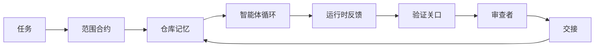

# 智能体工作台工程：为什么有能力的模型仍然失败

> 仅有能力的模型是不够的。可靠的智能体需要一个工作台：指令、状态、范围、反馈、验证、审查和交接。剥离这些，即使是前沿模型产出的工作也不安全，无法交付。

**类型：** 学习 + 构建
**语言：** Python（标准库）
**前置要求：** 阶段 14 · 01（智能体循环），阶段 14 · 26（失败模式）
**时间：** 约 45 分钟

## 学习目标

- 区分模型能力与执行可靠性。
- 列举决定智能体能否交付的七个工作台表面。
- 在一个小型仓库任务上，比较仅提示词运行与工作台引导运行。
- 生成一份失败模式报告，将每个缺失的表面映射到其引发的症状。

## 问题

你将一个前沿模型放入真实仓库，要求它添加输入验证。它打开四个文件，写出看似合理的代码，宣布成功，然后停止。你运行测试，两个失败。还有一个被触碰的文件与验证完全无关。没有记录表明模型假设了什么、最初尝试了什么、还有什么未完成。

模型并没有错在 Python，而是错在对工作的理解。它不知道什么算完成、允许在哪里写入、哪些测试是权威的、或者下一个会话应该如何接续。

这不是模型错误，而是工作台错误。智能体周围的环境缺少了将一次性生成转化为可靠、可接续工程的那些部分。

## 概念

工作台是在任务执行期间包裹模型的操作环境。它有七个表面：

| 表面 | 承载内容 | 缺失时的失败 |
|------|---------|-------------|
| 指令（Instructions） | 启动规则、禁止行为、完成定义 | 智能体猜测交付意味着什么 |
| 状态（State） | 当前任务、已触碰文件、阻塞项、下一步操作 | 每个会话从零开始 |
| 范围（Scope） | 允许文件、禁止文件、验收标准 | 编辑泄漏到无关代码中 |
| 反馈（Feedback） | 捕获到循环中的真实命令输出 | 智能体对 400 错误宣布成功 |
| 验证（Verification） | 测试、lint、冒烟测试、范围检查 | "看起来没问题" 到达主分支 |
| 审查（Review） | 以不同角色进行的二次检查 | 构建者给自己的作业打分 |
| 交接（Handoff） | 变更了什么、为什么、还有哪些未完成 | 下一个会话重新发现一切 |

工作台独立于模型。你可以更换模型并保留这些表面。你不能更换表面并保留可靠性。


```mermaid
flowchart LR
  Task[任务] --> Scope[范围合约]
  Scope --> State[仓库记忆]
  State --> Agent[智能体循环]
  Agent --> Feedback[运行时反馈]
  Feedback --> Verify[验证关口]
  Verify --> Review[审查者]
  Review --> Handoff[交接]
  Handoff --> State
```

循环闭合在状态文件上，而不是聊天历史记录上。聊天是易失的。仓库才是记录系统。

### 工作台与提示词工程对比

提示词工程告诉模型本轮你想要什么。工作台告诉模型如何跨轮次和跨会话工作。大多数智能体失败故事都是穿着提示词工程外衣的工作台失败。

### 工作台与框架对比

框架提供运行时（LangGraph、AutoGen、Agents SDK）。工作台给智能体在该运行时内提供一个工作的场所。两者缺一不可。本迷你轨道讨论的是后者。

### 从原语推理，而非从供应商分类法出发

目前关于"缰绳工程（harness engineering）"的文章很多。Addy Osmani、OpenAI、Anthropic、LangChain、Martin Fowler、MongoDB、HumanLayer、Augment Code、Thoughtworks、walkinglabs 的 awesome 列表，以及 Medium 和 Hacker News 上源源不断的文章都在讨论。他们对缰绳的边界、范围和术语存在分歧。我们不需要站队。七个表面是一个 UX 层；每个工作台之下都是支撑任何可靠后端系统的同一套分布式系统原语。

暂时去掉"智能体"这个标签。一次智能体运行是跨时间、跨进程、跨机器的计算。要使其可靠，你需要任何生产系统都需要的相同原语。

| 原语 | 是什么 | 为智能体承载什么 |
|------|--------|-----------------|
| 函数（Function） | 类型化处理器。尽可能纯函数。拥有自己的输入和输出。 | 工具调用、规则检查、验证步骤、模型调用 |
| 工作者（Worker） | 拥有一个或多个函数及生命周期的长寿命进程 | 构建者、审查者、验证者、MCP 服务器 |
| 触发器（Trigger） | 调用函数的事件源 | 智能体循环滴答、HTTP 请求、队列消息、cron、文件变更、钩子 |
| 运行时（Runtime） | 决定什么在哪运行、使用什么超时和资源的边界 | Claude Code 的进程、LangGraph 的运行时、工作者容器 |
| HTTP / RPC | 调用者与工作者之间的通信线路 | 工具调用协议、MCP 请求、模型 API |
| 队列（Queue） | 触发器与工作者之间的持久缓冲区；背压、重试、幂等性 | 任务板、反馈日志、审查收件箱 |
| 会话持久化（Session persistence） | 在崩溃、重启、模型更换后仍然存在的状态 | `agent_state.json`、检查点、KV 存储、仓库本身 |
| 授权策略（Authorization policy） | 谁可以用什么范围调用什么函数 | 允许/禁止文件、审批边界、MCP 能力列表 |

现在将七个工作台表面映射到这些原语上。

- **指令（Instructions）** — 策略 + 函数元数据。规则就是检查（函数）。路由器（`AGENTS.md`）是附着在运行时启动上的策略。
- **状态（State）** — 会话持久化。运行时每一步都读取的键值存储。文件、KV 或 DB；持久化语义重要，存储后端不重要。
- **范围（Scope）** — 每项任务的授权策略。允许/禁止的 glob 模式是 ACL。需要审批是权限格。
- **反馈（Feedback）** — 写入队列的调用日志。每个 shell 调用都是一条记录，持久化、可重放。
- **验证（Verification）** — 一个函数。对输入确定。在任务关闭时触发。失败时关闭。
- **审查（Review）** — 一个独立的工作者，对构建者的工件具有只读权限，对审查报告具有只写权限。
- **交接（Handoff）** — 由会话结束触发器发出的持久化记录。下一个会话的启动触发器读取它。

智能体循环本身是一个工作者，它消费事件（用户消息、工具结果、计时器滴答）、调用函数（模型、模型选择的工具）、写入记录（状态、反馈）、并发出触发器（验证、审查、交接）。没有玄机；与作业处理器的形状相同。

### 流行中的模式，翻译为原语

每个流行的缰绳模式都可以简化为八个原语。对照表如下。

| 供应商或社区模式 | 实际是什么 |
|------------------|-----------|
| Ralph Loop（Claude Code、Codex、agentic_harness 书籍）——在智能体试图提前停止时，将原始意图重新注入新的上下文窗口 | 一个用干净上下文重新入队任务的触发器；会话持久化将目标向前传递 |
| 计划/执行/验证（PEV） | 三个工作者，每个角色一个，通过状态和阶段间的队列通信 |
| 缰绳-计算分离（OpenAI Agents SDK，2026 年 4 月）——将控制平面与执行平面分离 | 重新陈述控制平面/数据平面。比智能体标签早了几十年 |
| Open Agent Passport（OAP，2026 年 3 月）——在执行前对每个工具调用进行签名并根据声明性策略进行审计 | 由前置操作工作者执行的授权策略，带有签名的审计队列 |
| 指南与传感器（Birgitta Böckeler / Thoughtworks）——前馈规则 + 反馈可观测性 | 授权策略 + 验证函数 + 可观测性追踪 |
| 渐进压缩，5 阶段（Claude Code 逆向工程，2026 年 4 月） | 一个状态管理工作者，像 cron 一样在会话持久化上运行，以将其保持在预算内 |
| 钩子/中间件（LangChain、Claude Code）——拦截模型和工具调用 | 围绕运行时调用路径包装的触发器 + 函数 |
| 标记为 Markdown 的技能，渐进式披露（Anthropic、Flue） | 函数注册表，函数元数据在需要时即时加载到上下文中 |
| 沙箱智能体（Codex、Sandcastle、Vercel Sandbox） | 计算平面：具有隔离文件系统、网络和生命周期的运行时 |
| MCP 服务器 | 通过稳定 RPC 暴露函数的工作者，以能力列表作为授权 |

上表中的每一项都是智能体社区碰巧发现了一个在分布式系统中早已有名字的原语，并给了它一个新名字。作为营销标签有用；作为工程词汇无用。

### 数据实际说明了什么

"缰绳优于模型"这一论断现在已经有了数据支持。值得了解，因为它们也是反对"等一个更聪明的模型"的唯一诚实论据。

- **Terminal Bench 2.0** — 相同模型，仅改变缰绳就将一个编码智能体从前 30 名之外提升到第 5 名（LangChain，《智能体缰绳解剖》）。
- **Vercel** — 删除了智能体 80% 的工具；成功率从 80% 跃升至 100%（MongoDB）。
- **Harvey** — 法律智能体仅通过缰绳优化就使准确率翻倍（MongoDB）。
- **88% 的企业 AI 智能体项目未能进入生产**。失败集中在运行时，而非推理（preprints.org，《语言智能体缰绳工程》，2026 年 3 月）。
- **一项 2025 年的基准研究**，覆盖三个流行的开源框架，报告约 50% 的任务完成率；长上下文 WebAgent 从 40-50% 崩溃到 10% 以下，主要原因是无限循环和目标丢失（在 2026 年初的报道中被广泛引用）。

结论不是"缰绳永远胜利"。模型确实会随着时间吸收缰绳的技巧。结论是：今天，承担工程重担的是模型周围，而非模型内部，而承担这部分重担的原语正是每个生产系统一直需要的那些。

### 供应商文章止步之处

这是你无需客气的地方。

- **LangChain 的《智能体缰绳解剖》**列举了十一个组件——提示词、工具、钩子、沙箱、编排、记忆、技能、子智能体和运行时"哑循环"。它没有命名队列、作为部署单元的工作者、触发器语义、作为独立关注点的会话持久化或授权策略。它将缰绳视为一个可配置的对象，而非一个需要部署的系统。
- **Addy Osmani 的《智能体缰绳工程》**确立了 `智能体 = 模型 + 缰绳` 的框架和棘轮模式，但止步于说清楚缰绳由什么构建。它读起来像一种立场，而非一份规格说明。
- **Anthropic 和 OpenAI** 对表面的探讨最为深入，但仍局限在自己的运行时内。2026 年 4 月 Agents SDK 中的"缰绳-计算分离"公告是第一个明确支持控制平面/数据平面分离的供应商文章。那是一个原语思想，而非新思想。
- **agentic_harness 书籍**将缰绳视为一个配置对象（Jaymin West 的《智能体工程》，第 6 章），其中最有力的一句话是"缰绳是智能体系统中的主要安全边界。"那不过是重新陈述的授权策略。
- **Hacker News 讨论**不断得出相同的结论。2026 年 4 月的讨论《缰绳智能体应位于沙箱之外》主张缰绳应该"更像一个位于一切之外、根据上下文和用户授权访问的管理程序。"这再次是将授权策略作为一个独立平面。

你不需要与上述任何文章争论就能注意到这个缺口。它们在为一个已经存在的系统写 UX 描述。我们在写这个系统本身。当系统构建正确时，七个表面会从原语中自然产生。当构建错误时，再多的 `AGENTS.md` 打磨也无法弥补缺失的队列。

所以当你听到其他地方讨论"缰绳工程"时，请翻译回原语。提示词和规则是策略和函数。脚手架是运行时。护栏是授权 + 验证。钩子是触发器。记忆是会话持久化。Ralph Loop 是重新入队。子智能体是工作者。沙箱是计算平面。词汇在变，工程不变。工作台是面向智能体的 UX；而缰绳——在这个能经受住下一轮供应商重新定义的涵义上——是正确连接在一起的函数、工作者、触发器、运行时、队列、持久化和策略。

## 动手构建

`code/main.py` 在一个微型仓库任务上运行两次。第一次仅使用提示词，第二次接入七个表面。相同模型，相同任务。脚本统计失败运行中缺失了哪些表面，并输出一份失败模式报告。

仓库任务有意设计得很小：为一个单文件的 FastAPI 风格处理器添加输入验证，并编写一个通过测试。

运行：

```
python3 code/main.py
```

输出：两个运行的并排日志、一份总结仅提示词运行的 `failure_modes.json`，以及一行关于工作台运行的结论。

智能体是一个微小的基于规则的桩代码；重点是表面而非模型。在本迷你轨道的其余部分，你将把每个表面重建为真实、可复用的工件。

## 使用场景

工作台表面在现实世界中已经存在于三个地方，即使没人这样称呼它们：

- **Claude Code、Codex、Cursor。** `AGENTS.md` 和 `CLAUDE.md` 是指令表面。斜杠命令是范围。钩子是验证。
- **LangGraph、OpenAI Agents SDK。** 检查点和会话存储是状态表面。交接是交接表面。
- **真实仓库的 CI。** 测试、lint 和类型检查是验证。PR 模板是交接。CODEOWNERS 是审查。

工作台工程就是使这些表面显式化和可复用，而不是让每个团队重新发现它们。

## 交付成果

`outputs/skill-workbench-audit.md` 是一个可移植的技能，用于审计现有仓库的七个工作台表面，并报告哪些缺失、哪些不完整、哪些健康。将其放入任何智能体设置旁；它会告诉你首先修复什么。

## 练习

1. 选择一个你已经运行智能体的仓库。为七个表面打分，从 0（缺失）到 2（健康）。你最弱的表面是什么？
2. 扩展 `main.py`，使仅提示词运行也产生一个虚假的"成功"声明。验证验证关口是否能捕获它。
3. 为你自己的产品添加第八个表面。论证为什么它不能归入现有的七个表面之一。
4. 使用一个会幻觉写出额外文件的桩智能体重新运行脚本。哪个表面最先捕获它？
5. 将阶段 14 · 26 中五个行业反复出现的失败模式映射到七个表面。每个表面设计用于吸收哪种模式？

## 关键术语

| 术语 | 人们说的意思 | 实际含义 |
|------|-------------|---------|
| 工作台（Workbench） | "那个设置" | 模型周围经过工程设计的表面，使工作变得可靠 |
| 表面（Surface） | "一份文档"或"一个脚本" | 智能体每一轮都会读取或写入的命名、机器可读输入 |
| 记录系统（System of record） | "笔记" | 当聊天历史消失时，智能体视为真理的文件 |
| 完成定义（Definition of done） | "验收" | 基于文件的、客观的、智能体无法伪造的检查清单 |
| 工作台审计（Workbench audit） | "仓库就绪检查" | 在工作开始前检查七个表面、标记缺失部分的遍访 |

## 延伸阅读

将这些作为数据点而非权威来阅读。每一份都是部分分类法。在决定是否采纳之前，将每个概念翻译回一个原语（函数、工作者、触发器、运行时、HTTP/RPC、队列、持久化、策略）。

供应商框架：

- [Addy Osmani, Agent Harness Engineering](https://addyosmani.com/blog/agent-harness-engineering/) — `Agent = Model + Harness` 和棘轮模式；基础设施方面较薄弱
- [LangChain, The Anatomy of an Agent Harness](https://blog.langchain.com/the-anatomy-of-an-agent-harness/) — 十一个组件：提示词、工具、钩子、编排、沙箱、记忆、技能、子智能体、运行时；遗漏了队列、部署、授权
- [OpenAI, Harness engineering: leveraging Codex in an agent-first world](https://openai.com/index/harness-engineering/) — Codex 团队对其运行时周围表面的看法
- [OpenAI, Unrolling the Codex agent loop](https://openai.com/index/unrolling-the-codex-agent-loop/) — 将智能体循环简化为函数调用上的 `while`
- [Anthropic, Effective harnesses for long-running agents](https://www.anthropic.com/engineering/effective-harnesses-for-long-running-agents) — 特定运行时内部的长周期表面
- [Anthropic, Harness design for long-running application development](https://www.anthropic.com/engineering/harness-design-long-running-apps) — 应用设计笔记
- [LangChain Deep Agents harness capabilities](https://docs.langchain.com/oss/python/deepagents/harness) — 运行时配置表面

包含可用细节的实践者文章：

- [Martin Fowler / Birgitta Böckeler, Harness engineering for coding agent users](https://martinfowler.com/articles/harness-engineering.html) — 指南（前馈）+ 传感器（反馈）；最清晰的控制理论框架
- [HumanLayer, Skill Issue: Harness Engineering for Coding Agents](https://www.humanlayer.dev/blog/skill-issue-harness-engineering-for-coding-agents) — "不是模型问题，是配置问题"
- [MongoDB, The Agent Harness: Why the LLM Is the Smallest Part of Your Agent System](https://www.mongodb.com/company/blog/technical/agent-harness-why-llm-is-smallest-part-of-your-agent-system) — 数据：Vercel 80% 到 100%，Harvey 2 倍准确率，Terminal Bench 前 30 到前 5
- [Augment Code, Harness Engineering for AI Coding Agents](https://www.augmentcode.com/guides/harness-engineering-ai-coding-agents) — 约束优先的实践指南
- [Sequoia podcast, Harrison Chase on Context Engineering Long-Horizon Agents](https://sequoiacap.com/podcast/context-engineering-our-way-to-long-horizon-agents-langchains-harrison-chase/) — 运行时关注点优先于模型关注点

书籍、论文和参考实现：

- [Jaymin West, Agentic Engineering — Chapter 6: Harnesses](https://www.jayminwest.com/agentic-engineering-book/6-harnesses) — 书籍长度的论述，将缰绳视为主要安全边界
- [preprints.org, Harness Engineering for Language Agents (March 2026)](https://www.preprints.org/manuscript/202603.1756) — 作为控制/代理/运行时的学术框架
- [walkinglabs/awesome-harness-engineering](https://github.com/walkinglabs/awesome-harness-engineering) — 涵盖上下文、评估、可观测性、编排的精选阅读列表
- [ai-boost/awesome-harness-engineering](https://github.com/ai-boost/awesome-harness-engineering) — 替代精选列表（工具、评估、记忆、MCP、权限）
- [andrewgarst/agentic_harness](https://github.com/andrewgarst/agentic_harness) — 生产就绪的参考实现，具有 Redis 支持的记忆和评估套件
- [HKUDS/OpenHarness](https://github.com/HKUDS/OpenHarness) — 带有内置个人智能体的开放智能体缰绳

值得阅读的 Hacker News 讨论，关注分歧而非共识：

- [HN: Effective harnesses for long-running agents](https://news.ycombinator.com/item?id=46081704)
- [HN: Improving 15 LLMs at Coding in One Afternoon. Only the Harness Changed](https://news.ycombinator.com/item?id=46988596)
- [HN: The agent harness belongs outside the sandbox](https://news.ycombinator.com/item?id=47990675) — 主张授权作为一个独立平面

本课程内的交叉引用：

- 阶段 14 · 23 — OpenTelemetry GenAI 约定：传感器文献所指的可观测性层
- 阶段 14 · 26 — 七个表面设计用于吸收的失败模式目录
- 阶段 14 · 27 — 位于授权策略原语上的提示注入防御
- 阶段 14 · 29 — 生产运行时（队列、事件、cron）：本课中的原语在部署中的位置
