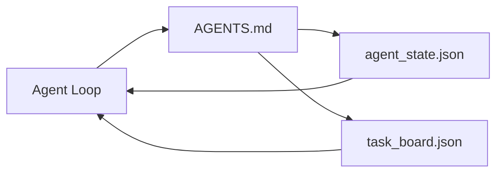

# The Minimal Agent Workbench

> The smallest useful workbench is three files: a root instructions router, a state file, and a task board. Everything else is layered on top. If a repo cannot carry these three, no model will save it.

**Type:** Build
**Languages:** Python (stdlib)
**Prerequisites:** Phase 14 · 31 (Why Capable Models Still Fail)
**Time:** ~45 minutes

## Learning Objectives

- Define the three files that form the minimum viable workbench.
- Explain why a short root router beats a long monolithic `AGENTS.md`.
- Build a state file the agent can read at every turn and write at the end.
- Build a task board that survives multi-session work without chat history.

## The Problem

Most teams reach for a workbench by writing a 3000-line `AGENTS.md` and calling it done. The model loads it, ignores the parts it cannot summarize, and still fails on the same surfaces it always failed on.

You need the opposite. A tiny root file that routes the agent into deeper files only when relevant. Durable state the agent reads before acting and writes after. A task board that says what is in flight, what is blocked, and what is up next.

Three files. Each one with a job. Each one machine-readable enough to evolve into a real system later.

## The Concept



### AGENTS.md is a router, not a manual

A good `AGENTS.md` is short. It points the agent at:

- The state file (where you are).
- The task board (what is left).
- The deeper rules (under `docs/agent-rules.md`).
- The verification command (how to know it works).

Anything longer goes in deeper docs, loaded only when needed. Long manuals get ignored. Short routers get followed.

### agent_state.json is the system of record

State carries: the active task id, the touched files, the assumptions made, the blockers, and the next action. The agent reads it at every turn. The next session reads it instead of replaying chat.

State lives in a file because chat history is unreliable. Sessions die. Conversations get trimmed. The file does not.

### task_board.json is the queue

The task board carries every task with status `todo | in_progress | done | blocked`. It is the queue the agent pulls from when state is empty, and the queue you read when you want to know whether the agent is on track.

A task on the board has an id, a goal, an owner (`builder`, `reviewer`, or `human`), and acceptance criteria. The board is small on purpose: when it grows past a screen, you have a planning problem, not a board problem.

### Three files is the floor, not the ceiling

Later lessons add scope contracts, feedback runners, verification gates, reviewer checklists, and handoff packets. The three files here are what they all assume.

## Build It

`code/main.py` writes the minimal workbench into an empty repo and demonstrates a single agent turn that:

1. Reads `agent_state.json`.
2. Pulls the next task from `task_board.json` if state is empty.
3. Touches a single file inside scope.
4. Writes back updated state.

Run it:

```
python3 code/main.py
```

The script creates `workdir/` next to itself, lays down the three files, runs one turn, and prints the diff. Re-run it to see how the second turn picks up where the first left off.

## Use It

Inside production agent products, the same three files show up under different names:

- **Claude Code:** `AGENTS.md` or `CLAUDE.md` for the router, `.claude/state.json`-style stores for state, hooks for the board.
- **Codex / Cursor:** workspace rules for the router, session memory for state, queued tasks in the chat sidebar for the board.
- **Custom Python agent:** the same files you just wrote.

The names change. The shape does not.

## Ship It

`outputs/skill-minimal-workbench.md` generates the three-file workbench for any new repo: an `AGENTS.md` router tuned to the project, an `agent_state.json` with the right keys, and a `task_board.json` seeded with the current backlog.

## Exercises

1. Add a `last_run` timestamp to `agent_state.json`. Refuse to run if the file is older than 24 hours unless an operator confirms.
2. Add a `priority` field to the task board and change the puller to always pick the highest priority `todo`.
3. Migrate `task_board.json` to JSON Lines so each task is a line and diffs are clean in version control.
4. Write a `lint_workbench.py` that fails if `AGENTS.md` is over 80 lines or references a file that does not exist.
5. Decide which one of the three files would hurt the most to lose. Defend it.

## Key Terms

| Term | What people say | What it actually means |
|------|----------------|------------------------|
| Router | `AGENTS.md` | Short root file that points the agent at deeper docs and files |
| State file | "The notes" | Machine-readable record of where the agent is, written every turn |
| Task board | "The backlog" | JSON queue of work with status, owner, acceptance |
| System of record | "Source of truth" | The file the workbench treats as authoritative when chat is gone |

## Further Reading

- [WalkingLabs, Learn Harness Engineering — repository as system of record](https://walkinglabs.github.io/learn-harness-engineering/en/)
- [Anthropic, Claude Code subagents and session store](https://docs.anthropic.com/en/docs/agents-and-tools/claude-code/sub-agents)
- Phase 14 · 31 — the failure modes this minimum absorbs
- Phase 14 · 34 — the durable state schema this lesson previews
