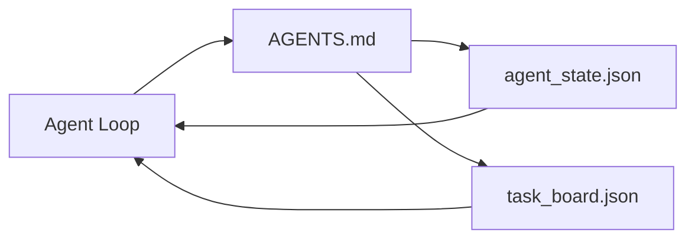

# 最小の Agent Workbench

> 最小限に役立つ workbench は 3 つの file です。root instructions router、state file、task board。その他はすべてその上に重ねます。repo がこの 3 つを持てないなら、どの model も救えません。

**種別:** 構築
**言語:** Python (stdlib)
**前提条件:** Phase 14 · 31 (Why Capable Models Still Fail)
**所要時間:** 約45分

## Learning Objectives

- minimum viable workbench を構成する 3 つの file を定義する。
- 長い monolithic な `AGENTS.md` より、短い root router が優れている理由を説明する。
- agent が各 turn で読めて最後に書ける state file を作る。
- chat history なしで multi-session work を生き残る task board を作る。

## 問題

多くの team は、3000 行の `AGENTS.md` を書いて workbench ができたことにします。model はそれを読み、要約できない部分を無視し、結局いつも失敗していた surface で失敗します。

必要なのは逆です。agent を relevant な deeper file へだけ route する小さな root file。acting 前に読み、after に書く durable state。何が in flight で、何が blocked で、次に何があるかを示す task board。

3 つの file。それぞれに 1 つの役割。後で real system へ育てられる程度に machine-readable にしておきます。

## The Concept



### AGENTS.md は manual ではなく router

よい `AGENTS.md` は短いです。agent に次を指し示します。

- state file (いまどこにいるか)。
- task board (何が残っているか)。
- deeper rules (`docs/agent-rules.md` 配下)。
- verification command (動作をどう確認するか)。

それより長いものは deeper docs に置き、必要なときだけ load します。長い manual は無視されます。短い router は従われます。

### agent_state.json は system of record

state は active task id、touched files、assumptions、blockers、next action を運びます。agent は各 turn でそれを読みます。次の session は chat を replay する代わりにそれを読みます。

chat history は信頼できないため、state は file に置きます。session は死にます。conversation は trim されます。file は残ります。

### task_board.json は queue

task board は status `todo | in_progress | done | blocked` を持つ全 task を運びます。state が空のときに agent が pull する queue であり、agent が順調か知りたいときに人間が読む queue です。

board 上の task は id、goal、owner (`builder`, `reviewer`, or `human`)、acceptance criteria を持ちます。board は意図的に小さくします。1 screen を越えて育つなら、board problem ではなく planning problem です。

### 3 つの file は床であり、天井ではない

後続 lessons では scope contracts、feedback runners、verification gates、reviewer checklists、handoff packets を追加します。ここでの 3 file は、それらすべてが前提とするものです。

## 実装

`code/main.py` は空の repo に minimal workbench を書き込み、single agent turn を実演します。

1. `agent_state.json` を読む。
2. state が空なら `task_board.json` から次の task を pull する。
3. scope 内の 1 file に触れる。
4. 更新済み state を書き戻す。

実行:

```
python3 code/main.py
```

script は自分の横に `workdir/` を作り、3 file を配置し、1 turn を実行して diff を表示します。再実行すると、2 回目の turn が 1 回目の停止地点から再開する様子を確認できます。

## Use It

production agent products の中では、同じ 3 file が別名で現れます。

- **Claude Code:** router は `AGENTS.md` または `CLAUDE.md`、state は `.claude/state.json` 風の store、board は hooks。
- **Codex / Cursor:** router は workspace rules、state は session memory、board は chat sidebar の queued tasks。
- **Custom Python agent:** いま書いたものと同じ file。

名前は変わります。形は変わりません。

## Production patterns in the wild

minimum workbench は、次の 3 pattern を重ねると実 monorepo でも生き残ります。これらは独立しています。repo が本当に必要とするものだけを選びます。

**Nested `AGENTS.md` with nearest-wins precedence.** OpenAI は main repo 全体に 88 個の `AGENTS.md` を出荷し、subcomponent ごとに 1 つ置いています。Codex、Cursor、Claude Code、Copilot はどれも working file から repo root に向かって歩き、途中で見つけたすべての `AGENTS.md` を concatenate します。sub-directory file は root file を拡張します。Codex は extend ではなく replace するための `AGENTS.override.md` を追加しますが、override mechanism は Codex-specific なので cross-tool work では避けます。Augment Code の測定で重要なのは、最良の `AGENTS.md` は Haiku から Opus へ upgrade するのに相当する quality jump を与え、最悪のものは file がない場合より output を悪くする、という点です。

**coverage に見えても拒否すべき anti-patterns。** 矛盾する instructions は agent を interactive mode から greedy mode へ silently drop します (ICLR 2026 AMBIG-SWE: resolve rate 48.8% → 28%)。flat に積むのではなく priority に番号を振ります。enforcement command のない unverifiable style rules ("follow the Google Python Style Guide") は、agent に compliance を発明させます。style rule には必ず正確な lint command を対応させます。command ではなく style から始めると verification path が埋もれます。commands first、style last。人間向けに書くと context budget を浪費します。簡潔さは feature です。

**Cross-tool symlinks.** symlinks (`ln -s AGENTS.md CLAUDE.md`, `ln -s AGENTS.md .github/copilot-instructions.md`, `ln -s AGENTS.md .cursorrules`) を使った single root file は、すべての coding agent を同じ source of truth に揃えます。Nx の `nx ai-setup` は Claude Code、Cursor、Copilot、Gemini、Codex、OpenCode に対して single config からこれを自動化します。

## Ship It

`outputs/skill-minimal-workbench.md` は新しい repo のために 3 file workbench を生成します。project に合わせた `AGENTS.md` router、適切な keys を持つ `agent_state.json`、current backlog で seed された `task_board.json` です。

## Exercises

1. `agent_state.json` に `last_run` timestamp を追加してください。file が 24 時間より古い場合、operator が確認しない限り実行を拒否してください。
2. task board に `priority` field を追加し、puller が常に最高 priority の `todo` を選ぶように変更してください。
3. `task_board.json` を JSON Lines に移行し、各 task が 1 line になり version control の diff が clean になるようにしてください。
4. `AGENTS.md` が 80 lines を超える、または存在しない file を参照している場合に fail する `lint_workbench.py` を書いてください。
5. 3 file のうち、失うと最も痛いものはどれかを決め、その理由を説明してください。

## Key Terms

| Term | よくある言い方 | 実際の意味 |
|------|----------------|------------|
| Router | `AGENTS.md` | agent を deeper docs と files へ指し示す短い root file |
| State file | "The notes" | agent がどこにいるかを示し、各 turn で書かれる machine-readable record |
| Task board | "The backlog" | status、owner、acceptance を持つ work の JSON queue |
| System of record | "Source of truth" | chat が消えたとき workbench が authoritative と扱う file |

## 参考文献

- [agents.md — the open spec](https://agents.md/) — Cursor、Codex、Claude Code、Copilot、Gemini、OpenCode が採用
- [Augment Code, A good AGENTS.md is a model upgrade. A bad one is worse than no docs at all](https://www.augmentcode.com/blog/how-to-write-good-agents-dot-md-files) — measured quality jumps
- [Blake Crosley, AGENTS.md Patterns: What Actually Changes Agent Behavior](https://blakecrosley.com/blog/agents-md-patterns) — empirical に効くもの、効かないもの
- [Datadog Frontend, Steering AI Agents in Monorepos with AGENTS.md](https://dev.to/datadog-frontend-dev/steering-ai-agents-in-monorepos-with-agentsmd-13g0) — nested precedence の実例
- [Nx Blog, Teach Your AI Agent How to Work in a Monorepo](https://nx.dev/blog/nx-ai-agent-skills) — 6 tools にまたがる single-source generation
- [The Prompt Shelf, AGENTS.md Best Practices: Structure, Scope, and Real Examples](https://thepromptshelf.dev/blog/agents-md-best-practices/) — review に耐える section ordering
- [Anthropic, Claude Code subagents and session store](https://docs.anthropic.com/en/docs/agents-and-tools/claude-code/sub-agents)
- Phase 14 · 31 — この minimum が吸収する failure modes
- Phase 14 · 34 — この lesson が preview する durable state schema
