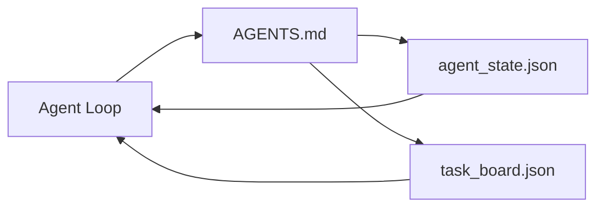

# O Agent Workbench Mínimo

> O workbench menor e útil tem três arquivos: um roteador raiz de instruções, um arquivo de estado e um quadro de tarefas. Todo o resto é construído em cima. Se um repo não consegue carregar esses três, nenhum modelo vai salvar.

**Tipo:** Construa
**Linguagens:** Python (stdlib)
**Pré-requisitos:** Fase 14 · 31 (Por Que Modelos Capazes Ainda Falham)
**Tempo:** ~45 minutos

## Objetivos de Aprendizado

- Definir os três arquivos que formam o workbench mínimo viável.
- Explicar por que um roteador raiz curto vence um `AGENTS.md` monolítico longo.
- Construir um arquivo de estado que o agent pode ler a cada turno e escrever no final.
- Construir um quadro de tarefas que sobrevive a trabalho multi-sessão sem histórico de chat.

## O Problema

A maioria dos times chega a um workbench escrevendo um `AGENTS.md` de 3000 linhas e chamando de pronto. O modelo carrega ele, ignora as partes que não consegue resumir, e ainda falha nas mesmas superfícies de sempre.

Você precisa do oposto. Um arquivo raiz pequeno que roteia o agent pra arquivos mais profundos só quando relevante. Estado durável que o agent lê antes de agir e escreve depois. Um quadro de tarefas que diz o que tá em andamento, o que tá bloqueado, e o que vem a seguir.

Três arquivos. Cada um com um trabalho. Cada um legível por máquina o suficiente pra evoluir pra um sistema real depois.

## O Conceito



### AGENTS.md é um roteador, não um manual

Um bom `AGENTS.md` é curto. Ele aponta o agent pra:

- O arquivo de estado (onde você tá).
- O quadro de tarefas (o que falta).
- As regras mais profundas (em `docs/agent-rules.md`).
- O comando de verificação (como saber que funciona).

Qualquer coisa maior vai em docs mais profundos, carregados só quando necessário. Manuais longos são ignorados. Roteadores curtos são seguidos.

### agent_state.json é o sistema de registro

Estado carrega: o id da tarefa ativa, os arquivos tocados, as premissas feitas, os bloqueios e a próxima ação. O agent lê a cada turno. A próxima sessão lê ao invés de refazer o chat.

Estado fica num arquivo porque o histórico de chat é instável. Sessões morrem. Conversas são cortadas. O arquivo não.

### task_board.json é a queue

O quadro de tarefas carrega cada tarefa com status `todo | in_progress | done | blocked`. É a queue de onde o agent puxa quando o estado tá vazio, e a queue que você lê quando quer saber se o agent tá no caminho certo.

Uma tarefa no quadro tem um id, um objetivo, um owner (`builder`, `reviewer` ou `human`), e critérios de aceitação. O quadro é pequeno de propósito: quando cresce pra além de uma tela, você tem um problema de planejamento, não de quadro.

### Três arquivos é o piso, não o teto

Lições posteriores adicionam contratos de escopo, runners de feedback, gates de verificação, checklists de revisão e pacotes de handoff. Os três arquivos aqui são o que todos pressupõem.

## Construa

`code/main.py` escreve o workbench mínimo num repo vazio e demonstra um turno de agent que:

1. Lê `agent_state.json`.
2. Puxa a próxima tarefa de `task_board.json` se o estado tá vazio.
3. Toca um único arquivo dentro do escopo.
4. Escreve o estado atualizado de volta.

Execute:

```
python3 code/main.py
```

O script cria `workdir/` ao lado dele, coloca os três arquivos, roda um turno, e imprime o diff. Execute de novo pra ver como o segundo turno retoma de onde o primeiro parou.

## Use

Dentro de produtos de agent em produção, os mesmos três arquivos aparecem sob nomes diferentes:

- **Claude Code:** `AGENTS.md` ou `CLAUDE.md` pro roteador, stores estilo `.claude/state.json` pro estado, hooks pro quadro.
- **Codex / Cursor:** regras de workspace pro roteador, memória de sessão pro estado, tarefas enfileiradas na barra lateral do chat pro quadro.
- **Agent Python customizado:** os mesmos arquivos que você acabou de escrever.

Os nomes mudam. A forma não.

## Padrões de produção no mundo real

O workbench mínimo sobrevive ao contato com monorepos reais quando três padrões são adicionados por cima. Eles são independentes; escolha os que o seu repo realmente precisa.

**`AGENTS.md` aninhado com precedência nearest-wins.** A OpenAI distribui 88 arquivos `AGENTS.md` no seu repo principal, um por subcomponente. Codex, Cursor, Claude Code e Copilot todos caminham do arquivo de trabalho até a raiz do repo e concatenam todo `AGENTS.md` que encontram no caminho. Arquivos de subdiretório estendem o arquivo raiz. Codex adiciona `AGENTS.override.md` pra substituir ao invés de estender; o mecanismo de override é específico do Codex e deve ser evitado pra trabalho cross-tool. A medição do Augment Code é a linha que importa: os melhores arquivos `AGENTS.md` dão um salto de qualidade equivalente a fazer upgrade de Haiku pra Opus; os piores deixam a saída pior que sem nenhum arquivo.

**Anti-padrões pra recusar, mesmo quando parecem cobertura.** Instruções conflitantes silenciosamente derrubam o agent do modo inter pro modo ganancioso (ICLR 2026 AMBIG-SWE: 48.8% → 28% taxa de resolução); numerar prioridades ao invés de empilhar na horizontal. Regras de estilo não verificáveis ("siga o Google Python Style Guide") sem comando de validação deixam o agent inventar aderência; pare cada regra de estilo com o comando de lint exato. Começar com estilo ao invés de comandos esconde o caminho de verificação; comandos primeiro, estilo último. Escrever pra humanos ao invés de agents desperdiça orçamento de contexto; concisão é uma feature.

**Symlinks cross-tool.** Um único arquivo raiz com symlinks (`ln -s AGENTS.md CLAUDE.md`, `ln -s AGENTS.md .github/copilot-instructions.md`, `ln -s AGENTS.md .cursorrules`) mantém todo agent de codificação na mesma fonte de verdade. O `nx ai-setup` do Nx automatiza isso em Claude Code, Cursor, Copilot, Gemini, Codex e OpenCode a partir de uma única configuração.

## Entregue

`outputs/skill-minimal-workbench.md` gera o workbench de três arquivos pra qualquer repo novo: um roteador `AGENTS.md` ajustado pro projeto, um `agent_state.json` com as chaves certas, e um `task_board.json` semeado com o backlog atual.

## Exercícios

1. Adicione um timestamp `last_run` em `agent_state.json`. Recuse rodar se o arquivo tiver mais de 24 horas a menos que um operador confirme.
2. Adicione um campo `priority` no quadro de tarefas e mude o puxador pra sempre escolher o `todo` de maior prioridade.
3. Migre `task_board.json` pra JSON Lines pra que cada tarefa seja uma linha e diffs sejam limpos no versionamento.
4. Escreva um `lint_workbench.py` que falhe se `AGENTS.md` tiver mais de 80 linhas ou referenciar um arquivo que não existe.
5. Decida qual dos três arquivos mais doeria perder. Defenda.

## Termos-Chave

| Termo | O que a galera fala | O que realmente significa |
|-------|---------------------|--------------------------|
| Roteador | `AGENTS.md` | Arquivo raiz curto que aponta o agent pra docs e arquivos mais profundos |
| Arquivo de estado | "As anotações" | Registro legível por máquina de onde o agent tá, escrito a cada turno |
| Quadro de tarefas | "O backlog" | Queue JSON de trabalho com status, owner e aceitação |
| Sistema de registro | "Fonte de verdade" | O arquivo que o workbench trata como autoritativo quando o chat acabou |

## Leitura Complementar

- [agents.md — the open spec](https://agents.md/) — adotado por Cursor, Codex, Claude Code, Copilot, Gemini, OpenCode
- [Augment Code, A good AGENTS.md is a model upgrade. A bad one is worse than no docs at all](https://www.augmentcode.com/blog/how-to-write-good-agents-dot-md-files) — saltos de qualidade medidos
- [Blake Crosley, AGENTS.md Patterns: What Actually Changes Agent Behavior](https://blakecrosley.com/blog/agents-md-patterns) — o que funciona empiricamente, o que não funciona
- [Datadog Frontend, Steering AI Agents in Monorepos with AGENTS.md](https://dev.to/datadog-frontend-dev/steering-ai-agents-in-monorepos-with-agentsmd-13g0) — precedência aninhada na prática
- [Nx Blog, Teach Your AI Agent How to Work in a Monorepo](https://nx.dev/blog/nx-ai-agent-skills) — geração de fonte única entre seis ferramentas
- [The Prompt Shelf, AGENTS.md Best Practices: Structure, Scope, and Real Examples](https://thepromptshelf.dev/blog/agents-md-best-practices/) — ordenação de seções que sobrevive revisão
- [Anthropic, Claude Code subagents and session store](https://docs.anthropic.com/en/docs/agents-and-tools/claude-code/sub-agents)
- Fase 14 · 31 — os modos de falha que esse mínimo absorve
- Fase 14 · 34 — o esquema de estado durável que essa aula pré-visualiza
