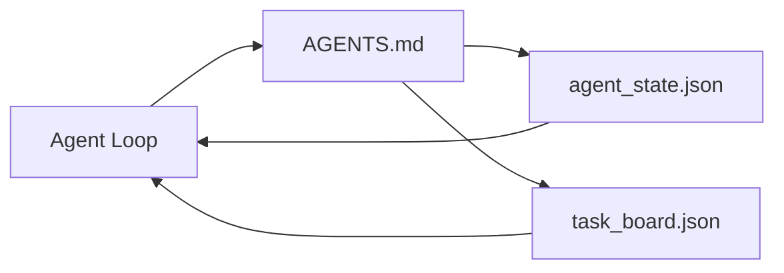

# Minimal Agent Çalışma Tezgahı

> Kullanışlı en küçük çalışma tezgahı üç dosyadır: bir kök talimat yönlendiricisi, bir durum dosyası ve bir görev panosu. Geri kalan her şey üstte katmanlı. Bir repo bu üçünü taşıyamazsa onu hiçbir model kurtaramaz.

**Tür:** Yapım
**Diller:** Python (stdlib)
**Önkoşullar:** Aşama 14 · 31 (Yetenekli Modeller Neden Hala Başarısız)
**Süre:** ~45 dakika

## Öğrenme Hedefleri

- Uygulanabilir minimum çalışma tezgahını oluşturan üç dosyayı tanımlayın.
- Kısa kök yönlendiricinin neden uzun monolitik `AGENTS.md`'yi yendiğini açıklayın.
- agent'nin her fırsatta okuyabileceği ve sonunda yazabileceği bir durum dosyası oluşturun.
- Sohbet geçmişi olmadan çok oturumlu çalışmalardan kurtulabilecek bir görev panosu oluşturun.

## Sorun

Çoğu ekip, 3000 satırlık bir `AGENTS.md` yazıp "tamam" diyerek bir çalışma tezgahına ulaşır. Model onu yükler, özetleyemediği parçaları göz ardı eder ve her zaman başarısız olduğu yüzeylerde yine başarısız olur.

Tam tersine ihtiyacınız var. agent'yi yalnızca ilgili olduğunda daha derin dosyalara yönlendiren küçük bir kök dosyası. agent'nin harekete geçmeden önce okuduğu ve sonrasında yazdığı dayanıklı durum. Neyin uçuşta olduğunu, nelerin engellendiğini ve sırada ne olduğunu söyleyen bir görev panosu.

Üç dosya. Her birinin bir işi var. Her biri daha sonra gerçek bir sisteme dönüşebilecek kadar makine tarafından okunabilir.

## Konsept



### AGENTS.md bir yönlendiricidir, kılavuz değil

İyi bir `AGENTS.md` kısadır. agent'yi şu noktaya işaret eder:

- Durum dosyası (bulunduğunuz yer).
- Görev panosu (geriye kalanlar).
- Daha derin kurallar (`docs/agent-rules.md` altında).
- Doğrulama komutu (çalıştığını nasıl anlayabilirsiniz).

Daha uzun olan her şey yalnızca ihtiyaç duyulduğunda yüklenen daha derin belgelere gider. Uzun kılavuzlar göz ardı ediliyor. Kısa yönlendiriciler takip edilir.

### agent_state.json kayıt sistemidir

Durum şunları taşır: etkin görev kimliği, dokunulan dosyalar, yapılan varsayımlar, engelleyiciler ve sonraki eylem. agent her fırsatta bunu okur. Bir sonraki oturum sohbeti tekrar oynatmak yerine onu okur.

Sohbet geçmişi güvenilmez olduğundan durum bir dosyada kalır. Oturumlar ölür. Konuşmalar kesiliyor. Dosya yok.

### task_board.json kuyruktur

Görev panosu her görevi `todo | in_progress | done | blocked` durumuyla taşır. Durum boş olduğunda agent'nin çektiği kuyruktur ve agent'nin yolunda olup olmadığını bilmek istediğinizde okuduğunuz kuyruktur.

Panodaki bir görevin kimliği, hedefi, sahibi (`builder`, `reviewer` veya `human`) ve kabul kriterleri vardır. Tahta bilerek küçüktür: Bir perdeyi aştığında, tahta sorunu değil, planlama sorununuz olur.

### Üç dosya tavan değil zemindir

Daha sonraki derslerde kapsam sözleşmeleri, geri bildirim çalıştırıcıları, doğrulama kapıları, gözden geçiren kontrol listeleri ve devir paketleri eklenir. Buradaki üç dosya hepsinin varsaydığı şeylerdir.

## İnşa Et

`code/main.py` minimal çalışma tezgahını boş bir depoya yazar ve tek bir agent dönüşünü gösterir:

1. `agent_state.json`'yi okur.
2. Durum boşsa sonraki görevi `task_board.json`'den çeker.
3. Kapsam içindeki tek bir dosyaya dokunur.
4. Güncellenmiş durumu geri yazar.

Çalıştır:

```
python3 code/main.py
```

Betik kendi yanında `workdir/`'yi oluşturur, üç dosyayı yerleştirir, bir tur çalıştırır ve farkı yazdırır. İkinci dönüşün ilkinin kaldığı yerden nasıl devam ettiğini görmek için tekrar çalıştırın.

## Kullan onu

Üretim agent ürünlerinin içinde aynı üç dosya farklı adlar altında görünüyor:

- **Claude Kodu:** Yönlendirici için `AGENTS.md` veya `CLAUDE.md`, durum için `.claude/state.json` tarzı depolar, kart için kancalar.
- **Kodeksi / İmleç:** Yönlendirici için çalışma alanı kuralları, durum için oturum belleği, pano için sohbet kenar çubuğunda sıralanmış görevler.
- **Özel Python agent:** az önce yazdığınız dosyaların aynısı.

İsimler değişir. Şekil öyle değil.

## Vahşi doğada üretim modelleri

Asgari çalışma tezgahı, üzerine üç desen yerleştirildiğinde gerçek monorepolarla temastan kurtulur. Bağımsızdırlar; deponuzun gerçekten ihtiyaç duyduğu şeyleri seçin.

**En yakın galibiyet önceliğine sahip iç içe geçmiş `AGENTS.md`.** OpenAI, ana deposunda alt bileşen başına bir tane olmak üzere 88 `AGENTS.md` dosyası gönderir. Codex, Cursor, Claude Code ve Copilot'un tümü çalışma dosyasından repo köküne doğru yürür ve yolda buldukları her `AGENTS.md`'yi birleştirir. Alt dizin dosyaları kök dosyayı genişletir. Codex, genişletmek yerine değiştirmek için `AGENTS.override.md`'yi ekler; geçersiz kılma mekanizması Codex'e özgüdür ve çapraz takım çalışması için bundan kaçınır. Augment Code'un ölçümü önemli olan çizgidir: en iyi `AGENTS.md` dosyaları, Haiku'dan Opus'a yükseltmeye eşdeğer bir kalite artışı sağlar; en kötüleri çıktıyı hiç dosya olmamasından daha kötü hale getirir.

**Kapsam gibi görünseler bile reddedilecek anti-örüntüler.** Çakışan talimatlar agent'yi sessizce etkileşimli moddan açgözlü moda düşürür (ICLR 2026 AMBIG-SWE: %48,8 → %28 çözümleme oranı); öncelikleri düz bir şekilde istiflemek yerine numaralandırın. Hiçbir zorlama komutu olmayan doğrulanamayan stil kuralları ("Google Python Stil Kılavuzunu izleyin") agent'nin uyumluluğu icat etmesine izin verir; her stil kuralını tam lint komutuyla eşleştirin. Komutlar yerine stille liderlik etmek doğrulama yolunu gizler; önce komutlar, son olarak stil. agent'ler yerine insanlar için yazmak bağlam bütçesini boşa harcar; kısalık bir özelliktir.

**Çapraz araç sembolik bağlantıları.** Sembolik bağlantılara sahip tek bir kök dosya (`ln -s AGENTS.md CLAUDE.md`, `ln -s AGENTS.md .github/copilot-instructions.md`, `ln -s AGENTS.md .cursorrules`), her agent kodlamasını aynı doğruluk kaynağında tutar. Nx'in `nx ai-setup`'si bunu tek bir yapılandırmadan Claude Code, Cursor, Copilot, Gemini, Codex ve OpenCode genelinde otomatikleştirir.

## Gönderin

`outputs/skill-minimal-workbench.md`, herhangi bir yeni repo için üç dosyalı çalışma tezgahı oluşturur: projeye göre ayarlanmış bir `AGENTS.md` yönlendirici, doğru tuşlara sahip bir `agent_state.json` ve mevcut birikime sahip bir `task_board.json`.

## Egzersizler

1. `agent_state.json`'ye bir `last_run` zaman damgası ekleyin. Dosya 24 saatten eskiyse operatör onaylamadığı sürece çalıştırmayı reddedin.
2. Görev panosuna bir `priority` alanı ekleyin ve çekiciyi her zaman en yüksek önceliği `todo` seçecek şekilde değiştirin.
3. Her görevin bir satır olması ve sürüm kontrolünde farkların temiz olması için `task_board.json`'yi JSON Satırlarına geçirin.
4. `AGENTS.md` 80 satırın üzerindeyse veya var olmayan bir dosyaya başvuruyorsa başarısız olan bir `lint_workbench.py` yazın.
5. Üç dosyadan hangisinin kaybedilmesinin en çok acı vereceğine karar verin. Onu savun.

## Anahtar Terimler

| Dönem | İnsanlar ne diyor | Aslında ne anlama geliyor |
|------|----------------|------------------------|
| Yönlendirici | `AGENTS.md` | agent'yi daha derin belge ve dosyalara yönlendiren kısa kök dosya |
| Durum dosyası | "Notlar" | agent'nin nerede olduğuna dair makine tarafından okunabilir kayıt, her fırsatta yazılır |
| Görev panosu | "Birikmiş işler" | Durum, sahip, kabul ile JSON iş kuyruğu |
| Kayıt sistemi | "Gerçeğin kaynağı" | Sohbet gittiğinde çalışma tezgahının yetkili olarak kabul ettiği dosya |

## Daha Fazla Okuma

- [agents.md — açık spesifikasyon](https://agents.md/) — Cursor, Codex, Claude Code, Copilot, Gemini, OpenCode tarafından benimsenmiştir
- [Augment Code, İyi bir AGENTS.md bir model yükseltmesidir. Kötü bir belge hiç belge olmamasından daha kötüdür](https://www.augmentcode.com/blog/how-to-write-good-agents-dot-md-files) — ölçülen kalite sıçramaları
- [Blake Crosley, AGENTS.md Kalıpları: Agent Davranışını Gerçekte Ne Değiştirir](https://blakecrosley.com/blog/agents-md-patterns) — ampirik olarak ne işe yarar, ne işe yaramaz
- [Datadog Ön Uç, AGENTS.md ile Monorepos'ta AI Agent'leri Yönlendirme](https://dev.to/datadog-frontend-dev/steering-ai-agents-in-monorepos-with-agentsmd-13g0) — uygulamada iç içe öncelik
- [Nx Blogu, Yapay Zekanıza Agent Monorepo'da Nasıl Çalışılacağını Öğretin](https://nx.dev/blog/nx-ai-agent-skills) — altı araçta tek kaynak oluşturma
- [Prompt Rafı, AGENTS.md En İyi Uygulamalar: Yapı, Kapsam ve Gerçek Örnekler](https://thepromptshelf.dev/blog/agents-md-best-practices/) — incelemeden sağ çıkan bölüm sıralaması
- [Antropik, Claude Kodu subagents](https://code.claude.com/docs/en/sub-agents)
- Aşama 14 · 31 — bu minimumun absorbe ettiği arıza modları
- Aşama 14 · 34 — bu dersin ön izlemesini yaptığı kalıcı durum şeması
