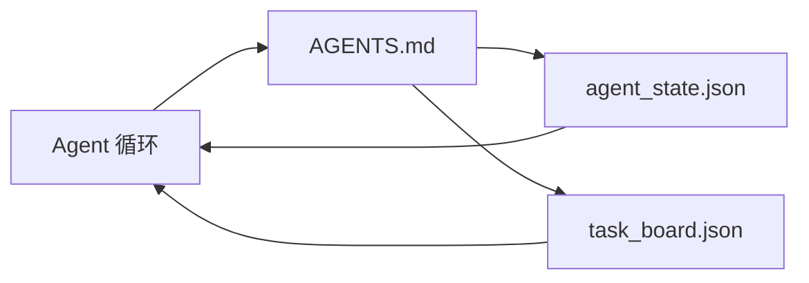

# 最小化 Agent 工作台

> 最小的有用工作台是三个文件：根指令路由器、状态文件和任务面板。其他一切都是在此基础上叠加的。如果一个仓库无法承载这三个文件，任何模型都救不了它。

**类型：** 构建
**语言：** Python（标准库）
**先决条件：** 阶段 14 · 31（为何能力强大的模型仍然失败）
**时间：** ~45 分钟

## 学习目标

- 定义构成最小可行工作台的三个文件。
- 解释为何简短的根路由器胜过冗长的单体 `AGENTS.md`。
- 构建一个 Agent 每轮都能读取并在结束时写入的状态文件。
- 构建一个无需聊天历史即可在多会话工作中存活的任务面板。

## 问题

大多数团队通过编写一个 3000 行的 `AGENTS.md` 并称之为完成来着手构建工作台。模型加载它，忽略无法总结的部分，并且仍然在它一直失败的相同层面上失败。

你需要相反的做法。一个微小的根文件，仅在相关时将 Agent 路由到更深的文件。Agent 在操作前读取、操作后写入的持久状态。一个说明正在进行什么、被什么阻塞、接下来是什么的任务面板。

三个文件。每个都有一份工作。每个都足够机器可读，以便后续演化为真实系统。

## 概念



### AGENTS.md 是路由器，而非手册

一个好的 `AGENTS.md` 是简短的。它引导 Agent 前往：

- 状态文件（你在哪里）。
- 任务面板（剩下什么）。
- 更深的规则（在 `docs/agent-rules.md` 下）。
- 验证命令（如何知道它有效）。

任何更长的内容都放在更深的文档中，仅在需要时加载。冗长的手册会被忽略。简短的路由器会被遵循。

### agent_state.json 是记录系统

状态承载：活跃任务 ID、接触的文件、做出的假设、阻塞项和下一步操作。Agent 每轮读取它。下一轮会话读取它，而非重放聊天。

状态存在于文件中，因为聊天历史不可靠。会话会死。对话会被截断。文件不会。

### task_board.json 是队列

任务面板承载每个任务及其状态：`todo | in_progress | done | blocked`。它是状态为空时 Agent 拉取任务的队列，也是你想知道 Agent 是否按计划进行时读取的队列。

面板上的任务有 ID、目标、所有者（`builder`、`reviewer` 或 `human`）和验收标准。面板故意做得小：当它增长超过一个屏幕时，你有的是规划问题，而非面板问题。

### 三个文件是下限，而非上限

后续课程会添加范围契约、反馈运行器、验证门、审查检查清单和交接数据包。此处的三个文件是它们都假设存在的。

## 构建

`code/main.py` 将最小工作台写入空仓库，并演示单个 Agent 轮次，该轮次：

1. 读取 `agent_state.json`。
2. 如果状态为空，从 `task_board.json` 拉取下一个任务。
3. 在范围内触及单个文件。
4. 写回更新的状态。

运行：

```
python3 code/main.py
```

脚本在自身旁边创建 `workdir/`，布置三个文件，运行一轮，并打印差异。重新运行它以查看第二轮如何接续第一轮停止的地方。

## 使用

在生产 Agent 产品中，相同的三个文件以不同名称出现：

- **Claude Code：** `AGENTS.md` 或 `CLAUDE.md` 用于路由器，`.claude/state.json` 风格存储用于状态，hook 用于面板。
- **Codex / Cursor：** 工作区规则用于路由器，会话记忆用于状态，聊天侧栏中的排队任务用于面板。
- **自定义 Python Agent：** 你刚写的相同文件。

名称会变。形状不会。

## 生产中的模式

当在这三个文件之上叠加三种模式时，最小工作台能在接触真实 monorepo 时存活。它们是独立的；选择你的仓库实际需要的那些。

**嵌套 `AGENTS.md`，最近者优先。** OpenAI 在其主仓库中发布了 88 个 `AGENTS.md` 文件，每个子组件一个。Codex、Cursor、Claude Code 和 Copilot 都从工作文件向仓库根目录遍历，并连接它们在路上找到的每个 `AGENTS.md`。子目录文件扩展根文件。Codex 添加 `AGENTS.override.md` 以替换而非扩展；覆盖机制是 Codex 特有的，跨工具工作时应避免。Augment Code 的测量是至关重要的台词：最好的 `AGENTS.md` 文件带来的质量跳跃相当于从 Haiku 升级到 Opus；最差的文件使输出比完全没有文件更糟。

**拒绝反模式，即使它们看起来像覆盖。** 冲突的指令悄然将 Agent 从交互模式降至贪婪模式（ICLR 2026 AMBIG-SWE：48.8% → 28% 解决率）；对优先级编号，而非平铺堆叠。无法验证的风格规则（"遵循 Google Python 风格指南"）没有强制命令，让 Agent 发明合规性；将每个风格规则与确切的 lint 命令配对。以风格而非命令开头会埋没验证路径；命令优先，风格最后。为人类而非 Agent 编写会浪费上下文预算；简洁是一项特性。

**跨工具符号链接。** 带有符号链接的单个根文件（`ln -s AGENTS.md CLAUDE.md`、`ln -s AGENTS.md .github/copilot-instructions.md`、`ln -s AGENTS.md .cursorrules`）使每个编码 Agent 保持在同一真相来源上。Nx 的 `nx ai-setup` 从单个配置自动执行跨 Claude Code、Cursor、Copilot、Gemini、Codex 和 OpenCode 的设置。

## 部署

`outputs/skill-minimal-workbench.md` 为任何新仓库生成三文件工作台：调优到项目的 `AGENTS.md` 路由器、具有正确键的 `agent_state.json` 和用当前积压工作种子化的 `task_board.json`。

## 练习

1. 向 `agent_state.json` 添加 `last_run` 时间戳。如果文件早于 24 小时，拒绝运行，除非操作员确认。
2. 向任务面板添加 `priority` 字段，并更改拉取器以始终选取最高优先级的 `todo`。
3. 将 `task_board.json` 迁移到 JSON Lines，使每个任务为一行，差异在版本控制中干净。
4. 编写 `lint_workbench.py`，如果 `AGENTS.md` 超过 80 行或引用不存在的文件则失败。
5. 决定三个文件中丢失哪一个伤害最大。为其辩护。

## 关键术语

| 术语 | 人们的说法 | 实际含义 |
|------|----------|----------|
| Router（路由器） | `AGENTS.md` | 引导 Agent 前往更深文档和文件的简短根文件 |
| State file（状态文件） | "笔记" | Agent 所在位置的机器可读记录，每轮写入 |
| Task board（任务面板） | "积压工作" | 带状态、所有者、验收的工作的 JSON 队列 |
| System of record（记录系统） | "真相来源" | 聊天消失时工作台视为权威的文件 |

## 延伸阅读

- [agents.md — 开放规范](https://agents.md/) — 被 Cursor、Codex、Claude Code、Copilot、Gemini、OpenCode 采用
- [Augment Code, 好的 AGENTS.md 是模型升级。坏的比完全没有文档更糟](https://www.augmentcode.com/blog/how-to-write-good-agents-dot-md-files) — 测量的质量跳跃
- [Blake Crosley, AGENTS.md 模式：什么实际改变 Agent 行为](https://blakecrosley.com/blog/agents-md-patterns) — 经验上有效的、无效的
- [Datadog Frontend, 用 AGENTS.md 在 Monorepo 中引导 AI Agent](https://dev.to/datadog-frontend-dev/steering-ai-agents-in-monorepos-with-agentsmd-13g0) — 实践中的嵌套优先级
- [Nx Blog, 教你的 AI Agent 如何在 Monorepo 中工作](https://nx.dev/blog/nx-ai-agent-skills) — 跨六个工具的单一来源生成
- [The Prompt Shelf, AGENTS.md 最佳实践：结构、范围和真实示例](https://thepromptshelf.dev/blog/agents-md-best-practices/) — 经受审查的章节排序
- [Anthropic, Claude Code 子 Agent 和会话存储](https://docs.anthropic.com/en/docs/agents-and-tools/claude-code/sub-agents)
- 阶段 14 · 31 — 此最小值吸收的失败模式
- 阶段 14 · 34 — 本课预览的持久化状态模式
