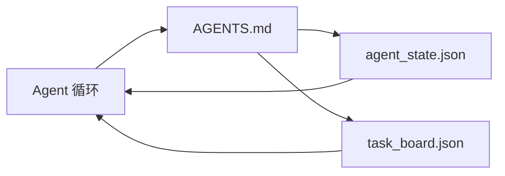

# 最小 agent 工作台（The Minimal Agent Workbench）

> 译注：本文译自同目录 [`en.md`](./en.md)。术语遵循仓根 [TRANSLATION_GUIDE.md](../../../../TRANSLATION_GUIDE.md)。

> 最小可用的 workbench（工作台）是三个文件：一个根目录指令路由器、一个状态文件、一个任务板。其它一切都是在这之上叠加。如果一个 repo 连这三样都撑不起来，没有哪个模型能救它。

**Type:** Build
**Languages:** Python (stdlib)
**Prerequisites:** Phase 14 · 31 (Why Capable Models Still Fail)
**Time:** ~45 minutes

## 学习目标（Learning Objectives）

- 定义构成最小可行 workbench 的三个文件。
- 解释为什么一份简短的根级路由器胜过一份冗长的整块 `AGENTS.md`。
- 构建一个 agent 每一轮都能读、每一轮结束都能写的状态文件。
- 构建一个无需聊天记录就能跨 session 存活的任务板。

## 问题（The Problem）

大多数团队搭 workbench 的方式是写一份 3000 行的 `AGENTS.md`，然后宣布大功告成。模型把它加载进来，把自己总结不出的部分忽略掉，然后继续在那些它一直翻车的地方翻车。

你需要的是反过来。一个微小的根文件，只有在相关时才把 agent 路由到更深的文件里。一份持久的状态，agent 行动前读、行动后写。一个任务板，告诉你哪些任务在飞、哪些被卡住、下一步该做什么。

三个文件。每个都有职责。每个都足够机器可读，未来可以演化成一套真正的系统。

## 概念（The Concept）



### AGENTS.md 是路由器，不是手册

一份好的 `AGENTS.md` 是简短的。它把 agent 指向：

- 状态文件（你现在在哪儿）。
- 任务板（还剩什么没做）。
- 更深的规则（位于 `docs/agent-rules.md` 之下）。
- 验证命令（怎么知道它跑通了）。

更长的内容放进更深的文档，按需加载。冗长的手册会被忽略；简短的路由器会被遵循。

### agent_state.json 是 system of record（权威记录）

状态承载：当前活跃的 task id、被改动的文件、所做的假设、当前的 blocker、下一步动作。agent 每一轮都读它。下一个 session 读它，而不是回放聊天。

状态存进文件，是因为聊天记录不可靠。Session 会挂掉。对话会被裁剪。文件不会。

### task_board.json 是队列

任务板承载所有任务，状态是 `todo | in_progress | done | blocked`。状态为空时，agent 从它里面拉任务；当你想知道 agent 跑得对不对，你也读它。

板上的一条任务有 id、目标、owner（`builder`、`reviewer` 或 `human`）、验收标准。任务板故意保持小：当它涨到一屏放不下，你的问题是规划问题，不是看板问题。

### 三个文件是地板，不是天花板

后续课程会加上 scope contract（作用域契约）、feedback runner（反馈跑批器）、verification gate（验证门禁）、reviewer（验证器）清单、handoff packet（交接包）。这里的三个文件是它们共同的前提。

## 动手实现（Build It）

`code/main.py` 把最小 workbench 写进一个空 repo，并演示一轮 agent 动作：

1. 读 `agent_state.json`。
2. 如果状态为空，从 `task_board.json` 拉下一条任务。
3. 在 scope（作用域）内动一个文件。
4. 把更新后的状态写回去。

跑起来：

```
python3 code/main.py
```

脚本会在自己旁边创建 `workdir/`，铺好三个文件，跑一轮，并打印 diff。重跑一次，观察第二轮是怎么从第一轮停下的位置接着往下走的。

## 用起来（Use It）

在生产级 agent 产品里，这同样的三个文件以不同的名字出现：

- **Claude Code：** 路由器是 `AGENTS.md` 或 `CLAUDE.md`；状态用 `.claude/state.json` 风格的存储；任务板用 hook 实现。
- **Codex / Cursor：** 路由器是 workspace rules；状态是 session memory；任务板是聊天侧栏里排队的任务。
- **自定义 Python agent：** 就是你刚写的那几个文件。

名字变，形状不变。

## 产线里看得到的模式（Production patterns in the wild）

最小 workbench 在真实 monorepo 里要活下来，需要在它之上叠加三种模式。它们彼此独立；挑你的 repo 真正需要的来用。

**嵌套 `AGENTS.md` + 就近优先（nearest-wins）。** OpenAI 在自家主仓里铺了 88 个 `AGENTS.md` 文件，每个子组件一份。Codex、Cursor、Claude Code、Copilot 都从当前工作文件向 repo 根目录走，把沿途遇到的每一份 `AGENTS.md` 拼接起来。子目录文件在根文件之上扩展。Codex 增加了 `AGENTS.override.md` 用于替换而不是扩展；这个覆盖机制是 Codex 专属的，做跨工具协作时要避开它。Augment Code 的测量值是关键的一句话：最好的 `AGENTS.md` 文件带来的质量跃升相当于把模型从 Haiku 升级到 Opus；最差的那种则比没有文件还糟。

**应当拒绝的反模式，哪怕它们看起来覆盖很全。** 互相冲突的指令会悄悄把 agent 从交互模式打回贪婪模式（ICLR 2026 AMBIG-SWE：解决率 48.8% → 28%）；把优先级编号，而不是把它们平铺。无法验证的风格规则（「遵循 Google Python Style Guide」）如果没有可执行的强制命令，agent 会自己脑补合规；每一条风格规则都要配一条精确的 lint 命令。把风格放在最前面、把命令放在后面，会埋掉验证路径；命令在前，风格在后。给人类写而不是给 agent 写，浪费 context（上下文）预算；简练是一种特性。

**跨工具 symlink。** 单一根文件加上 symlink（`ln -s AGENTS.md CLAUDE.md`、`ln -s AGENTS.md .github/copilot-instructions.md`、`ln -s AGENTS.md .cursorrules`）能让所有编码 agent 共用同一份事实来源。Nx 的 `nx ai-setup` 把这件事自动化，从单一配置同时覆盖 Claude Code、Cursor、Copilot、Gemini、Codex 与 OpenCode。

## 上线部署（Ship It）

`outputs/skill-minimal-workbench.md` 为任意新 repo 生成这三件套 workbench：一份针对项目调过的 `AGENTS.md` 路由器、一份带正确 key 的 `agent_state.json`、一份预置当前 backlog 的 `task_board.json`。

## 练习（Exercises）

1. 给 `agent_state.json` 加一个 `last_run` 时间戳。如果文件超过 24 小时没更新，拒绝运行——除非有 operator 显式确认。
2. 给任务板加一个 `priority` 字段，把拉任务的逻辑改成永远挑优先级最高的 `todo`。
3. 把 `task_board.json` 迁到 JSON Lines，让每条任务一行，diff 在版本控制里干净。
4. 写一个 `lint_workbench.py`：当 `AGENTS.md` 超过 80 行、或引用了不存在的文件时，让它失败。
5. 在三个文件中挑一个：丢掉哪个最痛？给出你的理由。

## 关键术语（Key Terms）

| Term | 大家嘴上怎么说 | 它真正的含义 |
|------|----------------|------------------------|
| Router | `AGENTS.md` | 简短的根文件，把 agent 指向更深的文档和文件 |
| State file | 「笔记」 | 机器可读的记录，记 agent 在哪儿，每一轮都写 |
| Task board | 「backlog」 | 带状态、owner、验收的工作 JSON 队列 |
| System of record | 「事实来源」 | 聊天没了之后，workbench 视为权威的那个文件 |

## 延伸阅读（Further Reading）

- [agents.md — the open spec](https://agents.md/) — 已被 Cursor、Codex、Claude Code、Copilot、Gemini、OpenCode 采用
- [Augment Code, A good AGENTS.md is a model upgrade. A bad one is worse than no docs at all](https://www.augmentcode.com/blog/how-to-write-good-agents-dot-md-files) — 实测的质量跃升
- [Blake Crosley, AGENTS.md Patterns: What Actually Changes Agent Behavior](https://blakecrosley.com/blog/agents-md-patterns) — 经验上什么有效、什么无效
- [Datadog Frontend, Steering AI Agents in Monorepos with AGENTS.md](https://dev.to/datadog-frontend-dev/steering-ai-agents-in-monorepos-with-agentsmd-13g0) — 嵌套优先级在实践里的样子
- [Nx Blog, Teach Your AI Agent How to Work in a Monorepo](https://nx.dev/blog/nx-ai-agent-skills) — 跨六款工具的单源生成
- [The Prompt Shelf, AGENTS.md Best Practices: Structure, Scope, and Real Examples](https://thepromptshelf.dev/blog/agents-md-best-practices/) — 经得起评审的章节排序
- [Anthropic, Claude Code subagents and session store](https://docs.anthropic.com/en/docs/agents-and-tools/claude-code/sub-agents)
- Phase 14 · 31 — 此最小方案吸收的失败模式
- Phase 14 · 34 — 本课预告的持久状态 schema
