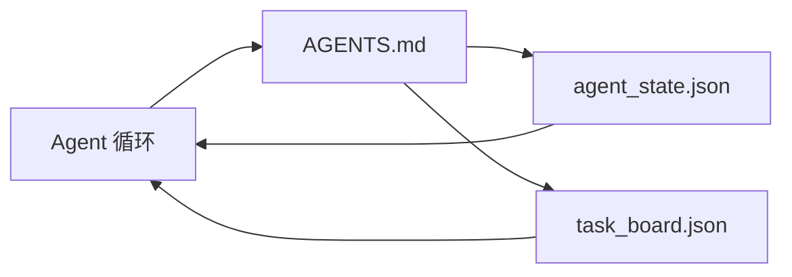

# 最小 Agent 工作台

> 最小可用的工作台是三个文件：根指令路由器、状态文件和任务板。其他所有内容都分层叠加。如果仓库无法承载这三个文件，没有模型能拯救它。

**类型：** 构建
**语言：** Python（标准库）
**前置条件：** 第 14 阶段 · 31（为什么有能力的模型仍然会失败）
**时间：** ~45 分钟

## 学习目标

- 定义构成最小可行工作台的三个文件。
- 解释为什么简短的根路由器胜过冗长的单体 `AGENTS.md`。
- 构建一个 agent 可以在每轮读取、在结束时写入的状态文件。
- 构建一个无需聊天历史即可在多次会话中存续的任务板。

## 问题

大多数团队通过编写 3000 行的 `AGENTS.md` 来搭建工作台，然后认为完成了。模型加载它，忽略无法总结的部分，仍然在它一贯失败的表面上失败。

你需要相反的做法。一个微小的根文件，仅在相关时将 agent 路由到更深的文件。持久状态，agent 在行动前读取、在行动后写入。任务板，说明什么正在进行、什么被阻塞、什么接下来要做。

三个文件。每个都有工作。每个都足够机器可读，以便日后演化为真实系统。

## 概念



### AGENTS.md 是路由器，不是手册

好的 `AGENTS.md` 很短。它指向：

- 状态文件（你在哪里）。
- 任务板（还剩什么）。
- 更深的规则（在 `docs/agent-rules.md` 下）。
- 验证命令（如何知道它有效）。

任何更长的内容放在更深的文档中，仅在需要时加载。长手册被忽略。短路由器被遵循。

### agent_state.json 是记录系统

状态承载：活动任务 id、触碰的文件、做出的假设、阻塞者和下一步动作。Agent 每轮读取它。下一个会话读取它而不是重放聊天。

状态存在于文件中，因为聊天历史不可靠。会话死亡。对话被截断。文件不会。

### task_board.json 是队列

任务板承载每个状态为 `todo | in_progress | done | blocked` 的任务。它是状态为空时 agent 拉取的队列，也是你想知道 agent 是否在正轨上时读取的队列。

板上的任务有 id、目标、所有者（`builder`、`reviewer` 或 `human`）和验收标准。板故意保持小巧：当它超过一屏时，你有的是规划问题，不是板的问题。

### 三个文件是底线，不是天花板

后续课程添加范围合约、反馈运行器、验证门控、审查清单和交接包。这里的三个文件是它们都假设的基础。

## 构建

`code/main.py` 将最小工作台写入空仓库，并演示单个 agent 轮次：

1. 读取 `agent_state.json`。
2. 如果状态为空，从 `task_board.json` 拉取下一个任务。
3. 在范围内触碰单个文件。
4. 写回更新后的状态。

运行：

```
python3 code/main.py
```

脚本在自身旁边创建 `workdir/`，放下三个文件，运行一轮，并打印差异。重新运行以查看第二轮如何从第一轮离开的地方继续。

## 使用

在生产 agent 产品中，相同的三个文件以不同名称出现：

- **Claude Code：** `AGENTS.md` 或 `CLAUDE.md` 作为路由器，`.claude/state.json` 风格的存储作为状态，钩子作为板。
- **Codex / Cursor：** 工作区规则作为路由器，会话记忆作为状态，聊天侧边栏中的排队任务作为板。
- **自定义 Python agent：** 你刚写的相同文件。

名称改变。形状不变。

## 野外生产模式

最小工作台在与真实单体仓库接触时，当三个模式分层叠加时能够存续。它们是独立的；选择你的仓库实际需要的。

**嵌套 `AGENTS.md`，最近优先。** OpenAI 在其主仓库中发布了 88 个 `AGENTS.md` 文件，每个子组件一个。Codex、Cursor、Claude Code 和 Copilot 都从工作文件走向仓库根目录，沿途连接找到的每个 `AGENTS.md`。子目录文件扩展根文件。Codex 添加 `AGENTS.override.md` 来替换而非扩展；覆盖机制是 Codex 特有的，跨工具工作时避免使用。Augment Code 的测量是关键数据：最好的 `AGENTS.md` 文件带来的质量提升相当于从 Haiku 升级到 Opus；最差的使输出比没有文件还糟。

**即使看起来像覆盖也要拒绝的反模式。** 冲突指令静默将 agent 从交互模式降为贪婪模式（ICLR 2026 AMBIG-SWE：48.8% → 28% 解决率）；用数字优先级代替平铺堆叠。无法验证的风格规则（"遵循 Google Python 风格指南"）没有强制执行命令，让 agent 发明合规性；每个风格规则都要配对精确的 lint 命令。以风格而非命令开头会埋没验证路径；命令优先，风格最后。为人类而非 agent 写作浪费上下文预算；简洁是特性。

**跨工具符号链接。** 单个根文件配合符号链接（`ln -s AGENTS.md CLAUDE.md`、`ln -s AGENTS.md .github/copilot-instructions.md`、`ln -s AGENTS.md .cursorrules`）让每个编码 agent 保持在同一事实来源上。Nx 的 `nx ai-setup` 从单个配置在 Claude Code、Cursor、Copilot、Gemini、Codex 和 OpenCode 之间自动化此过程。

## 交付

`outputs/skill-minimal-workbench.md` 为任何新仓库生成三文件工作台：针对项目调优的 `AGENTS.md` 路由器、带正确键的 `agent_state.json`，以及用当前待办事项播种的 `task_board.json`。

## 练习

1. 向 `agent_state.json` 添加 `last_run` 时间戳。如果文件超过 24 小时旧，除非操作员确认，否则拒绝运行。
2. 向任务板添加 `priority` 字段，并更改拉取器以始终选择最高优先级的 `todo`。
3. 将 `task_board.json` 迁移到 JSON Lines，使每个任务是一行，差异在版本控制中保持干净。
4. 编写 `lint_workbench.py`，如果 `AGENTS.md` 超过 80 行或引用不存在的文件，则失败。
5. 决定三个文件中丢失哪个伤害最大。为它辩护。

## 关键术语

| 术语 | 人们怎么说 | 实际含义 |
|------|-----------|---------|
| Router | `AGENTS.md` | 简短的根文件，将 agent 指向更深的文档和文件 |
| State file | "笔记" | 机器可读的 agent 位置记录，每轮写入 |
| Task board | "待办事项" | 带状态、所有者、验收标准的 JSON 工作队列 |
| System of record | "事实来源" | 聊天消失时工作台视为权威的文件 |

## 延伸阅读

- [agents.md — 开放规范](https://agents.md/) —— 被 Cursor、Codex、Claude Code、Copilot、Gemini、OpenCode 采用
- [Augment Code, 好的 AGENTS.md 是模型升级。坏的不如没有文档](https://www.augmentcode.com/blog/how-to-write-good-agents-dot-md-files) —— 测量的质量提升
- [Blake Crosley, AGENTS.md 模式：什么实际改变 Agent 行为](https://blakecrosley.com/blog/agents-md-patterns) —— 什么经验有效，什么无效
- [Datadog Frontend, 用 AGENTS.md 在单体仓库中引导 AI Agent](https://dev.to/datadog-frontend-dev/steering-ai-agents-in-monorepos-with-agentsmd-13g0) —— 实践中的嵌套优先
- [Nx Blog, 教你的 AI Agent 如何在单体仓库中工作](https://nx.dev/blog/nx-ai-agent-skills) —— 跨六个工具的单一来源生成
- [The Prompt Shelf, AGENTS.md 最佳实践：结构、范围和真实示例](https://thepromptshelf.dev/blog/agents-md-best-practices/) —— 经得起审查的章节排序
- [Anthropic, Claude Code 子 agent 和会话存储](https://docs.anthropic.com/en/docs/agents-and-tools/claude-code/sub-agents)
- 第 14 阶段 · 31 —— 此最小工作台吸收的失败模式
- 第 14 阶段 · 34 —— 本课预览的持久状态模式