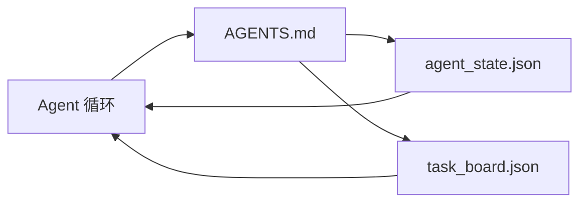

# 最小 Agent 工作台

> 最小可用的工作台由三个文件组成：一个根指令路由器、一个状态文件、一个任务看板。其他一切都是在此基础上叠加的。如果一个仓库连这三个文件都承载不了，任何模型都无法拯救它。

**类型：** 动手构建
**语言：** Python（标准库）
**前置条件：** 第 14 阶段 · 第 31 节（为什么能力强大的模型仍然会失败）
**时长：** ~45 分钟

## 学习目标

- 定义构成最小可行工作台的三个文件。
- 解释为什么短小的根路由器优于冗长的单一 `AGENTS.md`。
- 构建一个 agent 每次回合都能读取、回合结束时能写入的状态文件。
- 构建一个能跨多会话存活、不依赖聊天历史的任务看板。

## 问题所在

大多数团队构建工作台的方式是写一份 3000 行的 `AGENTS.md` 然后就觉得完事了。模型加载它，忽略掉它无法总结的部分，然后在它一贯失败的地方继续失败。

你需要相反的做法。一个极小的根文件，只在相关时才将 agent 路由到更深层的文件。持久的状态，agent 在行动前读取、行动后写入。一个任务看板，标明哪些正在执行、哪些受阻、哪些是下一步。

三个文件。各司其职。每个都足够机器可读，日后可以演进成一个真正的系统。

## 核心理念


```mermaid
flowchart LR
  Agent[Agent 循环] --> Router[AGENTS.md]
  Router --> State[agent_state.json]
  Router --> Board[task_board.json]
  State --> Agent
  Board --> Agent
```

### AGENTS.md 是路由器，不是操作手册

一份好的 `AGENTS.md` 应当简短。它指引 agent 到：

- 状态文件（当前所处位置）
- 任务看板（还剩什么）
- 更深层的规则（`docs/agent-rules.md`）
- 验证命令（如何确认它能工作）

任何更长的内容都放在更深层的文档中，只在需要时才加载。冗长的操作手册会被忽略。简短的路由器才会被遵循。

### agent_state.json 是记录系统

状态承载：当前活跃的任务 ID、已触碰的文件、所做的假设、阻塞项以及下一步行动。agent 在每次回合读取它。下一个会话读取它，而不是重放聊天记录。

状态存在于文件中，因为聊天历史不可靠。会话会终止。对话会被截断。文件不会。

### task_board.json 是队列

任务看板承载每一个任务，状态为 `todo | in_progress | done | blocked`。它是 agent 在状态为空时拉取任务的队列，也是你想知道 agent 是否在轨道上时所读取的队列。

看板上的任务包含一个 ID、一个目标、一个负责人（`builder`、`reviewer` 或 `human`）以及验收标准。看板刻意保持短小：当它超过一屏时，你遇到的是规划问题，而不是看板问题。

### 三个文件是地板，不是天花板

后续的课程将添加作用域契约、反馈运行器、验证门、审查清单和交接包。这里的三个文件是它们共同依赖的基础。

## 动手构建

`code/main.py` 将最小工作台写入一个空仓库，并演示一个单一的 agent 回合，该回合：

1. 读取 `agent_state.json`
2. 如果状态为空，从 `task_board.json` 拉取下一个任务
3. 在作用域内触碰一个文件
4. 写回更新后的状态

运行它：

```
python3 code/main.py
```

脚本会在自身旁边创建 `workdir/`，放下三个文件，运行一个回合，并打印差异。重新运行以查看第二个回合如何从第一个回合结束的地方继续。

## 使用它

在生产级 agent 产品中，同样的三个文件以不同的名字出现：

- **Claude Code：** `AGENTS.md` 或 `CLAUDE.md` 作为路由器，`.claude/state.json` 风格存储作为状态，钩子机制作为看板
- **Codex / Cursor：** 工作区规则作为路由器，会话记忆作为状态，聊天侧栏中的排队任务作为看板
- **自定义 Python agent：** 就是你刚刚写的那些文件

名字变了。形态没有。

## 实际生产模式

最小工作台在接触真实的大型仓库时，需要在它之上叠加三种模式才能存活。它们是独立的；选择你的仓库实际需要的那些。

**嵌套 `AGENTS.md`，就近优先。** OpenAI 在其主仓库中发布了 88 个 `AGENTS.md` 文件，每个子组件一个。Codex、Cursor、Claude Code 和 Copilot 都从工作文件向仓库根目录遍历，沿途合并每一个遇到的 `AGENTS.md`。子目录文件扩展根文件。Codex 添加了 `AGENTS.override.md` 来替换而非扩展；override 机制是 Codex 特有的，跨工具工作时应避免使用。Augment Code 的衡量标准才是关键：最好的 `AGENTS.md` 文件能带来等同于从 Haiku 升级到 Opus 的质量跃升；最差的则使输出比没有文件更糟糕。

**即使看起来像覆盖面也要拒绝的反模式。** 冲突的指令会让 agent 从交互模式静默降级为贪心模式（ICLR 2026 AMBIG-SWE：48.8% → 28% 解决率）；应使用数字优先级，而不是扁平堆叠。不可验证的风格规则（"遵循 Google Python 风格指南"）没有强制执行命令，会让 agent 自己编造合规性；每条风格规则都应配上精确的 lint 命令。以风格而非命令开头会埋没验证路径；命令优先，风格最后。为人类而非 agent 写作会浪费上下文预算；简洁是一种特性。

**跨工具符号链接。** 一个单一的根文件加上符号链接（`ln -s AGENTS.md CLAUDE.md`、`ln -s AGENTS.md .github/copilot-instructions.md`、`ln -s AGENTS.md .cursorrules`）让每个编码 agent 共享同一个事实来源。Nx 的 `nx ai-setup` 从单一配置自动完成这一操作，覆盖 Claude Code、Cursor、Copilot、Gemini、Codex 和 OpenCode。

## 交付

`outputs/skill-minimal-workbench.md` 为任何新仓库生成三个文件的工作台：一个针对项目调整的 `AGENTS.md` 路由器、一个带有正确键的 `agent_state.json`，以及一个填充了当前积压任务的 `task_board.json`。

## 练习

1. 给 `agent_state.json` 添加一个 `last_run` 时间戳。如果文件超过 24 小时未更新，除非操作员确认，否则拒绝运行。
2. 给任务看板添加一个 `priority` 字段，并修改拉取逻辑，使其始终选择最高优先级的 `todo`。
3. 将 `task_board.json` 迁移为 JSON Lines 格式，使每个任务占一行，且在版本控制中差异清晰。
4. 编写一个 `lint_workbench.py`，当 `AGENTS.md` 超过 80 行或引用了不存在的文件时抛出错误。
5. 判断三个文件中哪一个丢失的代价最大。为你的选择辩护。

## 关键术语

| 术语 | 人们通常说的 | 实际含义 |
|------|----------------|------------------------|
| 路由器 | `AGENTS.md` | 将 agent 指向深层文档和文件的短小根文件 |
| 状态文件 | "笔记" | agent 当前位置的机器可读记录，每回合写入 |
| 任务看板 | "积压任务" | 包含状态、负责人、验收标准的 JSON 工作队列 |
| 记录系统 | "事实来源" | 当聊天记录消失时，工作台视为权威的文件 |

## 延伸阅读

- [agents.md — 开放规范](https://agents.md/) — 被 Cursor、Codex、Claude Code、Copilot、Gemini、OpenCode 采用
- [Augment Code：一份好的 AGENTS.md 就是模型升级。糟糕的比没有文档更糟](https://www.augmentcode.com/blog/how-to-write-good-agents-dot-md-files) — 可衡量的质量跃升
- [Blake Crosley：AGENTS.md 模式——什么真正改变了 Agent 行为](https://blakecrosley.com/blog/agents-md-patterns) — 经验上有效与无效的做法
- [Datadog 前端团队：在大型仓库中使用 AGENTS.md 引导 AI Agent](https://dev.to/datadog-frontend-dev/steering-ai-agents-in-monorepos-with-agentsmd-13g0) — 实际应用中的嵌套优先级
- [Nx 博客：教会你的 AI Agent 如何在大型仓库中工作](https://nx.dev/blog/nx-ai-agent-skills) — 跨六个工具的单一来源生成
- [The Prompt Shelf：AGENTS.md 最佳实践——结构、作用域与真实案例](https://thepromptshelf.dev/blog/agents-md-best-practices/) — 能通过审查的章节排序
- [Anthropic：Claude Code 子 agent 与会话存储](https://docs.anthropic.com/en/docs/agents-and-tools/claude-code/sub-agents)
- 第 14 阶段 · 第 31 节 — 这个最小工作台所吸收的失败模式
- 第 14 阶段 · 第 34 节 — 本节课预览的持久状态模式
