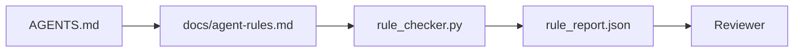

# 実行可能な制約としての Agent Instructions

> prose として書かれた instructions は願望です。constraints として書かれた instructions は test です。workbench は各 rule を、agent が runtime で確認でき、reviewer が後から検証できるものに変えます。

**種別:** 構築
**言語:** Python (stdlib)
**前提条件:** Phase 14 · 32 (Minimal Workbench)
**所要時間:** 約50分

## Learning Objectives

- routing prose と operational rules を分ける。
- startup rules、forbidden actions、definition of done、uncertainty handling、approval boundaries を machine-checkable constraints として表現する。
- run を rule set に対して採点する rule checker を実装する。
- review で何が変わったか見えるように、rule set を diff-friendly にする。

## 問題

典型的な `AGENTS.md` は onboarding documentation のように読めます。"be careful"、"test thoroughly"、"ask if unsure" と agent に伝えます。3 日後、agent は tests なしの change を ship し、forbidden directory に書き込み、どこが境界か知らないため質問もしません。

instructions は operational なら強力で、aspirational なら弱いです。修正方法は、workbench が解釈でき、reviewer が採点できる rules として書くことです。

## The Concept

rules は短い root router から離して `docs/agent-rules.md` に置きます。各 rule は name、category、check を持ちます。



### ほとんどの rule を覆う 5 categories

| Category | rule が答える質問 | Example |
|----------|-------------------|---------|
| Startup | work を始める前に何が true であるべきか？ | "state file exists and is fresh" |
| Forbidden | 絶対に何をしてはいけないか？ | "do not edit `scripts/release.sh`" |
| Definition of done | task complete を何が証明するか？ | "pytest exits 0 and acceptance line passes" |
| Uncertainty | 不確かなとき agent は何をするか？ | "open a question note instead of guessing" |
| Approval | human approval が必要なものは何か？ | "any new dependency, any prod write" |

この 5 つのどれにも入らない rule は、たいてい 2 つの rule に分けるべきです。分割を強制します。

### Rules are machine-readable

各 rule は slug、category、one-line description、そして `rule_checker.py` の function 名を示す `check` field を持ちます。rule を追加するとは check を追加することです。checker は workbench とともに育ちます。

### Rules are diff-friendly

rules は single markdown file に heading ごと 1 rule で置きます。rename は diff に見えます。new rule は category の先頭に置きます。stale rule は comment out ではなく delete します。workbench は team が前四半期にどう感じたかの chat log ではなく、source of truth だからです。

### Rules versus framework guardrails

framework guardrails (OpenAI Agents SDK guardrails、LangGraph interrupts) は runtime level で rules を enforce します。この lesson の rule set は、それらの guardrails が実装する human-readable, reviewable contract です。両方が必要です。runtime は turn 中の violation を捕捉し、rule set は runtime が正しいことを証明します。

## 実装

`code/main.py` は以下を含みます。

- rules を dataclass に load する `agent-rules.md` parser。
- `check` reference ごとに 1 つの `rule_checker.py` style checker functions。
- 2 つの rule に違反する demo agent run と、それを捕捉する check pass。

実行:

```
python3 code/main.py
```

出力: parsed rule set、run trace、rule ごとの pass/fail、script の横に保存される `rule_report.json`。

## Production patterns in the wild

quarter 持つ rule set と 1 週間で腐る rule set を分ける pattern が 3 つあります。

**Severity tagging at write time.** 各 rule は `severity`: `block`, `warn`, `info` を持ちます。checker は 3 つすべてを report し、runtime は `block` のみを refuse します。多くの team は初期に severity を過大評価し、deadline pressure の下で静かに弱めます。write time で tag することで、calibration を upfront に強制できます。Phase 14 · 38 の verification gate と組み合わせ、`block` rule の override は `overrides.jsonl` audit log に署名して記録します。

**Rule expiry as a forcing function.** 各 rule は `expires_at` date (default は authoring から 90 days) を持ちます。checker は、未期限切れ rule が 60 consecutive days で violation 0 の場合に warning を出します。次の quarterly review で、その rule を保持する理由を示す、`info` に弱める、または delete します。Cloudflare の production AI Code Review data (April 2026、30 日間で 5,169 repos、131,246 review runs) では、explicit expiry を持つ rule set は repo あたり 30 rules 未満に留まり、ないものは 80+ に育って多くが一度も発火しませんでした。

**Markdown-as-source, JSON-as-cache.** `agent-rules.md` が authored file で、`agent-rules.lock.json` は hot path で checker が読む cache です。lock は pre-commit hook で再生成します。Markdown diff は review 可能で、JSON parsing は毎 turn の外に出せます。`package.json` / `package-lock.json` や `Cargo.toml` / `Cargo.lock` と同じ形です。

## Use It

production では次のように使います。

- Claude Code、Codex、Cursor は session start で rules を読み、action を拒否するときに quote します。checker は CI で再実行され、silent drift を捕捉します。
- OpenAI Agents SDK guardrails は同じ checks を input/output guardrails として register します。markdown は docs surface、SDK は runtime surface です。
- LangGraph interrupts は in-flight node が rule に違反したとき発火します。interrupt handler は rule を読み、人間に確認し、resume します。

rule set は markdown と function names だけなので、この 3 つすべてをまたいで portable です。

## Ship It

`outputs/skill-rule-set-builder.md` は project owner に interview し、既存の prose instructions を 5 categories に分類し、versioned `agent-rules.md` と checker stub を出力します。

## Exercises

1. product が本当に必要とするなら 6 番目の category を追加してください。5 つのどれにも畳み込めない理由を説明してください。
2. checker を拡張し、rule が severity (`block`, `warn`, `info`) を持てるようにして、report がそれを aggregate するようにしてください。
3. checker を CI に結線してください。latest agent run で block-severity rule が失敗したら build を fail します。
4. rule ごとに "expiry" field を追加してください。90 days check fail がない rule は review 対象にします。
5. 実在する `AGENTS.md` を見つけ、5-category rules として書き直してください。その lines のうち何行が operational で、何行が aspirational でしたか。

## Key Terms

| Term | よくある言い方 | 実際の意味 |
|------|----------------|------------|
| Operational rule | "A real instruction" | workbench が runtime で check できる rule |
| Aspirational rule | "Be careful" | check のない rule。delete するか upgrade する |
| Definition of done | "Acceptance" | task complete を証明する objective, file-backed proof |
| Block severity | "Hard rule" | violation が run を halt する。operator なしでは silence できない |
| Rule expiry | "Stale rule sweep" | N days fail がない rule は retirement 対象 |

## 参考文献

- [OpenAI Agents SDK guardrails](https://platform.openai.com/docs/guides/agents-sdk/guardrails)
- [LangGraph interrupts](https://langchain-ai.github.io/langgraph/how-tos/human_in_the_loop/breakpoints/)
- [Anthropic, Building Effective Agents](https://www.anthropic.com/research/building-effective-agents)
- [Rick Hightower, Agent RuleZ: A Deterministic Policy Engine](https://medium.com/@richardhightower/agent-rulez-a-deterministic-policy-engine-for-ai-coding-agents-9489e0561edf) — production での block/warn/info severity
- [Cloudflare, Orchestrating AI Code Review at Scale](https://blog.cloudflare.com/ai-code-review/) — 131k review runs、rule composition lessons
- [microservices.io, GenAI development platform — part 1: guardrails](https://microservices.io/post/architecture/2026/03/09/genai-development-platform-part-1-development-guardrails.html) — rules と CI の defense in depth
- [Type-Checked Compliance: Deterministic Guardrails (arXiv 2604.01483)](https://arxiv.org/pdf/2604.01483) — rule-as-check の上限としての Lean 4
- [logi-cmd/agent-guardrails](https://github.com/logi-cmd/agent-guardrails) — merge-gate implementation: scope, mutation testing, violation budgets
- Phase 14 · 32 — この rule set が入る minimal workbench
- Phase 14 · 38 — rule report を消費する verification gate
- Phase 14 · 39 — rule compliance を採点する reviewer agent
