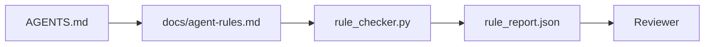

# Instruções de Agent como Restrições Executáveis

> Instruções escritas em prosa são desejos. Instruções escritas como restrições são testes. O workbench transforma cada regra em algo que um agente pode checar no runtime e um reviewer pode verificar depois.

**Tipo:** Construa
**Linguagens:** Python (stdlib)
**Pré-requisitos:** Fase 14 · 32 (Workbench Mínimo)
**Tempo:** ~50 minutos

## Objetivos de Aprendizado

- Separar prosa de roteamento de regras operacionais.
- Expressar regras de inicialização, ações proibidas, definição de pronto, tratamento de incerteza e limites de aprovação como restrições verificáveis por máquina.
- Implementar um verificador de regras que pontua uma execução contra o conjunto de regras.
- Tornar o conjunto de regras amigável a diffs pra que a revisão veja o que mudou.

## O Problema

Um `AGENTS.md` típico lê como documentação de onboarding. Ele diz ao agente pra "ter cuidado" e "testar bem" e "perguntar se tiver com dúvida." Três dias depois, o agente faz release de uma mudança sem nenhum teste, escreve num diretório proibido, e nunca pergunta porque nunca sabia onde a linha tava.

Instruções são poderosas quando são operacionais e fracas quando são aspiracionais. A solução é escrever regras que o workbench consegue interpretar e o reviewer consegue pontuar.

## O Conceito

Regras ficam em `docs/agent-rules.md`, longe do roteador raiz curto. Cada regra tem um nome, uma categoria e uma verificação.



### Cinco categorias que cobrem a maioria das regras

| Categoria | Pergunta que a regra responde | Exemplo |
|-----------|-------------------------------|---------|
| Inicialização | O que deve ser verdade antes do trabalho começar? | "arquivo de estado existe e tá fresco" |
| Proibido | O que nunca deve acontecer? | "não edita `scripts/release.sh`" |
| Definição de pronto | O que prova que a tarefa tá completa? | "pytest sai 0 e a linha de aceitação passa" |
| Incerteza | O que o agente faz quando tá com dúvida? | "abre uma nota de pergunta ao invés de adivinhar" |
| Aprovação | O que precisa de aprovação humana? | "qualquer dependência nova, qualquer escrita em prod" |

Uma regra que não se encaixa nessas cinco normalmente quer ser duas regras. Força o split.

### Regras são legíveis por máquina

Cada regra tem um slug, uma categoria, uma descrição de uma linha, e um campo `check` que nomeia uma function em `rule_checker.py`. Adicionar uma regra significa adicionar uma verificação; o checker cresce junto com o workbench.

### Regras são amigáveis a diffs

Regras ficam uma por cabeçalho num arquivo markdown único. Renomeações são visíveis em diffs. Regras novas ficam no topo da categoria. Regras obsoletas são deletadas, não comentadas, porque o workbench é a fonte de verdade, não o log de chat de como o time sentiu no último trimestre.

### Regras versus guardrails de framework

Guardrails de framework (guardrails do OpenAI Agents SDK, interrupts do LangGraph) aplicam regras no nível do runtime. O conjunto de regras dessa aula é o contrato legível e revisável que esses guardrails implementam. Você precisa dos dois: o runtime pega violações durante um turno, o conjunto de regras prova que o runtime tá fazendo a coisa certa.

## Construa

`code/main.py` traz:

- Parser de `agent-rules.md` que carrega regras num dataclass.
- Functions verificadoras de estilo `rule_checker.py`, uma por referência de `check`.
- Uma demo de execução de agente que viola duas regras e uma verificação passa que pega elas.

Execute:

```
python3 code/main.py
```

Saída: conjunto de regras parseado, trace de execução, pass/fail por regra, e um `rule_report.json` salvo ao lado do script.

## Padrões de produção no mundo real

Três padrões separam um conjunto de regras que dura um trimestre de um que decai numa semana.

**Tag de severidade no momento de escrita.** Cada regra carrega `severity`: `block`, `warn` ou `info`. O checker reporta as três; o runtime só recusa em `block`. A maioria dos times superestima severidade no início e depois enfraquece silenciosamente sob pressão de deadline; tagar no momento de escrita força o calibramento na frente. Combine com o gate de verificação (Fase 14 · 38), que assina qualquer override de uma regra `block` num log de auditoria `overrides.jsonl`.

**Expiração de regra como função forçante.** Cada regra carrega uma data `expires_at` (padrão 90 dias da data de criação). O checker emite um aviso quando uma regra não expirada teve zero violações em 60 dias consecutivos; a próxima revisão trimestral justifica mantê-la, enfraquece pra `info`, ou deleta. Os dados de AI Code Review em produção da Cloudflare (abril de 2026, 131.246 execuções de review em 5.169 repos em 30 dias) mostraram que conjuntos de regras com expiração explícita ficaram abaixo de 30 regras por repo; sem expiração cresceram pra 80+ com a maioria nunca disparando.

**Markdown como fonte, JSON como cache.** `agent-rules.md` é o arquivo autorado; `agent-rules.lock.json` é um cache que o checker lê no caminho quente. O lock é regenerado por um hook pre-commit. Diffs de markdown são revisáveis; parsing de JSON fica fora de cada turno. Mesma forma que `package.json` / `package-lock.json` e `Cargo.toml` / `Cargo.lock`.

## Use

Em produção:

- Claude Code, Codex, Cursor leem as regras no início da sessão e citam elas quando recusam ações. O checker re-executa em CI pra pegar deriva silencioso.
- Guardrails do OpenAI Agents SDK registram as mesmas verificações como guardrails de input e output. O markdown é a superfície de docs; o SDK é a superfície de runtime.
- Interrupts do LangGraph disparam quando um nó em andamento viola uma regra. O handler de interrupt lê a regra, pergunta pro humano, e retoma.

O conjunto de regras é portável entre os três porque é só markdown mais nomes de functions.

## Entregue

`outputs/skill-rule-set-builder.md` entrevista um dono de projeto, classifica as instruções em prosa existentes nas cinco categorias, e emite um `agent-rules.md` versionado mais um stub de checker.

## Exercícios

1. Adicione uma sexta categoria se o seu produto realmente precisa. Defenda por que ela não colapsa em uma das cinco.
2. Estenda o checker pra que uma regra possa carregar uma severidade (`block`, `warn`, `info`) e o relatório agregue de acordo.
3. Conecte o checker ao CI: falhe o build se uma regra de severidade block falhar na última execução do agent.
4. Adicione um campo "expiry" por regra. Depois de 90 dias sem falha de verificação, a regra fica pra revisão.
5. Encontre um `AGENTS.md` real e reescreva como regras de cinco categorias. Quantas linhas eram operacionais? Quantas eram aspiracionais?

## Termos-Chave

| Termo | O que a galera fala | O que realmente significa |
|-------|---------------------|--------------------------|
| Regra operacional | "Uma instrução real" | Uma regra que o workbench consegue checar no runtime |
| Regra aspiracional | "Ter cuidado" | Uma regra sem verificação; delete ou faça upgrade |
| Definição de pronto | "Aceitação" | Uma prova objetiva, respaldada em arquivo, de que a tarefa tá completa |
| Severidade block | "Regra dura" | Violação interrompe a execução; não pode ser silenciada sem um operador |
| Expiração de regra | "Limpeza de regra obsoleta" | Uma regra sem falhas em N dias fica pra aposentadoria |

## Leitura Complementar

- [OpenAI Agents SDK guardrails](https://platform.openai.com/docs/guides/agents-sdk/guardrails)
- [LangGraph interrupts](https://langchain-ai.github.io/langgraph/how-tos/human_in_the_loop/breakpoints/)
- [Anthropic, Building Effective Agents](https://www.anthropic.com/research/building-effective-agents)
- [Rick Hightower, Agent RuleZ: A Deterministic Policy Engine](https://medium.com/@richardhightower/agent-rulez-a-deterministic-policy-engine-for-ai-coding-agents-9489e0561edf) — severidade block/warn/info em produção
- [Cloudflare, Orchestrating AI Code Review at Scale](https://blog.cloudflare.com/ai-code-review/) — 131k execuções de review, lições de composição de regras
- [microservices.io, GenAI development platform — part 1: guardrails](https://microservices.io/post/architecture/2026/03/09/genai-development-platform-part-1-development-guardrails.html) — defesa em profundidade entre regras e CI
- [Type-Checked Compliance: Deterministic Guardrails (arXiv 2604.01483)](https://arxiv.org/pdf/2604.01483) — Lean 4 como limite superior pra regra-como-verificação
- [logi-cmd/agent-guardrails](https://github.com/logi-cmd/agent-guardrails) — implementação de merge-gate: escopo, teste de mutação, orçamentos de violação
- Fase 14 · 32 — o workbench mínimo que esse conjunto de regras entra
- Fase 14 · 38 — o gate de verificação que consome o relatório de regras
- Fase 14 · 39 — o agente revisor que pontua aderência às regras
