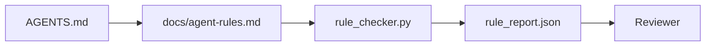

# Yürütülebilir Kısıtlamalar Olarak Agent Talimatlar

> Düzyazı şeklinde yazılan talimatlar dilektir. Kısıtlamalar olarak yazılan talimatlar testlerdir. Workbench, her kuralı bir agent'nin çalışma zamanında kontrol edebileceği ve bir incelemecinin olay sonrasında doğrulayabileceği bir şeye dönüştürür.

**Tür:** Yapım
**Diller:** Python (stdlib)
**Önkoşullar:** Aşama 14 · 32 (Minimal Çalışma Tezgahı)
**Süre:** ~50 dakika

## Öğrenme Hedefleri

- Yönlendirme metnini operasyonel kurallardan ayırın.
- Başlatma kurallarını, yasak eylemleri, yapılanların tanımını, belirsizlik yönetimini ve onay sınırlarını makine tarafından kontrol edilebilen kısıtlamalar olarak ifade edin.
- Kural kümesine göre bir çalışmayı puanlayan bir kural denetleyicisi uygulayın.
- Kural kümesini fark dostu hale getirin, böylece inceleme nelerin değiştiğini görebilir.

## Sorun

Tipik bir `AGENTS.md`, katılım belgelerine benzer. agent'ya "dikkatli olmasını", "iyice test etmesini" ve "emin değilseniz sormasını" söyler. Üç gün sonra, agent hiçbir test yapmadan bir değişiklik gönderir, yasak bir dizine yazar ve satırın nerede olduğunu asla bilmediği için asla sormaz.

Talimatlar işlevsel olduklarında güçlüdür, istek uyandırdıklarında zayıftırlar. Çözüm, çalışma tezgahının yorumlayabileceği ve gözden geçirenin puan verebileceği kurallar yazmaktır.

## Konsept

Kurallar, kısa kök yönlendiriciden uzakta, `docs/agent-rules.md`'ya aittir. Her kuralın bir adı, bir kategorisi ve bir kontrolü vardır.



### Kuralların çoğunu kapsayan beş kategori

| Kategori | Kural sorusunun yanıtları | Örnek |
|----------|---------------------------|---------|
| Başlangıç ​​| İş başlamadan önce ne doğru olmalı? | "durum dosyası mevcut ve yeni" |
| Yasak | Asla ne olmamalı? | "`scripts/release.sh`'yi düzenleme" |
| done'ın tanımı | Görevin tamamlandığını kanıtlayan şey nedir? | "pytest 0'dan çıkar ve kabul satırı geçer" |
| Belirsizlik | Emin olmadığında agent ne yapar? | "Tahmin etmek yerine soru notunu açın" |
| Onay | İnsanın onayını gerektiren şey nedir? | "herhangi bir yeni bağımlılık, herhangi bir ürün yazma" |

Bu beş kuraldan birine uymayan bir kural genellikle iki kural olmak ister. Bölmeyi zorla.

### Kurallar makine tarafından okunabilir

Her kuralın bir bilgisi, bir kategorisi, tek satırlık bir açıklaması ve `rule_checker.py` içindeki bir işlevi adlandıran bir `check` alanı vardır. Kural eklemek, çek eklemek anlamına gelir; denetleyici tezgahla birlikte büyür.

### Kurallar farklara uygundur

Kurallar, tek bir etiketleme dosyasında başlık başına bir tane bulunur. Yeniden adlar farklarda görülebilir. Yeni kurallar kendi kategorilerinin en üstünde yer alıyor. Eski kurallar siliniyor, yorumlanmıyor çünkü gerçeğin kaynağı takımın geçen çeyrekte nasıl hissettiğini gösteren sohbet günlüğü değil, tezgahtır.

### Kurallara karşı framework korkuluklar

Framework korkulukları (OpenAI Agent'nin SDK korkulukları, LangGraph kesintileri) çalışma zamanı düzeyinde kuralları uygular. Bu derste belirlenen kural, bu korkulukların uyguladığı, insan tarafından okunabilen, gözden geçirilebilen sözleşmedir. Her ikisine de ihtiyacınız var: çalışma zamanı bir dönüş sırasında ihlalleri yakalar, kural seti çalışma zamanının doğru şeyi yaptığını kanıtlar.

### Aşamalı açıklama: ansiklopedi değil, harita

`AGENTS.md`'nin büyümeye devam etmesinin nedeni, her olayın bir kural eklemesi ve hiçbir olayın bir kuralı kaldırmamasıdır. Bir yıl sonra dosya iki bin satır oluyor ve agent ilk ekranı okuyor, dikkat bütçesi tükeniyor ve kendisine söylenenin çok küçük bir kısmıyla hareket ediyor. Devasa bir talimat dosyası, kırk sayfalık bir işe alım dokümanının başarısız olmasıyla aynı nedenden dolayı başarısız olur: Okuyucu onu bir kez gözden geçirir ve bir daha önemli kısma geri dönmez.

Düzeltme daha kısa bir dosya değil. Katmanlı bir şey. Kök yönlendirici her oturumu okuyabilecek kadar küçük kalır ve işaretçilerden başka hiçbir şeyi barındırmaz. Derinlik, agent'nin yalnızca görev onlara dokunduğunda yüklediği konu dosyalarında bulunur. agent'a ansiklopedinin tamamını değil, bir haritayı verin ve ihtiyaç duyduğu sayfaya gitmesine izin verin.

```
AGENTS.md                  # router, < 50 lines: what this repo is, where to look, the 5 hard rules
docs/
  agent-rules.md           # the full rule set (this lesson)
  architecture.md          # loaded when the task touches module boundaries
  testing.md               # loaded when the task writes or runs tests
  deploy.md                # loaded only for release work, gated behind an approval rule
feature_list.json          # the backlog (Phase 14 · 36)
```

| Seviye | |'da yaşıyor Ne zaman oku | Boyut bütçesi |
|------|----------|-----------|-------------|
| Yönlendirici | `AGENTS.md` | Her oturumda, her zaman | ~50 satırın altında |
| Kurallar | `docs/agent-rules.md` | Her oturum, başlangıçta | Kategori başına bir ekran |
| Konu belgeleri | `docs/<topic>.md` | Yalnızca görev o konuya dokunduğunda | Gerektiği kadar derin |

İki test katmanlamayı dürüst tutar. Erişilebilirlik testi: bir agent herhangi bir kurala yönlendiriciden en fazla iki atlamada ulaşmalıdır, dolayısıyla yönlendirici her konu belgesini düzyazıyla açıklamamalı, yolla bağlamalıdır. Tazelik testi: Yönlendirici, bir incelemecinin onu her PR'de yeniden okumasına yetecek kadar kısadır; bu, onun sessizce yerini aldığı ansiklopediye geri dönmesini engelleyen tek şeydir. Artık çözümlenmeyen bir işaretçi, eksik bir kuraldan daha kötü bir başarısızlıktır; dolayısıyla yönlendiricideki bozuk bir bağlantının kendisi de bir başlangıç ​​denetimi ihlalidir.

## İnşa Et

`code/main.py` gemileri:

- Kuralları bir veri sınıfına yükleyen `agent-rules.md` ayrıştırıcı.
- `rule_checker.py` stil kontrol işlevi, her `check` referans için bir tane.
- İki kuralı ihlal eden bir demo agent koşusu ve bunları yakalayan bir kontrol geçişi.

Çalıştır:

```
python3 code/main.py
```

Çıktı: ayrıştırılmış kural kümesi, çalıştırma izlemesi, kural başına başarılı/başarısız ve betiğin yanına kaydedilen bir `rule_report.json`.

## Vahşi doğada üretim modelleri

Üç kalıp, çeyrek yıl süren bir kural kümesini bir hafta içinde bozulan bir kural kümesinden ayırır.

**Yazma sırasında önem derecesi etiketlemesi.** Her kural `severity` taşır: `block`, {`warn` veya `info`. Kontrolör üçünü de rapor ediyor; çalışma zamanı yalnızca `block` tarihinde reddediyor. Çoğu ekip ciddiyeti erkenden abartır ve son teslim tarihi baskısı altında sessizce zayıflatır; Yazma sırasında etiketleme, kalibrasyonun ön plana çıkmasını sağlar. Bir `block` kuralının geçersiz kılınmasını bir `overrides.jsonl` denetim günlüğüne imzalayan doğrulama kapısı (Aşama 14 · 38) ile eşleştirin.

**Zorlama işlevi olarak kuralın sona ermesi.** Her kural bir `expires_at` tarihi taşır (varsayılan olarak yazma tarihinden itibaren 90 gün). Süresi dolmamış bir kuralın art arda 60 gün boyunca sıfır ihlali olması durumunda denetleyici bir uyarı verir; bir sonraki üç ayda bir yapılan inceleme ya onu tutmayı haklı çıkarır, onu `info`'a kadar zayıflatır ya da siler. Cloudflare'in üretim AI Kod İncelemesi verileri (Nisan 2026, 30 günde 5.169 depoda 131.246 inceleme çalıştırıldı), açık sona erme tarihi olan kural kümelerinin depo başına 30 kuralın altında kaldığını gösterdi; çoğu hiç ateşlenmeyen setler 80'in üzerine çıktı.

**Kaynak olarak işaretle, önbellek olarak JSON.** `agent-rules.md` yazılan dosyadır; `agent-rules.lock.json` denetleyicinin etkin yolda okuduğu bir önbellektir. Kilit, bir ön işleme kancasıyla yeniden oluşturulur. Markdown farkları gözden geçirilebilir; JSON ayrıştırma her fırsatta dışarıda kalır. {`package.json` / `package-lock.json` ve `Cargo.toml` / `Cargo.lock` ile aynı şekil.

## Kullan onu

Üretimde:

- Claude Code, Codex, Cursor oturum başlangıcında kuralları okuyun ve eylemleri reddederken bunları alıntılayın. Kontrolcü, sessiz sürüklenmeyi yakalamak için bunları CI'da yeniden çalıştırır.
- OpenAI Agent'nin SDK korkulukları, giriş ve çıkış korkuluklarıyla aynı kontrolleri kaydeder. İşaretleme, dokümanın yüzeyidir; SDK çalışma zamanı yüzeyidir.
- Uçuş halindeki bir düğüm bir kuralı ihlal ettiğinde LangGraph ateşi keser. Kesme işleyicisi kuralı okur, insana sorar ve devam eder.

Kural kümesi her üçünde de taşınabilir çünkü yalnızca işaretleme artı işlev adlarından oluşur.

## Gönderin

`outputs/skill-rule-set-builder.md` bir proje sahibiyle röportaj yapar, mevcut düzyazı talimatlarını beş kategoriye sınıflandırır ve sürümlendirilmiş bir `agent-rules.md` artı bir kontrol koçanı yayınlar.

## Egzersizler

1. Ürününüzün gerçekten ihtiyacı varsa altıncı kategoriyi ekleyin. Neden beşten birine düşmediğini savunun.
2. Denetleyiciyi, bir kuralın önem derecesini (`block`, `warn`, {`info`) taşıyabileceği ve raporun buna göre toplanacağı şekilde genişletin.
3. Denetleyiciyi CI'ya bağlayın: en son agent çalıştırmada bir blok önem derecesi kuralı başarısız olursa derlemede başarısız olun.
4. Kural başına bir "son kullanma tarihi" alanı ekleyin. Denetimin başarısız olduğu 90 günün ardından kural incelemeye alınır.
5. Gerçek bir `AGENTS.md` bulun ve onu beş kategorili kurallar olarak yeniden yazın. Hatlarından kaç tanesi çalışır durumdaydı? Kaç tanesi istekliydi?

## Anahtar Terimler

| Dönem | İnsanlar ne diyor | Aslında ne anlama geliyor |
|------|----------------|------------------------|
| Operasyonel kural | "Gerçek bir talimat" | Tezgahın çalışma zamanında kontrol edebileceği bir kural |
| İstenilen kural | "Dikkatli olun" | Kontrolsüz bir kural; silin veya yükseltin |
| done'ın tanımı | "Kabul" | Görevin tamamlandığına dair nesnel, dosya destekli bir kanıt |
| Engelleme ciddiyeti | "Katı kural" | İhlal koşuyu durdurur; operatör olmadan susturulamaz |
| Kuralın sona ermesi | "Eski kural taraması" | N gün içinde hatasız olan bir kural artık kaldırılıyor |

## Daha Fazla Okuma

- [OpenAI Agent'nin SDK korkulukları](https://openai.github.io/openai-agents-python/guardrails/)
- [LangGraph kesintiye uğrar](https://langchain-ai.github.io/langgraph/how-tos/human_in_the_loop/breakpoints/)
- [Antropik, Etkili Agentler Oluşturma](https://www.anthropic.com/research/building-effective-agents)
- [Rick Hightower, Agent RuleZ: Belirleyici Bir Politika Motoru](https://medium.com/@richardhightower/agent-rulez-a-deterministic-policy-engine-for-ai-coding-agents-9489e0561edf) — üretimde engelleme/uyarma/bilgi ciddiyeti
- [Cloudflare, Yapay Zeka Kod İncelemesini Geniş Ölçekte Düzenleme](https://blog.cloudflare.com/ai-code-review/) — 131 bin inceleme çalıştırması, kural oluşturma dersleri
- [microservices.io, GenAI geliştirme platformu — bölüm 1: korkuluklar](https://microservices.io/post/architecture/2026/03/09/genai-development-platform-part-1-development-guardrails.html) — kurallar ve CI arasında derinlemesine savunma
- [Tür Kontrollü Uyumluluk: Deterministik Korkuluklar (arXiv 2604.01483)](https://arxiv.org/pdf/2604.01483) — Kontrol kuralında üst sınır olarak Yalın 4
- [logi-cmd/agent-guardrails](https://github.com/logi-cmd/agent-guardrails) — birleştirme kapısı uygulaması: kapsam, mutasyon testi, ihlal bütçeleri
- Aşama 14 · 32 — bu kural kümesinin düştüğü minimum çalışma alanı
- Aşama 14 · 38 — kural raporunu tüketen doğrulama kapısı
- Aşama 14 · 39 — kural uyumluluğunu puanlayan incelemeci agent
