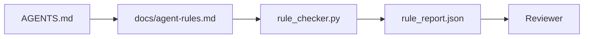

# 33 · 将智能体指令写成可执行的约束

> 写成散文的指令是愿望，写成约束的指令是测试。工作台把每条规则都变成智能体能在运行时检查、评审者能在事后核验的东西。

**类型：** 构建
**语言：** Python（标准库）
**前置：** 第 14 阶段 · 32（最小工作台）
**时长：** 约 50 分钟

## 学习目标

- 把路由散文（routing prose）与操作规则（operational rule）分离开。
- 把启动规则、禁止动作、完成定义（definition of done）、不确定性处理与审批边界，表达为机器可校验的约束。
- 实现一个规则检查器（rule checker），针对规则集为一次运行打分。
- 让规则集对差异（diff）友好，使评审能看清改了什么。

## 问题所在

一份典型的 `AGENTS.md` 读起来像入职文档。它叮嘱智能体「要小心」「要充分测试」「不确定就问」。三天后，智能体提交了一个没有任何测试的改动，写入了一个禁止写入的目录，而且从不发问——因为它从不知道边界在哪里。

指令在「可操作」时是强大的，在「停留于期许」时则是软弱的。解法是：把规则写成工作台能解释、评审者能打分的形式。

## 核心概念

规则应放在 `docs/agent-rules.md` 中，与简短的根路由（root router）分开。每条规则都有一个名称、一个类别和一项检查。



### 覆盖大多数规则的五个类别

| 类别 | 规则回答的问题 | 示例 |
|----------|---------------------------|---------|
| 启动（Startup） | 工作开始前，什么必须为真？ | 「状态文件存在且是最新的」 |
| 禁止（Forbidden） | 什么绝不能发生？ | 「不要编辑 `scripts/release.sh`」 |
| 完成定义（Definition of done） | 什么能证明任务已完成？ | 「pytest 以 0 退出且验收行通过」 |
| 不确定性（Uncertainty） | 智能体不确定时该做什么？ | 「开一条提问笔记，而不是猜测」 |
| 审批（Approval） | 什么需要人工审批？ | 「任何新依赖、任何生产环境写入」 |

如果某条规则不属于这五类中的任何一类，它通常想要被拆成两条规则。强制拆分。

### 规则是机器可读的

每条规则都有一个 slug、一个类别、一行描述，以及一个 `check` 字段，该字段指向 `rule_checker.py` 中的某个函数。新增一条规则意味着新增一项检查；检查器随工作台一同成长。

### 规则对差异友好

规则以「一条规则一个标题」的形式存放在单个 markdown 文件中。重命名在差异里清晰可见。新规则放在其所属类别的顶部。过期规则被删除，而不是被注释掉——因为工作台才是事实来源（source of truth），而不是团队上个季度某种感受的聊天记录。

### 规则与框架护栏的区别

框架护栏（OpenAI Agents SDK guardrails、LangGraph interrupts）在运行时层面强制执行规则。本课中的规则集，则是那些护栏所实现的、人类可读且可评审的契约。两者你都需要：运行时在一次回合中捕捉违规，规则集则证明运行时做的是对的事。

## 动手构建

`code/main.py` 提供：

- 一个 `agent-rules.md` 解析器，把规则加载到一个 dataclass 中。
- 若干 `rule_checker.py` 风格的检查函数，每个 `check` 引用对应一个。
- 一次演示性的智能体运行：它违反了两条规则，而一次检查通过将其捕获。

运行它：

```
python3 code/main.py
```

输出：解析后的规则集、运行轨迹、每条规则的通过/失败结果，以及一个保存在脚本旁边的 `rule_report.json`。

## 业界的生产实践模式

有三种模式，把「能维持一个季度的规则集」和「一周内就腐化的规则集」区分开来。

**写入时即标注严重级别（severity）。** 每条规则都携带 `severity`：`block`、`warn` 或 `info`。检查器报告全部三种；运行时只在 `block` 时拒绝。多数团队早期会高估严重级别，随后在截止压力下悄悄削弱它；在写入时就标注，会迫使你提前完成校准。可与验证关卡（第 14 阶段 · 38）配对——后者会把对某条 `block` 规则的任何覆盖（override）签入一个 `overrides.jsonl` 审计日志。

**用规则过期作为倒逼机制。** 每条规则都携带一个 `expires_at` 日期（默认为创作起 90 天）。当一条未过期的规则连续 60 天零违规时，检查器发出警告；下一次季度评审要么论证保留它、要么把它弱化为 `info`、要么删除它。Cloudflare 的生产 AI 代码评审数据（2026 年 4 月，30 天内跨 5,169 个仓库的 131,246 次评审运行）显示：带显式过期机制的规则集每个仓库保持在 30 条规则以下；没有过期机制的则增长到 80 条以上，且其中大多数从未触发。

**Markdown 为源，JSON 为缓存。** `agent-rules.md` 是被创作的文件；`agent-rules.lock.json` 是检查器在热路径（hot path）中读取的缓存。锁文件由一个 pre-commit 钩子重新生成。Markdown 的差异可评审；JSON 解析则不必出现在每一回合中。其形态与 `package.json` / `package-lock.json` 和 `Cargo.toml` / `Cargo.lock` 相同。

## 实际应用

在生产环境中：

- Claude Code、Codex、Cursor 在会话开始时读取这些规则，并在拒绝某个动作时引用它们。检查器在 CI 中重新运行这些规则，以捕捉无声的漂移（silent drift）。
- OpenAI Agents SDK guardrails 把同样的检查注册为输入护栏和输出护栏。Markdown 是文档面；SDK 是运行时面。
- LangGraph interrupts 在一个进行中的节点违反规则时触发。中断处理器读取该规则、询问人类，然后恢复运行。

这套规则集在这三者之间都可移植，因为它无非就是 markdown 加函数名。

## 交付物

`outputs/skill-rule-set-builder.md` 会访谈一位项目负责人，把他们既有的散文式指令分类到上述五个类别，并产出一份带版本的 `agent-rules.md` 以及一个检查器存根（stub）。

## 练习

1. 如果你的产品确实需要，就添加第六个类别。论证它为什么不会坍缩进五类中的某一类。
2. 扩展检查器，使一条规则可以携带严重级别（`block`、`warn`、`info`），并让报告据此聚合。
3. 把检查器接入 CI：如果某条 block 级别的规则在最新一次智能体运行中失败，就让构建失败。
4. 为每条规则添加一个「过期」字段。在连续 90 天没有检查失败之后，该规则进入待评审状态。
5. 找一份真实的 `AGENTS.md`，把它改写成五类别规则。它有多少行是可操作的？多少行只是期许？

## 关键术语

| 术语 | 人们怎么说 | 它实际的含义 |
|------|----------------|------------------------|
| 操作规则（Operational rule） | 「一条真正的指令」 | 工作台能在运行时检查的规则 |
| 期许规则（Aspirational rule） | 「要小心」 | 没有检查的规则；要么删除，要么升级 |
| 完成定义（Definition of done） | 「验收」 | 一个客观的、有文件背书的、证明任务已完成的依据 |
| Block 严重级别（Block severity） | 「硬规则」 | 违规会中止运行；没有操作员就无法被静默 |
| 规则过期（Rule expiry） | 「过期规则清扫」 | 一条在 N 天内没有失败的规则进入待退役状态 |

## 延伸阅读

- [OpenAI Agents SDK guardrails](https://platform.openai.com/docs/guides/agents-sdk/guardrails)
- [LangGraph interrupts](https://langchain-ai.github.io/langgraph/how-tos/human_in_the_loop/breakpoints/)
- [Anthropic，构建高效智能体（Building Effective Agents）](https://www.anthropic.com/research/building-effective-agents)
- [Rick Hightower，Agent RuleZ：一个确定性策略引擎](https://medium.com/@richardhightower/agent-rulez-a-deterministic-policy-engine-for-ai-coding-agents-9489e0561edf) —— 生产环境中的 block/warn/info 严重级别
- [Cloudflare，大规模编排 AI 代码评审](https://blog.cloudflare.com/ai-code-review/) —— 13.1 万次评审运行，规则组合的经验
- [microservices.io，GenAI 开发平台——第 1 部分：护栏](https://microservices.io/post/architecture/2026/03/09/genai-development-platform-part-1-development-guardrails.html) —— 规则与 CI 之间的纵深防御
- [类型受检的合规：确定性护栏（arXiv 2604.01483）](https://arxiv.org/pdf/2604.01483) —— 以 Lean 4 作为「规则即检查」的上界
- [logi-cmd/agent-guardrails](https://github.com/logi-cmd/agent-guardrails) —— 合并关卡（merge-gate）实现：作用域、变异测试、违规预算
- 第 14 阶段 · 32 —— 这套规则集所落入的最小工作台
- 第 14 阶段 · 38 —— 消费规则报告的验证关卡
- 第 14 阶段 · 39 —— 为规则合规性打分的评审者智能体
