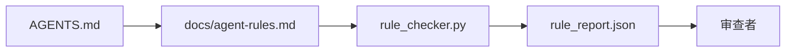

# Agent 指令作为可执行约束

> 以散文形式编写的指令是愿望。以约束形式编写的指令是测试。工作台将每个规则转变为 Agent 可以在运行时检查、审查者可以在事后验证的东西。

**类型：** 构建
**语言：** Python（标准库）
**先决条件：** 阶段 14 · 32（最小工作台）
**时间：** ~50 分钟

## 学习目标

- 将路由散文与操作规则分离。
- 将启动规则、禁止操作、完成定义、不确定性处理和审批边界表达为机器可检查的约束。
- 实现一个根据规则集对运行进行评分的规则检查器。
- 使规则集对差异友好，以便审查能看到变更。

## 问题

典型的 `AGENTS.md` 读起来像入职文档。它告诉 Agent"小心"、"彻底测试"和"不确定时询问"。三天后，Agent 发布了一个没有测试、写入禁止目录、并且从不询问的变更，因为它从不知道界限在哪里。

当指令是操作性的时，它们很强大；当它们只是期望性的时候，它们很弱。修复方法是编写工作台可以解释、审查者可以评分的规则。

## 概念

规则属于 `docs/agent-rules.md`，远离简短的根路由器。每个规则都有一个名称、一个类别和一个检查。



### 覆盖大多数规则的五个类别

| 类别 | 规则回答的问题 | 示例 |
|------|-----------------|------|
| Startup（启动） | 工作开始前必须为真的是什么？ | "状态文件存在且新鲜" |
| Forbidden（禁止） | 什么必须永不发生？ | "不要编辑 `scripts/release.sh`" |
| Definition of done（完成定义） | 什么证明任务完成？ | "pytest 退出 0 且验收行通过" |
| Uncertainty（不确定性） | Agent 不确定时做什么？ | "打开问题笔记而非猜测" |
| Approval（审批） | 什么需要人工审批？ | "任何新依赖、任何生产写入" |

不适合这五个类别之一的规则通常需要拆分成两个规则。强制拆分。

### 规则是机器可读的

每个规则都有一个 slug、一个类别、一行描述和命名 `rule_checker.py` 中函数的 `check` 字段。添加规则意味着添加检查；检查器随工作台一起成长。

### 规则对差异友好

规则在单个 markdown 文件中每个标题一个。重命名在差异中可见。新规则位于其类别的顶部。陈旧的规则被删除，而非注释掉，因为工作台是真相来源，而非团队上季度的感受聊天记录。

### 规则与框架护栏

框架护栏（OpenAI Agents SDK 护栏、LangGraph 中断）在运行时级别强制执行规则。本课中的规则集是那些护栏实现的人类可读、可审查的契约。两者都需要：运行时在轮次期间捕获违规，规则集证明运行时在做正确的事情。

## 构建

`code/main.py` 提供：

- 将规则加载到数据类的 `agent-rules.md` 解析器。
- `rule_checker.py` 风格检查器函数，每个 `check` 引用一个。
- 一个演示 Agent 运行，违反两个规则和一个捕获它们的检查通行。

运行：

```
python3 code/main.py
```

输出：解析的规则集、运行追踪、每个规则的通过/失败，以及保存在脚本旁边的 `rule_report.json`。

## 生产模式

三种模式将有持续一个季度的规则集与一周内衰败的规则集区分开来。

**写入时的严重性标记。** 每个规则携带 `severity`：`block`、`warn` 或 `info`。检查器报告所有三个；运行时仅拒绝 `block`。大多数团队在早期夸大严重性，然后在截止日期压力下悄悄削弱它；写入时标记迫使预先校准。与验证门（阶段 14 · 38）配对，后者将任何对 `block` 规则的覆盖签署到 `overrides.jsonl` 审计日志。

**规则到期作为强制函数。** 每个规则携带一个 `expires_at` 日期（默认自创作起 90 天）。当未到期的规则连续 60 天零违规时，检查器发出警告；下一次季度审查要么证明保留它是合理的，要么将其削弱为 `info`，要么删除它。Cloudflare 的生产 AI 代码审查数据（2026 年 4 月，30 天内 5,169 个仓库的 131,246 次审查运行）显示，具有明确到期的规则集每个仓库保持在 30 条规则以下；没有的规则集增长到 80+ 条，大多数从未触发。

**Markdown 作为源，JSON 作为缓存。** `agent-rules.md` 是创作文件；`agent-rules.lock.json` 是检查器在热路径中读取的缓存。锁由预提交 hook 重新生成。Markdown 差异是可审查的；JSON 解析脱离每轮。与 `package.json` / `package-lock.json` 和 `Cargo.toml` / `Cargo.lock` 形状相同。

## 使用

在生产中：

- Claude Code、Codex、Cursor 在会话开始时读取规则，并在拒绝操作时引用它们。检查器在 CI 中重新运行它们以捕获静默漂移。
- OpenAI Agents SDK 护栏将相同的检查注册为输入和输出护栏。Markdown 是文档层面；SDK 是运行时层面。
- LangGraph 中断在飞行中节点违反规则时触发。中断处理程序读取规则，询问人类，然后恢复。

规则集在所有三者之间是可移植的，因为它只是 markdown 加函数名称。

## 部署

`outputs/skill-rule-set-builder.md` 采访项目所有者，将其现有散文指令分类为五个类别，并发布版本化的 `agent-rules.md` 加检查器存根。

## 练习

1. 如果你的产品真正需要，添加第六个类别。证明它不能合并到五个之一中。
2. 扩展检查器，使规则可以携带严重性（`block`、`warn`、`info`）并且报告相应聚合。
3. 将检查器接入 CI：如果块严重性规则在最新的 Agent 运行上失败，则使构建失败。
4. 为每个规则添加"到期"字段。90 天无检查失败后，规则将接受审查。
5. 找一个真实的 `AGENTS.md` 并将其重写为五类别规则。它的行中有多少是操作性的？多少是期望性的？

## 关键术语

| 术语 | 人们的说法 | 实际含义 |
|------|----------|----------|
| Operational rule（操作性规则） | "真实指令" | 工作台可以在运行时检查的规则 |
| Aspirational rule（期望性规则） | "小心" | 无检查的规则；要么删除要么升级 |
| Definition of done（完成定义） | "验收" | 任务完成的客观、文件支持的证据 |
| Block severity（阻止严重性） | "硬规则" | 违规停止运行；没有操作员无法静音 |
| Rule expiry（规则到期） | "陈旧规则清理" | N 天内无失败的规则即将退役 |

## 延伸阅读

- [OpenAI Agents SDK 护栏](https://platform.openai.com/docs/guides/agents-sdk/guardrails)
- [LangGraph 中断](https://langchain-ai.github.io/langgraph/how-tos/human_in_the_loop/breakpoints/)
- [Anthropic, 构建有效的 Agent](https://www.anthropic.com/research/building-effective-agents)
- [Rick Hightower, Agent RuleZ: 确定性策略引擎](https://medium.com/@richardhightower/agent-rulez-a-deterministic-policy-engine-for-ai-coding-agents-9489e0561edf) — 生产中的阻止/警告/信息严重性
- [Cloudflare, 大规模编排 AI 代码审查](https://blog.cloudflare.com/ai-code-review/) — 131k 审查运行，规则组合经验教训
- [microservices.io, GenAI 开发平台 — 第 1 部分：护栏](https://microservices.io/post/architecture/2026/03/09/genai-development-platform-part-1-development-guardrails.html) — 规则和 CI 之间的深度防御
- [类型检查合规性：确定性护栏 (arXiv 2604.01483)](https://arxiv.org/pdf/2604.01483) — Lean 4 作为规则即检查的上限
- [logi-cmd/agent-guardrails](https://github.com/logi-cmd/agent-guardrails) — 合并门实现：范围、突变测试、违规预算
- 阶段 14 · 32 — 此规则集落入的最小工作台
- 阶段 14 · 38 — 消费规则报告的验证门
- 阶段 14 · 39 — 评分规则合规性的审查者 Agent
