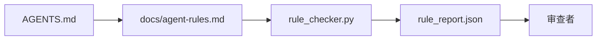

# Agent 指令即可执行的约束（Agent Instructions as Executable Constraints）

> 译注：本文译自同目录 [`en.md`](./en.md)。术语遵循仓根 [TRANSLATION_GUIDE.md](../../../../TRANSLATION_GUIDE.md)。

> 写成散文的指令是愿望，写成约束的指令才是测试。workbench（工作台）把每条规则变成 agent 可以在运行时检查、reviewer（验证器）可以在事后核验的东西。

**Type:** Build
**Languages:** Python (stdlib)
**Prerequisites:** Phase 14 · 32 (Minimal Workbench)
**Time:** ~50 minutes

## 学习目标（Learning Objectives）

- 把路由用的散文与运行规则分开。
- 把启动规则、禁止动作、完成定义、不确定性处理、审批边界，统统表达成机器可检查的约束。
- 实现一个规则检查器（rule checker），按规则集给一次运行打分。
- 让规则集对 diff 友好，让 review 一眼看出改了什么。

## 问题（Problem）

一份典型的 `AGENTS.md` 读起来像新人入职文档。它告诉 agent 要「小心」「测试要充分」「不确定就问」。三天后，这个 agent 提交了一个没测试的改动、写到了一个禁区目录里，而且从来没问过——因为它压根不知道边界在哪。

指令一旦走向操作化（operational）就很有力，停留在愿景化（aspirational）就很无力。解法是：把规则写成 workbench 能解释、reviewer 能打分的东西。

## 概念（Concept）

规则放在 `docs/agent-rules.md` 里，远离那个简短的根路由文件。每条规则都有名字、类别、检查项。



### 五个类别覆盖大部分规则（Five categories that cover most rules）

| 类别 | 这条规则回答什么问题 | 例子 |
|----------|---------------------------|---------|
| Startup（启动） | 开工前必须满足什么？ | 「state 文件存在且足够新」 |
| Forbidden（禁止） | 什么绝对不能发生？ | 「不要修改 `scripts/release.sh`」 |
| Definition of done（完成定义） | 怎么证明任务做完了？ | 「pytest 退出码为 0，且验收行通过」 |
| Uncertainty（不确定性） | 不确定时 agent 怎么办？ | 「开一个 question note，而不是猜」 |
| Approval（审批） | 什么必须人来批？ | 「任何新依赖、任何写生产」 |

不属于这五类的规则，通常其实是两条规则。强制拆开。

### 规则是机器可读的（Rules are machine-readable）

每条规则都有 slug、类别、一行描述，以及一个 `check` 字段，指向 `rule_checker.py` 里的某个函数。新增一条规则就意味着新增一个 check；checker 跟着 workbench 一起长大。

### 规则对 diff 友好（Rules are diff-friendly）

规则在一个 markdown 文件里、每条占一个 heading。改名在 diff 里能看到。新规则放在所属类别的最上面。陈旧的规则要删掉，而不是注释掉，因为 source of truth 是 workbench，不是团队上个季度心情如何的聊天记录。

### 规则 vs framework guardrail（Rules versus framework guardrails）

framework 层面的 guardrail（护栏，比如 OpenAI Agents SDK guardrails、LangGraph interrupts）在运行时强制执行规则。本节讲的规则集是那些 guardrail 背后那份**人类可读、可 review** 的契约。两者你都需要：runtime 抓住 turn 内的违规，规则集证明 runtime 做的事是对的。

## 动手实现（Build It）

`code/main.py` 自带：

- `agent-rules.md` 解析器，把规则加载进 dataclass。
- `rule_checker.py` 风格的检查函数，每个 `check` 引用对应一个。
- 一段 demo agent 运行：故意违反两条规则，由 check pass 把它们抓出来。

跑起来：

```
python3 code/main.py
```

输出：解析后的规则集、运行 trace、每条规则的 pass/fail，以及一份 `rule_report.json` 存在脚本旁边。

## 现实世界里的生产模式（Production patterns in the wild）

有三种模式，决定一份规则集是能撑一个季度，还是一周就开始腐烂。

**写入时就打 severity 标签（Severity tagging at write time）。** 每条规则带一个 `severity`：`block`、`warn` 或 `info`。checker 三种都会报；runtime 只会因为 `block` 而拒绝执行。大多数团队早期把 severity 写得过重，到了 deadline 压力下又偷偷调弱；写入时就打标签可以逼着团队前置完成校准。配合 verification gate（Phase 14 · 38）一起用：任何对 `block` 规则的 override 都会被签名后写进 `overrides.jsonl` 审计日志。

**用 rule expiry 当倒逼机制（Rule expiry as a forcing function）。** 每条规则带一个 `expires_at` 日期（默认从写入起 90 天）。如果一条没过期的规则连续 60 天 0 违规，checker 就会发出 warning；下一次季度 review 要么给出留下它的理由、要么降级为 `info`、要么删掉。Cloudflare 的生产 AI Code Review 数据（2026 年 4 月，30 天内 5169 个 repo 上的 131,246 次 review run）显示：有显式 expiry 的规则集，每个 repo 始终在 30 条以内；没有 expiry 的，会涨到 80+，而且大部分从来没触发过。

**Markdown 是源，JSON 是缓存（Markdown-as-source, JSON-as-cache）。** `agent-rules.md` 是作者写的那份；`agent-rules.lock.json` 是 checker 在热路径上读的缓存。lock 由 pre-commit hook 重新生成。Markdown 的 diff 可以 review；JSON 解析不进入每个 turn 的开销。形式跟 `package.json` / `package-lock.json`、`Cargo.toml` / `Cargo.lock` 是一样的。

## 用起来（Use It）

在生产里：

- Claude Code、Codex、Cursor 在 session 启动时读规则；拒绝某个动作时会把规则原文引出来。CI 里 checker 重跑一遍这些规则，抓静默漂移。
- OpenAI Agents SDK 的 guardrail 把同一批 check 注册成 input guardrail 和 output guardrail。Markdown 是文档面，SDK 是运行时面。
- LangGraph 的 interrupt 在某个执行中节点违规时被触发。interrupt 处理器读规则、问人、然后 resume。

这套规则集在三个地方都能用，因为它本质就是 markdown + 函数名。

## 上线部署（Ship It）

`outputs/skill-rule-set-builder.md` 是一个 skill：访谈项目负责人，把他现有那堆散文指令分类进这五个类别，产出一份带版本号的 `agent-rules.md`，以及一个 checker 桩。

## 练习（Exercises）

1. 如果你的产品确实需要，加一个第六类。请说明它为什么不能塌缩进现有五类的某一个。
2. 扩展 checker，让一条规则可以带 severity（`block`、`warn`、`info`），report 按 severity 聚合。
3. 把 checker 接进 CI：最近一次 agent 运行里，只要有一条 block-severity 的规则失败就 fail build。
4. 给每条规则加一个「expiry」字段。90 天内没出现 check fail 的规则进入 review 队列。
5. 找一份真实的 `AGENTS.md`，把它重写成五类规则。它有多少行是操作化的？多少行是愿景化的？

## 关键术语（Key Terms）

| Term | 大家嘴上怎么说 | 它实际是什么 |
|------|----------------|------------------------|
| Operational rule（操作化规则） | 「真正的指令」 | workbench 能在运行时 check 的规则 |
| Aspirational rule（愿景化规则） | 「要小心」 | 没有 check 的规则；要么删掉、要么升级 |
| Definition of done（完成定义） | 「验收」 | 一份客观的、有文件支撑的「任务完成」证明 |
| Block severity（block 级严重度） | 「硬规则」 | 违规则停跑；没 operator 介入就关不掉 |
| Rule expiry（规则过期） | 「清扫陈旧规则」 | 连续 N 天没失败的规则，进入退役评审 |

## 延伸阅读（Further Reading）

- [OpenAI Agents SDK guardrails](https://platform.openai.com/docs/guides/agents-sdk/guardrails)
- [LangGraph interrupts](https://langchain-ai.github.io/langgraph/how-tos/human_in_the_loop/breakpoints/)
- [Anthropic, Building Effective Agents](https://www.anthropic.com/research/building-effective-agents)
- [Rick Hightower, Agent RuleZ: A Deterministic Policy Engine](https://medium.com/@richardhightower/agent-rulez-a-deterministic-policy-engine-for-ai-coding-agents-9489e0561edf) — 生产中的 block/warn/info severity
- [Cloudflare, Orchestrating AI Code Review at Scale](https://blog.cloudflare.com/ai-code-review/) — 13.1 万次 review 运行、规则组合的经验教训
- [microservices.io, GenAI development platform — part 1: guardrails](https://microservices.io/post/architecture/2026/03/09/genai-development-platform-part-1-development-guardrails.html) — 规则与 CI 之间的纵深防御
- [Type-Checked Compliance: Deterministic Guardrails (arXiv 2604.01483)](https://arxiv.org/pdf/2604.01483) — 用 Lean 4 给「规则即 check」划上限
- [logi-cmd/agent-guardrails](https://github.com/logi-cmd/agent-guardrails) — merge-gate 实现：scope、变异测试、违规预算
- Phase 14 · 32 —— 这套规则集要落进的那个 minimal workbench
- Phase 14 · 38 —— 消费这份规则报告的 verification gate
- Phase 14 · 39 —— 给规则合规度打分的 reviewer agent
