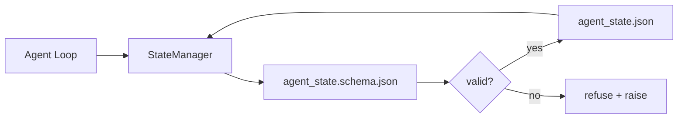

# Repo Memory and Durable State

> Chat history is volatile. The repo is durable. The workbench stores agent state in versioned files so the next session, the next agent, and the next reviewer all read from the same source of truth.

**Type:** Build
**Languages:** Python (stdlib + `jsonschema` optional)
**Prerequisites:** Phase 14 · 32 (Minimal Workbench)
**Time:** ~60 minutes

## Learning Objectives

- Define what belongs in repo memory and what belongs in chat history.
- Author JSON Schemas for `agent_state.json` and `task_board.json`.
- Build a state manager that loads, validates, mutates, and persists state atomically.
- Use the schema to refuse bad writes before they corrupt the workbench.

## The Problem

The agent finishes a session. The chat closes. The next session opens and asks where to start. The model says "let me check the files," reads stale notes, and re-does work that was already complete. Or worse, it rewrites a finished file because no one told it the file was finished.

The workbench fix is repo memory: state lives in JSON files in the repo, written under a schema, persisted atomically, diff-friendly in code review. Chat is a transient feed; the repo is the system of record.

## The Concept



### What belongs in repo memory

| Belongs | Does not belong |
|---------|-----------------|
| Active task id | Raw chat transcripts |
| Touched files this session | Token-level reasoning traces |
| Assumptions the agent made | "The user seemed frustrated" |
| Open blockers | Sampled completions |
| Next action | Vendor-specific model ids |

The test is durability: would this be useful three months from now in a CI rerun? If yes, repo. If no, telemetry.

### Schema-first state

JSON Schema is the contract. Without it, every agent invents new fields, every reviewer learns a new shape, and every CI script has to special-case past versions. With it, a bad write is a refused write.

The schema covers:

- Required keys.
- Allowed `status` values.
- Forbidden values (e.g. `null` for arrays).
- Pattern constraints (task ids match `T-\d{3,}`).
- Version field for migrations.

### Atomic writes

State writes need to survive partial failures: write to a tempfile, fsync, rename over the target. The state file is the source of truth; a half-written one is worse than no file at all.

### Migrations

When the schema changes, ship a migration script next to the schema bump. The state file carries a `schema_version` field; the manager refuses to load a file from a version it cannot migrate.

## Build It

`code/main.py` implements:

- `agent_state.schema.json` and `task_board.schema.json`.
- A stdlib-only validator (subset of JSON Schema: required, type, enum, pattern, items).
- `StateManager.load`, `StateManager.update`, `StateManager.commit` with atomic temp-and-rename writes.
- A demo that mutates state, persists, reloads, and proves the round-trip.

Run it:

```
python3 code/main.py
```

The script writes `workdir/agent_state.json` and `workdir/task_board.json`, mutates them across two turns, and prints the validated state at each step.

## Use It

In production:

- **LangGraph checkpointers.** Same idea, different storage. The checkpointer persists graph state to SQLite, Postgres, or a custom backend. The schema this lesson teaches is what you reach for when the checkpointer dies and you need to read state by hand.
- **Letta memory blocks.** Persistent blocks with structured schemas (Phase 14 · 08). Same discipline scoped to long-running personas.
- **OpenAI Agents SDK session store.** Pluggable backends, schema-aware. The state file in this lesson is the local-file backend.

## Ship It

`outputs/skill-state-schema.md` generates a project-specific JSON Schema pair (state + board), a Python `StateManager` wired to atomic writes, and a migration scaffold so the next schema bump does not break the workbench.

## Exercises

1. Add a `last_human_touch` timestamp. Refuse any agent write within five seconds of a human edit.
2. Extend the validator to support `oneOf` so a task can be either a build task or a review task with different required fields.
3. Add a `schema_version` field and write the migration from v1 to v2 (rename `blockers` to `risks`).
4. Move the storage backend from a local file to SQLite. Keep the `StateManager` API identical.
5. Run two agents against the same state file with a 50 ms write race. What goes wrong and how does the atomic rename save you?

## Key Terms

| Term | What people say | What it actually means |
|------|----------------|------------------------|
| Repo memory | "Notes file" | State stored in tracked files in the repo, under schema |
| Schema-first | "Validate inputs" | Define the contract before the writer, refuse drift |
| Atomic write | "Just rename" | Write to temp, fsync, rename, so partial failures cannot corrupt |
| Migration | "Schema bump" | A script that turns vN state into v(N+1) state |
| System of record | "Source of truth" | The artifact the workbench treats as authoritative |

## Further Reading

- [JSON Schema specification](https://json-schema.org/specification.html)
- [LangGraph checkpointers](https://langchain-ai.github.io/langgraph/concepts/persistence/)
- [Letta memory blocks](https://docs.letta.com/concepts/memory)
- Phase 14 · 08 — memory blocks and sleep-time compute
- Phase 14 · 32 — the three-file minimum this lesson schematizes
