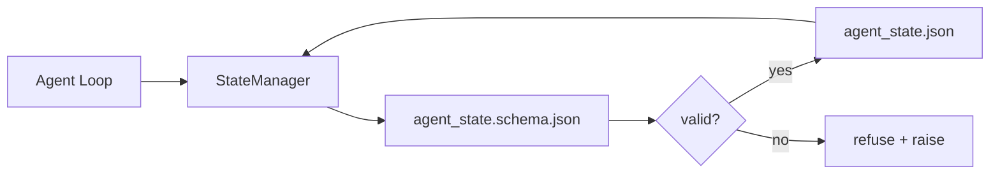

# Repo Memory と Durable State

> chat history は揮発的です。repo は durable です。workbench は agent state を versioned files に保存し、次の session、次の agent、次の reviewer が同じ source of truth から読めるようにします。

**種別:** 構築
**言語:** Python (stdlib + `jsonschema` optional)
**前提条件:** Phase 14 · 32 (Minimal Workbench)
**所要時間:** 約60分

## Learning Objectives

- repo memory に属するものと chat history に属するものを定義する。
- `agent_state.json` と `task_board.json` の JSON Schemas を作成する。
- state を load、validate、mutate、atomic に persist する state manager を構築する。
- schema を使い、bad write が workbench を壊す前に拒否する。

## 問題

agent が session を終えます。chat が閉じます。次の session が開き、どこから始めるかを尋ねます。model は "let me check the files" と言い、stale notes を読み、既に完了した work をやり直します。さらに悪い場合、file が完了済みだと誰も教えていないため、finished file を書き直します。

workbench の修正は repo memory です。state は repo 内の JSON files に置き、schema の下で書かれ、atomic に persist され、code review で diff-friendly になります。chat は transient feed です。repo が system of record です。

## The Concept



### repo memory に属するもの

| 属する | 属さない |
|--------|----------|
| Active task id | Raw chat transcripts |
| Touched files this session | Token-level reasoning traces |
| Assumptions the agent made | "The user seemed frustrated" |
| Open blockers | Sampled completions |
| Next action | Vendor-specific model ids |

判定基準は durability です。3 か月後の CI rerun で役に立つなら repo。そうでなければ telemetry です。

### Schema-first state

JSON Schema は contract です。なければ、各 agent が新しい fields を発明し、各 reviewer が新しい shape を覚え、各 CI script が過去 versions を special-case することになります。あれば、bad write は refused write になります。

schema は次を扱います。

- required keys。
- 許可される `status` values。
- forbidden values (例: arrays に対する `null`)。
- pattern constraints (task ids は `T-\d{3,}` に match)。
- migrations 用の version field。

### Atomic writes

state writes は partial failures を生き残る必要があります。tempfile に書き、fsync し、target に rename します。state file は source of truth です。half-written file は file がないより悪いです。

### Migrations

schema が変わるときは、schema bump の横に migration script を ship します。state file は `schema_version` field を持ちます。manager は migrate できない version の file を load しません。

## 実装

`code/main.py` は次を実装します。

- `agent_state.schema.json` と `task_board.schema.json`。
- stdlib-only validator (JSON Schema subset: required, type, enum, pattern, items)。
- atomic temp-and-rename writes を持つ `StateManager.load`, `StateManager.update`, `StateManager.commit`。
- state を mutate、persist、reload し、round-trip を証明する demo。

実行:

```
python3 code/main.py
```

script は `workdir/agent_state.json` と `workdir/task_board.json` を書き、2 turns にわたって mutate し、各 step の validated state を表示します。

## Production patterns in the wild

lesson の minimum を multi-agent monorepo が耐えられるものにする pattern は 4 つあります。

**Atomic temp-and-rename is not optional.** March 2026 の Hive project bug report は failure mode を明確に示しています。`state.json` が `write_text()` で書かれ、exceptions が catch されて silence されていました。partial writes により corrupt state に対して sessions が resume し、signal はありませんでした。修正は常に同じです。target と同じ directory で `tempfile.mkstemp`、write、`fsync`、`os.replace` (POSIX と Windows で atomic rename)。この lesson の `atomic_write` はそれを行います。

**Idempotency keys on every non-idempotent tool call.** agent が tool call 後、result の checkpoint 前に crash すると、recovery は tool call を retry します。reads なら安全ですが、emails、DB inserts、file uploads では危険です。pattern は、execution 前にすべての tool call ID を `pending_calls.jsonl` に log することです。retry 時に ID が存在すれば call を skip し、cached result を使います。Anthropic と LangChain は 2026 guidance でこれを強調しており、LangGraph の checkpointer も同じ理由で pending writes を persist します。

**Separate large artifacts from state.** CSV、long transcripts、generated files を `agent_state.json` に保存しないでください。artifact は separate file として保存するか object storage に upload し、state には path だけを残します。checkpoints は small and fast のまま、artifacts は独立して成長します。

**Event sourcing for audit, snapshots for resume.** すべての mutation で event log (`state.events.jsonl`) に append し、periodically `state.json` に snapshot します。resume は snapshot を読み、snapshot timestamp 以降の events を replay します。disk は多く使いますが、agent decisions を verbatim に replay できます。long-horizon runs の debugging では必須です。Postgres が内部で WAL に使う形と同じです。

**Schema migrations or refuse to load.** `schema_version` integer が contract です。manager が unknown version の file を load したら、読むことを拒否します。schema bump の横に migration script を ship し、`tools/migrate_state.py` を毎 startup で idempotent に実行します。

## Use It

production では次のように現れます。

- **LangGraph checkpointers.** 同じ考え、別 storage。checkpointer は graph state を SQLite、Postgres、custom backend に persist します。この lesson の schema は、checkpointer が死んだときに state を手で読むためのものです。
- **Letta memory blocks.** structured schemas を持つ persistent blocks (Phase 14 · 08)。long-running personas に scope された同じ discipline です。
- **OpenAI Agents SDK session store.** pluggable backends、schema-aware。この lesson の state file は local-file backend です。

## Ship It

`outputs/skill-state-schema.md` は project-specific な JSON Schema pair (state + board)、atomic writes に結線した Python `StateManager`、次の schema bump で workbench を壊さない migration scaffold を生成します。

## Exercises

1. `last_human_touch` timestamp を追加してください。human edit から 5 秒以内の agent write を拒否します。
2. validator を拡張して `oneOf` を support し、task が build task または review task のどちらかになり、それぞれ different required fields を持てるようにしてください。
3. `schema_version` field を追加し、v1 から v2 への migration (`blockers` を `risks` に rename) を書いてください。
4. storage backend を local file から SQLite に移してください。`StateManager` API は同一に保ちます。
5. 2 つの agents を同じ state file に対して 50 ms の write race で走らせてください。何が壊れ、atomic rename は何を救いますか。

## Key Terms

| Term | よくある言い方 | 実際の意味 |
|------|----------------|------------|
| Repo memory | "Notes file" | schema の下で repo の tracked files に保存される state |
| Schema-first | "Validate inputs" | writer より前に contract を定義し、drift を拒否する |
| Atomic write | "Just rename" | temp に書き、fsync、rename して partial failure による corruption を防ぐ |
| Migration | "Schema bump" | vN state を v(N+1) state に変える script |
| System of record | "Source of truth" | workbench が authoritative と扱う artifact |

## 参考文献

- [JSON Schema specification](https://json-schema.org/specification.html)
- [LangGraph checkpointers](https://langchain-ai.github.io/langgraph/concepts/persistence/)
- [Letta memory blocks](https://docs.letta.com/concepts/memory)
- [Fast.io, AI Agent State Checkpointing: A Practical Guide](https://fast.io/resources/ai-agent-state-checkpointing/) — schema-first checkpointing with idempotency
- [Fast.io, AI Agent Workflow State Persistence: Best Practices 2026](https://fast.io/resources/ai-agent-workflow-state-persistence/) — concurrency control、TTL、event sourcing
- [Hive Issue #6263 — non-atomic state.json writes silently ignored](https://github.com/aden-hive/hive/issues/6263) — real project における failure mode
- [eunomia, Checkpoint/Restore Systems: Evolution, Techniques, Applications](https://eunomia.dev/blog/2025/05/11/checkpointrestore-systems-evolution-techniques-and-applications-in-ai-agents/) — OS history から agent に適用された CR primitives
- [Indium, 7 State Persistence Strategies for Long-Running AI Agents in 2026](https://www.indium.tech/blog/7-state-persistence-strategies-ai-agents-2026/)
- [Microsoft Agent Framework, Compaction](https://learn.microsoft.com/en-us/agent-framework/agents/conversations/compaction) — vendor checkpoint manager
- Phase 14 · 08 — memory blocks and sleep-time compute
- Phase 14 · 32 — この lesson が schematize する 3 file minimum
- Phase 14 · 40 — 同じ schema から読む handoff packets
