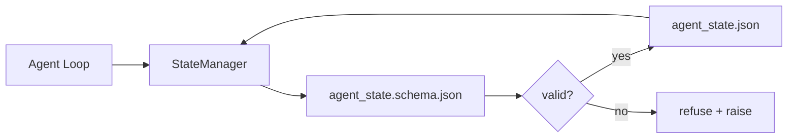

# Memória de Repo e Estado Durável

> Histórico de chat é volátil. O repo é durável. O workbench armazena o estado do agent em arquivos versionados pra que a próxima sessão, o próximo agent, e o próximo reviewer todos leiam da mesma fonte de verdade.

**Tipo:** Construa
**Linguagens:** Python (stdlib + `jsonschema` opcional)
**Pré-requisitos:** Fase 14 · 32 (Workbench Mínimo)
**Tempo:** ~60 minutos

## Objetivos de Aprendizado

- Definir o que pertence à memória de repo e o que pertence ao histórico de chat.
- Criar JSON Schemas pra `agent_state.json` e `task_board.json`.
- Construir um gerenciador de estado que carrega, valida, muta e persiste estado atomicamente.
- Usar o schema pra recusar escritas ruins antes de corromperem o workbench.

## O Problema

O agent termina uma sessão. O chat fecha. A próxima sessão abre e pergunta por onde começar. O modelo diz "deixa eu checar os arquivos," lê anotações obsoletas e refaz trabalho que já tava pronto. Ou pior, reescreve um arquivo que tava terminado porque ninguém falou que o arquivo tava terminado.

A solução do workbench é memória de repo: estado vive em arquivos JSON no repo, escrito sob um schema, persistido atomicamente, amigável a diffs no code review. Chat é um feed transitório; o repo é o sistema de registro.

## O Conceito



### O que pertence à memória de repo

| Pertence | Não pertence |
|----------|--------------|
| Id da tarefa ativa | Transcrições brutas de chat |
| Arquivos tocados nesta sessão | Traces de raciocínio a nível de token |
| Premissas que o agent fez | "O usuário parecia frustrado" |
| Bloqueios abertos | Completions amostradas |
| Próxima ação | IDs de modelo específicos de vendor |

O teste é durabilidade: isso seria útil três meses a partir de agora num rerun de CI? Se sim, repo. Se não, telemetria.

### Estado com schema primeiro

JSON Schema é o contrato. Sem ele, cada agent inventa novos campos, cada reviewer aprende uma nova forma, e cada script de CI tem que tratar versões passadas como caso especial. Com ele, uma escrita ruim é uma escrita recusada.

O schema cobre:

- Chaves obrigatórias.
- Valores permitidos de `status`.
- Valores proibidos (ex. `null` pra arrays).
- Restrições de padrão (ids de tarefa combinam com `T-\d{3,}`).
- Campo de versão pra migrações.

### Escritas atômicas

Escritas de estado precisam sobreviver a falhas parciais: escrever num tempfile, fsync, renomear sobre o alvo. O arquivo de estado é a fonte de verdade; um escrito pela metade é pior que nenhum arquivo.

### Migrações

Quando o schema muda, lance um script de migração ao lado do bump de schema. O arquivo de estado carrega um campo `schema_version`; o gerenciador se recusa a carregar um arquivo de uma versão que não consegue migrar.

## Construa

`code/main.py` implementa:

- `agent_state.schema.json` e `task_board.schema.json`.
- Um validator só com stdlib (subconjunto de JSON Schema: required, type, enum, pattern, items).
- `StateManager.load`, `StateManager.update`, `StateManager.commit` com escritas atômicas de temp-and-rename.
- Uma demo que muta estado, persiste, recarrega, e prova o round-trip.

Execute:

```
python3 code/main.py
```

O script escreve `workdir/agent_state.json` e `workdir/task_board.json`, muta eles ao longo de dois turnos, e imprime o estado validado a cada passo.

## Padrões de produção no mundo real

Quatro padrões transformam o mínimo da aula em algo que um monorepo multi-agent consegue sobreviver.

**Atomic temp-and-rename não é opcional.** Um bug report do projeto Hive de março de 2026 documenta o modo de falha de forma limpa: `state.json` foi escrito via `write_text()` e exceções foram capturadas e silenciadas. Escritas parciais deixaram sessões retomando contra estado corrompido sem nenhum sinal. A solução é sempre: `tempfile.mkstemp` no mesmo diretório que o alvo, escrever, `fsync`, `os.replace` (rename atômico no POSIX e Windows). O `atomic_write` dessa aula faz exatamente isso.

**Chaves de idempotência em toda chamada de ferramenta não idempotente.** Se um agent crasha depois de chamar uma ferramenta mas antes de checkpointar o resultado, a recuperação tenta a chamada de ferramenta de novo. Seguro pra leituras; perigoso pra emails, inserts em DB, uploads de arquivo. O padrão: logue o ID de cada chamada de ferramenta antes da execução num `pending_calls.jsonl`. No retry, verifique o ID; se estiver presente, pule a chamada e use o resultado em cache. Anthropic e LangChain ambos destacam isso em orientações de 2026; o checkpointer do LangGraph persiste escritas pendentes pelo mesmo motivo.

**Separe artefatos grandes do estado.** Não armazene CSVs, transcrições longas ou arquivos gerenciados em `agent_state.json`. Salve o artefato como um arquivo separado (ou upload pra object storage) e guarde só o caminho no estado. Checkpoints ficam pequenos e rápidos; os artefatos crescem independentemente.

**Event sourcing pra auditoria, snapshots pra retomada.** Anexe a um log de eventos (`state.events.jsonl`) a cada mutação; periodicamente snapshotie pra `state.json`. A retomada lê o snapshot, depois refaz qualquer evento após o timestamp do snapshot. Isso custa mais disco mas permite refazer decisões de agent word-for-word — essencial na hora de debugar execuções de horizonte longo. Mesma forma que o Postgres usa internamente pra WAL.

**Migrações de schema ou recusa de carregar.** O inteiro `schema_version` é o contrato. Quando o gerenciador carrega um arquivo numa versão desconhecida, ele se recusa a ler. Lance um script de migração ao lado do bump de schema; `tools/migrate_state.py` roda idempotentemente a cada inicialização.

## Use

Em produção:

- **Checkpoints do LangGraph.** Mesma ideia, armazenamento diferente. O checkpointer persiste o estado do grafo em SQLite, Postgres ou um backend customizado. O schema que essa aula ensina é o que você recorre quando o checkpointer morre e precisa ler o estado na mão.
- **Memory blocks do Letta.** Blocos persistentes com schemas estruturados (Fase 14 · 08). Mesma disciplina limitada a personas de execução longa.
- **Session store do OpenAI Agents SDK.** Backends plugáveis, consciente de schema. O arquivo de estado nessa aula é o backend de arquivo local.

## Entregue

`outputs/skill-state-schema.md` gera um par de JSON Schemas específico do projeto (estado + board), um `StateManager` Python conectado a escritas atômicas, e um scaffold de migração pra que o próximo bump de schema não quebre o workbench.

## Exercícios

1. Adicione um timestamp `last_human_touch`. Recuse qualquer escrita de agent dentro de cinco segundos de uma edição humana.
2. Estenda o validator pra suportar `oneOf` pra que uma tarefa possa ser tanto uma tarefa de build quanto uma tarefa de review com campos obrigatórios diferentes.
3. Adicione um campo `schema_version` e escreva a migração de v1 pra v2 (renomear `blockers` pra `risks`).
4. Mova o backend de armazenamento de arquivo local pra SQLite. Mantenha a API do `StateManager` idêntica.
5. Execute dois agents contra o mesmo arquivo de estado com uma corrida de escrita de 50 ms. O que dá errado e como o rename atômico te salva?

## Termos-Chave

| Termo | O que a galera fala | O que realmente significa |
|-------|---------------------|--------------------------|
| Memória de repo | "Arquivo de anotações" | Estado armazenado em arquivos rastreados no repo, sob schema |
| Schema primeiro | "Validar inputs" | Definir o contrato antes do escritor, recusar drift |
| Escrita atômica | "Só renomear" | Escrever no temp, fsync, renomear, pra que falhas parciais não corrompam |
| Migração | "Bump de schema" | Um script que transforma estado de vN em estado de v(N+1) |
| Sistema de registro | "Fonte de verdade" | O artefato que o workbench trata como autoritativo |

## Leitura Complementar

- [JSON Schema specification](https://json-schema.org/specification.html)
- [LangGraph checkpointers](https://langchain-ai.github.io/langgraph/concepts/persistence/)
- [Letta memory blocks](https://docs.letta.com/concepts/memory)
- [Fast.io, AI Agent State Checkpointing: A Practical Guide](https://fast.io/resources/ai-agent-state-checkpointing/) — checkpointing com schema primeiro e idempotência
- [Fast.io, AI Agent Workflow State Persistence: Best Practices 2026](https://fast.io/resources/ai-agent-workflow-state-persistence/) — controle de concorrência, TTL, event sourcing
- [Hive Issue #6263 — non-atomic state.json writes silently ignored](https://github.com/aden-hive/hive/issues/6263) — o modo de falha num projeto real
- [eunomia, Checkpoint/Restore Systems: Evolution, Techniques, Applications](https://eunomia.dev/blog/2025/05/11/checkpointrestore-systems-evolution-techniques-and-applications-in-ai-agents/) — primitivos de CR da história de OS aplicados a agents
- [Indium, 7 State Persistence Strategies for Long-Running AI Agents in 2026](https://www.indium.tech/blog/7-state-persistence-strategies-ai-agents-2026/)
- [Microsoft Agent Framework, Compaction](https://learn.microsoft.com/en-us/agent-framework/agents/conversations/compaction) — gerenciador de checkpoint de vendor
- Fase 14 · 08 — memory blocks e computação de sono
- Fase 14 · 32 — o mínimo de três arquivos que essa aula esquematiza
- Fase 14 · 40 — pacotes de handoff lidos do mesmo schema
