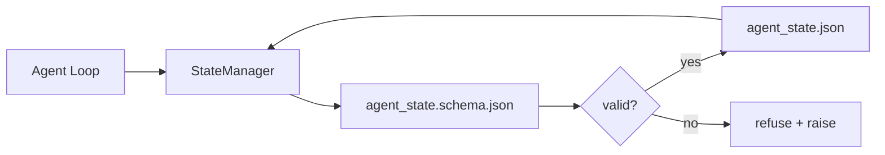

# Repo Bellek ve Dayanıklı Durum

> Sohbet geçmişi geçicidir. Repo dayanıklıdır. Workbench, agent durumunu sürümlendirilmiş dosyalarda saklar, böylece bir sonraki oturum, bir sonraki agent ve bir sonraki gözden geçirenin tümü aynı doğruluk kaynağından okunur.

**Tür:** Yapım
**Diller:** Python (stdlib + `jsonschema` isteğe bağlı)
**Önkoşullar:** Aşama 14 · 32 (Minimal Çalışma Tezgahı)
**Süre:** ~60 dakika

## Öğrenme Hedefleri

- Nelerin repo hafızasına, nelerin sohbet geçmişine ait olduğunu tanımlayın.
- `agent_state.json` ve `task_board.json` için JSON Şemaları yazın.
- Durumu atomik olarak yükleyen, doğrulayan, değiştiren ve sürdüren bir durum yöneticisi oluşturun.
- Kötü yazma işlemlerini, tezgahı bozmadan önce reddetmek için şemayı kullanın.

## Sorun

agent bir oturumu bitirir. Sohbet kapanır. Bir sonraki oturum açılır ve nereden başlayacağınız sorulur. Model "dosyaları kontrol edeyim" diyor, eski notları okuyor ve zaten tamamlanmış işi yeniden yapıyor. Daha da kötüsü, kimse ona dosyanın bittiğini söylemediği için bitmiş bir dosyayı yeniden yazar.

Tezgah düzeltmesi repo belleğidir: durum, repodaki JSON dosyalarında yaşar, bir şema altında yazılır, atomik olarak kalıcıdır, kod incelemesinde fark dostudur. Sohbet geçici bir yayındır; repo kayıt sistemidir.

## Konsept



### Repo belleğinde neler var

| Ait | Ait değil |
|---------|-----------------|
| Aktif görev kimliği | Ham sohbet transkriptleri |
| Bu oturumda dosyalara dokundum | Token düzeyindeki akıl yürütme izleri |
| agent'nin yaptığı varsayımlar | "Kullanıcı sinirli görünüyordu" |
| Engelleyicileri aç | Örnek tamamlamalar |
| Sonraki eylem | Satıcıya özel model kimlikleri |

Test dayanıklılıktır: Bu, bundan üç ay sonra CI'nın yeniden çalışmasında faydalı olur mu? Evet ise, repo. Hayırsa telemetri.

### Şema-ilk durumu

JSON Şeması sözleşmedir. Bu olmadan, her agent yeni alanlar icat eder, her gözden geçiren yeni bir şekil öğrenir ve her CI betiğinin geçmiş sürümleri özel harfle yazması gerekir. Bununla birlikte, kötü bir yazma, reddedilen bir yazmadır.

Şema şunları kapsar:

- Gerekli anahtarlar.
- İzin verilen `status` değerleri.
- Yasak değerler (diziler için e.g. `null`).
- Desen kısıtlamaları (görev kimlikleri `T-\d{3,}` ile eşleşir).
- Geçişler için sürüm alanı.

### Atomik yazma

Durum yazmalarının kısmi hatalardan kurtulması gerekir: geçici dosyaya yazma, fsync, hedef üzerinde yeniden adlandırma. Devlet dosyası gerçeğin kaynağıdır; yarısı yazılmış bir dosya hiç dosya olmamasından daha kötüdür.

### Taşımalar

Şema değiştiğinde şema çıkıntısının yanına bir geçiş komut dosyası gönderin. Durum dosyası bir `schema_version` alanı taşır; yönetici, taşıyamayacağı bir sürümden dosya yüklemeyi reddediyor.

## İnşa Et

`code/main.py` şunu uygular:

- `agent_state.schema.json` ve `task_board.schema.json`.
- Yalnızca stdlib doğrulayıcı (JSON Şemasının alt kümesi: gerekli, tür, numaralandırma, desen, öğeler).
- Atomik sıcaklık ve yeniden adlandırma yazmalarıyla `StateManager.load`, `StateManager.update`, {`StateManager.commit`.
- Durumu değiştiren, devam eden, yeniden yükleyen ve gidiş-dönüş kanıtlayan bir demo.

Çalıştır:

```
python3 code/main.py
```

Betik, `workdir/agent_state.json` ve `workdir/task_board.json` yazar, bunları iki tur boyunca değiştirir ve her adımda doğrulanmış durumu yazdırır.

## Vahşi doğada üretim modelleri

Dört model, dersin minimumunu bir multi-agent monorepo'nun hayatta kalabileceği bir şeye dönüştürür.

**Atomik sıcaklık ve yeniden adlandırma isteğe bağlı değildir.** Mart 2026'daki Hive projesi hata raporu, hata modunu net bir şekilde belgelemektedir: `state.json`, `write_text()` aracılığıyla yazılmıştır ve istisnalar yakalanıp susturulmuştur. Kısmi, sinyal olmadan bozuk duruma karşı devam eden sol oturumları yazar. Düzeltme her zaman: hedefle aynı dizinde {`tempfile.mkstemp`, write, `fsync`, `os.replace` (POSIX ve Windows'ta atomik yeniden adlandırma). Bu dersin `atomic_write` tam olarak bunu yapıyor.

**Her idempotent olmayan araç çağrısında kimlik anahtarları.** Bir agent, bir aracı çağırdıktan sonra ancak sonucu kontrol etmeden önce çökerse, kurtarma, araç çağrısını yeniden dener. Okumalar için güvenli; e-postalar, veritabanı eklemeleri ve dosya yüklemeleri için tehlikelidir. Model: yürütmeden önce her takım çağrı kimliğini bir `pending_calls.jsonl`'ye kaydedin. Yeniden denediğinizde kimliği kontrol edin; mevcutsa aramayı atlayın ve önbelleğe alınan sonucu kullanın. Anthropic ve LangChain bunu 2026 kılavuzunda dile getiriyor; LangGraph'ın denetim işaretçisi aynı nedenden ötürü bekleyen yazma işlemlerine devam ediyor.

**Büyük artifact'leri durumdan ayırın.** CSV'leri, uzun transkriptleri veya oluşturulan dosyaları `agent_state.json` içinde saklamayın. artifact dosyasını ayrı bir dosya olarak kaydedin (veya nesne depolama alanına yükleyin) ve yalnızca yolu olduğu gibi tutun. Kontrol noktaları küçük ve hızlı kalıyor; artifact'ler bağımsız olarak büyür.

**Denetim için olay kaynağı, özgeçmiş için anlık görüntüler.** Her mutasyona bir olay günlüğü (`state.events.jsonl`) ekleyin; `state.json`'a periyodik olarak anlık görüntü. Devam ettir, anlık görüntüyü okur ve ardından anlık görüntünün zaman damgasından sonraki tüm etkinlikleri yeniden oynatır. Bu, daha fazla diske mal olur ancak agent kararlarını kelimesi kelimesine tekrarlamanıza olanak tanır; uzun ufuklu çalışmalarda hata ayıklama yaparken gereklidir. Postgres'in WAL için dahili olarak kullandığı şeklin aynısı.

**Şema taşıma işlemleri veya yüklemenin reddedilmesi.** `schema_version` tamsayısı sözleşmedir. Yönetici bilinmeyen bir sürüme sahip bir dosya yüklediğinde dosya okumayı reddediyor. Şema çıkıntısının yanına bir geçiş komut dosyası gönderin; `tools/migrate_state.py` her başlangıçta önemsiz bir şekilde çalışır.

## Kullan onu

Üretimde:

- **LangGraph kontrol noktaları.** Aynı fikir, farklı depolama. Denetim işaretçisi grafik durumunu SQLite, Postgres veya özel bir arka uçta sürdürür. Bu dersin öğrettiği şema, kontrol noktası öldüğünde ve durumu elle okumanız gerektiğinde ulaşacağınız şeydir.
- **Letta bellek blokları.** Yapılandırılmış şemalara sahip kalıcı bloklar (Aşama 14 · 08). Aynı disiplin uzun süredir devam eden kişilikleri de kapsıyordu.
- **OpenAI Agent'nin SDK oturum deposu.** Takılabilir arka uçlar, şema uyumlu. Bu dersteki durum dosyası yerel dosya arka ucudur.

## Gönderin

`outputs/skill-state-schema.md`, projeye özgü bir JSON Şema çifti (durum + pano), atomik yazmalara bağlı bir Python `StateManager` ve bir geçiş iskelesi oluşturur; böylece bir sonraki şema artışı çalışma tezgahını bozmaz.

## Egzersizler

1. `last_human_touch` zaman damgasını ekleyin. İnsan tarafından yapılan düzenlemeden sonraki beş saniye içinde herhangi bir agent yazmayı reddedin.
2. Doğrulayıcıyı `oneOf`'yı destekleyecek şekilde genişletin; böylece bir görev, farklı gerekli alanlara sahip bir derleme görevi veya inceleme görevi olabilir.
3. Bir `schema_version` alanı ekleyin ve v1'den v2'ye geçişi yazın (`blockers`'yi {`risks` olarak yeniden adlandırın).
4. Depolama arka ucunu yerel bir dosyadan SQLite'a taşıyın. `StateManager` API'sini aynı tutun.
5. Aynı durum dosyasına karşı 50 ms yazma yarışıyla iki agent çalıştırın. Neler ters gidiyor ve atomik yeniden adlandırma sizi nasıl kurtarır?

## Anahtar Terimler

| Dönem | İnsanlar ne diyor | Aslında ne anlama geliyor |
|------|----------------|------------------------|
| Depo belleği | "Not dosyası" | Şema altında depodaki izlenen dosyalarda saklanan durum |
| Şema öncelikli | "Girişleri doğrula" | Sözleşmeyi yazardan önce tanımlayın, sürüklenmeyi reddedin |
| Atomik yazma | "Sadece yeniden adlandırın" | Kısmi hataların bozulmaması için temp, fsync, yeniden adlandırma yazın |
| Geçiş | "Şema çıkıntısı" | VN durumunu v(N+1) durumuna dönüştüren bir komut dosyası |
| Kayıt sistemi | "Gerçeğin kaynağı" | Tezgahın yetkili olarak kabul ettiği artifact |

## Daha Fazla Okuma

- [JSON Şeması spesifikasyonu](https://json-schema.org/specification.html)
- [LangGraph kontrol noktaları](https://langchain-ai.github.io/langgraph/concepts/persistence/)
- [Letta bellek blokları](https://docs.letta.com/concepts/memory)
- [Fast.io, AI Agent Durum Denetim Noktası Belirleme: Pratik Bir Kılavuz](https://fast.io/resources/ai-agent-state-checkpointing/) — bağımsız şema ile ilk denetim noktası belirleme
- [Fast.io, AI Agent İş Akışı Durumu Kalıcılığı: En İyi Uygulamalar 2026](https://fast.io/resources/ai-agent-workflow-state-persistence/) — eşzamanlılık kontrolü, TTL, olay kaynağı bulma
- [Hive Issue #6263 — atomik olmayan state.json yazmaları sessizce göz ardı edildi](https://github.com/aden-hive/hive/issues/6263) — gerçek bir projedeki hata modu
- [eunomia, Kontrol Noktası/Geri Yükleme Sistemleri: Evrim, Teknikler, Uygulamalar](https://eunomia.dev/blog/2025/05/11/checkpointrestore-systems-evolution-techniques-and-applications-in-ai-agents/) — agent'lara uygulanan işletim sistemi geçmişindeki CR temel öğeleri
- [Indium, 2026'da Uzun Süreli Yapay Zeka Agent'lar için 7 Durum Kalıcılık Stratejisi](https://www.indium.tech/blog/7-state-persistence-strategies-ai-agents-2026/)
- [Microsoft Agent Framework, Sıkıştırma](https://learn.microsoft.com/en-us/agent-framework/agents/conversations/compaction) — satıcı kontrol noktası yöneticisi
- Aşama 14 · 08 - bellek blokları ve uyku zamanı hesaplaması
- Aşama 14 · 32 — bu derste şematize edilen minimum üç dosya
- Aşama 14 · 40 — aynı şemadan okunan aktarım paketleri
