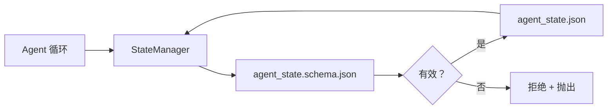

# 仓库记忆与持久状态

> 聊天历史是易失的。仓库是持久的。工作台将 agent 状态存储在版本化文件中，以便下一个会话、下一个 agent 和下一个审查者都从相同的事实来源读取。

**类型：** 构建
**语言：** Python（标准库 + `jsonschema` 可选）
**前置条件：** 第 14 阶段 · 32（最小工作台）
**时间：** ~60 分钟

## 学习目标

- 定义什么属于仓库记忆，什么属于聊天历史。
- 为 `agent_state.json` 和 `task_board.json` 编写 JSON Schema。
- 构建一个状态管理器，原子性地加载、验证、变更和持久化状态。
- 使用模式在坏写入破坏工作台之前拒绝它们。

## 问题

Agent 完成一个会话。聊天关闭。下一个会话打开并询问从哪里开始。模型说"让我检查文件"，读取陈旧的笔记，重做已经完成的工作。或者更糟，它重写一个已完成的文件，因为没人告诉它文件已完成。

工作台的修复是仓库记忆：状态存在于仓库中的 JSON 文件里，在模式下编写，原子性持久化，在代码审查中差异友好。聊天是瞬态流；仓库是记录系统。

## 概念



### 什么属于仓库记忆

| 属于 | 不属于 |
|------|--------|
| 活动任务 id | 原始聊天记录 |
| 本会话触碰的文件 | Token 级推理跟踪 |
| Agent 做出的假设 | "用户似乎很沮丧" |
| 开放阻塞者 | 采样完成 |
| 下一步动作 | 供应商特定模型 id |

测试是持久性：三个月后 CI 重新运行时这会有用吗？如果是，放仓库。如果否，放遥测。

### 模式优先状态

JSON Schema 是合约。没有它，每个 agent 发明新字段，每个审查者学习新形状，每个 CI 脚本必须特殊处理过去的版本。有了它，坏写入就是被拒绝的写入。

模式涵盖：

- 必需键。
- 允许的 `status` 值。
- 禁止值（例如数组的 `null`）。
- 模式约束（任务 id 匹配 `T-\d{3,}`）。
- 迁移版本字段。

### 原子写入

状态写入需要幸存部分失败：写入临时文件，fsync，重命名覆盖目标。状态文件是事实来源；半写入的比没有文件还糟。

### 迁移

当模式改变时，在模式升级旁边发布迁移脚本。状态文件携带 `schema_version` 字段；管理器拒绝加载它无法迁移版本的文件。

## 构建

`code/main.py` 实现：

- `agent_state.schema.json` 和 `task_board.schema.json`。
- 仅标准库的验证器（JSON Schema 子集：必需、类型、枚举、模式、项）。
- `StateManager.load`、`StateManager.update`、`StateManager.commit`，带原子临时文件和重命名写入。
- 一个演示，变更状态、持久化、重新加载，并证明往返。

运行：

```
python3 code/main.py
```

脚本写入 `workdir/agent_state.json` 和 `workdir/task_board.json`，在两轮中变更它们，并在每一步打印验证后的状态。

## 野外生产模式

四种模式将本课的最小化转化为多 agent 单体仓库可以幸存的东西。

**原子临时文件和重命名不是可选的。** 2026 年 3 月 Hive 项目错误报告干净地记录了失败模式：`state.json` 通过 `write_text()` 写入，异常被捕获并静默。部分写入让会话针对损坏的状态恢复，没有信号。修复方法总是：`tempfile.mkstemp` 在目标相同目录中，写入，`fsync`，`os.replace`（POSIX 和 Windows 上的原子重命名）。本课的 `atomic_write` 正是这样做的。

**每个非幂等工具调用上的幂等性键。** 如果 agent 在调用工具后但在检查点结果前崩溃，恢复会重试工具调用。读取安全；邮件、DB 插入、文件上传危险。模式：在执行前将每个工具调用 ID 记录到 `pending_calls.jsonl`。重试时，检查 ID；如果存在，跳过调用并使用缓存结果。Anthropic 和 LangChain 都在 2026 年指南中提到这一点；LangGraph 的检查点器出于相同原因持久化待写入。

**将大型工件与状态分开。** 不要在 `agent_state.json` 中存储 CSV、长记录或生成文件。将工件保存为单独文件（或上传到对象存储），只在状态中保留路径。检查点保持小巧快速；工件独立增长。

**事件溯源用于审计，快照用于恢复。** 每次变更追加到事件日志（`state.events.jsonl`）；定期快照到 `state.json`。恢复读取快照，然后重放快照时间戳之后的任何事件。这花费更多磁盘，但让你逐字重放 agent 决策 —— 调试长程运行时必不可少。与 Postgres 内部用于 WAL 的相同形状。

**模式迁移或拒绝加载。** `schema_version` 整数是合约。当管理器加载未知版本的文件时，它拒绝读取。在模式升级旁边发布迁移脚本；`tools/migrate_state.py` 在每次启动时幂等地运行。

## 使用

在生产中：

- **LangGraph 检查点器。** 相同想法，不同存储。检查点器将图状态持久化到 SQLite、Postgres 或自定义后端。本课教授的模式是检查点器死亡且你需要手动读取状态时求助的东西。
- **Letta 记忆块。** 带结构化模式的持久块（第 14 阶段 · 08）。相同规则作用于长程角色。
- **OpenAI Agents SDK 会话存储。** 可插拔后端，模式感知。本课中的状态文件是本地文件后端。

## 交付

`outputs/skill-state-schema.md` 生成项目特定的 JSON Schema 对（状态 + 板）、连接到原子写入的 Python `StateManager`，以及迁移脚手架，以便下次模式升级不会破坏工作台。

## 练习

1. 添加 `last_human_touch` 时间戳。拒绝人工编辑后五秒内的任何 agent 写入。
2. 扩展验证器以支持 `oneOf`，使任务可以是构建任务或审查任务，具有不同的必需字段。
3. 添加 `schema_version` 字段并编写从 v1 到 v2 的迁移（将 `blockers` 重命名为 `risks`）。
4. 将存储后端从本地文件移动到 SQLite。保持 `StateManager` API 相同。
5. 针对相同状态文件运行两个 agent，带 50 毫秒写入竞争。什么会出错，原子重命名如何拯救你？

## 关键术语

| 术语 | 人们怎么说 | 实际含义 |
|------|-----------|---------|
| Repo memory | "笔记文件" | 存储在仓库跟踪文件中的状态，在模式下 |
| Schema-first | "验证输入" | 在写入者之前定义合约，拒绝漂移 |
| Atomic write | "只是重命名" | 写入临时文件，fsync，重命名，使部分失败无法损坏 |
| Migration | "模式升级" | 将 vN 状态转换为 v(N+1) 状态的脚本 |
| System of record | "事实来源" | 工作台视为权威的工件 |

## 延伸阅读

- [JSON Schema 规范](https://json-schema.org/specification.html)
- [LangGraph 检查点器](https://langchain-ai.github.io/langgraph/concepts/persistence/)
- [Letta 记忆块](https://docs.letta.com/concepts/memory)
- [Fast.io, AI Agent 状态检查点：实用指南](https://fast.io/resources/ai-agent-state-checkpointing/) —— 带幂等性的模式优先检查点
- [Fast.io, AI Agent 工作流状态持久化：2026 年最佳实践](https://fast.io/resources/ai-agent-workflow-state-persistence/) —— 并发控制、TTL、事件溯源
- [Hive Issue #6263 — 非原子 state.json 写入被静默忽略](https://github.com/aden-hive/hive/issues/6263) —— 真实项目中的失败模式
- [eunomia, 检查点/恢复系统：演进、技术、应用](https://eunomia.dev/blog/2025/05/11/checkpointrestore-systems-evolution-techniques-and-applications-in-ai-agents/) —— 从 OS 历史应用到 agent 的 CR 原语
- [Indium, 2026 年长程 AI Agent 的 7 种状态持久化策略](https://www.indium.tech/blog/7-state-persistence-strategies-ai-agents-2026/)
- [Microsoft Agent Framework, 压缩](https://learn.microsoft.com/en-us/agent-framework/agents/conversations/compaction) —— 供应商检查点管理器
- 第 14 阶段 · 08 —— 记忆块和睡眠时间计算
- 第 14 阶段 · 32 —— 本课模式化的三文件最小化
- 第 14 阶段 · 40 —— 从相同模式读取的交接包