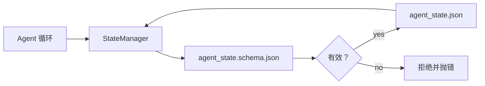

# 仓库记忆与持久状态（Repo Memory and Durable State）

> 译注：本文译自同目录 [`en.md`](./en.md)。术语遵循仓根 [TRANSLATION_GUIDE.md](../../../../TRANSLATION_GUIDE.md)。

> 聊天记录是易失的，仓库才是持久的。workbench（工作台）把 agent 的状态存成带版本的文件，让下一次会话、下一个 agent、下一位 reviewer（验证器）都从同一份「事实源」（source of truth）读取。

**Type:** Build
**Languages:** Python (stdlib + `jsonschema` optional)
**Prerequisites:** Phase 14 · 32 (Minimal Workbench)
**Time:** ~60 minutes

## 学习目标（Learning Objectives）

- 区分什么属于仓库记忆，什么属于聊天记录。
- 为 `agent_state.json` 和 `task_board.json` 编写 JSON Schema。
- 构建一个能加载、校验、改写、原子持久化状态的 state manager。
- 用 schema 在写入污染 workbench 之前就拒绝坏数据。

## 问题（The Problem）

agent 跑完一次会话，聊天关闭。下一次会话打开后问：从哪儿开始？模型说「我看看文件」，读到过期笔记，把已经做完的活又做了一遍。更糟的是，因为没人告诉它某个文件已经定稿，它把成品又重写了一遍。

workbench 的解法叫仓库记忆（repo memory）：状态以 JSON 文件存在仓库里，按 schema 写入，原子持久化，在 code review 里 diff 友好。聊天是临时数据流，仓库才是系统记录（system of record）。

## 概念（The Concept）



### 哪些东西属于仓库记忆（What belongs in repo memory）

| 属于 | 不属于 |
|---------|-----------------|
| 当前 task id | 原始聊天 transcript |
| 本次会话改动的文件 | token 级的推理 trace |
| agent 做出的假设 | 「用户看起来不耐烦了」 |
| 未解决的 blocker | 采样得到的补全 |
| 下一步动作 | 厂商特定的模型 id |

判断标准是「持久性」：三个月后在 CI 重跑里还有用吗？有用就进仓库，没用就走 telemetry（遥测）。

### Schema 优先的状态（Schema-first state）

JSON Schema 是契约。没有它，每个 agent 都会发明新字段，每个 reviewer 都要学一遍新结构，每个 CI 脚本都要为旧版本特判。有了它，坏数据写入就是被拒的写入。

schema 覆盖以下内容：

- 必填键。
- 允许的 `status` 取值。
- 禁止的取值（例如数组字段不能为 `null`）。
- 模式约束（task id 必须匹配 `T-\d{3,}`）。
- 用于迁移的版本字段。

### 原子写入（Atomic writes）

状态写入必须能挺过部分失败：先写 tempfile（临时文件）、fsync、再 rename 覆盖目标文件。状态文件是事实源；写到一半的文件比根本没有文件还糟糕。

### 迁移（Migrations）

schema 变更时，要在 schema 升级旁边一起发一个迁移脚本。状态文件带一个 `schema_version` 字段；遇到无法迁移的版本，manager 就拒绝加载。

## 动手实现（Build It）

`code/main.py` 实现：

- `agent_state.schema.json` 和 `task_board.schema.json`。
- 一个仅依赖 stdlib 的 validator（JSON Schema 子集：required、type、enum、pattern、items）。
- `StateManager.load`、`StateManager.update`、`StateManager.commit`，使用「写临时文件 + 重命名」的原子写入。
- 一个 demo：改写状态、持久化、重新加载、验证整个 round-trip 成立。

运行它：

```
python3 code/main.py
```

脚本会写出 `workdir/agent_state.json` 和 `workdir/task_board.json`，跨两轮改写它们，并在每一步打印通过校验的状态。

## 业界生产实践模式（Production patterns in the wild）

四种模式能把这节课的「最小版本」升级到一个多 agent monorepo 能撑住的水平。

**「写临时文件 + 重命名」的原子写入不是可选项。** 2026 年 3 月 Hive 项目的一份 bug 报告把这种失败模式记录得很清楚：`state.json` 用 `write_text()` 写入，异常被 catch 之后又被静默吞掉。半截写入的文件让会话恢复时面对的是污染的状态，毫无信号。修复方式永远是：在目标文件同目录下 `tempfile.mkstemp`，写入，`fsync`，`os.replace`（在 POSIX 和 Windows 上都是原子 rename）。本课的 `atomic_write` 就是这么做的。

**所有非幂等的 tool call（工具调用）都要带幂等键（idempotency key）。** 如果 agent 在调用工具之后、checkpoint 写入结果之前崩溃，恢复时会重试这次工具调用。读操作没问题；发邮件、DB 插入、文件上传就危险了。模式是：执行前把每个 tool call ID 记入 `pending_calls.jsonl`；重试时检查 ID，如果已存在就跳过调用、直接用缓存结果。Anthropic 和 LangChain 都在 2026 年的指南里强调过这一点；LangGraph 的 checkpointer 持久化 pending writes 也是出于同样的原因。

**把大体积 artifact（产物）和状态分开。** 不要把 CSV、长 transcript、生成的文件存进 `agent_state.json`。把 artifact 单独存一个文件（或上传到对象存储），状态里只保留路径。这样 checkpoint 保持小而快，artifact 独立增长。

**事件溯源做审计，快照做恢复（Event sourcing for audit, snapshots for resume）。** 每次改写都向事件日志（`state.events.jsonl`）追加一条；周期性地把状态快照到 `state.json`。恢复时先读快照，再回放快照时间戳之后的事件。这会多占点磁盘，但能让你逐字回放 agent 的决策——调试 long-horizon（长链路）任务时这是必需的。Postgres 内部的 WAL（预写日志）也是同一种形态。

**要么 schema 迁移，要么拒绝加载。** `schema_version` 整数是契约。当 manager 加载到未知版本的文件时，就拒绝读取。schema 升级时配套发布一个迁移脚本；`tools/migrate_state.py` 在每次启动时幂等运行。

## 用起来（Use It）

生产环境里：

- **LangGraph checkpointer。** 同一个思路，换种存储。checkpointer 把图状态持久化到 SQLite、Postgres，或自定义后端。本课教的 schema 正是当 checkpointer 挂掉、你需要手工读取状态时要用的东西。
- **Letta memory block。** 带结构化 schema 的持久块（Phase 14 · 08），把同一套规范搬到长期运行的 persona（人格）上。
- **OpenAI Agents SDK session store。** 可插拔后端、schema 感知。本课里的状态文件就是它的本地文件后端。

## 上线部署（Ship It）

`outputs/skill-state-schema.md` 生成一对项目专属的 JSON Schema（state + board）、一个接好原子写入的 Python `StateManager`，再加一个迁移脚手架，让下一次 schema 升级不会把 workbench 砸坏。

## 练习（Exercises）

1. 加一个 `last_human_touch` 时间戳。在人类编辑后的 5 秒内拒绝 agent 的任何写入。
2. 扩展 validator 让它支持 `oneOf`，使一个 task 可以是 build 任务，也可以是 review 任务，required 字段不同。
3. 加一个 `schema_version` 字段，写一个从 v1 到 v2 的迁移脚本（把 `blockers` 重命名为 `risks`）。
4. 把存储后端从本地文件换成 SQLite。保持 `StateManager` API 完全一致。
5. 让两个 agent 以 50ms 的写入竞态对同一个状态文件操作。会出什么错？原子 rename 是怎么救你的？

## 关键术语（Key Terms）

| 术语 | 嘴上怎么说 | 实际意思 |
|------|----------------|------------------------|
| Repo memory | 「笔记文件」 | 按 schema 存在仓库 tracked 文件中的状态 |
| Schema-first | 「校验输入」 | 在写入方之前就定义契约，拒绝漂移 |
| Atomic write | 「直接 rename 嘛」 | 写临时文件、fsync、rename，半截失败也不会污染 |
| Migration | 「升级 schema」 | 把 vN 状态变成 v(N+1) 状态的脚本 |
| System of record | 「事实源」 | workbench 视为权威的那份产物 |

## 延伸阅读（Further Reading）

- [JSON Schema specification](https://json-schema.org/specification.html)
- [LangGraph checkpointers](https://langchain-ai.github.io/langgraph/concepts/persistence/)
- [Letta memory blocks](https://docs.letta.com/concepts/memory)
- [Fast.io, AI Agent State Checkpointing: A Practical Guide](https://fast.io/resources/ai-agent-state-checkpointing/) — schema 优先的 checkpoint，配合幂等性
- [Fast.io, AI Agent Workflow State Persistence: Best Practices 2026](https://fast.io/resources/ai-agent-workflow-state-persistence/) — 并发控制、TTL、事件溯源
- [Hive Issue #6263 — non-atomic state.json writes silently ignored](https://github.com/aden-hive/hive/issues/6263) — 真实项目里的失败模式
- [eunomia, Checkpoint/Restore Systems: Evolution, Techniques, Applications](https://eunomia.dev/blog/2025/05/11/checkpointrestore-systems-evolution-techniques-and-applications-in-ai-agents/) — 操作系统历史里的 CR 原语应用到 agent
- [Indium, 7 State Persistence Strategies for Long-Running AI Agents in 2026](https://www.indium.tech/blog/7-state-persistence-strategies-ai-agents-2026/)
- [Microsoft Agent Framework, Compaction](https://learn.microsoft.com/en-us/agent-framework/agents/conversations/compaction) — 厂商提供的 checkpoint manager
- Phase 14 · 08 — memory block 与 sleep-time compute
- Phase 14 · 32 — 本课所 schema 化的三文件最小集
- Phase 14 · 40 — 从同一 schema 读取的 handoff（交接）packet
