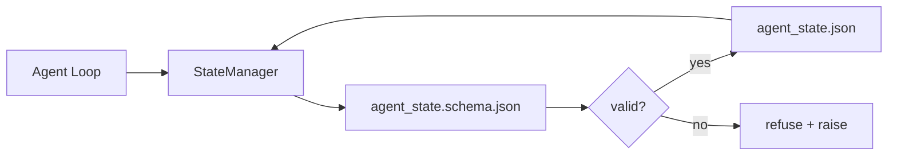

# 34 · 仓库记忆与持久化状态

> 聊天记录是易失的，仓库是持久的。工作台（workbench）把智能体（agent）状态存储在带版本的文件中，因此下一次会话、下一个智能体、下一位评审者都从同一份事实来源（source of truth）读取。

**类型：** 构建
**语言：** Python（标准库 + 可选的 `jsonschema`）
**前置：** 第 14 阶段 · 32（最小工作台）
**时长：** 约 60 分钟

## 学习目标

- 界定什么属于仓库记忆（repo memory），什么属于聊天记录。
- 为 `agent_state.json` 和 `task_board.json` 编写 JSON Schema。
- 构建一个状态管理器（state manager），用于加载、校验、变更并原子化地持久化状态。
- 利用 schema 在坏数据破坏工作台之前拒绝错误写入。

## 问题所在

智能体结束了一次会话，聊天窗口关闭。下一次会话开启，它问该从哪里开始。模型说「让我看看文件」，读到了过时的笔记，于是重做了一遍已经完成的工作。更糟的是，它重写了一个已完工的文件，因为没人告诉它这个文件已经完成了。

工作台的解法是仓库记忆：状态以 JSON 文件的形式存活在仓库中，依据 schema 写入，原子化地持久化，并在代码评审中对 diff 友好。聊天是临时的信息流；仓库才是记录系统（system of record）。

## 核心概念



### 什么属于仓库记忆

| 属于 | 不属于 |
|---------|-----------------|
| 当前任务 id | 原始聊天记录 |
| 本次会话改动过的文件 | token 级别的推理轨迹 |
| 智能体所做的假设 | 「用户似乎有些不耐烦」 |
| 未解决的阻塞项 | 采样得到的补全结果 |
| 下一步动作 | 厂商特定的模型 id |

判断标准是持久性（durability）：三个月后在一次 CI 重跑中，这条信息还有用吗？有用，就进仓库；没用，就归为遥测（telemetry）。

### Schema 优先的状态

JSON Schema 就是契约。没有它，每个智能体都会发明新字段，每个评审者都要学一套新结构，每个 CI 脚本都得为历史版本写特例。有了它，一次坏写入就是一次被拒绝的写入。

schema 覆盖：

- 必需键。
- 允许的 `status` 取值。
- 禁止的取值（例如数组不允许为 `null`）。
- 模式约束（任务 id 匹配 `T-\d{3,}`）。
- 用于迁移的版本字段。

### 原子写入

状态写入需要能在部分失败中存活：先写入临时文件，执行 fsync，再重命名覆盖目标文件。状态文件是事实来源；一个写了一半的状态文件比没有文件更糟糕。

### 迁移

当 schema 变更时，应在 schema 版本号提升的同时附带一个迁移脚本。状态文件携带一个 `schema_version` 字段；管理器会拒绝加载它无法迁移的版本文件。

## 动手构建

`code/main.py` 实现了：

- `agent_state.schema.json` 和 `task_board.schema.json`。
- 一个纯标准库的校验器（JSON Schema 的子集：required、type、enum、pattern、items）。
- `StateManager.load`、`StateManager.update`、`StateManager.commit`，采用临时文件加重命名的原子写入。
- 一个演示：变更状态、持久化、重新加载，并证明往返一致。

运行它：

```
python3 code/main.py
```

该脚本写出 `workdir/agent_state.json` 和 `workdir/task_board.json`，跨两个回合对它们进行变更，并在每一步打印校验通过后的状态。

## 真实世界中的生产模式

四种模式把本课的最小实现，提升为一个能在多智能体单体仓库（monorepo）中存活下来的方案。

**临时文件加重命名的原子写入不是可选项。** 2026 年 3 月 Hive 项目的一份缺陷报告清晰地记录了这种失败模式：`state.json` 通过 `write_text()` 写入，而异常被捕获后默默吞掉。部分写入导致会话恢复时面对的是损坏的状态，且没有任何信号。修复方案总是一致的：在目标文件的同一目录中用 `tempfile.mkstemp`，写入，`fsync`，再用 `os.replace`（在 POSIX 和 Windows 上都是原子重命名）。本课的 `atomic_write` 正是这么做的。

**对每个非幂等的工具调用都加幂等键（idempotency key）。** 如果智能体在调用工具之后、但在为结果设置检查点（checkpoint）之前崩溃，恢复时会重试该工具调用。对读操作是安全的；但对发邮件、数据库插入、文件上传则是危险的。其模式是：在执行前把每个工具调用的 ID 记录到 `pending_calls.jsonl`。重试时检查该 ID；如果存在，就跳过调用并使用缓存的结果。Anthropic 和 LangChain 都在 2026 年的指南中强调了这一点；LangGraph 的 checkpointer 出于同样的原因会持久化待处理的写入。

**把大型产物与状态分离。** 不要把 CSV、长篇记录或生成的文件存进 `agent_state.json`。应将产物保存为单独的文件（或上传到对象存储），状态中只保留路径。这样检查点保持小而快；产物则独立增长。

**用事件溯源（event sourcing）做审计，用快照（snapshot）做恢复。** 每次变更都向事件日志（`state.events.jsonl`）追加；周期性地快照到 `state.json`。恢复时先读快照，再回放快照时间戳之后的所有事件。这会占用更多磁盘，但能让你逐字回放智能体的决策——在调试长周期运行时这是必不可少的。这与 Postgres 内部用于 WAL 的形态相同。

**要么迁移 schema，要么拒绝加载。** `schema_version` 整数就是契约。当管理器加载到一个未知版本的文件时，它会拒绝读取。在提升 schema 版本号的同时附带一个迁移脚本；`tools/migrate_state.py` 会在每次启动时幂等地运行。

## 实际运用

在生产环境中：

- **LangGraph checkpointers。** 同样的思路，不同的存储。checkpointer 把图状态持久化到 SQLite、Postgres 或自定义后端。本课所教的 schema，正是当 checkpointer 失效、你需要手动读取状态时所依赖的东西。
- **Letta memory blocks。** 带结构化 schema 的持久化块（第 14 阶段 · 08）。同一套纪律，作用于长期运行的人设（persona）。
- **OpenAI Agents SDK session store。** 可插拔后端，且感知 schema。本课中的状态文件就是其本地文件后端。

## 交付落地

`outputs/skill-state-schema.md` 会生成一对项目专属的 JSON Schema（state + board）、一个接好原子写入的 Python `StateManager`，以及一个迁移脚手架，使下一次 schema 版本提升不会破坏工作台。

## 练习

1. 添加一个 `last_human_touch` 时间戳。拒绝任何在人工编辑后五秒内发生的智能体写入。
2. 扩展校验器以支持 `oneOf`，使一个任务既可以是构建任务、也可以是评审任务，二者有不同的必需字段。
3. 添加一个 `schema_version` 字段，并编写从 v1 到 v2 的迁移（把 `blockers` 重命名为 `risks`）。
4. 把存储后端从本地文件迁移到 SQLite，保持 `StateManager` 的 API 完全不变。
5. 让两个智能体以 50 ms 的写入竞争（write race）操作同一个状态文件。会出什么问题，原子重命名又是如何救你于水火的？

## 关键术语

| 术语 | 人们怎么说 | 实际含义 |
|------|----------------|------------------------|
| 仓库记忆（Repo memory） | 「笔记文件」 | 存储在仓库受版本跟踪的文件中、依据 schema 的状态 |
| Schema 优先（Schema-first） | 「校验输入」 | 在写入方之前定义契约，拒绝偏移 |
| 原子写入（Atomic write） | 「直接重命名就行」 | 写临时文件、fsync、重命名，使部分失败无法造成损坏 |
| 迁移（Migration） | 「升级 schema」 | 把 vN 状态转成 v(N+1) 状态的脚本 |
| 记录系统（System of record） | 「事实来源」 | 工作台视为权威的那份产物 |

## 延伸阅读

- [JSON Schema 规范](https://json-schema.org/specification.html)
- [LangGraph checkpointers](https://langchain-ai.github.io/langgraph/concepts/persistence/)
- [Letta memory blocks](https://docs.letta.com/concepts/memory)
- [Fast.io，AI Agent State Checkpointing: A Practical Guide](https://fast.io/resources/ai-agent-state-checkpointing/) —— schema 优先的检查点与幂等性
- [Fast.io，AI Agent Workflow State Persistence: Best Practices 2026](https://fast.io/resources/ai-agent-workflow-state-persistence/) —— 并发控制、TTL、事件溯源
- [Hive Issue #6263 —— 非原子的 state.json 写入被默默忽略](https://github.com/aden-hive/hive/issues/6263) —— 真实项目中的失败模式
- [eunomia，Checkpoint/Restore Systems: Evolution, Techniques, Applications](https://eunomia.dev/blog/2025/05/11/checkpointrestore-systems-evolution-techniques-and-applications-in-ai-agents/) —— 把操作系统历史中的 CR 原语应用到智能体上
- [Indium，7 State Persistence Strategies for Long-Running AI Agents in 2026](https://www.indium.tech/blog/7-state-persistence-strategies-ai-agents-2026/)
- [Microsoft Agent Framework，Compaction](https://learn.microsoft.com/en-us/agent-framework/agents/conversations/compaction) —— 厂商的检查点管理器
- 第 14 阶段 · 08 —— 记忆块与睡眠期计算（sleep-time compute）
- 第 14 阶段 · 32 —— 本课为其建立 schema 的三文件最小集
- 第 14 阶段 · 40 —— 从同一 schema 读取的交接包（handoff packet）
