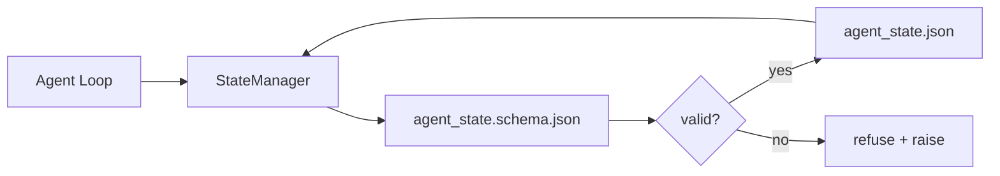

# 仓库记忆与持久状态 (Repo Memory and Durable State)

> 聊天记录是易失的。仓库是持久的。工作台将智能体状态存储在版本化文件中，使得下一个会话、下一个智能体、下一个审查者都能从同一事实源读取。

**类型：** 构建
**语言：** Python（标准库 + `jsonschema` 可选）
**前置条件：** 阶段 14 · 32（最小工作台）
**时长：** ~60 分钟

## 学习目标

- 区分哪些属于仓库记忆、哪些属于聊天记录。
- 为 `agent_state.json` 和 `task_board.json` 编写 JSON Schema。
- 构建一个能够原子性地加载、验证、变更和持久化状态的状态管理器。
- 使用 Schema 在损坏写入损坏工作台之前将其拒绝。

## 问题

智能体完成一个会话。聊天关闭。下一个会话打开，询问从哪里开始。模型说"让我检查一下文件"，读取过时的笔记，然后重新做已经完成的工作。或者更糟——因为没人告诉它某个文件已经完成，它重写了这个已完成的文件。

工作台的解决方案是仓库记忆：状态以 JSON 文件形式存放在仓库中，在 Schema 约束下写入，原子性地持久化，在代码审查中友好地显示差异。聊天的瞬态的传输流；仓库才是记录系统。

## 概念


```mermaid
flowchart LR
  Agent[Agent Loop] --> Manager[StateManager]
  Manager --> Schema[agent_state.schema.json]
  Schema --> Validate{valid?}
  Validate -- yes --> Write[agent_state.json]
  Validate -- no --> Reject[refuse + raise]
  Write --> Manager
```

### 哪些属于仓库记忆

| 属于 | 不属于 |
|------|--------|
| 当前任务 ID | 原始聊天记录 |
| 本会话中触摸过的文件 | Token 级推理轨迹 |
| 智能体做出的假设 | "用户似乎很沮丧" |
| 未解决的阻塞项 | 采样补全结果 |
| 下一步行动 | 供应商特定模型 ID |

检验标准是持久性：三个月后在 CI 重跑中这段信息还有用吗？如果有用，放入仓库；如果没用，放入遥测。

### Schema 优先的状态管理

JSON Schema 是契约。没有它，每个智能体都会发明新字段，每个审查者都要学习新的结构，每个 CI 脚本都要特殊处理旧版本。有了它，错误的写入会被直接拒绝。

Schema 涵盖：

- 必需的键。
- 允许的 `status` 值。
- 禁止的值（例如数组不允许为 `null`）。
- 模式约束（任务 ID 匹配 `T-\d{3,}`）。
- 用于迁移的版本字段。

### 原子写入

状态写入需要抵御部分失败：先写入临时文件，执行 fsync，再重命名覆盖目标文件。状态文件是事实源；一个只写了一半的文件比没有文件更糟。

### 迁移

当 Schema 发生变化时，在 Schema 版本升级的同时附带一个迁移脚本。状态文件携带 `schema_version` 字段；当管理器遇到无法迁移的版本时，拒绝加载该文件。

## 构建

`code/main.py` 实现：

- `agent_state.schema.json` 和 `task_board.schema.json`。
- 仅使用标准库的验证器（JSON Schema 子集：required、type、enum、pattern、items）。
- `StateManager.load`、`StateManager.update`、`StateManager.commit`，使用原子性临时文件加重命名写入。
- 一个演示程序：变更状态、持久化、重新加载，并验证往返一致性。

运行方式：

```
python3 code/main.py
```

脚本会写入 `workdir/agent_state.json` 和 `workdir/task_board.json`，在两轮操作中变更它们，并在每一步打印验证后的状态。

## 生产环境中的常见模式

以下四个模式将本课的最小实现扩展为多智能体单体仓库也能经受考验的方案。

**原子性临时文件加重命名不可省略。** 2026 年 3 月的一个 Hive 项目 bug 报告清晰地记录了失败模式：`state.json` 通过 `write_text()` 写入，异常被捕获并静默忽略。部分写入导致会话在损坏的状态上恢复运行，且没有任何信号提示。修复方案始终是：在与目标文件相同的目录下使用 `tempfile.mkstemp`，写入，执行 `fsync`，然后使用 `os.replace`（在 POSIX 和 Windows 上均为原子性重命名）。本课中的 `atomic_write` 正是这样做的。

**每个非幂等工具调用都使用幂等键。** 如果智能体在调用工具之后、检查点记录结果之前崩溃，恢复时会重试该工具调用。对于读取操作是安全的；但对于电子邮件、数据库插入、文件上传则是危险的。模式：在执行之前将每次工具调用的 ID 记录到 `pending_calls.jsonl` 中。重试时检查该 ID；如果存在则跳过调用并使用缓存的结果。Anthropic 和 LangChain 在 2026 年的指南中都指出了这一点；LangGraph 的检查点器出于同样的原因持久化待处理的写入。

**将大型工件与状态分离。** 不要将 CSV、长记录或生成的文件存储在 `agent_state.json` 中。将工件保存为单独的文件（或上传到对象存储），在状态中只保留路径。检查点保持小巧快速；工件可以独立增长。

**审计使用事件溯源，恢复使用快照。** 每次变更时向事件日志（`state.events.jsonl`）追加记录；定期快照到 `state.json`。恢复时读取快照，然后重放快照时间戳之后的所有事件。这会消耗更多磁盘空间，但可以逐字重放智能体的决策——在调试长时间运行的任务时至关重要。Postgres 内部对 WAL 使用的也是同样的结构。

**Schema 迁移，否则拒绝加载。** `schema_version` 整数就是契约。当管理器加载一个未知版本的文件时，它拒绝读取。在 Schema 版本升级的同时附带迁移脚本；`tools/migrate_state.py` 在每次启动时幂等地运行。

## 使用

在生产环境中：

- **LangGraph 检查点器。** 相同的概念，不同的存储方式。检查点器将图状态持久化到 SQLite、Postgres 或自定义后端。本课教授的 Schema 正是当检查点器失效、需要手动读取状态时你需要用到的方法。
- **Letta 记忆块。** 带有结构化 Schema 的持久化块（阶段 14 · 08）。相同的规范，作用于长期运行的角色。
- **OpenAI Agents SDK 会话存储。** 可插拔后端，Schema 感知。本课中的状态文件就是本地文件后端。

## 交付

`outputs/skill-state-schema.md` 生成项目特定的 JSON Schema 对（state + board）、一个接入原子写入的 Python `StateManager`，以及一个迁移脚手架，使得下一次 Schema 升级不会破坏工作台。

## 练习

1. 添加 `last_human_touch` 时间戳。拒绝在人工编辑后五秒内的任何智能体写入。
2. 扩展验证器以支持 `oneOf`，使得任务可以是构建任务或审查任务，且两者具有不同的必填字段。
3. 添加 `schema_version` 字段，并编写从 v1 到 v2 的迁移（将 `blockers` 重命名为 `risks`）。
4. 将存储后端从本地文件迁移到 SQLite。保持 `StateManager` API 不变。
5. 让两个智能体以 50 毫秒的写入竞争访问同一个状态文件。会发生什么问题？原子性重命名如何拯救你？

## 关键术语

| 术语 | 人们通常说的 | 实际含义 |
|------|-------------|----------|
| 仓库记忆 (Repo memory) | "笔记文件" | 存储在仓库受跟踪文件中的状态，受 Schema 约束 |
| Schema 优先 (Schema-first) | "验证输入" | 在写入者之前定义契约，拒绝偏离 |
| 原子写入 (Atomic write) | "就重命名一下" | 写入临时文件、fsync、重命名，使部分失败不会造成损坏 |
| 迁移 (Migration) | "Schema 升级" | 将 vN 状态转换为 v(N+1) 状态的脚本 |
| 记录系统 (System of record) | "事实源" | 工作台视作权威的工件 |

## 延伸阅读

- [JSON Schema 规范](https://json-schema.org/specification.html)
- [LangGraph 检查点器](https://langchain-ai.github.io/langgraph/concepts/persistence/)
- [Letta 记忆块](https://docs.letta.com/concepts/memory)
- [Fast.io，AI 智能体状态检查点：实用指南](https://fast.io/resources/ai-agent-state-checkpointing/) — Schema 优先的检查点与幂等性
- [Fast.io，AI 智能体工作流状态持久化：2026 最佳实践](https://fast.io/resources/ai-agent-workflow-state-persistence/) — 并发控制、TTL、事件溯源
- [Hive Issue #6263 — 非原子性的 state.json 写入被静默忽略](https://github.com/aden-hive/hive/issues/6263) — 真实项目中的失败模式
- [eunomia，检查点/恢复系统：演进、技术、应用](https://eunomia.dev/blog/2025/05/11/checkpointrestore-systems-evolution-techniques-and-applications-in-ai-agents/) — 从操作系统历史中应用于智能体的 CR 原语
- [Indium，2026 年长期运行 AI 智能体的 7 种状态持久化策略](https://www.indium.tech/blog/7-state-persistence-strategies-ai-agents-2026/)
- [Microsoft Agent Framework，压缩](https://learn.microsoft.com/en-us/agent-framework/agents/conversations/compaction) — 供应商检查点管理器
- 阶段 14 · 08 — 记忆块与休眠期计算
- 阶段 14 · 32 — 本课进行 Schema 化的三文件最小结构
- 阶段 14 · 40 — 从同一 Schema 读取的交接包
