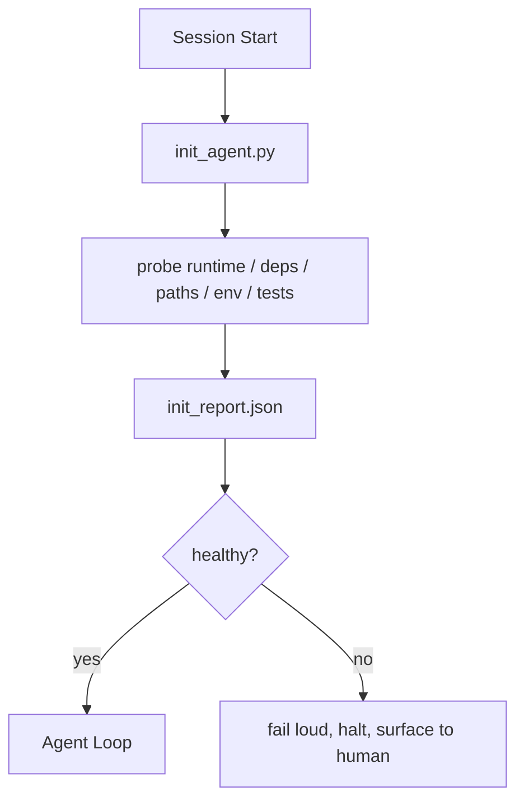

# Initialization Scripts for Agents

> Every session that starts cold pays a tax. The agent reads the same files, retries the same probes, and rediscovers the same paths. An init script pays the tax once and writes the answers into state.

**Type:** Build
**Languages:** Python (stdlib)
**Prerequisites:** Phase 14 · 32 (Minimal Workbench), Phase 14 · 34 (Repo Memory)
**Time:** ~45 minutes

## Learning Objectives

- Identify the work an agent should never have to redo per session.
- Build a deterministic init script that probes runtime, dependencies, and repo health.
- Persist the probe result so the agent reads it instead of re-running checks.
- Fail loud, fast, and with one place to look when initialization fails.

## The Problem

Open a session. The agent guesses the Python version. Guesses the test command. Lists the repo root five times to find the entry point. Tries to import a package that is not installed. Asks the user where the config file lives. By the time it makes a real edit, ten thousand tokens have gone to setup work that should have been a single script.

The fix is one initialization script that runs before the agent does anything else and writes a `init_report.json` the agent reads at startup.

## The Concept



### What the init script probes

| Probe | Why it matters |
|-------|----------------|
| Runtime versions | Wrong Python or Node version means silent wrong-version bugs |
| Dependency availability | A missing package later costs ten times the cost of catching it now |
| Test command | The agent must know how to verify; if the command is missing the workbench is broken |
| Repo paths | Hard-coded paths drift; resolve them once and pin |
| Environment variables | Missing `OPENAI_API_KEY` is a failure surface, not a runtime mystery |
| State + board freshness | Stale state from a crashed session is a footgun |
| Last-known-good commit | Anchor for the handoff diff at the end of the session |

### Fail loud, fail fast, fail in one place

A probe failure means halt and surface to the human. No "the agent will figure it out." The whole point of init is to refuse to start when the workbench is broken.

### Idempotent

Run it twice in a row. The second run should be a no-op except for a fresh timestamp. Idempotency is what lets you wire the script into CI, hooks, or a pre-task slash command.

### Init versus startup rules

Rules (Phase 14 · 33) describe what must be true to act. Init is the script that establishes that those rules can be checked. Rules without init become "be careful." Init without rules becomes a polished failure.

## Build It

`code/main.py` implements `init_agent.py`:

- Five probes: Python version, listed dependencies via `importlib.util.find_spec`, test command resolvability, required env vars, state file freshness.
- Each probe returns `(name, status, detail)`.
- The script writes `init_report.json` with the full probe set and exits non-zero if any block-severity probe fails.

Run it:

```
python3 code/main.py
```

The script prints the table of probes, writes `init_report.json`, and exits zero on the happy path or non-zero with a list of failed probes.

## Use It

In production:

- **Claude Code hooks.** `pre-task` hook calls the init script and refuses to launch the agent if it fails.
- **GitHub Actions.** A `setup-agent` job runs the init script; the agent job depends on it.
- **Docker entrypoint.** The agent container runs the init script before exec-ing the agent runtime; logs surface on failure.

The init script is portable because it makes no calls to a specific framework. Bash, Make, or a tasks file can all wrap it.

## Ship It

`outputs/skill-init-script.md` interviews the project, classifies its setup work into probes, and emits a project-specific `init_agent.py` plus a CI workflow that runs it before any agent step.

## Exercises

1. Add a probe that diffs the current commit against the last-known-good commit and refuses to start if more than 50 files changed.
2. Wire the script to write a `prereqs.lock` file and refuse to start if the lock is older than seven days.
3. Add a `--fix` flag that auto-installs missing dev dependencies but never modifies runtime dependencies without approval.
4. Move probes from hardcoded functions to a YAML registry. Defend the trade-off.
5. Add a timing budget per probe. A probe that runs longer than three seconds is a workbench smell.

## Key Terms

| Term | What people say | What it actually means |
|------|----------------|------------------------|
| Probe | "A check" | A deterministic function returning `(name, status, detail)` |
| Init report | "Setup output" | JSON written next to state with the probe results |
| Idempotent | "Safe to re-run" | Two runs in a row produce identical reports modulo timestamp |
| Fail loud | "Don't swallow" | Halt and surface to the human; no silent fallback |
| Setup tax | "Bootstrap cost" | The tokens the agent spends per session rediscovering the obvious |

## Further Reading

- [Anthropic, Effective harnesses for long-running agents](https://www.anthropic.com/engineering/effective-harnesses-for-long-running-agents)
- [GitHub Actions, composite actions for setup](https://docs.github.com/en/actions/sharing-automations/creating-actions/creating-a-composite-action)
- Phase 14 · 33 — the rule set this script enables
- Phase 14 · 34 — the state file this script seeds
- Phase 14 · 40 — the handoff that consumes the init report's last-known-good
