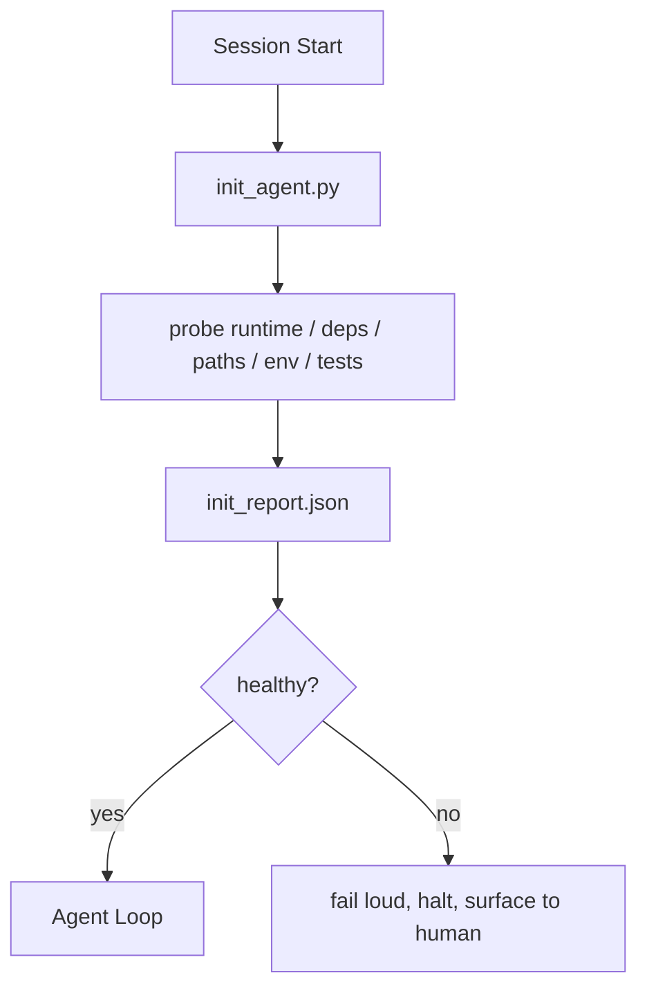

# Agents のための Initialization Scripts

> cold start する session は毎回 tax を払います。agent は同じ files を読み、同じ probes を retry し、同じ paths を再発見します。init script はその tax を一度だけ払い、答えを state に書きます。

**種別:** 構築
**言語:** Python (stdlib)
**前提条件:** Phase 14 · 32 (Minimal Workbench), Phase 14 · 34 (Repo Memory)
**所要時間:** 約45分

## Learning Objectives

- agent が session ごとにやり直すべきではない work を特定する。
- runtime、dependencies、repo health を probe する deterministic init script を作る。
- agent が check を再実行する代わりに読めるよう、probe result を persist する。
- initialization が失敗したとき、loud、fast、かつ見る場所 1 つで fail する。

## 問題

session を開きます。agent は Python version を推測します。test command を推測します。entry point を見つけるために repo root を 5 回 list します。install されていない package を import しようとします。config file がどこにあるかを user に尋ねます。実際の edit に入るまでに、1 つの script で済むはずの setup work に 1 万 tokens が消えています。

修正は 1 つの initialization script です。agent が何かをする前に実行され、agent が startup で読む `init_report.json` を書きます。

## The Concept



### init script が probe するもの

| Probe | 重要な理由 |
|-------|------------|
| Runtime versions | wrong Python or Node version は silent wrong-version bugs を生む |
| Dependency availability | missing package は、後で見つかると今捕捉する 10 倍の cost がかかる |
| Test command | agent は verify 方法を知る必要がある。command が欠けているなら workbench が壊れている |
| Repo paths | hard-coded paths は drift する。1 回 resolve して pin する |
| Environment variables | missing `OPENAI_API_KEY` は runtime mystery ではなく failure surface |
| State + board freshness | crashed session 由来の stale state は footgun |
| Last-known-good commit | session 末尾の handoff diff の anchor |

### Fail loud, fail fast, fail in one place

probe failure は halt して human に surface します。"agent が何とかする" ではありません。init の目的は、workbench が壊れているときに start を拒否することです。

### Idempotent

連続で 2 回実行してください。2 回目は fresh timestamp 以外 no-op であるべきです。idempotency により、script を CI、hooks、pre-task slash command に結線できます。

### Init versus startup rules

Rules (Phase 14 · 33) は、act する前に true であるべきことを記述します。Init は、それらの rules が check 可能であることを確立する script です。init のない rules は "be careful" になります。rules のない init は磨かれた failure になります。

## 実装

`code/main.py` は `init_agent.py` を実装します。

- 5 probes: Python version、`importlib.util.find_spec` による listed dependencies、test command resolvability、required env vars、state file freshness。
- 各 probe は `(name, status, detail)` を返す。
- script は full probe set を持つ `init_report.json` を書き、block-severity probe が失敗すると non-zero exit する。

実行:

```
python3 code/main.py
```

script は probes の table を表示し、`init_report.json` を書き、happy path では exit zero、失敗時は failed probes の list とともに non-zero で終了します。

## Production patterns in the wild

useful init script と ceremony を分ける pattern が 3 つあります。

**Last-known-good commit anchoring.** current commit を、最後の successful merge で書かれた `LKG` file に照らして probe します。diff が budget (default 50 files) を超えたら start を拒否し、新しい baseline の ratify を human に要求します。Cloudflare の AI Code Review が reviewer agents の scope に使うのがこれです。各 review session は同じ last-known-good に anchor し、session をまたいで drift を compound しません。

**Lock files with TTL.** 最初の successful probe pass 後に `prereqs.lock` を書きます。以後の run は N hours (default 24h) lock を信頼し、dependency manifest hash が一致すれば expensive probes を skip します。init script は lock を最初に読み、fresh かつ manifest hash が一致すれば short-circuit します。Docker layer caches と同じ pattern です。idempotent probe + content hash = skip。

**No network, no LLM, no surprises in the hot path.** init probes は deterministic plumbing です。failure を classify するために LLM を呼ぶ probe や、license を check するため外部 service に当たる probe は probe ではなく workflow です。dry run で 3 seconds を超える probe は workbench smell とみなし、init の外へ移すか result を cache します。

## Use It

production では次のように使います。

- **Claude Code hooks.** `pre-task` hook が init script を呼び、失敗すれば agent launch を拒否します。
- **GitHub Actions.** `setup-agent` job が init script を実行し、agent job はそれに依存します。
- **Docker entrypoint.** agent container は agent runtime を exec する前に init script を実行し、失敗時には logs を surface します。

init script は特定 framework に call しないため portable です。Bash、Make、tasks file はどれも wrap できます。

## Ship It

`outputs/skill-init-script.md` は project に interview し、その setup work を probes に分類し、project-specific な `init_agent.py` と、agent step の前にそれを実行する CI workflow を出力します。

## Exercises

1. current commit と last-known-good commit の diff を取り、50 files を超えて変わっていたら start を拒否する probe を追加してください。
2. script が `prereqs.lock` file を書くようにし、lock が 7 days より古い場合は start を拒否してください。
3. missing dev dependencies を auto-install するが、approval なしに runtime dependencies は変更しない `--fix` flag を追加してください。
4. probes を hardcoded functions から YAML registry に移してください。trade-off を説明してください。
5. probe ごとの timing budget を追加してください。3 seconds を超える probe は workbench smell です。

## Key Terms

| Term | よくある言い方 | 実際の意味 |
|------|----------------|------------|
| Probe | "A check" | `(name, status, detail)` を返す deterministic function |
| Init report | "Setup output" | probe results とともに state の横へ書かれる JSON |
| Idempotent | "Safe to re-run" | 連続 2 run が timestamp 以外同一 report を作る |
| Fail loud | "Don't swallow" | silent fallback ではなく halt して human に surface する |
| Setup tax | "Bootstrap cost" | obvious なものを session ごとに再発見するために agent が使う tokens |

## 参考文献

- [Anthropic, Effective harnesses for long-running agents](https://www.anthropic.com/engineering/effective-harnesses-for-long-running-agents)
- [GitHub Actions, composite actions for setup](https://docs.github.com/en/actions/sharing-automations/creating-actions/creating-a-composite-action)
- [microservices.io, GenAI dev platform: guardrails](https://microservices.io/post/architecture/2026/03/09/genai-development-platform-part-1-development-guardrails.html) — init としての pre-commit + CI checks
- [Augment Code, How to Build Your AGENTS.md (2026)](https://www.augmentcode.com/guides/how-to-build-agents-md) — init expectations
- [Codex Blog, Codex CLI Context Compaction](https://codex.danielvaughan.com/2026/03/31/codex-cli-context-compaction-architecture/) — compaction-aware init としての session start
- Phase 14 · 33 — この script が可能にする rule set
- Phase 14 · 34 — この script が seed する state file
- Phase 14 · 38 — init script が feed する verification gate
- Phase 14 · 40 — init report の last-known-good を消費する handoff
