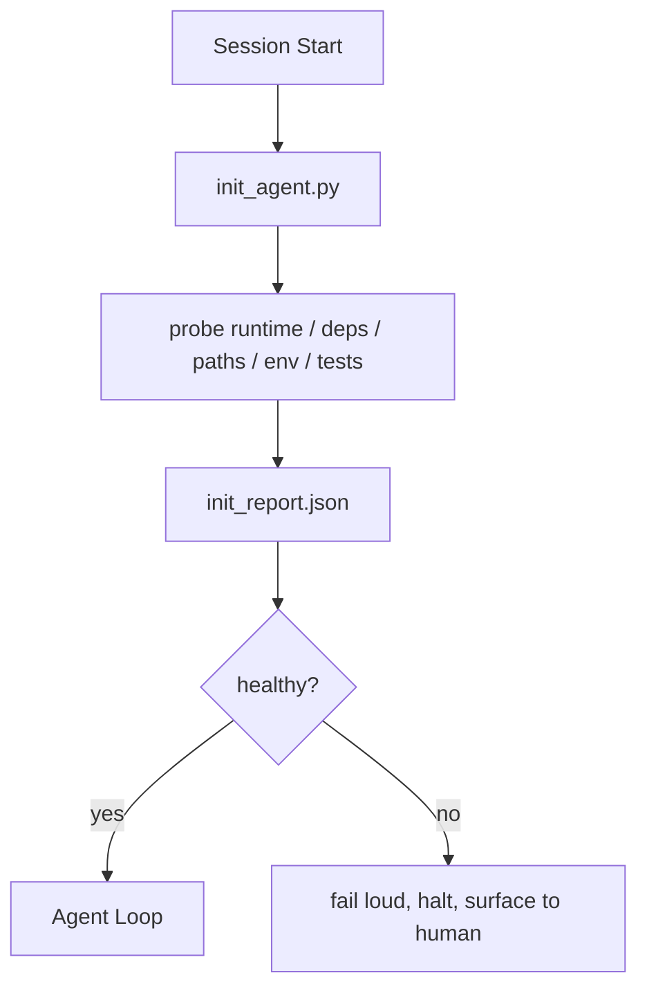

# Scripts de Inicialização para Agents

> Toda sessão que começa do zero paga um imposto. O agent lê os mesmos arquivos, tenta as mesmas verificações e redescobre os mesmos caminhos. Um script de init paga esse imposto uma vez e grava as respostas no estado.

**Tipo:** Construção
**Linguagens:** Python (stdlib)
**Pré-requisitos:** Fase 14 · 32 (Workbench Mínimo), Fase 14 · 34 (Memória do Repo)
**Tempo:** ~45 minutos

## Objetivos de Aprendizado

- Identificar o trabalho que um agent nunca deveria ter que refazer a cada sessão.
- Criar um script de init determinístico que verifica runtime, dependências e saúde do repo.
- Persistir o resultado da verificação pra que o agent leia em vez de rodar os checks de novo.
- Falhar alto, rápido e com um único lugar pra olhar quando a inicialização falha.

## O Problema

Abre uma sessão. O agent chuta a versão do Python. Chuta o comando de teste. Lista a raiz do repo cinco vezes pra achar o entry point. Tenta importar um pacote que não tá instalado. Pergunta ao usuário onde fica o arquivo de config. Quando ele finalmente faz uma edição de verdade, dez mil tokens foram gastos em trabalho de setup que deveria ter sido um único script.

A solução é um script de inicialização que roda antes do agent fazer qualquer coisa e escreve um `init_report.json` que o agent lê na startup.

## O Conceito



### O que o script de init verifica

| Verificação | Por que importa |
|-------------|-----------------|
| Versões do runtime | Versão errada do Python ou Node gera bugs silenciosos de versão errada |
| Disponibilidade de dependências | Um pacote faltando depois custa dez vezes mais do que pegar agora |
| Comando de teste | O agent precisa saber como verificar; se o comando tá faltando, o workbench tá quebrado |
| Caminhos do repo | Caminhos hardcoded desatualizam; resolva uma vez e fixe |
| Variáveis de ambiente | `OPENAI_API_KEY` faltando é uma superfície de falha, não um mistério de runtime |
| Frescor do estado e do board | Estado estagnado de uma sessão que crashou é uma bomba-relógio |
| Último commit conhecido bom | Âncora pro diff de handoff no final da sessão |

### Falhe alto, falhe rápido, falhe em um só lugar

Uma falha na verificação significa parar e apresentar pro humano. Nada de "o agent vai se virar." O objetivo inteiro do init é recusar a inicialização quando o workbench tá quebrado.

### Idempotente

Roda duas vezes seguidas. A segunda vez deveria ser um no-op exceto por um timestamp novo. Idempotência é o que permite colocar o script no CI, hooks ou um comando slash pré-tarefa.

### Init versus regras de startup

Regras (Fase 14 · 33) descrevem o que precisa ser verdade pra agir. Init é o script que garante que essas regras podem ser checadas. Regras sem init viram "se cuida." Init sem regras vira uma falha bem organizada.

## Construa

`code/main.py` implementa `init_agent.py`:

- Cinco verificações: versão do Python, dependências listadas via `importlib.util.find_spec`, resolubilidade do comando de teste, variáveis de ambiente necessárias, frescor do arquivo de estado.
- Cada verificação retorna `(nome, status, detalhe)`.
- O script escreve `init_report.json` com o conjunto completo de verificações e sai com código diferente de zero se qualquer verificação de severidade bloqueante falhar.

Rode:

```
python3 code/main.py
```

O script imprime a tabela de verificações, escreve `init_report.json` e sai com zero no caminho feliz ou diferente de zero com a lista de verificações que falharam.

## Padrões de produção no mundo real

Três padrões separam um script de init útil de uma cerimônia.

**Âncora no último commit conhecido bom.** Verifica o commit atual contra um arquivo `LKG` escrito no último merge bem-sucedido. Se o diff exceder um orçamento (padrão 50 arquivos), recusa a inicialização e exige que um humano ratifique a nova baseline. É o que o AI Code Review da Cloudflare usa pra delimitar agents de review: cada sessão de review ancora no mesmo último commit conhecido bom e nunca acumula desvio entre sessões.

**Lock files com TTL.** Escreve um `prereqs.lock` após a primeira passagem bem-sucedida. Rodadas subsequentes confiam no lock por N horas (padrão 24h) e pulam as verificações caras. O script de init lê o lock primeiro; se tá fresco e o hash do manifest de dependências bate, faz curto-circuito. É o mesmo padrão que o Docker usa pra caches de camada: probe idempotente + hash de conteúdo = skip.

**Sem rede, sem LLM, sem surpresas no hot path.** Probes de init são encanamento determinístico. Uma probe que chama um LLM pra classificar uma falha ou que acessa um serviço externo pra checar uma licença não é uma probe; é um workflow. Se uma probe demora mais de três segundos em um dry run, trate isso como um cheiro de workbench e mova pra fora do init ou faça cache do resultado.

## Use

Em produção:

- **Hooks do Claude Code.** O hook `pre-task` chama o script de init e recusa iniciar o agent se ele falhar.
- **GitHub Actions.** Um job `setup-agent` roda o script de init; o job do agent depende dele.
- **Docker entrypoint.** O container do agent roda o script de init antes de executar o runtime do agent; logs aparecem na falha.

O script de init é portável porque não faz chamadas pra nenhum framework específico. Bash, Make ou um arquivo de tasks podem todos encapsulá-lo.

## Entregue

`outputs/skill-init-script.md` entrevista o projeto, classifica o trabalho de setup em verificações e emite um `init_agent.py` específico pro projeto mais um workflow de CI que roda ele antes de qualquer etapa do agent.

## Exercícios

1. Adicione uma verificação que compara o commit atual com o último commit conhecido bom e recusa a inicialização se mais de 50 arquivos mudaram.
2. Coloque o script pra escrever um arquivo `prereqs.lock` e recuse a inicializar se o lock tiver mais de sete dias.
3. Adicione uma flag `--fix` que instala automaticamente dependências de dev faltantes mas nunca modifica dependências de runtime sem aprovação.
4. Mova as verificações de funções hardcoded pra um registro YAML. Defenda o trade-off.
5. Adicione um orçamento de tempo por verificação. Uma verificação que roda mais de três segundos é um cheiro de workbench.

## Termos-Chave

| Termo | O que a galera fala | O que realmente significa |
|-------|---------------------|--------------------------|
| Probe | "Um check" | Uma função determinística que retorna `(nome, status, detalhe)` |
| Relatório de init | "Saída do setup" | JSON gravado ao lado do estado com os resultados das verificações |
| Idempotente | "Seguro pra rodar de novo" | Duas rodadas seguidas produzem relatórios idênticos módulo timestamp |
| Falhe alto | "Não engole" | Para e apresenta pro humano; sem fallback silencioso |
| Imposto de setup | "Custo de bootstrap" | Os tokens que o agent gasta por sessão redescobrindo o óbvio |

## Leitura Complementar

- [Anthropic, Effective harnesses for long-running agents](https://www.anthropic.com/engineering/effective-harnesses-for-long-running-agents)
- [GitHub Actions, composite actions for setup](https://docs.github.com/en/actions/sharing-automations/creating-actions/creating-a-composite-action)
- [microservices.io, GenAI dev platform: guardrails](https://microservices.io/post/architecture/2026/03/09/genai-development-platform-part-1-development-guardrails.html) — pre-commit + CI checks como init
- [Augment Code, How to Build Your AGENTS.md (2026)](https://www.augmentcode.com/guides/how-to-build-agents-md) — expectativas de init
- [Codex Blog, Codex CLI Context Compaction](https://codex.danielvaughan.com/2026/03/31/codex-cli-context-compaction-architecture/) — startup de sessão como init aware de compactação
- Fase 14 · 33 — o conjunto de regras que esse script habilita
- Fase 14 · 34 — o arquivo de estado que esse script semeia
- Fase 14 · 38 — o verification gate que o init alimenta
- Fase 14 · 40 — o handoff que consome o último commit conhecido bom do relatório de init
