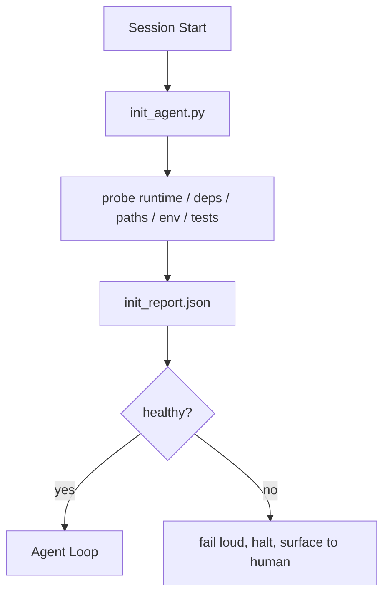

# Agents için Başlatma Komut Dosyaları

> Soğuk başlayan her seans vergi öder. agent aynı dosyaları okur, aynı araştırmaları yeniden dener ve aynı yolları yeniden keşfeder. Bir init betiği vergiyi bir kez öder ve yanıtları duruma yazar.

**Tür:** Yapım
**Diller:** Python (stdlib)
**Önkoşullar:** Aşama 14 · 32 (Minimal Çalışma Tezgahı), Aşama 14 · 34 (Repo Belleği)
**Süre:** ~45 dakika

## Öğrenme Hedefleri

- Bir agent'nin oturum başına asla yeniden yapmak zorunda kalmaması gereken işi tanımlayın.
- Çalışma zamanını, bağımlılıkları ve depo durumunu araştıran deterministik bir başlatma betiği oluşturun.
- Kontrol sonucunu yeniden çalıştırmak yerine agent'nin okuması için araştırma sonucunu sürdürün.
- Başlatma başarısız olduğunda yüksek sesle, hızlı ve bakacak tek yerden başarısız olun.

## Sorun

Bir oturum açın. agent Python sürümünü tahmin eder. Test komutunu tahmin eder. Giriş noktasını bulmak için repo kökünü beş kez listeler. Kurulu olmayan bir paketi içe aktarmaya çalışır. Kullanıcıya yapılandırma dosyasının nerede bulunduğunu sorar. Gerçek bir düzenleme yaptığında, on bin token tek bir komut dosyası olması gereken kurulum işine gitmiştir.

Düzeltme, agent başka bir şey yapmadan önce çalışan ve başlangıçta agent'nin okuduğu bir `init_report.json` yazan bir başlatma komut dosyasıdır.

## Konsept



### Başlangıç ​​betiğinin araştırdığı şey

| Prob | Neden önemlidir |
|-------|----------------|
| Çalışma zamanı sürümleri | Yanlış Python veya Node sürümü, sessiz yanlış sürüm hataları anlamına gelir |
| Bağımlılık kullanılabilirliği | Kayıp bir paketin maliyeti daha sonra onu şimdi yakalamanın maliyetinin on katıdır |
| Test komutu | agent nasıl doğrulama yapılacağını bilmeli; komut eksikse tezgah bozulur |
| Repo yolları | Sabit kodlanmış yollar sürükleniyor; bunları bir kez çözün ve sabitleyin |
| Ortam değişkenleri | `OPENAI_API_KEY`'nin eksik olması çalışma zamanı gizemi değil, başarısızlık yüzeyidir |
| Durum + tahta tazeliği | Çökmüş bir oturumun eski durumu bir tabancadır |
| Bilinen son iyi sonuç | Oturumun sonundaki devir farkının dayanağı |

### Yüksek sesle başarısız olun, hızlı başarısız olun, tek bir yerde başarısız olun

Prob arızası, insan için durup yüzeye çıkmak anlamına gelir. Hayır "agent bunu çözecek." Başlatmanın asıl amacı, tezgah bozulduğunda başlamayı reddetmektir.

### İdempotent

Üst üste iki kez çalıştırın. İkinci çalıştırma, yeni bir zaman damgası dışında işlem yapılmamalıdır. Idempotency, betiği CI'ya, kancalara veya görev öncesi eğik çizgi komutuna bağlamanıza olanak tanıyan şeydir.

### Başlatma ve başlatma kuralları

Kurallar (Aşama 14 · 33) eyleme geçmek için neyin doğru olması gerektiğini tanımlar. Init, bu kuralların kontrol edilebileceğini belirleyen komut dosyasıdır. init içermeyen kurallar "dikkatli olun" haline gelir. Kuralsız başlangıç, gösterişli bir başarısızlığa dönüşür.

## İnşa Et

`code/main.py`, `init_agent.py`'yi uygular:

- Beş araştırma: Python sürümü, `importlib.util.find_spec` yoluyla listelenen bağımlılıklar, test komutu çözülebilirliği, gerekli env değişkenleri, durum dosyası güncelliği.
- Her araştırma `(name, status, detail)` değerini döndürür.
- Betik, tam araştırma seti ile `init_report.json` yazar ve herhangi bir blok önem araştırması başarısız olursa sıfırdan farklı olarak çıkar.

Çalıştır:

```
python3 code/main.py
```

Betik, araştırma tablosunu yazdırır, `init_report.json` yazar ve başarısız araştırmaların listesiyle birlikte mutlu yolda veya sıfırdan farklı olarak sıfırdan çıkar.

## Vahşi doğada üretim modelleri

Yararlı bir başlangıç ​​senaryosunu törenden üç kalıp ayırır.

**Son bilinen-iyi işleme bağlantısı.** Son başarılı birleştirmede yazılan bir `LKG` dosyasına karşı mevcut işlemeyi araştırın. Fark bir bütçeyi aşarsa (varsayılan 50 dosya), başlamayı reddedin ve bir kişinin yeni temeli onaylamasını isteyin. Cloudflare'in AI Kod İncelemesi, incelemeci agent'lerin kapsamını belirlemek için bunu kullanır: her inceleme oturumu, aynı bilinen son iyiye göre sabitlenir ve oturumlar arasındaki sapmaları hiçbir zaman birleştirmez.

**Dosyaları TTL ile kilitleyin.** İlk başarılı araştırma geçişinden sonra bir `prereqs.lock` yazın. Sonraki çalıştırmalar N saat boyunca kilide güvenir (varsayılan 24 saat) ve pahalı araştırmaları atlar. Başlatma betiği önce kilidi okur; eğer yeniyse ve bağımlılık bildirimi karma eşleşiyorsa, kısa devre yapar. Bu, Docker'ın katman önbellekleri için kullandığı modelin aynısıdır: idempotent probe + content hash = skip.

**Ağ yok, Yüksek Lisans yok, sıcak yolda sürpriz yok.** Başlangıç ​​araştırmaları deterministik tesisatlardır. Bir arızayı sınıflandırmak için LLM'yi çağıran veya bir lisansı kontrol etmek için harici bir hizmete başvuran bir araştırma, bir araştırma değildir; bu bir iş akışıdır. Bir probun provada üç saniyeden uzun sürmesi durumunda, bunu bir çalışma tezgahı kokusu olarak değerlendirin ve onu başlangıçtan çıkarın veya sonucunu önbelleğe alın.

## Kullan onu

Üretimde:

- **Claude Kodu kancalanır.** `pre-task` kancası, başlatma betiğini çağırır ve başarısız olursa agent'yı başlatmayı reddeder.
- **GitHub Eylemleri.** Bir `setup-agent` işi başlatma betiğini çalıştırır; agent işi buna bağlı.
- **Docker giriş noktası.** agent kapsayıcısı, agent çalışma zamanını çalıştırmadan önce başlatma betiğini çalıştırır; başarısızlık durumunda yüzeye çıkar.

Başlatma betiği taşınabilirdir çünkü belirli bir framework'ye çağrı yapmaz. Bash, Make veya bir görev dosyasının tümü onu sarabilir.

## Gönderin

`outputs/skill-init-script.md` projeyle görüşür, kurulum çalışmasını araştırmalar halinde sınıflandırır ve projeye özel bir `init_agent.py` artı onu herhangi bir agent adımından önce çalıştıran bir CI iş akışı yayar.

## Egzersizler

1. Geçerli işlemi, bilinen son iyi işlemeyle karşılaştıran ve 50'den fazla dosya değiştiğinde başlamayı reddeden bir araştırma ekleyin.
2. Komut dosyasını bir `prereqs.lock` dosyası yazacak ve kilit yedi günden eskiyse başlatmayı reddedecek şekilde bağlayın.
3. Eksik geliştirme bağımlılıklarını otomatik olarak yükleyen ancak çalışma zamanı bağımlılıklarını onay olmadan asla değiştirmeyen bir `--fix` bayrağı ekleyin.
4. Araştırmaları sabit kodlanmış işlevlerden YAML kaydına taşıyın. Takas hakkını savun.
5. Araştırma başına bir zamanlama bütçesi ekleyin. Üç saniyeden uzun süre çalışan bir prob, tezgah kokusudur.

## Anahtar Terimler

| Dönem | İnsanlar ne diyor | Aslında ne anlama geliyor |
|------|----------------|------------------------|
| Prob | "Çek" | `(name, status, detail)` döndüren deterministik bir fonksiyon |
| Raporu başlat | "Çıkış kurulumu" | JSON, araştırma sonuçlarıyla birlikte durumun yanında yazılı |
| İdempotent | "Yeniden çalıştırmak güvenli" | Art arda iki çalıştırma aynı raporları modülo zaman damgası üretir |
| Yüksek sesle başarısız ol | "Yutmayın" | Durun ve insana doğru yüzeye çıkın; sessiz geri dönüş yok |
| Kurulum vergisi | "Önyükleme maliyeti" | agent bariz olanı yeniden keşfetmek için oturum başına harcadığı tokens |

## Daha Fazla Okuma

- [Uzun koşan agentlar için antropik, Etkili koşum takımları](https://www.anthropic.com/engineering/effective-harnesses-for-long-running-agents)
- [GitHub Eylemleri, kurulum için bileşik eylemler](https://docs.github.com/en/actions/sharing-automations/creating-actions/creating-a-composite-action)
- [microservices.io, GenAI geliştirme platformu: guardrails](https://microservices.io/post/architecture/2026/03/09/genai-development-platform-part-1-development-guardrails.html) — ön taahhüt + başlangıç ​​olarak CI kontrolleri
- [Geliştirme Kodu, AGENTS.md (2026)](https://www.augmentcode.com/guides/how-to-build-agents-md)'nizi Nasıl Oluşturabilirsiniz — başlangıç ​​beklentileri
- [Codex Blogu, Codex CLI Bağlam Sıkıştırması](https://codex.danielvaughan.com/2026/03/31/codex-cli-context-compaction-architecture/) — sıkıştırmaya duyarlı başlangıç ​​olarak oturum başlangıcı
- Aşama 14 · 33 — bu komut dosyasının etkinleştirdiği kural kümesi
- Aşama 14 · 34 — bu betiğin tohumladığı durum dosyası
- Aşama 14 · 38 — başlatma komut dosyasının beslediği doğrulama kapısı
- Aşama 14 · 40 — başlangıç ​​raporunun bilinen son faydasını tüketen devir
