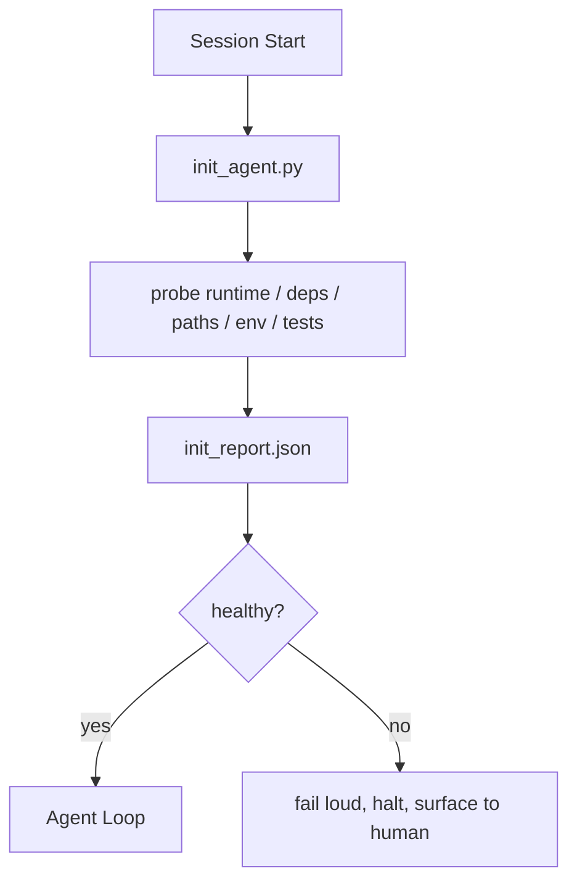

# 35 · 智能体的初始化脚本

> 每一次从冷启动开始的会话都要交一笔税。智能体读取同样的文件，重试同样的探测，重新发现同样的路径。初始化脚本把这笔税一次性交清，并把答案写进状态。

**类型：** 构建
**语言：** Python（标准库）
**前置：** 阶段 14 · 32（最小化工作台）、阶段 14 · 34（仓库记忆）
**时长：** 约 45 分钟

## 学习目标

- 识别出智能体每次会话都不应该重做的工作。
- 构建一个确定性的初始化脚本，用于探测运行时、依赖与仓库健康状况。
- 持久化探测结果，让智能体读取它，而不是重新运行检查。
- 让失败响亮、迅速，并且只有一个地方需要查看——当初始化失败时。

## 问题

打开一个会话。智能体猜测 Python 版本。猜测测试命令。把仓库根目录列出五遍来寻找入口点。尝试 import 一个尚未安装的包。问用户配置文件在哪里。等到它真正做出一次有效编辑时，已经有上万 token 花在了本应只是一个脚本的环境搭建上。

修复办法是：一个初始化脚本，在智能体做任何其他事情之前运行，并写出一份 `init_report.json`，让智能体在启动时读取它。

## 概念



### 初始化脚本探测什么

| 探测项 | 为何重要 |
|-------|----------------|
| 运行时版本 | 错误的 Python 或 Node 版本意味着无声的版本错误型 bug |
| 依赖可用性 | 后续才发现缺包，代价是现在抓住它的十倍 |
| 测试命令 | 智能体必须知道如何验证；命令缺失就意味着工作台坏了 |
| 仓库路径 | 硬编码路径会漂移；一次性解析它们并固定下来 |
| 环境变量 | 缺少 `OPENAI_API_KEY` 是一个失败面，而不是运行时的谜题 |
| 状态与看板的新鲜度 | 来自崩溃会话的陈旧状态是一颗自伤的雷 |
| 最后已知良好提交（last-known-good commit） | 会话结束时交接 diff 的锚点 |

### 失败要响亮、要迅速、要集中在一处

探测失败意味着停下并上报给人类。绝不要「智能体会自己想办法」。初始化的全部意义就在于：当工作台坏掉时，拒绝启动。

### 幂等（Idempotent）

连续运行两次。第二次运行除了刷新时间戳之外应当是空操作（no-op）。正是幂等性让你能把脚本接入 CI、钩子（hooks），或一个任务前的斜杠命令。

### 初始化 vs 启动规则

规则（阶段 14 · 33）描述的是「采取行动必须为真的条件」。初始化是建立「这些规则可被检查」这一前提的脚本。没有初始化的规则会沦为「小心点」。没有规则的初始化则会成为一次精致的失败。

## 动手构建

`code/main.py` 实现了 `init_agent.py`：

- 五个探测：Python 版本、通过 `importlib.util.find_spec` 检查所列依赖、测试命令的可解析性、必需的环境变量、状态文件的新鲜度。
- 每个探测返回 `(name, status, detail)`。
- 脚本写出包含完整探测集的 `init_report.json`，并在任何阻断级（block-severity）探测失败时以非零状态退出。

运行它：

```
python3 code/main.py
```

脚本会打印探测表格、写出 `init_report.json`，在顺利路径下以零退出，或在失败时以非零退出并附上一份失败探测列表。

## 业界的生产模式

有三种模式把一个有用的初始化脚本与一场仪式区分开来。

**最后已知良好提交锚定。** 把当前提交与在上一次成功合并时写入的 `LKG` 文件做对比探测。如果 diff 超过预算（默认 50 个文件），就拒绝启动，并要求人类批准这条新基线。这正是 Cloudflare 的 AI Code Review 用来约束审查智能体范围的做法：每一次审查会话都锚定到同一个最后已知良好状态，绝不让漂移在多次会话间累积。

**带 TTL 的锁文件。** 在第一次探测全部通过后写一个 `prereqs.lock`。后续运行在 N 小时（默认 24h）内信任该锁并跳过昂贵的探测。初始化脚本先读取锁；如果它是新鲜的且依赖清单的哈希匹配，就短路（short-circuit）。这与 Docker 用于层缓存的模式相同：幂等探测 + 内容哈希 = 跳过。

**热路径里没有网络、没有 LLM、没有意外。** 初始化探测是确定性的管道工程。一个调用 LLM 去分类失败、或访问外部服务去检查许可证的探测不是探测，而是一个工作流。如果某个探测在一次空跑（dry run）中耗时超过三秒，就把它当作工作台的异味（workbench smell），要么把它移出初始化，要么缓存它的结果。

## 投入使用

在生产中：

- **Claude Code 钩子。** `pre-task` 钩子调用初始化脚本，若失败则拒绝启动智能体。
- **GitHub Actions。** 一个 `setup-agent` 作业运行初始化脚本；智能体作业依赖于它。
- **Docker entrypoint。** 智能体容器在 exec 智能体运行时之前先运行初始化脚本；失败时日志会浮现出来。

初始化脚本是可移植的，因为它不调用任何特定框架。Bash、Make 或一个任务文件都可以包裹它。

## 交付

`outputs/skill-init-script.md` 会访谈项目，把其环境搭建工作分类成探测项，并输出一个项目专属的 `init_agent.py`，外加一个在任何智能体步骤之前运行它的 CI 工作流。

## 练习

1. 添加一个探测，把当前提交与最后已知良好提交做 diff，若超过 50 个文件变更则拒绝启动。
2. 接线让脚本写出一个 `prereqs.lock` 文件，并在锁的年龄超过七天时拒绝启动。
3. 添加一个 `--fix` 标志，自动安装缺失的开发依赖，但未经批准绝不修改运行时依赖。
4. 把探测从硬编码函数迁移到一个 YAML 注册表。为这个权衡做出论证。
5. 给每个探测加一个计时预算。运行时间超过三秒的探测就是一种工作台异味。

## 关键术语

| 术语 | 人们怎么说 | 它实际指什么 |
|------|----------------|------------------------|
| 探测（Probe） | 「一个检查」 | 一个返回 `(name, status, detail)` 的确定性函数 |
| 初始化报告（Init report） | 「搭建输出」 | 写在状态文件旁、包含探测结果的 JSON |
| 幂等（Idempotent） | 「可以安全重跑」 | 连续两次运行产出除时间戳外完全相同的报告 |
| 失败响亮（Fail loud） | 「别吞掉」 | 停下并上报给人类；没有无声的回退 |
| 搭建税（Setup tax） | 「引导成本」 | 智能体每次会话花在重新发现显而易见之事上的 token |

## 延伸阅读

- [Anthropic, Effective harnesses for long-running agents](https://www.anthropic.com/engineering/effective-harnesses-for-long-running-agents)
- [GitHub Actions, composite actions for setup](https://docs.github.com/en/actions/sharing-automations/creating-actions/creating-a-composite-action)
- [microservices.io, GenAI dev platform: guardrails](https://microservices.io/post/architecture/2026/03/09/genai-development-platform-part-1-development-guardrails.html) —— 把预提交 + CI 检查作为初始化
- [Augment Code, How to Build Your AGENTS.md (2026)](https://www.augmentcode.com/guides/how-to-build-agents-md) —— 初始化的预期
- [Codex Blog, Codex CLI Context Compaction](https://codex.danielvaughan.com/2026/03/31/codex-cli-context-compaction-architecture/) —— 把会话启动当作压缩感知（compaction-aware）的初始化
- 阶段 14 · 33 —— 本脚本所赋能的规则集
- 阶段 14 · 34 —— 本脚本所播种的状态文件
- 阶段 14 · 38 —— 本初始化脚本所馈入的验证关卡
- 阶段 14 · 40 —— 消费初始化报告中「最后已知良好」的交接
