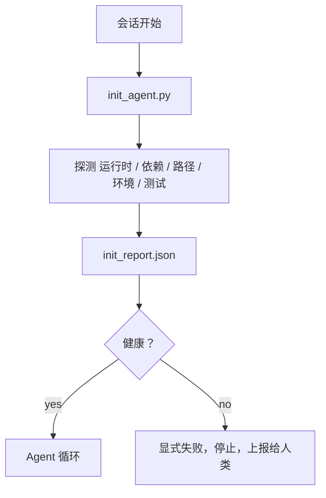

# Agent 的初始化脚本（Initialization Scripts for Agents）

> 译注：本文译自同目录 [`en.md`](./en.md)。术语遵循仓根 [TRANSLATION_GUIDE.md](../../../../TRANSLATION_GUIDE.md)。

> 每一次冷启动的 session 都得交一笔税。agent 反复读同一批文件、反复跑同一批探测、反复重新发现同一批路径。一个 init 脚本只交一次税，把答案直接写进状态里。

**Type:** Build
**Languages:** Python (stdlib)
**Prerequisites:** Phase 14 · 32 (Minimal Workbench), Phase 14 · 34 (Repo Memory)
**Time:** ~45 minutes

## 学习目标（Learning Objectives）

- 识别 agent 在每个 session 里都不该重做的工作。
- 构建一个确定性的 init 脚本，用来探测运行时、依赖与仓库健康度。
- 把探测结果持久化下来，让 agent 直接读，而不是重跑检查。
- 失败时要响、要快、要只在一处可查。

## 问题（The Problem）

打开一个 session。agent 猜 Python 版本。猜测试命令。把仓库根目录列五遍才找到入口。尝试 import 一个根本没装的包。问用户配置文件在哪。等它真正动手改一行代码时，已经有一万 token 烧在了「本该一个脚本搞定的初始化」上。

解决办法：一个初始化脚本，在 agent 做任何事之前先跑一遍，并写出一份 `init_report.json`，agent 启动时直接读这份报告。

## 概念（The Concept）



### init 脚本探测什么（What the init script probes）

| 探测项 | 为什么重要 |
|-------|----------------|
| 运行时版本 | Python 或 Node 版本不对，会埋下静默的版本错误 bug |
| 依赖可用性 | 一个缺失的包，事后修复的成本是当下抓出来的十倍 |
| 测试命令 | agent 必须知道怎么验证；测试命令缺失等于 workbench 坏了 |
| 仓库路径 | 硬编码路径会漂移；解析一次，钉死 |
| 环境变量 | 缺 `OPENAI_API_KEY` 是一个失败面，而不是一个运行时谜题 |
| 状态 + board 新鲜度 | 来自上一个崩掉 session 的陈旧状态是个大坑 |
| Last-known-good commit | 给 session 末尾的 handoff（交接包）diff 锚点 |

### 失败要响、要快、要在一处（Fail loud, fail fast, fail in one place）

一项探测失败，就停下来交给人。不要「agent 自己会想办法」。init 的全部意义就是：当 workbench 坏了的时候，拒绝启动。

### 幂等（Idempotent）

连跑两次。第二次除了新的时间戳之外应该完全是 no-op。幂等性正是让你能把脚本接进 CI、hook 或者 pre-task slash command 的前提。

### Init 与启动规则的区别（Init versus startup rules）

规则（Phase 14 · 33）描述「要动手必须满足什么条件」。Init 是确保这些规则真的可以被检查的脚本。没有 init 的规则就只是「小心点」。没有规则的 init 就只是一次精致的失败。

## 动手实现（Build It）

`code/main.py` 实现了 `init_agent.py`：

- 五个探测：Python 版本、通过 `importlib.util.find_spec` 检查列出的依赖、测试命令的可解析性、必备的环境变量、状态文件新鲜度。
- 每个探测返回 `(name, status, detail)`。
- 脚本把完整的探测集合写进 `init_report.json`；如果有任何「block 严重级别」的探测失败，就以非零退出。

跑起来：

```
python3 code/main.py
```

脚本会打印探测表、写出 `init_report.json`，并在 happy path 上以零退出，或在失败时以非零退出并列出失败的探测。

## 现实里的生产模式（Production patterns in the wild）

有用的 init 脚本和走过场的 init 脚本，差别在三个模式上。

**Last-known-good commit 锚定。** 把当前 commit 与上一次成功合入时写下的 `LKG` 文件做对比。如果 diff 超出预算（默认 50 个文件），拒绝启动，要求人来认可新的 baseline（基准）。这就是 Cloudflare 的 AI Code Review 用来圈定 reviewer（验证器）agent 范围的做法：每一次 review session 都锚定同一个 last-known-good，永远不让漂移在 session 之间叠加。

**带 TTL 的 lock 文件。** 第一次探测全部通过后，写一份 `prereqs.lock`。后续运行在 N 小时内（默认 24h）信任这个 lock，跳过昂贵的探测。init 脚本先读 lock；只要它够新、并且依赖清单的 hash 匹配，就短路掉。这跟 Docker 缓存层的模式是同一个：幂等探测 + 内容 hash = 跳过。

**热路径上不联网、不调 LLM、不留意外。** Init 探测是确定性的管道工程。一个调 LLM 来判断失败原因、或者打外部服务查 license 的「探测」，那不是探测，那是 workflow。如果一个探测在 dry run 里耗时超过三秒，就把它当成 workbench 的异味，要么从 init 里挪走，要么把结果缓存起来。

## 用起来（Use It）

在生产环境里：

- **Claude Code hooks。** `pre-task` hook 调 init 脚本，失败就拒绝启动 agent。
- **GitHub Actions。** 一个 `setup-agent` job 跑 init 脚本；agent job 依赖它。
- **Docker entrypoint。** agent 容器在 exec agent 运行时之前先跑 init 脚本；失败时通过日志暴露。

init 脚本是可移植的，因为它不依赖任何具体框架。Bash、Make、tasks 文件都能把它包起来。

## 上线部署（Ship It）

`outputs/skill-init-script.md` 会访谈这个项目，把它的初始化工作分类成探测项，产出一份项目专属的 `init_agent.py`，以及一个在任何 agent 步骤之前先跑它的 CI workflow（流水线）。

## 练习（Exercises）

1. 加一项探测：对比当前 commit 与 last-known-good commit 的 diff，超过 50 个文件就拒绝启动。
2. 让脚本写一份 `prereqs.lock` 文件，lock 超过七天就拒绝启动。
3. 加一个 `--fix` 标志，自动安装缺失的开发依赖，但绝不在没有审批的情况下改运行时依赖。
4. 把探测从硬编码的函数迁移到一份 YAML 注册表。为这个权衡做辩护。
5. 给每项探测加一个时间预算。运行超过三秒的探测就是 workbench 异味。

## 关键术语（Key Terms）

| 术语 | 大家口头怎么说 | 它真正的意思 |
|------|----------------|------------------------|
| Probe（探测） | 「一个 check」 | 一个返回 `(name, status, detail)` 的确定性函数 |
| Init report（初始化报告） | 「Setup 的输出」 | 写在 state 旁边、装着探测结果的 JSON |
| Idempotent（幂等） | 「重跑安全」 | 连跑两次的报告除了时间戳完全相同 |
| Fail loud（响着失败） | 「别吞错误」 | 停下来交给人；不要静默 fallback |
| Setup tax（启动税） | 「Bootstrap 成本」 | agent 每个 session 花在重新发现显而易见之事上的 token |

## 延伸阅读（Further Reading）

- [Anthropic, Effective harnesses for long-running agents](https://www.anthropic.com/engineering/effective-harnesses-for-long-running-agents)
- [GitHub Actions, composite actions for setup](https://docs.github.com/en/actions/sharing-automations/creating-actions/creating-a-composite-action)
- [microservices.io, GenAI dev platform: guardrails](https://microservices.io/post/architecture/2026/03/09/genai-development-platform-part-1-development-guardrails.html) — 把 pre-commit + CI 检查当作 init
- [Augment Code, How to Build Your AGENTS.md (2026)](https://www.augmentcode.com/guides/how-to-build-agents-md) — 对 init 的期望
- [Codex Blog, Codex CLI Context Compaction](https://codex.danielvaughan.com/2026/03/31/codex-cli-context-compaction-architecture/) — 把 session 启动当作 compaction（压缩）感知的 init
- Phase 14 · 33 — 这份脚本要落地的规则集
- Phase 14 · 34 — 这份脚本要播种的状态文件
- Phase 14 · 38 — 这份 init 脚本要喂给的验证 gate
- Phase 14 · 40 — 消费 init 报告里 last-known-good 的 handoff
