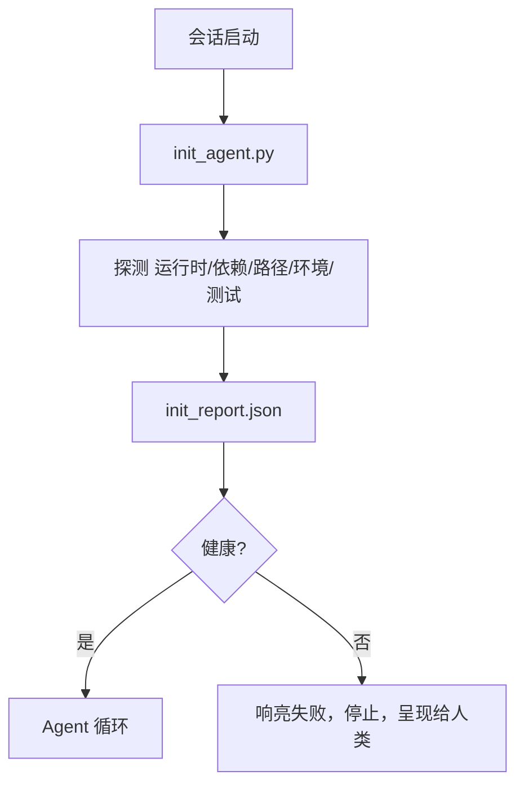

# Agent 初始化脚本

> 每个冷启动的会话都要付出代价。Agent 读取相同的文件，重试相同的探测，重新发现相同的路径。初始化脚本一次性付出代价，并将答案写入状态。

**类型：** 构建
**语言：** Python（标准库）
**先决条件：** 阶段 14 · 32（最小工作台）、阶段 14 · 34（仓库记忆）
**时间：** ~45 分钟

## 学习目标

- 识别 Agent 永远不需要每轮重做的工作。
- 构建一个确定性初始化脚本，探测运行时、依赖项和仓库健康度。
- 持久化探测结果，以便 Agent 读取它而非重新运行检查。
- 在初始化失败时快速响亮地失败，并提供一个查找位置。

## 问题

打开一个会话。Agent 猜测 Python 版本。猜测测试命令。列出仓库根目录五次以查找入口点。尝试导入未安装的包。询问用户配置文件在哪里。到它进行真正编辑时，一万个 token 已经花在应该是单个脚本的设置工作上。

修复方法是一个在 Agent 做任何其他事情之前运行的初始化脚本，并写入 Agent 在启动时读取的 `init_report.json`。

## 概念



### 初始化脚本探测的内容

| 探测 | 为何重要 |
|------|----------|
| Runtime versions（运行时版本） | 错误的 Python 或 Node 版本意味着静默的版本错误 |
| Dependency availability（依赖可用性） | 缺失的包后来花费的成本是现在捕获成本的十倍 |
| Test command（测试命令） | Agent 必须知道如何验证；如果命令缺失，工作台就坏了 |
| Repo paths（仓库路径） | 硬编码路径会漂移；解析一次并固定 |
| Environment variables（环境变量） | 缺失的 `OPENAI_API_KEY` 是失败层面，而非运行时谜团 |
| State + board freshness（状态 + 面板新鲜度） | 来自崩溃会话的陈旧状态是 footgun |
| Last-known-good commit（最后已知良好提交） | 会话结束时的交接差异锚点 |

### 响亮失败，快速失败，在一个地方失败

探测失败意味着停止并呈现给人类。没有"Agent 会弄清楚的"。初始化的全部意义就是在工作台损坏时拒绝启动。

### 幂等

连续运行两次。第二次运行应该是无操作的，除了新鲜的时间戳。幂等性让你能够将脚本接入 CI、hook 或预任务斜杠命令。

### 初始化与启动规则

规则（阶段 14 · 33）描述采取行动必须为真的事情。初始化是建立可以检查这些规则的脚本。没有初始化的规则变成"小心"。没有规则的初始化变成 polished 失败。

## 构建

`code/main.py` 实现 `init_agent.py`：

- 五个探测：Python 版本、通过 `importlib.util.find_spec` 列出的依赖项、测试命令可解析性、必需的环境变量、状态文件新鲜度。
- 每个探测返回 `(name, status, detail)`。
- 脚本写入带有完整探测集的 `init_report.json`，如果任何阻止严重性探测失败则非零退出。

运行：

```
python3 code/main.py
```

脚本打印探测表，写入 `init_report.json`，在快乐路径上零退出，或在失败探测列表上非零退出。

## 生产模式

三种模式将有用的初始化脚本与仪式区分开来。

**最后已知良好提交锚定。** 根据上次成功合并写入的 `LKG` 文件探测当前提交。如果差异超过预算（默认 50 个文件），拒绝启动并要求人类批准新的基线。这是 Cloudflare 的 AI 代码审查用于范围审查 Agent 的方法：每个审查会话锚定到相同的最后已知良好，并且从不跨会话复合漂移。

**带 TTL 的锁文件。** 在第一次成功的探测通行后写入 `prereqs.lock`。后续运行在 N 小时内（默认 24 小时）信任锁并跳过昂贵的探测。初始化脚本首先读取锁；如果它是新鲜的且依赖清单哈希匹配，它就短路。这与 Docker 用于层缓存的相同模式：幂等探测 + 内容哈希 = 跳过。

**热路径中没有网络、没有 LLM、没有意外。** 初始化探测是确定性管道。调用 LLM 对失败分类或命中外部服务检查许可证的探测不是探测；它是工作流。如果探测在干运行中花费超过三秒，将其视为工作台坏味道，要么将其移出初始化，要么缓存其结果。

## 使用

在生产中：

- **Claude Code hooks。** `pre-task` hook 调用初始化脚本，如果失败则拒绝启动 Agent。
- **GitHub Actions。** 一个 `setup-agent` 作业运行初始化脚本；Agent 作业依赖于它。
- **Docker 入口点。** Agent 容器在执行 Agent 运行时之前运行初始化脚本；日志在失败时呈现。

初始化脚本是可移植的，因为它不调用特定框架。Bash、Make 或 tasks 文件都可以包装它。

## 部署

`outputs/skill-init-script.md` 采访项目，将其设置工作分类为探测，并发布项目特定的 `init_agent.py` 加上在任何 Agent 步骤之前运行它的 CI 工作流。

## 练习

1. 添加一个探测，将当前提交与最后已知良好提交进行差异比较，如果更改超过 50 个文件则拒绝启动。
2. 将脚本连线以写入 `prereqs.lock` 文件，如果锁超过七天则拒绝启动。
3. 添加 `--fix` 标志，自动安装缺失的开发依赖项，但未经批准绝不修改运行时依赖项。
4. 将探测从硬编码函数移动到 YAML 注册表。辩护权衡。
5. 添加每个探测的计时预算。运行超过三秒的探测是工作台坏味道。

## 关键术语

| 术语 | 人们的说法 | 实际含义 |
|------|----------|----------|
| Probe（探测） | "一个检查" | 返回 `(name, status, detail)` 的确定性函数 |
| Init report（初始化报告） | "设置输出" | 写在状态旁边的带有探测结果的 JSON |
| Idempotent（幂等） | "安全重新运行" | 连续两次运行产生除时间戳外的相同报告 |
| Fail loud（响亮失败） | "不要吞下" | 停止并呈现给人类；无静默回退 |
| Setup tax（设置代价） | "引导成本" | Agent 每轮花费在重新发现显而易见事物上的 token |

## 延伸阅读

- [Anthropic, 长运行 Agent 的有效 harness](https://www.anthropic.com/engineering/effective-harnesses-for-long-running-agents)
- [GitHub Actions, 用于设置的复合操作](https://docs.github.com/en/actions/sharing-automations/creating-actions/creating-a-composite-action)
- [microservices.io, GenAI 开发平台：护栏](https://microservices.io/post/architecture/2026/03/09/genai-development-platform-part-1-development-guardrails.html) — 作为初始化的预提交 + CI 检查
- [Augment Code, 如何构建你的 AGENTS.md (2026)](https://www.augmentcode.com/guides/how-to-build-agents-md) — 初始化期望
- [Codex Blog, Codex CLI 上下文压缩](https://codex.danielvaughan.com/2026/03/31/codex-cli-context-compaction-architecture/) — 作为感知压缩的会话启动
- 阶段 14 · 33 — 此脚本启用的规则集
- 阶段 14 · 34 — 此脚本种子的状态文件
- 阶段 14 · 38 — 初始化脚本馈送的验证门
- 阶段 14 · 40 — 消费初始化报告最后已知良好的交接
