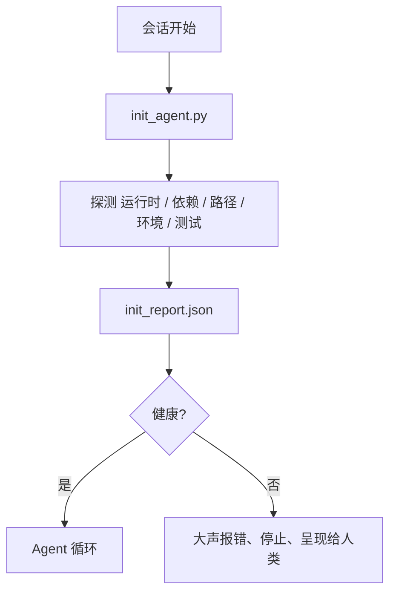

# Agent 初始化脚本（Initialization Scripts for Agents）

> 每个冷启动的会话都要付出代价。Agent 反复读取相同的文件、重试相同的探测、重新发现相同的路径。而初始化脚本仅支付一次代价，并将答案写入状态中。

**类型：** 构建  
**语言：** Python（标准库）  
**前置条件：** 阶段 14 · 32（最小工作台）、阶段 14 · 34（仓库记忆）  
**耗时：** 约 45 分钟

## 学习目标

- 识别 Agent 每次会话中绝不该重复做的工作。
- 构建一个确定性的初始化脚本，探测运行时、依赖和仓库健康状态。
- 持久化探测结果，使 Agent 直接读取而非重复执行检查。
- 当初始化失败时，做到大声、快速报错，并集中在一个地方排查。

## 问题

打开一个会话。Agent 猜测 Python 版本。猜测测试命令。列出五次仓库根目录以找到入口点。尝试导入一个未安装的包。询问用户配置文件在哪里。等它真正开始编辑时，已经消耗了一万个 token 用于本应一个脚本就能完成的准备工作。

解决方案是一个初始化脚本，在 Agent 做任何其他工作之前运行，并写入一个 `init_report.json`，Agent 在启动时读取它。

## 概念


```mermaid
flowchart TD
  Start[会话开始] --> Init[init_agent.py]
  Init --> Probes[探测 运行时 / 依赖 / 路径 / 环境 / 测试]
  Probes --> Report[init_report.json]
  Report --> Decision{健康?}
  Decision -- 是 --> Agent[Agent 循环]
  Decision -- 否 --> Halt[大声报错、停止、呈现给人类]
```

### 初始化脚本探测什么

| 探测项 | 为何重要 |
|--------|----------|
| 运行时版本 | 错误的 Python 或 Node 版本意味着静默的错误版本 bug |
| 依赖可用性 | 后续缺失某个包，代价是现在检查出来的十倍 |
| 测试命令 | Agent 必须知道如何验证；若命令缺失，工作台就是坏的 |
| 仓库路径 | 硬编码的路径会漂移；一次性解析并固定下来 |
| 环境变量 | 缺少 `OPENAI_API_KEY` 是一个明确的失败面，而不是运行时的谜题 |
| 状态与面板新鲜度 | 崩溃会话留下的陈旧状态是一个隐患 |
| 最后已知良好提交 | 为会话结束时的手写 diff 提供锚点 |

### 大声报错、快速报错、集中报错

探测失败意味着停止并呈现给人类。不要指望"Agent 自己会搞清楚"。初始化的全部意义就在于当工作台损坏时拒绝启动。

### 幂等性

连续运行两次。第二次运行除了刷新时间戳外应该不做任何实质性操作。幂等性使你能够将这个脚本接入 CI、Git 钩子或前任务斜杠命令。

### 初始化与启动规则

规则（阶段 14 · 33）描述了行动必须具备的条件。初始化是建立这些条件可被检查的脚本。没有初始化的规则会沦为"小心一点"；没有规则的初始化则会变成精致的失败。

## 构建它

`code/main.py` 实现了 `init_agent.py`：

- 五个探测项：Python 版本、通过 `importlib.util.find_spec` 列出的依赖、测试命令的可解析性、必需的环境变量、状态文件的新鲜度。
- 每个探测返回 `(name, status, detail)`。
- 脚本写入 `init_report.json`，包含完整的探测结果集，若有任何阻塞级别的探测失败则非零退出。

运行方式：

```
python3 code/main.py
```

脚本会打印探测结果表格，写入 `init_report.json`，在正常路径下以零退出，否则以非零退出并列出失败的探测项。

## 生产环境中的模式

三种模式能使初始化脚本真正有用而非流于形式。

**最后已知良好提交锚定。** 将当前提交与上次成功合并时写入的 `LKG` 文件进行比对。如果 diff 超出预算（默认 50 个文件），则拒绝启动并要求人类确认新的基线。Cloudflare 的 AI 代码审查正是使用此方法来限定审查 Agent 的范围：每个审查会话都锚定在同一个最后已知良好提交上，永远不会跨会话累积偏差。

**带 TTL 的锁文件。** 第一次成功通过探测后写入 `prereqs.lock`。后续运行在 N 小时内（默认 24 小时）信任该锁并跳过昂贵的探测。初始化脚本首先读取锁文件；如果锁仍然新鲜且依赖清单哈希匹配，就直接短路返回。这与 Docker 的层缓存使用相同模式：幂等探测 + 内容哈希 = 跳过。

**热路径中无网络、无 LLM、无意外。** 初始化探测是确定性的管道工作。一个需要调用 LLM 来分类失败或访问外部服务检查许可证的探测，不是探测——它是工作流。如果某个探测在空跑中耗时超过三秒，将其视为工作台的气味，要么移出初始化脚本，要么缓存其结果。

## 使用它

在生产环境中：

- **Claude Code 钩子。** `pre-task` 钩子调用初始化脚本，若失败则拒绝启动 Agent。
- **GitHub Actions。** 一个 `setup-agent` 作业运行初始化脚本；Agent 作业依赖于它。
- **Docker 入口点。** Agent 容器在执行 Agent 运行时之前运行初始化脚本；失败时日志会呈现出来。

初始化脚本是可移植的，因为它不对特定框架做任何调用。Bash、Make 或任务文件都可以包装它。

## 交付物

`outputs/skill-init-script.md` 对项目进行访谈，将其设置工作分类为探测项，并生成项目专属的 `init_agent.py` 以及在任何 Agent 步骤之前运行它的 CI 工作流。

## 练习

1. 添加一个探测项，将当前提交与最后已知良好提交进行 diff，如果超过 50 个文件被更改则拒绝启动。
2. 让脚本写入 `prereqs.lock` 文件，如果锁文件超过七天则拒绝启动。
3. 添加一个 `--fix` 标志，自动安装缺失的开发依赖，但未经批准不得修改运行时依赖。
4. 将探测从硬编码函数迁移到 YAML 注册表。论证其中的权衡。
5. 为每个探测添加时间预算。运行超过三秒的探测被视为工作台气味。

## 关键术语

| 术语 | 通常说法 | 实际含义 |
|------|----------|----------|
| 探测（Probe） | "一项检查" | 返回 `(name, status, detail)` 的确定性函数 |
| 初始化报告（Init report） | "设置输出" | 与状态文件相邻写入、包含探测结果的 JSON |
| 幂等（Idempotent） | "可安全重跑" | 连续两次运行产生除时间戳外完全相同的报告 |
| 大声报错（Fail loud） | "不要吞掉错误" | 停止并呈现给人类；无静默降级 |
| 设置税（Setup tax） | "启动成本" | Agent 每次会话中重新发现显而易见事物所消耗的 token |

## 延伸阅读

- [Anthropic —— 长期运行 Agent 的高效框架](https://www.anthropic.com/engineering/effective-harnesses-for-long-running-agents)
- [GitHub Actions —— 用于设置的复合操作](https://docs.github.com/en/actions/sharing-automations/creating-actions/creating-a-composite-action)
- [microservices.io —— GenAI 开发平台：护栏](https://microservices.io/post/architecture/2026/03/09/genai-development-platform-part-1-development-guardrails.html) —— 将 pre-commit 和 CI 检查作为初始化
- [Augment Code —— 如何构建你的 AGENTS.md（2026）](https://www.augmentcode.com/guides/how-to-build-agents-md) —— 初始化期望
- [Codex Blog —— Codex CLI 上下文压缩](https://codex.danielvaughan.com/2026/03/31/codex-cli-context-compaction-architecture/) —— 将会话启动视为感知上下文的初始化
- 阶段 14 · 33 —— 此脚本所启用的规则集
- 阶段 14 · 34 —— 此脚本所填充的状态文件
- 阶段 14 · 38 —— 此脚本所供给的验证关卡
- 阶段 14 · 40 —— 消耗初始化报告中最后已知良好提交的交接
