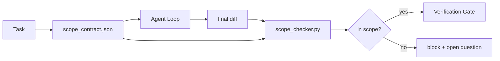

# Scope Contracts and Task Boundaries

> The model does not know where the work ends. A scope contract is a per-task file that says where the work begins, where it ends, and how to roll back if it spills. The contract turns "stay in scope" from a wish into a check.

**Type:** Build
**Languages:** Python (stdlib)
**Prerequisites:** Phase 14 · 32 (Minimal Workbench), Phase 14 · 33 (Rules as Constraints)
**Time:** ~50 minutes

## Learning Objectives

- Write a scope contract that an agent reads at task start and a verifier reads at task end.
- Specify allowed files, forbidden files, acceptance criteria, rollback plan, and approval boundaries.
- Implement a scope checker that compares a diff against the contract and flags violations.
- Make scope creep visible, automatic, and reviewable.

## The Problem

Agents creep. The task is "fix the login bug." The diff touches the login route, the email helper, the database driver, the README, and the release script. Each touch had a plausible reason in the moment. Together they are a different change than the one that was reviewed.

Scope creep is the most under-monitored failure mode in agent work because the agent narrates each step in good faith. The fix is not a stricter prompt. The fix is a contract on disk that says what was promised and a check that compares the result against the promise.

## The Concept



### What goes in a scope contract

| Field | Purpose |
|-------|---------|
| `task_id` | Links to the task on the board |
| `goal` | One sentence the reviewer can verify |
| `allowed_files` | Globs the agent may write |
| `forbidden_files` | Globs the agent must not touch even by accident |
| `acceptance_criteria` | Test commands or assertion lines that prove done |
| `rollback_plan` | One paragraph the operator can execute if a halt is required |
| `approvals_required` | Actions outside scope that need explicit human sign-off |

A contract without `forbidden_files` is incomplete. The negative space is half the contract.

### Globs, not raw paths

Real repos move files. Pin contracts to globs (`app/**/*.py`, `tests/test_signup*.py`) so a refactor between sessions does not invalidate the contract.

### Rollback is part of scope

Listing how to roll back forces the contract author to think about what could go wrong. A contract you cannot roll back from is a contract that should not be approved.

### Scope check is a diff check

The agent writes a diff. The checker reads the diff, the allowed globs, the forbidden globs, and a list of any acceptance commands that ran. Each violation is a tagged finding the verification gate can refuse.

## Build It

`code/main.py` implements:

- `scope_contract.json` schema (subset of JSON Schema, glob arrays).
- A diff parser that turns a list of touched files plus a list of run commands into a `RunSummary`.
- A `scope_check` that returns `(violations, in_scope, off_scope)` against the contract.
- Two demo runs: one that stays in scope, one that creeps. The checker flags the creep with the exact file and reason.

Run it:

```
python3 code/main.py
```

Output: the contract, the two runs, the per-run verdicts, and a saved `scope_report.json`.

## Use It

Production patterns:

- **Claude Code slash commands.** A `/scope` command writes the contract and pins it as session context. Subagents read the contract before acting.
- **GitHub PRs.** Push the contract as a JSON file in the PR body or as a checked-in artifact. CI runs the scope checker against the merge diff.
- **LangGraph interrupts.** A scope violation triggers an interrupt; the handler asks the human whether the contract needs to grow or the agent needs to back off.

The contract travels with the task. When the task closes, the contract is archived under `outputs/scope/closed/`.

## Ship It

`outputs/skill-scope-contract.md` generates a scope contract for a task description and a glob-aware checker that runs in CI on every agent diff.

## Exercises

1. Add a `network_egress` field listing allowed external hosts. Refuse runs that touch other hosts.
2. Extend the checker to fail soft on `docs/**` and hard on `scripts/**`. Justify the asymmetry.
3. Make the contract derive `allowed_files` from a `goal` field using a static rule set (no LLM). What goes wrong on the first edge case?
4. Add a `time_budget_minutes` and refuse to continue once the wall clock exceeds it.
5. Run two contracts against the same diff. What is the right merge semantics when both apply?

## Key Terms

| Term | What people say | What it actually means |
|------|----------------|------------------------|
| Scope contract | "The task brief" | Per-task JSON listing allowed/forbidden files, acceptance, rollback |
| Scope creep | "It also touched..." | Files outside the contract changed in the same task |
| Rollback plan | "We can revert" | The one-paragraph operator runbook for halting |
| Approval boundary | "Needs sign-off" | An action listed in the contract as requiring explicit human approval |
| Diff check | "Path audit" | Comparing touched files against the contract globs |

## Further Reading

- [LangGraph human-in-the-loop interrupts](https://langchain-ai.github.io/langgraph/concepts/human_in_the_loop/)
- [OpenAI Agents SDK tool approval policies](https://platform.openai.com/docs/guides/agents-sdk)
- Phase 14 · 27 — prompt injection defenses that pair with scope locks
- Phase 14 · 33 — the rule set this contract specializes per task
- Phase 14 · 38 — the verification gate the checker reports into
