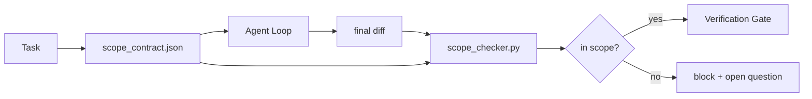

# スコープ契約とタスク境界

> モデルは作業の終わりを知りません。スコープ契約は、作業がどこから始まり、どこで終わり、はみ出したらどう戻すかをタスクごとに書くファイルです。この契約によって、「スコープ内に留まる」という願いがチェックに変わります。

**種別:** 構築
**言語:** Python (stdlib)
**前提条件:** Phase 14 · 32 (Minimal Workbench), Phase 14 · 33 (Rules as Constraints)
**所要時間:** 約50分

## Learning Objectives

- agent がタスク開始時に読み、verifier がタスク終了時に読むスコープ契約を書けるようになる。
- 許可ファイル、禁止ファイル、受け入れ条件、rollback plan、approval boundary を指定できるようになる。
- diff を契約と照合し、違反を検出する scope checker を実装する。
- scope creep を見える化し、自動化し、review 可能にする。

## 問題

Agent はスコープからはみ出します。タスクは「login bug を修正する」です。diff は login route、email helper、database driver、README、release script に触れます。その瞬間ごとには、どの変更にももっともらしい理由がありました。しかし全体としては、review された変更とは別物になっています。

Scope creep は agent 作業でもっとも監視不足になりやすい failure mode です。agent は各ステップを善意で説明するからです。解決策は prompt を厳しくすることではありません。約束した内容をディスク上の契約にし、結果をその約束と比較する check を置くことです。

## The Concept



### スコープ契約に入れるもの

| Field | Purpose |
|-------|---------|
| `task_id` | ボード上のタスクに紐づける |
| `goal` | reviewer が検証できる一文の目標 |
| `allowed_files` | agent が書き換えてよい glob |
| `forbidden_files` | 偶発的にも触れてはいけない glob |
| `acceptance_criteria` | 完了を証明する test command や assertion 行 |
| `rollback_plan` | 停止が必要なとき operator が実行できる一段落の手順 |
| `approvals_required` | スコープ外で明示的な human sign-off が必要な行為 |

`forbidden_files` がない契約は未完成です。negative space は契約の半分です。

### raw path ではなく glob

実際の repo ではファイルが動きます。契約は raw path ではなく glob (`app/**/*.py`, `tests/test_signup*.py`) に固定します。そうすれば session 間の refactor で契約が無効になりにくくなります。

### rollback はスコープの一部

戻し方を列挙すると、契約を書く人は何が壊れうるかを考えざるを得ません。rollback できない契約は、承認すべき契約ではありません。

### scope check は diff check

Agent は diff を書きます。checker は diff、allowed glob、forbidden glob、実行された acceptance command の一覧を読みます。各違反は verification gate が拒否できる tagged finding になります。

## 実装

`code/main.py` は次を実装します。

- `scope_contract.json` schema (JSON Schema のサブセット、glob 配列)。
- touched file の一覧と実行コマンドの一覧を `RunSummary` に変換する diff parser。
- 契約に対して `(violations, in_scope, off_scope)` を返す `scope_check`。
- スコープ内に留まる demo run と、scope creep する demo run。checker は creep を exact file と理由つきで flag します。

実行します。

```
python3 code/main.py
```

出力: 契約、2 つの run、run ごとの verdict、保存された `scope_report.json`。

## Production patterns in the wild

「specsmaxxing」(agent 起動前に YAML で scope contract を書く運用) を行った practitioner は、agent を変えずに rabbit-hole rate が 3 週間で 52% から 21% に下がったと報告しています。仕事をしたのは model ではなく契約です。この改善を定着させる pattern が 3 つあります。

**Violation budgets, not binary failures.** `agent-guardrails` (Claude Code、Cursor、Windsurf、Codex が MCP 経由で使う OSS merge gate) は、タスクごとに `violationBudget` を持ちます。budget 内の小さなスコープ逸脱は warning として提示し、budget を超えたときだけ merge gate が拒否します。`violationSeverity: "error" | "warning"` と組み合わせます。budget は、実際に運用される gate と、嫌われて無効化される gate の差です。

**Severity asymmetry by path family.** `docs/**` への off-scope write はたいてい `warn` です。一方、`scripts/**`、`migrations/**`、`config/prod/**` への off-scope write は常に `block` です。この非対称性は runtime ではなく契約に置く必要があります。project 固有で、task ごとに変わるからです。

**Time and network budgets next to file budgets.** `time_budget_minutes` field は wall clock を制限し、runtime は再承認なしに超過後の継続を拒否します。hostname の `network_egress` allowlist は、タスクに含まれていない外部 API を agent が静かに叩くことを防ぎます。これらもスコープの dimension です。file glob は必要ですが十分ではありません。

**Multi-contract merge semantics (least privilege).** 2 つのスコープ契約が同時に適用される場合 (project-wide contract と task-specific contract など)、merge は次の通りです。`allowed_files` は **intersect** (両方の契約が path を許可する必要がある)、`forbidden_files` は **union** (どちらかが禁止すれば禁止)、`time_budget_minutes` はもっとも厳しい値 (min)、`approvals_required` は累積します。`network_egress` は、`None` が enforcement なし、`[]` が deny-all、`[...]` が allowlist です。merge では `None` は相手側に委ね、2 つの list は交差し、deny-all は deny-all のままです。merge が機械的で review 可能になるように、この規則を contract schema に明記します。

## Use It

Production pattern:

- **Claude Code slash commands.** `/scope` command が契約を書き、session context として pin します。Subagent は作業前に契約を読みます。
- **GitHub PRs.** 契約を PR body の JSON file または checked-in artifact として push します。CI が merge diff に対して scope checker を実行します。
- **LangGraph interrupts.** scope violation が interrupt を発生させます。handler は、人間に契約を広げるべきか、agent が引くべきかを確認します。

契約はタスクと一緒に移動します。タスクが close されたら、契約は `outputs/scope/closed/` に archive されます。

## Ship It

`outputs/skill-scope-contract.md` は、タスク説明からスコープ契約を生成し、すべての agent diff に対して CI で走る glob-aware checker を生成します。

## Exercises

1. 許可された外部 host を列挙する `network_egress` field を追加してください。他の host に触れる run は拒否してください。
2. checker を拡張し、`docs/**` は soft fail、`scripts/**` は hard fail にしてください。その非対称性を正当化してください。
3. static rule set (LLM なし) を使って、`goal` field から `allowed_files` を導出してください。最初の edge case で何が壊れますか。
4. `time_budget_minutes` を追加し、wall clock が超えたら継続を拒否してください。
5. 同じ diff に対して 2 つの契約を実行してください。両方が適用される場合の正しい merge semantics は何ですか。

## Key Terms

| Term | What people say | What it actually means |
|------|----------------|------------------------|
| Scope contract | 「タスク brief」 | 許可/禁止ファイル、acceptance、rollback を列挙する task ごとの JSON |
| Scope creep | 「ここにも触れた」 | 同じ task 内で契約外のファイルが変更されること |
| Rollback plan | 「revert できる」 | 停止時に operator が使う一段落の runbook |
| Approval boundary | 「sign-off が必要」 | 明示的な human approval が必要な action として契約に列挙された境界 |
| Diff check | 「path audit」 | touched file を contract glob と比較すること |

## 参考文献

- [LangGraph human-in-the-loop interrupts](https://langchain-ai.github.io/langgraph/concepts/human_in_the_loop/)
- [OpenAI Agents SDK tool approval policies](https://platform.openai.com/docs/guides/agents-sdk)
- [logi-cmd/agent-guardrails — merge gates and scope validation](https://github.com/logi-cmd/agent-guardrails) — violation budget と severity tier
- [Dev|Journal, Preventing AI Agent Configuration Drift with Agent Contract Testing](https://earezki.com/ai-news/2026-05-05-i-built-a-tiny-ci-tool-to-keep-ai-agent-configs-from-drifting-in-my-repo/) — external deps なしの `--strict` mode
- [Agentic Coding Is Not a Trap (production logs)](https://dev.to/jtorchia/agentic-coding-is-not-a-trap-i-answered-the-viral-hn-post-with-my-own-production-logs-33d9) — specsmaxxing の実績: 52% → 21%
- [OpenCode permission globs](https://opencode.ai/docs/agents/) — permission ごとの細かな scope
- [Knostic, AI Coding Agent Security: Threat Models and Protection Strategies](https://www.knostic.ai/blog/ai-coding-agent-security) — least privilege の一部としての scope
- [Augment Code, AI Spec Template](https://www.augmentcode.com/guides/ai-spec-template) — 3 層の boundary system (must/ask/never)
- Phase 14 · 27 — scope lock と組み合わせる prompt injection defense
- Phase 14 · 33 — この契約が task ごとに特化する rule set
- Phase 14 · 38 — checker が report を渡す verification gate
