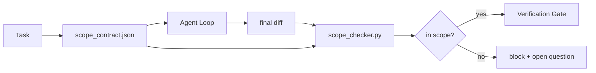

# Contratos de Escopo e Limites de Tarefa

> O modelo não sabe onde o trabalho termina. Um contrato de escopo é um arquivo por tarefa que diz onde o trabalho começa, onde termina, e como fazer rollback se vazar. O contrato transforma "fique dentro do escopo" de um desejo numa verificação.

**Tipo:** Construção
**Linguagens:** Python (stdlib)
**Pré-requisitos:** Fase 14 · 32 (Workbench Mínimo), Fase 14 · 33 (Regras como Restrições)
**Tempo:** ~50 minutos

## Objetivos de Aprendizado

- Escrever um contrato de escopo que um agente lê no início da tarefa e um verificador lê no final.
- Eespecificaçãoificar arquivos permitidos, arquivos proibidos, critérios de aceitação, plano de rollback e limites de aprovação.
- Implementar um verificador de escopo que compara um diff com o contrato e sinaliza violações.
- Tornar o scope creep visível, automático e revisável.

## O Problema

Agents expandem o escopo. A tarefa é "consertar o bug de login." O diff toca na rota de login, no helper de email, no driver do banco, no README e no script de release. Cada toque tinha uma justificativa plausível no momento. Juntos, eles são uma mudança diferente daquela que foi revisada.

Scope creep é o modo de falha mais submonitorado no trabalho de agente porque o agente narra cada passo de boa fé. A solução não é um prompt mais rigoroso. A solução é um contrato no disco que diz o que foi prometido e uma verificação que compara o resultado com a promessa.

## O Conceito



### O que vai num contrato de escopo

| Campo | Finalidade |
|-------|------------|
| `task_id` | Vincula à tarefa no board |
| `goal` | Uma frase que o revisor pode verificar |
| `allowed_files` | Globs que o agente pode escrever |
| `forbidden_files` | Globs que o agente não pode tocar nem por acidente |
| `acceptance_criteria` | Comandos de teste ou linhas de assert que provam conclusão |
| `rollback_plan` | Um parágrafo que o operador pode executar se precisar parar |
| `approvals_required` | Ações fora do escopo que precisam de aprovação explícita de um humano |

Um contrato sem `forbidden_files` tá incompleto. O espaço negativo é metade do contrato.

### Globs, não caminhos brutos

Repos reais movem arquivos. Fixe os contratos em globs (`app/**/*.py`, `tests/test_signup*.py`) pra que um refactor entre sessões não invalidade o contrato.

### Rollback faz parte do escopo

Listar como fazer rollback força quem escreve o contrato a pensar no que pode dar errado. Um contrato que não dá pra dar rollback não deveria ser aprovado.

### Verificação de escopo é verificação de diff

O agente escreve um diff. O verificador lê o diff, os globs permitidos, os globs proibidos e a lista de comandos de aceitação que rodaram. Cada violação é uma constatação marcada que o verification gate pode recusar.

## Construa

`code/main.py` implementa:

- Schema do `scope_contract.json` (subset do JSON Schema, arrays de glob).
- Um parser de diff que transforma uma lista de arquivos tocados mais uma lista de comandos rodados num `RunSummary`.
- Uma `scope_check` que retorna `(violações, dentro_do_escopo, fora_do_escopo)` contra o contrato.
- Duas demos: uma que fica dentro do escopo, uma que vaza. O verificador marca o vazamento com o arquivo exato e o motivo.

Rode:

```
python3 code/main.py
```

Saída: o contrato, as duas rodadas, os veredictos por rodada e um `scope_report.json` salvo.

## Padrões de produção no mundo real

Um praticante rodando "especificaçãosmaxxing" (contratos de escopo em YAML antes de invocar o agent) relata que a taxa de rabbit-hole caiu de 52% pra 21% em três semanas sem mudar o agent. O contrato fez o trabalho, não o modelo. Três padrões garantem que o ganho persista.

**Orçamentos de violação, não falhas binárias.** `agent-guardrails` (o merge gate OSS usado pelo Claude Code, Cursor, Windsurf, Codex via MCP) entrega um `violationBudget` por tarefa: desvios menores dentro do orçamento aparecem como warnings; só quando o orçamento é excedido o merge gate recusa. Combine com `violationSeverity: "error" | "warning"`. O orçamento é a diferença entre um gate que entrega e um gate que é desligado pelo time que odiou.

**Assimetria de severidade por família de caminho.** Escritas fora do escopo em `docs/**` geralmente são `warn`; escritas fora do escopo em `scripts/**`, `migrations/**`, `config/prod/**` são sempre `block`. Essa assimetria precisa morar no contrato, não no runtime, porque é eespecificaçãoífica do projeto e muda por tarefa.

**Orçamentos de tempo e rede ao lado dos orçamentos de arquivo.** Um campo `time_budget_minutes` limita o relógio; o runtime recusa continuar sem nova aprovação. Uma allowlist de `network_egress` por hostname impede que o agente acesse silenciosamente uma API externa que não fazia parte da tarefa. Essas são dimensões de escopo também; os globs de arquivo são necessários, mas não suficientes.

**Semântica de merge multi-contrato (menor privilégio).** Quando dois contratos de escopo se aplicam (ex: um contrato de projeto inteiro mais um eespecificaçãoífico da tarefa), o merge é: **interseção** de `allowed_files` (ambos devem permitir o caminho), **união** de `forbidden_files` (qualquer um pode proibir), `time_budget_minutes` é o mais restritivo (mínimo), `approvals_required` acumula. `network_egress` é `None` pra sem enforcement, `[]` pra negar tudo, `[...]` como allowlist; sob merge, `None` cede pro outro lado, duas listas intersectam, e deny-all continua deny-all. Declare isso no schema do contrato pra que o merge seja mecânico e revisável.

## Use

Padrões de produção:

- **Comandos slash do Claude Code.** Um comando `/scope` escreve o contrato e fixa como contexto da sessão. Subagents leem o contrato antes de agir.
- **PRs no GitHub.** Envie o contrato como arquivo JSON no corpo do PR ou como artifact versionado. CI roda o verificador de escopo contra o diff de merge.
- **Interrupções no LangGraph.** Uma violação de escopo dispara uma interrupção; o handler pergunta ao humano se o contrato precisa crescer ou se o agente precisa recuar.

O contrato viaja com a tarefa. Quando a tarefa fecha, o contrato é arquivado em `outputs/scope/closed/`.

## Entregue

`outputs/skill-scope-contract.md` gera um contrato de escopo pra uma descrição de tarefa e um verificador aware de glob que roda no CI a cada diff do agent.

## Exercícios

1. Adicione um campo `network_egress` listando hosts externos permitidos. Recuse rodadas que toquem em outros hosts.
2. Estenda o verificador pra falhar suave em `docs/**` e falhar forte em `scripts/**`. Justifique a assimetria.
3. Faça o contrato derivar `allowed_files` de um campo `goal` usando um conjunto de regras estáticas (sem LLM). O que dá errado no primeiro edge case?
4. Adicione um `time_budget_minutes` e recuse continuar quando o relógio exceder o limite.
5. Rode dois contratos contra o mesmo diff. Qual é a semântica de merge correta quando ambos se aplicam?

## Termos-Chave

| Termo | O que a galera fala | O que realmente significa |
|-------|---------------------|--------------------------|
| Contrato de escopo | "O briefing da tarefa" | JSON por tarefa listando arquivos permitidos/proibidos, aceitação, rollback |
| Scope creep | "Também mexeu em..." | Arquivos fora do contrato alterados na mesma tarefa |
| Plano de rollback | "A gente reverte" | O manual de uma página do operador pra parar tudo |
| Limite de aprovação | "Precisa de assinatura" | Uma ação listada no contrato como necessitando aprovação explícita de humano |
| Verificação de diff | "Auditoria de caminhos" | Comparar arquivos tocados com os globs do contrato |

## Leitura Complementar

- [LangGraph human-in-the-loop interrupts](https://langchain-ai.github.io/langgraph/concepts/human_in_the_loop/)
- [OpenAI Agents SDK ferramenta approval policies](https://platform.openai.com/docs/guides/agents-sdk)
- [logi-cmd/agent-guardrails — merge gates and scope validation](https://github.com/logi-cmd/agent-guardrails) — orçamentos de violação, tiers de severidade
- [Dev|Journal, Preventing AI Agent Configuration Drift with Agent Contract Testing](https://earezki.com/ai-news/2026-05-05-i-built-a-tiny-ci-tool-to-keep-ai-agent-configs-from-derivaing-in-my-repo/) — modo `--strict` sem deps externas
- [Agentic Coding Is Not a Trap (production logs)](https://dev.to/jtorchia/agentic-coding-is-not-a-trap-i-answered-the-viral-hn-post-with-my-own-production-logs-33d9) — receitas do especificaçãosmaxxing: 52% → 21%
- [OpenCode permission globs](https://opencode.ai/docs/agents/) — escopo por permissão de granularidade fina
- [Knostic, AI Coding Agent Security: Threat Models and Protection Strategies](https://www.knostic.ai/blog/ai-coding-agent-security) — escopo como parte do menor privilégio
- [Augment Code, AI Spec Template](https://www.augmentcode.com/guides/ai-especificação-template) — sistema de limites em três níveis (must/ask/never)
- Fase 14 · 27 — defesas contra prompt injection que combinam com restrições de escopo
- Fase 14 · 33 — o conjunto de regras que esse contrato eespecificaçãoializa por tarefa
- Fase 14 · 38 — o verification gate que o verificador reporta
