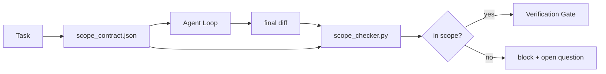

# Kapsam Sözleşmeleri ve Görev Sınırları

> Model işin nerede bittiğini bilmiyor. Kapsam sözleşmesi, işin nerede başladığını, nerede bittiğini ve taşması halinde nasıl geri alınacağını belirten, görev başına bir dosyadır. Sözleşme, "kapsam dahilinde kalmayı" bir dilek olmaktan çıkarıp çeke dönüştürüyor.

**Tür:** Yapım
**Diller:** Python (stdlib)
**Önkoşullar:** Aşama 14 · 32 (Minimum Çalışma Tezgahı), Aşama 14 · 33 (Kısıtlama Olarak Kurallar)
**Süre:** ~50 dakika

## Öğrenme Hedefleri

- agent'nin görev başlangıcında okuyacağı ve bir doğrulayıcının görev sonunda okuyacağı bir kapsam sözleşmesi yazın.
- İzin verilen dosyaları, yasak dosyaları, kabul kriterlerini, geri alma planını ve onay sınırlarını belirtin.
- Sözleşme ile farkları karşılaştıran ve ihlalleri işaretleyen bir kapsam denetleyicisi uygulayın.
- Kapsam kaymasını görünür, otomatik ve incelenebilir hale getirin.

## Sorun

Agent sürünüyor. Görev "giriş hatasını düzeltmek"tir. Fark, oturum açma yoluna, e-posta yardımcısına, veritabanı sürücüsüne, README'ye ve sürüm komut dosyasına dokunur. Her dokunuşun o anda makul bir nedeni vardı. Hepsi birlikte, incelenenden farklı bir değişikliktir.

Kapsam kayması agent çalışmasında en az izlenen hata modudur çünkü agent her adımı iyi niyetle anlatır. Düzeltme daha katı bir prompt değil. Düzeltme, diskte neyin vaat edildiğini belirten bir sözleşme ve sonucu sözle karşılaştıran bir kontroldür.

## Konsept



### Kapsam sözleşmesinde neler yer alır?

| Alan | Amaç |
|-------|---------|
| `task_id` | Panodaki göreve bağlantılar |
| `goal` | İncelemeyi yapan kişinin doğrulayabileceği bir cümle |
| `allowed_files` | agent'nin yazabileceği küreler |
| `forbidden_files` | agent küreciklerine kazara bile dokunulmamalıdır |
| `acceptance_criteria` | Tamamlandığını kanıtlayan test komutları veya iddia satırları |
| `rollback_plan` | Durdurma gerekiyorsa operatörün yürütebileceği bir paragraf |
| `approvals_required` | Açıkça insan tarafından imzalanması gereken kapsam dışı eylemler |

`forbidden_files` içermeyen bir sözleşme eksiktir. Negatif alan sözleşmenin yarısıdır.

### Küreler, ham yollar değil

Gerçek depolar dosyaları taşır. Sözleşmeleri globlara (`app/**/*.py`, `tests/test_signup*.py`) sabitleyin, böylece oturumlar arasındaki yeniden düzenleme sözleşmeyi geçersiz kılmaz.

### Geri alma kapsamın bir parçasıdır

Nasıl geri alınacağını listelemek, sözleşme yazarını neyin yanlış gidebileceğini düşünmeye zorlar. Geri alamayacağınız bir sözleşme, onaylanmaması gereken bir sözleşmedir.

### Kapsam kontrolü bir fark kontrolüdür

agent bir fark yazar. Denetleyici farkı, izin verilen küreleri, yasak küreleri ve çalıştırılan kabul komutlarının listesini okur. Her ihlal, doğrulama kapısının reddedebileceği bir etiketli bulgudur.

### Kapsamın iki düzeyi: özellik listesi ve görev sözleşmesi

Kapsam sözleşmesi bir görevi sınırlar. Projeyi bağlamaz. Bir agent, oturum açma düzeltmesi için bir sözleşmenin içinde mükemmel bir şekilde kalabilir ve yine de bir sonraki aşamada projenin bir ayarlar sayfasına, karanlık mod geçişine ve yönlendiricinin yeniden yazılmasına ihtiyacı olduğuna karar verebilir. Sözleşmede hiçbir zaman hangi işin proje kapsamında olduğu sorulmadı, yalnızca hangi dosyaların görev kapsamında olduğu sorulmuştu.

Bu ikinci yüksekliğin kendi ilkeline ihtiyacı var: agent'nin oturum başlangıcında okuduğu bir `feature_list.json`. Makine tarafından okunabilen, sıralı bir dosya olarak proje biriktirme listesidir. agent, `status`'si `todo` olan tam olarak bir özelliği seçer, `id`'sini aktif kapsam sözleşmesine yazar ve aynı oturumda ikinci bir özelliği başlatması yasaktır. "Her seferinde bir özellik", prompt'de bir satır olmaktan çıkar, agent geçmişi rasyonelleştirebilir ve diskten okuduğu ve geçidin uyguladığı bir kontrol olan bir değer haline gelir.

```json
{
  "project": "knowledge-base",
  "active": "import-pdf",
  "features": [
    { "id": "import-pdf",   "status": "in_progress", "goal": "import a PDF into the library",        "done_when": "pytest tests/test_import.py && a sample PDF appears in the library view" },
    { "id": "full-text-search", "status": "todo",     "goal": "search document text and rank hits",   "done_when": "query returns ranked results with snippets" },
    { "id": "cite-answers", "status": "todo",         "goal": "answers carry source citations",        "done_when": "every answer renders at least one clickable citation" }
  ]
}
```

| Alan | Amaç |
|-------|---------|
| `active` | Geçerli oturumun dokunabileceği tek özellik; boş, birini seçip ayarlamak anlamına gelir |
| `features[].id` | Kapsam sözleşmesinin `task_id` noktası |
| `features[].status` | `todo`, `in_progress`, `done`, `blocked`; aynı anda yalnızca bir `in_progress` |
| `features[].goal` | İncelemeyi yapan kişinin doğrulayabileceği bir cümle |
| `features[].done_when` | `in_progress`'yi `done`'ye çeviren kabul çizgisi |

İki kural, listeyi dekoratif olmaktan ziyade yük taşıyan hale getirir. İlk olarak, "en fazla bir `in_progress`" değişmezinin kendisi bir başlangıç ​​kontrolüdür (Aşama 14 · 33): listede iki tane varsa, bir insan bunu çözene kadar oturum başlamayı reddeder. İkincisi, özellik listesi bir sohbet mesajı değil bir dosyadır çünkü sohbet bağlamın dışına çıkar ve dosya oturumlar ve agent'ler arasında varlığını sürdürür. Aktarma (Aşama 14 · 40), tamamlanan özelliğin durumunu `done`'ye geri yazar, böylece bir sonraki oturum, kalanları yeniden türetmek yerine doğru bir panoya açılır.

Sözleşme ve liste, aşağıda açıklanan aynı birleştirmeyle en az ayrıcalığa göre oluşturulur: görev sözleşmesinin `allowed_files`'si, aktif özelliğin dokunduğu şeyin içine oturmalı, asla onun dışına çıkmamalıdır.

## İnşa Et

`code/main.py` şunu uygular:

- `scope_contract.json` şeması (JSON Şemasının alt kümesi, glob dizileri).
- Dokunulan dosyaların listesini ve çalıştırma komutlarının listesini `RunSummary`'ye dönüştüren bir fark ayrıştırıcı.
- Sözleşmeye karşılık `(violations, in_scope, off_scope)` değerini döndüren bir `scope_check`.
- İki demo çalışması: biri kapsam dahilinde kalan, diğeri sürünen. Kontrolör, sürüngeni tam dosya ve sebeple işaretler.

Çalıştır:

```
python3 code/main.py
```

Çıktı: sözleşme, iki çalıştırma, çalıştırma başına kararlar ve kaydedilen `scope_report.json`.

## Vahşi doğada üretim modelleri

"specsmaxxing" (agent'yi başlatmadan önce YAML'de kapsam sözleşmeleri) çalıştıran bir uygulayıcı, agent'yi değiştirmeden tavşan deliği oranının üç hafta içinde %52'den %21'e düştüğünü bildirdi. İşi model değil sözleşme yaptı. Üç model kazancın kalıcı olmasını sağlar.

**Bütçe ihlali, ikili hatalar değil.** `agent-guardrails` (MCP aracılığıyla Claude Code, Cursor, Windsurf, Codex tarafından kullanılan OSS birleştirme kapısı) görev başına bir `violationBudget` gönderir: bütçe içindeki küçük kapsam kaymaları uyarı olarak ortaya çıkar; ancak bütçe aşıldığında birleştirme kapısı reddeder. `violationSeverity: "error" | "warning"` ile eşleştirin. Bütçe, gönderilen bir kapı ile ondan nefret eden ekip tarafından devre dışı bırakılan bir kapı arasındaki farktır.

**Yol ailesine göre önem derecesi asimetrisi.** `docs/**`'ye kapsam dışı yazma işlemleri genellikle `warn`'dir; `scripts/**`, `migrations/**`, `config/prod/**`'ye kapsam dışı yazma işlemleri her zaman `block`'dir. Bu asimetrinin çalışma zamanında değil sözleşmede olması gerekir çünkü projeye özeldir ve göreve göre değişir.

**Dosya bütçelerinin yanında zaman ve ağ bütçeleri.** Bir `time_budget_minutes` alanı duvar saatini sınırlar; çalışma zamanı, yeniden onay olmadan bu aşamayı geçmeyi reddeder. Ana makine adlarındaki `network_egress` izin verilenler listesi, agent'nin, görevin parçası olmayan harici bir API'ye sessizce ulaşmasını engeller. Bunlar da kapsam boyutlarıdır; dosya küreleri gerekli, yeterli değil.

**Çok sözleşmeli birleştirme semantiği (en az ayrıcalık).** İki kapsam sözleşmesi geçerli olduğunda (e.g., proje çapında bir sözleşme artı göreve özel bir sözleşme), birleştirme şu şekildedir: **kesişen** `allowed_files` (her iki sözleşme de yola izin vermelidir), **birleşim** `forbidden_files` (her ikisi de yasaklayabilir), `time_budget_minutes` en kısıtlayıcıdır (min), `approvals_required` birikir. `network_egress`, yaptırım uygulanmaması için `None`, tümünü reddetme için `[]`, izin verilenler listesi olarak `[...]`'dir; birleştirme sırasında, `None` diğer tarafa erteler, iki liste kesişir ve hepsini reddet, hepsini reddet olarak kalır. Birleştirmenin mekanik ve gözden geçirilebilir olması için bunu sözleşme şemasında belirtin.

## Kullan onu

Üretim modelleri:

- **Claude Code eğik çizgi komutları.** Bir `/scope` komutu sözleşmeyi yazar ve bunu oturum bağlamı olarak sabitler. Subagent'ler harekete geçmeden önce sözleşmeyi okur.
- **GitHub PR'ler.** Sözleşmeyi PR gövdesine bir JSON dosyası olarak veya teslim edilmiş bir artifact olarak aktarın. CI kapsam denetleyicisini birleştirme farkına karşı çalıştırır.
- **LangGraph kesintiye uğrar.** Kapsam ihlali, kesintiyi tetikler; işleyici insana sözleşmenin büyümesi mi gerektiğini yoksa agent'nin geri adım atması mı gerektiğini sorar.

Sözleşme görevle birlikte seyahat eder. Görev kapatıldığında sözleşme `outputs/scope/closed/` altında arşivlenir.

## Gönderin

`outputs/skill-scope-contract.md`, bir görev açıklaması için bir kapsam sözleşmesi ve her agent farkında CI'da çalışan, dünyaya duyarlı bir denetleyici oluşturur.

## Egzersizler

1. İzin verilen harici ana bilgisayarları listeleyen bir `network_egress` alanı ekleyin. Diğer ana bilgisayarlara dokunan çalıştırmaları reddedin.
2. `docs/**`'de yumuşak ve `scripts/**`'de sert başarısız olacak şekilde denetleyiciyi uzatın. Asimetriyi gerekçelendirin.
3. Statik bir kural seti (LLM yok) kullanarak sözleşmenin `goal` alanından `allowed_files` türetmesini sağlayın. İlk uç durumda yanlış giden ne?
4. Bir `time_budget_minutes` ekleyin ve duvar saati bunu aştığında devam etmeyi reddedin.
5. Aynı farka karşı iki sözleşme çalıştırın. Her ikisi de geçerli olduğunda doğru birleştirme semantiği nedir?

## Anahtar Terimler

| Dönem | İnsanlar ne diyor | Aslında ne anlama geliyor |
|------|----------------|------------------------|
| Kapsam sözleşmesi | "Görev özeti" | Görev başına JSON'da izin verilen/yasaklı dosyaları listeleme, kabul etme, geri alma |
| Kapsam kayması | "Ayrıca dokundu..." | Sözleşmenin dışındaki dosyalar aynı görevde değiştirildi |
| Geri alma planı | "Geri dönebiliriz" | Durdurma için tek paragraflı operatör runbook'u |
| Onay sınırı | "İmza gerekiyor" | Sözleşmede açıkça insan onayı gerektiren bir eylem |
| Fark kontrolü | "Yol denetimi" | Dokunulan dosyaları sözleşme küreleriyle karşılaştırma |

## Daha Fazla Okuma

- [LangGraph döngüdeki insan kesintileri](https://langchain-ai.github.io/langgraph/concepts/human_in_the_loop/)
- [OpenAI Agent'nin SDK aracı onay politikaları](https://platform.openai.com/docs/guides/agents-sdk)
- [logi-cmd/agent-guardrails — geçitleri birleştirme ve kapsam doğrulaması](https://github.com/logi-cmd/agent-guardrails) — ihlal bütçeleri, önem dereceleri
- [Dev|Journal, Agent Sözleşme Testi ile Yapay Zeka Agent Yapılandırma Kaymasını Önleme](https://earezki.com/ai-news/2026-05-05-i-built-a-tiny-ci-tool-to-keep-ai-agent-configs-from-drifting-in-my-repo/) — Harici depolar olmadan `--strict` modu
- [Agentic Kodlama Bir Tuzak Değildir (üretim günlükleri)](https://dev.to/jtorchia/agentic-coding-is-not-a-trap-i-answered-the-viral-hn-post-with-my-own-production-logs-33d9) — spesifikasyonları maksimuma çıkarma gelirleri: %52 → %21
- [OpenCode izin küreleri](https://opencode.ai/docs/agents/) — izin başına ayrıntılı kapsam
- [Knostic, AI Kodlama Agent Güvenlik: Tehdit Modelleri ve Koruma Stratejileri](https://www.knostic.ai/blog/ai-coding-agent-security) — en az ayrıcalığın parçası olarak kapsam
- [Arttırma Kodu, AI Spesifikasyon Şablonu](https://www.augmentcode.com/guides/ai-spec-template) — üç katmanlı sınır sistemi (zorunlu/sormalı/asla)
- Aşama 14 · 27 — Dürbün kilitleriyle eşleşen prompt enjeksiyon savunmaları
- Aşama 14 · 33 — bu sözleşmenin görev başına uzmanlaştığı kural seti
- Aşama 14 · 38 — denetleyicinin rapor ettiği doğrulama kapısı
