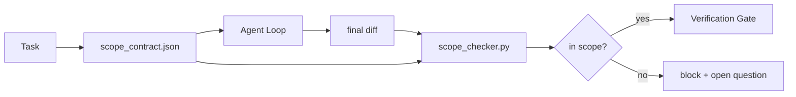

# 36 · 范围契约与任务边界

> 模型不知道工作在哪里结束。范围契约（scope contract）是一个针对单个任务的文件，它规定了工作从哪里开始、在哪里结束，以及一旦溢出该如何回滚。契约把「不要越界」从一句期望变成一项可执行的检查。

**类型：** 构建
**语言：** Python（标准库）
**前置：** 阶段 14 · 32（最小工作台）、阶段 14 · 33（规则即约束）
**时长：** 约 50 分钟

## 学习目标

- 编写一份范围契约，让智能体（agent）在任务开始时读取，让校验器（verifier）在任务结束时读取。
- 指定允许的文件、禁止的文件、验收标准、回滚方案以及审批边界。
- 实现一个范围检查器，将差异（diff）与契约比对并标记违规之处。
- 让范围蔓延（scope creep）变得可见、自动化且可审查。

## 问题所在

智能体会越界。任务是「修复登录 bug」。结果差异却动到了登录路由、邮件辅助函数、数据库驱动、README 以及发布脚本。每一处改动在当下都有看似合理的理由。但合在一起，它就成了一个与被评审对象完全不同的改动。

范围蔓延是智能体工作中最缺乏监控的失败模式，因为智能体会为每一步给出真诚的叙述。解决办法不是更严格的提示词，而是一份落在磁盘上、写明承诺内容的契约，以及一项把结果与承诺进行比对的检查。

## 核心概念



### 范围契约里应包含什么

| 字段 | 用途 |
|-------|---------|
| `task_id` | 关联到看板上的任务 |
| `goal` | 一句话目标，评审者可据此验证 |
| `allowed_files` | 智能体可以写入的 glob（通配符） |
| `forbidden_files` | 智能体即便误触也绝不能动的 glob |
| `acceptance_criteria` | 证明任务完成的测试命令或断言行 |
| `rollback_plan` | 一段话说明：若需中止，操作者可执行的回滚动作 |
| `approvals_required` | 范围之外、需要明确人工签字的动作 |

缺少 `forbidden_files` 的契约是不完整的。负空间（negative space）是契约的另一半。

### 用 glob，而非裸路径

真实仓库里文件会移动。把契约钉在 glob 上（`app/**/*.py`、`tests/test_signup*.py`），这样跨会话之间的一次重构就不会让契约失效。

### 回滚是范围的一部分

列出如何回滚，会迫使契约作者去思考可能出什么岔子。一份无法回滚的契约，就是一份不该被批准的契约。

### 范围检查就是差异检查

智能体写出一个差异。检查器读取这个差异、允许的 glob、禁止的 glob，以及所运行的任何验收命令清单。每一处违规都是一条带标签的发现项，校验关卡（verification gate）可以据此拒绝。

## 动手构建

`code/main.py` 实现了：

- `scope_contract.json` 模式（JSON Schema 的一个子集，glob 数组）。
- 一个差异解析器，把一份被触碰文件清单加上一份运行命令清单转换为 `RunSummary`。
- 一个 `scope_check`，针对契约返回 `(violations, in_scope, off_scope)`。
- 两次演示运行：一次保持在范围内，一次发生蔓延。检查器会用确切的文件和原因标记出蔓延。

运行它：

```
python3 code/main.py
```

输出：契约、两次运行、每次运行的判定结果，以及一份保存下来的 `scope_report.json`。

## 真实世界中的生产级模式

一位实践者采用「specsmaxxing」（在调用智能体之前用 YAML 写好范围契约），报告称在三周内、在未改动智能体的情况下，钻牛角尖（rabbit-hole）率从 52% 降到了 21%。起作用的是契约，而不是模型。有三种模式能让这一收益长期保持。

**违规预算，而非二元失败。** `agent-guardrails`（被 Claude Code、Cursor、Windsurf、Codex 通过 MCP 使用的开源合并关卡）为每个任务提供一个 `violationBudget`：预算内的轻微范围溢出会以警告形式呈现；只有当预算被超出时，合并关卡才会拒绝。与 `violationSeverity: "error" | "warning"` 搭配使用。这个预算，正是一个能落地的关卡与一个被讨厌它的团队禁用掉的关卡之间的差别。

**按路径族划分的严重度不对称。** 对 `docs/**` 的越界写入通常是 `warn`；对 `scripts/**`、`migrations/**`、`config/prod/**` 的越界写入则始终是 `block`。这种不对称必须落在契约里，而非运行时里，因为它是项目特定的，且会随任务变化。

**时间与网络预算，与文件预算并列。** `time_budget_minutes` 字段为挂钟时间设界；运行时若未经重新审批，将拒绝超时继续。基于主机名的 `network_egress` 白名单可防止智能体悄悄访问一个不属于本任务的外部 API。这些同样是范围的维度；文件 glob 是必要的，但不是充分的。

**多契约合并语义（最小权限）。** 当两份范围契约同时适用时（例如一份项目级契约加一份任务级契约），合并规则是：`allowed_files` **取交集**（两份契约都必须允许该路径），`forbidden_files` **取并集**（任一份禁止即禁止），`time_budget_minutes` 取最严格者（取最小值），`approvals_required` 累加。`network_egress` 中 `None` 表示不强制，`[]` 表示全部拒绝，`[...]` 作为白名单；在合并时，`None` 让位于另一方，两个列表取交集，全部拒绝则保持全部拒绝。把这一点写进契约模式中，使合并是机械可执行且可审查的。

## 实战运用

生产级模式：

- **Claude Code 斜杠命令。** 一个 `/scope` 命令写出契约，并把它钉为会话上下文。子智能体（subagent）在行动前读取该契约。
- **GitHub PR。** 把契约作为 PR 正文中的一个 JSON 文件推送，或作为签入的产物。CI 针对合并差异运行范围检查器。
- **LangGraph 中断。** 一处范围违规触发一次中断；处理器询问人类，是契约需要扩张，还是智能体需要退让。

契约随任务一同流转。任务关闭时，契约被归档到 `outputs/scope/closed/` 之下。

## 交付成果

`outputs/skill-scope-contract.md` 会为一段任务描述生成一份范围契约，以及一个支持 glob 的检查器，该检查器在 CI 中对每一次智能体差异运行。

## 练习

1. 添加一个 `network_egress` 字段，列出允许的外部主机。拒绝触碰其他主机的运行。
2. 扩展检查器，使其对 `docs/**` 软失败、对 `scripts/**` 硬失败。说明这种不对称的理由。
3. 让契约用一套静态规则集（不用 LLM）从 `goal` 字段推导出 `allowed_files`。在第一个边界情形上会出什么问题？
4. 添加一个 `time_budget_minutes`，一旦挂钟时间超过它就拒绝继续。
5. 对同一份差异运行两份契约。当两者都适用时，正确的合并语义是什么？

## 关键术语

| 术语 | 人们怎么说 | 它实际指什么 |
|------|----------------|------------------------|
| 范围契约（Scope contract） | 「任务简报」 | 针对单个任务的 JSON，列出允许/禁止的文件、验收、回滚 |
| 范围蔓延（Scope creep） | 「它还动到了……」 | 在同一任务中改动了契约之外的文件 |
| 回滚方案（Rollback plan） | 「我们可以还原」 | 用于中止的一段话操作者操作手册 |
| 审批边界（Approval boundary） | 「需要签字」 | 契约中列为需要明确人工批准的动作 |
| 差异检查（Diff check） | 「路径审计」 | 将被触碰文件与契约 glob 进行比对 |

## 延伸阅读

- [LangGraph human-in-the-loop interrupts](https://langchain-ai.github.io/langgraph/concepts/human_in_the_loop/)
- [OpenAI Agents SDK tool approval policies](https://platform.openai.com/docs/guides/agents-sdk)
- [logi-cmd/agent-guardrails — 合并关卡与范围校验](https://github.com/logi-cmd/agent-guardrails) — 违规预算、严重度分级
- [Dev|Journal，用智能体契约测试防止 AI 智能体配置漂移](https://earezki.com/ai-news/2026-05-05-i-built-a-tiny-ci-tool-to-keep-ai-agent-configs-from-drifting-in-my-repo/) — 无外部依赖的 `--strict` 模式
- [智能体式编码不是陷阱（生产日志）](https://dev.to/jtorchia/agentic-coding-is-not-a-trap-i-answered-the-viral-hn-post-with-my-own-production-logs-33d9) — specsmaxxing 实证凭据：52% → 21%
- [OpenCode permission globs](https://opencode.ai/docs/agents/) — 细粒度的逐权限范围
- [Knostic，AI 编码智能体安全：威胁模型与防护策略](https://www.knostic.ai/blog/ai-coding-agent-security) — 范围作为最小权限的一部分
- [Augment Code，AI 规格模板](https://www.augmentcode.com/guides/ai-spec-template) — 三层边界体系（必须/询问/绝不）
- 阶段 14 · 27 — 与范围锁定相搭配的提示词注入防御
- 阶段 14 · 33 — 本契约针对单个任务做特化的那套规则集
- 阶段 14 · 38 — 检查器向其汇报的校验关卡
