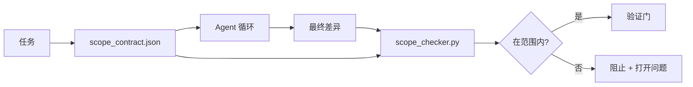

# 范围契约与任务边界

> 模型不知道工作在哪里结束。范围契约是一个每任务文件，说明工作从哪里开始，在哪里结束，以及如果溢出如何回滚。契约将"保持范围内"从愿望转变为检查。

**类型：** 构建
**语言：** Python（标准库）
**先决条件：** 阶段 14 · 32（最小工作台）、阶段 14 · 33（规则作为约束）
**时间：** ~50 分钟

## 学习目标

- 编写一个 Agent 在任务开始时读取、验证者在任务结束时读取的范围契约。
- 指定允许的文件、禁止的文件、验收标准、回滚计划和审批边界。
- 实现一个范围检查器，将差异与契约进行比较并标记违规。
- 使范围蠕变可见、自动化和可审查。

## 问题

Agent 会蠕变。任务是"修复登录错误"。差异触及登录路由、电子邮件帮助程序、数据库驱动程序、README 和发布脚本。每个触及在当时都有合理的理由。它们在一起是与被审查的那个不同的变更。

范围蠕变是 Agent 工作中监控最不足的失败模式，因为 Agent 真诚地叙述每个步骤。修复方法不是更严格的提示。修复方法是磁盘上的契约，说明承诺了什么，以及将结果与承诺进行比较的检查。

## 概念



### 范围契约中包含的内容

| 字段 | 目的 |
|-------|------|
| `task_id` | 链接到面板上的任务 |
| `goal` | 审查者可以验证的一句话 |
| `allowed_files` | Agent 可以写入的 Glob |
| `forbidden_files` | Agent 即使意外也不得触及的 Glob |
| `acceptance_criteria` | 证明完成的测试命令或断言行 |
| `rollback_plan` | 如果需要停止，操作员可以执行的一段话 |
| `approvals_required` | 需要明确人类签署的超出范围的操作 |

没有 `forbidden_files` 的契约是不完整的。负空间是契约的一半。

### Glob，而非原始路径

真实的仓库会移动文件。将契约固定到 Glob（`app/**/*.py`、`tests/test_signup*.py`），以便会话之间的重构不会使契约无效。

### 回滚是范围的一部分

列出如何回滚迫使契约作者思考可能出错的地方。无法从中回滚的契约是不应该被批准的契约。

### 范围检查是差异检查

Agent 编写差异。检查器读取差异、允许的 Glob、禁止的 Glob 和任何已运行的验收命令列表。每个违规都是验证门可以拒绝的标记发现。

## 构建

`code/main.py` 实现：

- `scope_contract.json` 模式（JSON Schema 子集，Glob 数组）。
- 将接触文件列表加运行命令列表转换为 `RunSummary` 的差异解析器。
- 针对契约返回 `(violations, in_scope, off_scope)` 的 `scope_check`。
- 两个演示运行：一个保持在范围内，一个蠕变。检查器用确切的文件和原因标记蠕变。

运行：

```
python3 code/main.py
```

输出：契约、两个运行、每个运行的裁决和保存的 `scope_report.json`。

## 生产模式

一位从业者运行"specsmaxxing"（在调用 Agent 之前的 YAML 范围契约）报告说，在三个星期内，rabbit-hole 率从 52% 降至 21%，而没有更改 Agent。契约完成了工作，而非模型。三种模式使收益持续。

**违规预算，而非二元失败。** `agent-guardrails`（Claude Code、Cursor、Windsurf、Codex 通过 MCP 使用的 OSS 合并门）为每个任务提供一个 `violationBudget`：预算内的轻微范围滑动作为警告呈现；仅当预算超限时，合并门才拒绝。与 `violationSeverity: "error" | "warning"` 配对。预算是交付的门与被讨厌它的团队禁用的门之间的区别。

**按路径族的不对称严重性。** 对 `docs/**` 的超出范围写入通常是 `warn`；对 `scripts/**`、`migrations/**`、`config/prod/**` 的超出范围写入总是 `block`。这种不对称性必须存在于契约中，而非运行时中，因为它是项目特定的并且每任务变化。

**文件预算旁边的时间和网络预算。** `time_budget_minutes` 字段边界挂钟；运行时拒绝在未重新批准的情况下继续超过它。主机名上的 `network_egress` 允许列表防止 Agent 悄悄命中不属于任务的外部 API。这些也是范围维度；文件 Glob 是必要但不充分的。

**多契约合并语义（最小权限）。** 当两个范围契约适用时（例如，项目范围契约加任务特定契约），合并是：**交集** `allowed_files`（两个契约都必须允许路径），**并集** `forbidden_files`（任一个都可以禁止），`time_budget_minutes` 是最严格的（最小值），`approvals_required` 累积。`network_egress` 对于不强制执行为 `None`，对于拒绝所有为 `[]`，作为允许列表为 `[...]`；在合并下，`None` 推迟到另一侧，两个列表交集，拒绝所有保持拒绝所有。在契约模式中声明这一点，以便合并是机械的和可审查的。

## 使用

生产模式：

- **Claude Code 斜杠命令。** `/scope` 命令编写契约并将其固定为会话上下文。子 Agent 在行动之前读取契约。
- **GitHub PR。** 将契约作为 PR 正文中的 JSON 文件或作为检入的制品推送。CI 针对合并差异运行范围检查器。
- **LangGraph 中断。** 范围违规触发中断；处理程序询问人类契约是否需要增长或 Agent 是否需要退让。

契约随任务一起传播。当任务关闭时，契约被归档在 `outputs/scope/closed/` 下。

## 部署

`outputs/skill-scope-contract.md` 为任务描述和感知 Glob 的检查器生成范围契约，该检查器在 CI 中针对每个 Agent 差异运行。

## 练习

1. 添加列出允许外部主机的 `network_egress` 字段。拒绝触及其他主机的运行。
2. 扩展检查器以对 `docs/**` 软失败，对 `scripts/**` 硬失败。辩护不对称性。
3. 使契约使用静态规则集（无 LLM）从 `goal` 字段派生 `allowed_files`。在第一个边缘情况下什么出错了？
4. 添加 `time_budget_minutes` 并在挂钟超过它后拒绝继续。
5. 对相同差异运行两个契约。当两者都适用时，正确的合并语义是什么？

## 关键术语

| 术语 | 人们的说法 | 实际含义 |
|------|----------|----------|
| Scope contract（范围契约） | "任务简介" | 每任务 JSON 列出允许/禁止的文件、验收、回滚 |
| Scope creep（范围蠕变） | "它还触及了..." | 同一任务中契约外的文件变更 |
| Rollback plan（回滚计划） | "我们可以还原" | 用于停止的单段操作员运行手册 |
| Approval boundary（审批边界） | "需要签署" | 契约中列为需要明确人类审批的操作 |
| Diff check（差异检查） | "路径审计" | 针对契约 Glob 比较触及的文件 |

## 延伸阅读

- [LangGraph 人在回路中断](https://langchain-ai.github.io/langgraph/concepts/human_in_the_loop/)
- [OpenAI Agents SDK 工具审批策略](https://platform.openai.com/docs/guides/agents-sdk)
- [logi-cmd/agent-guardrails — 合并门和范围验证](https://github.com/logi-cmd/agent-guardrails) — 违规预算、严重性层
- [Dev|Journal, 用 Agent 契约测试防止 AI Agent 配置漂移](https://earezki.com/ai-news/2026-05-05-i-built-a-tiny-ci-tool-to-keep-ai-agent-configs-from-drifting-in-my-repo/) — 无外部依赖的 `--strict` 模式
- [Agentic Coding Is Not a Trap（生产日志）](https://dev.to/jtorchia/agentic-coding-is-not-a-trap-i-answered-the-viral-hn-post-with-my-own-production-logs-33d9) — specsmaxxing 收据：52% → 21%
- [OpenCode 权限 Glob](https://opencode.ai/docs/agents/) — 每权限细粒度范围
- [Knostic, AI 编码 Agent 安全：威胁模型和保护策略](https://www.knostic.ai/blog/ai-coding-agent-security) — 作为最小权限一部分的范围
- [Augment Code, AI Spec 模板](https://www.augmentcode.com/guides/ai-spec-template) — 三层边界系统（must/ask/never）
- 阶段 14 · 27 — 与范围锁配对的提示注入防御
- 阶段 14 · 33 — 此契约每任务专用的规则集
- 阶段 14 · 38 — 检查器报告进入的验证门
