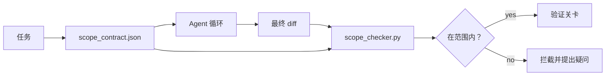

# 范围契约与任务边界（Scope Contracts and Task Boundaries）

> 译注：本文译自同目录 [`en.md`](./en.md)。术语遵循仓根 [TRANSLATION_GUIDE.md](../../../../TRANSLATION_GUIDE.md)。

> 模型不知道工作在哪里结束。scope contract（范围契约）是一份按任务编写的文件，规定工作从哪里开始、到哪里结束、一旦越界如何回滚。契约把「待在范围内」从一个心愿变成一项检查。

**Type:** Build
**Languages:** Python (stdlib)
**Prerequisites:** Phase 14 · 32 (Minimal Workbench), Phase 14 · 33 (Rules as Constraints)
**Time:** ~50 minutes

## 学习目标（Learning Objectives）

- 写一份 scope contract，让 agent 在任务开始时读、verifier（验证器）在任务结束时读。
- 指定允许文件、禁止文件、验收标准、回滚方案、审批边界。
- 实现一个范围检查器，把 diff 与契约对比，标出违规。
- 让范围蔓延变得可见、自动、可复核。

## 问题（The Problem）

Agent 会蔓延。任务是「修登录 bug」。结果 diff 动了登录路由、邮件 helper、数据库驱动、README、还有发布脚本。当时每一处改动都有合理理由。合在一起，已经是另一个变更，跟评审过的根本不是同一回事。

范围蔓延（scope creep）是 agent 工作中最被忽视的失败模式，因为 agent 每一步都在认真叙述自己在做什么。解法不是写更严的 prompt，而是在磁盘上放一份契约，写清楚承诺了什么；再放一项检查，把结果跟承诺对一对。

## 概念（The Concept）



### scope contract 里写什么（What goes in a scope contract）

| 字段 | 用途 |
|-------|---------|
| `task_id` | 关联任务看板上的某条任务 |
| `goal` | 一句话，reviewer（评审者）能据此校验 |
| `allowed_files` | agent 可以写入的 glob |
| `forbidden_files` | agent 即便手滑也不许碰的 glob |
| `acceptance_criteria` | 证明「做完」的测试命令或断言行 |
| `rollback_plan` | 一段话，让运维在需要喊停时可以照着执行 |
| `approvals_required` | 范围之外、需要人类显式签字的动作 |

少了 `forbidden_files` 的契约是不完整的。负空间撑起了契约的另一半。

### 用 glob，不用裸路径（Globs, not raw paths）

真实仓库里文件会移动。把契约钉在 glob 上（`app/**/*.py`、`tests/test_signup*.py`），这样会话之间的一次重构不会让契约失效。

### 回滚也是范围的一部分（Rollback is part of scope）

把「怎么回滚」列出来，会逼着契约作者去想哪里可能出问题。一份你回滚不了的契约，本身就不该被批准。

### 范围检查就是 diff 检查（Scope check is a diff check）

agent 写出 diff。检查器读 diff、读允许的 glob、读禁止的 glob、再读一份「跑过哪些验收命令」的清单。每一条违规都是一个带标签的发现，verification gate（验证关卡）可以据此拒收。

## 动手实现（Build It）

`code/main.py` 实现了：

- `scope_contract.json` 的 schema（JSON Schema 的子集，glob 数组）。
- 一个 diff 解析器，把「动过的文件列表 + 跑过的命令列表」转成 `RunSummary`。
- 一个 `scope_check`，对照契约返回 `(violations, in_scope, off_scope)`。
- 两次演示：一次守在范围内，一次蔓延。检查器会精确指出蔓延的文件和原因。

跑一下：

```
python3 code/main.py
```

输出：契约、两次运行、每次运行的 verdict（裁决），以及保存到 `scope_report.json` 的报告。

## 生产环境里的实战模式（Production patterns in the wild）

一位实践者推行「specsmaxxing」（在调用 agent 前用 YAML 写好 scope contract），三周内不改 agent，把「掉进兔子洞」的比例从 52% 压到 21%。是契约在干活，不是模型。三个模式让收益能保住。

**违规预算，不是非黑即白。** `agent-guardrails`（Claude Code、Cursor、Windsurf、Codex 通过 MCP 接入的开源合并关卡）为每个任务带一个 `violationBudget`：预算之内的小幅范围越界以警告呈现；只有超出预算，合并关卡才拒绝。配合 `violationSeverity: "error" | "warning"` 一起用。这份预算就是「能上线的关卡」与「被讨厌它的团队拔掉的关卡」的差别。

**按路径家族做严重度的非对称分级。** 越界写到 `docs/**` 通常是 `warn`；越界写到 `scripts/**`、`migrations/**`、`config/prod/**` 永远是 `block`。这种非对称必须落在契约里、不能落在运行时，因为它跟项目相关、且每个任务都不一样。

**时间预算和网络预算，与文件预算并列。** `time_budget_minutes` 字段约束墙钟时间；超过后运行时拒绝继续，必须重新审批。一份基于主机名的 `network_egress` allowlist（白名单）防止 agent 偷偷打到任务外的外部 API。这些都是范围的维度；文件 glob 是必要的，但不充分。

**多契约合并语义（最小权限原则）。** 当两份 scope contract 同时适用（比如一份项目级 + 一份任务级），合并方式是：`allowed_files` **取交集**（两份都允许这个路径才行），`forbidden_files` **取并集**（任一份禁止即禁止），`time_budget_minutes` 取最严（最小值），`approvals_required` 累加。`network_egress` 取值约定为：`None` 表示不强制，`[]` 表示一律拒绝，`[...]` 是 allowlist；合并时，`None` 听另一侧的，两个 list 取交集，deny-all（一律拒绝）保持 deny-all。把这条写进契约 schema，合并就是机械的、可复核的。

## 用起来（Use It）

生产模式：

- **Claude Code 斜杠命令。** 一个 `/scope` 命令写出契约，并把它钉为会话上下文。子 agent 在动作之前读这份契约。
- **GitHub PR。** 把契约作为 JSON 文件放进 PR 描述，或作为入仓产物提交。CI 在合并 diff 上跑范围检查器。
- **LangGraph 中断。** 范围违规触发一次 interrupt（中断）；处理函数问人：是契约要扩张，还是 agent 要退回。

契约跟着任务走。任务关闭时，契约归档到 `outputs/scope/closed/`。

## 上线部署（Ship It）

`outputs/skill-scope-contract.md` 会基于一段任务描述生成 scope contract，以及一个支持 glob 的检查器，可以在 CI 里对每一份 agent diff 运行。

## 练习（Exercises）

1. 增加一个 `network_egress` 字段，列出允许的外部主机。拒绝触达其他主机的运行。
2. 扩展检查器，让它对 `docs/**` 软失败、对 `scripts/**` 硬失败。说明这种非对称的理由。
3. 让契约用一组静态规则（不调 LLM）从 `goal` 字段推导 `allowed_files`。第一个边界情况上会出什么问题？
4. 加一个 `time_budget_minutes`，墙钟超出就拒绝继续。
5. 用两份契约对同一份 diff 跑检查。两份都适用时，合理的合并语义是什么？

## 关键术语（Key Terms）

| 术语 | 大家嘴上的说法 | 它实际指什么 |
|------|----------------|------------------------|
| Scope contract | "任务说明" | 按任务的 JSON，列出允许/禁止文件、验收、回滚 |
| Scope creep | "顺手还动了……" | 同一任务里改到了契约外的文件 |
| Rollback plan | "我们能回退" | 用于喊停的、一段话的运维 runbook |
| Approval boundary | "得签字" | 契约里列出的、需要人类显式批准的动作 |
| Diff check | "路径审计" | 把改动过的文件跟契约 glob 对一对 |

## 延伸阅读（Further Reading）

- [LangGraph human-in-the-loop interrupts](https://langchain-ai.github.io/langgraph/concepts/human_in_the_loop/)
- [OpenAI Agents SDK tool approval policies](https://platform.openai.com/docs/guides/agents-sdk)
- [logi-cmd/agent-guardrails — merge gates and scope validation](https://github.com/logi-cmd/agent-guardrails) — 违规预算、严重度分级
- [Dev|Journal, Preventing AI Agent Configuration Drift with Agent Contract Testing](https://earezki.com/ai-news/2026-05-05-i-built-a-tiny-ci-tool-to-keep-ai-agent-configs-from-drifting-in-my-repo/) — 不依赖外部包的 `--strict` 模式
- [Agentic Coding Is Not a Trap (production logs)](https://dev.to/jtorchia/agentic-coding-is-not-a-trap-i-answered-the-viral-hn-post-with-my-own-production-logs-33d9) — specsmaxxing 的账：52% → 21%
- [OpenCode permission globs](https://opencode.ai/docs/agents/) — 细粒度、按权限分的范围
- [Knostic, AI Coding Agent Security: Threat Models and Protection Strategies](https://www.knostic.ai/blog/ai-coding-agent-security) — 把范围当作最小权限的一部分
- [Augment Code, AI Spec Template](https://www.augmentcode.com/guides/ai-spec-template) — 三档边界体系（must/ask/never）
- Phase 14 · 27 — 与范围锁配套使用的 prompt 注入防御
- Phase 14 · 33 — 本契约按任务特化的那套规则集
- Phase 14 · 38 — 检查器把结果汇报进去的 verification gate
